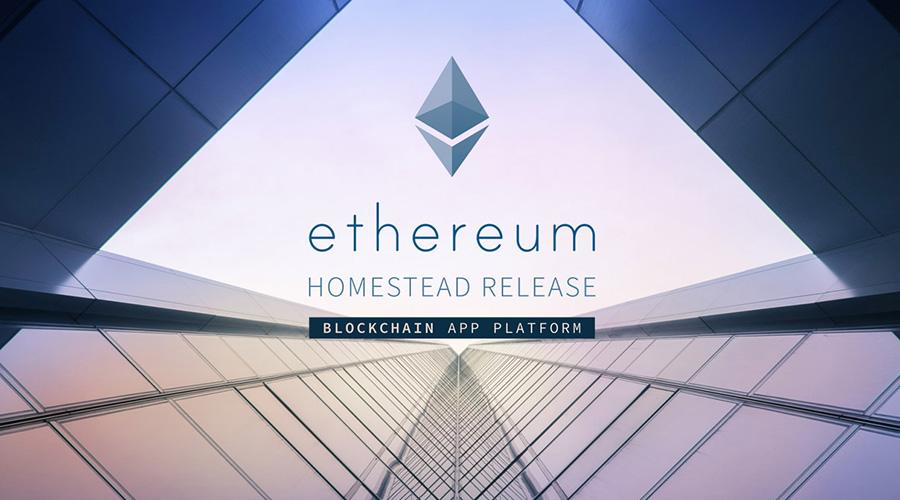

# 2017 Was Bitcoin's Year. 2018 Will Be Ethereum's
# 2017年是比特币的一年,而2018将是以太坊的一年

> 本文翻译自：https://www.coindesk.com/dont-hodl-buidl-blockchain-tech-will-add-value-2018/
> 
> 译者：[区块链中文字幕组](https://github.com/BlockchainTranslator/EOS) [林炜鑫](https://github.com/weixin1993)
> 
> 翻译时间：2017-12-29

As a long time investor in bitcoin and cryptocurrencies, 2017 has been remarkable. But it's important to remember, this is really just the beginning.

对于比特币和加密货币的长期投资者来说，2017年非常了不起。 但重要的是要记住，这只是一个开始。

Despite the valuations, major protocols remain deficient in delivering value to users. Bitcoin with it's high fees and slow transaction times is hardly suitable for payments – spending the [same fee](https://www.coindesk.com/bought-first-bitcoin-ether-now-brace-fees/) whether you buy a coffee or send $100,000 is a joke and the promise of scaling solutions such as the [Lightning Network](https://www.coindesk.com/lightning-bitcoin-scaling-tech-really-know/) hasn’t been fulfilled.

尽管有估价，但主要协议书在为用户提供价值方面依然不足。 比特币的收费较高，交易时间较慢，不太适合支付 - 无论您是购买咖啡还是发送10万美元，都花费[相同的费用](https://www.coindesk.com/bought-first-bitcoin-ether-now-brace-fees/)，这只是一个笑话，[闪电网络](https://www.coindesk.com/lightning-bitcoin-scaling-tech-really-know/)等解决方案的承诺还没有实现。

Suffice to say, its new positioning as a store of value is precarious, even if, judging by the huge uptick in bitcoin price, the store of value narrative is winning for now.

可以说，作为一个价值储备的新定位是岌岌可危的，即使如此，从比特币价格的巨大上升来看，价值叙事的存储目前是胜利的。

While there's no shortage of old and new believers to keep the party going, along with plenty of developers working to create better, forked versions of bitcoin, I’m betting my chips on a more flexible alternative.

虽然不乏新老信徒保持工程继续，加上大量的开发者努力创造比较好的分支版本的比特币，但我打赌我的筹码是一个更灵活的选择。

The door is wide open for blockchains that use [smart contracts](https://www.coindesk.com/information/ethereum-smart-contracts-work/), like ethereum, and I believe their potential market dwarfs that of "store of value" chains. Platforms like ethereum are an operating system for decentralized finance and commerce.

对于使用[智能合约](https://www.coindesk.com/information/ethereum-smart-contracts-work/)的区块链来说，门户是敞开的，比如以太坊，我相信他们的潜在市场很大。 像以太坊这样的平台是分去中心式金融和商业的操作系统。

They power applications – lots of them.

他们为大多数的应用程序提供支持。

### A comparison
### 一个对比

Think of bitcoin as [DOS](https://en.wikipedia.org/wiki/DOS) and ethereum as Windows or Mac OS. There is nothing wrong with DOS. It came first and was an essential part of the computer's success.

把比特币想象成[DOS](https://en.wikipedia.org/wiki/DOS)，而以太坊，就像Windows或者Mac OS一样。 DOS没有错。它第一个创建，是电脑成功的关键部分。

Us geeks grew up on DOS, but computers only went mainstream when Windows and Mac OS appeared. DOS is difficult to learn, tricky to program and few applications ever ran on it. Windows and Mac OS support and encourage applications to be built and are ultimately easier for people to use.

我们的极客们在DOS上长大，但是当Windows和Mac OS出现时，电脑才成为主流。 DOS很难学，编程也很棘手，很少有应用程序在它上面运行。 Windows和Mac OS支持并鼓励应用程序的构建，最终让人们更容易使用。

Ethereum is like Windows and Mac OS, and as a result, developers are creating applications in the thousands.

以太坊就像Windows和Mac OS，因此，开发人员正在创造数以千计的应用程序。

It feels like the internet boom in 2000. Thousands of new companies are sprouting up with highly innovative business models and bleeding edge compliance with regulation, and new methods are being found to finance them. Most, like Pets.com and Webvan, will fail. But some will be the next Amazon, eBay, or Google of the blockchain generation.

这感觉就像2000年的互联网繁荣。成千上万的新公司正在萌芽，创新的商业模式徘徊在监管的边缘，并找到了新的方法来资助他们。 像Pets.com和Webvan一样，大多数都会失败。 但一些将成为区块链下一代的亚马逊，eBay或谷歌。

But with its proven stability and exceptional immutability, don’t bitcoin’s developers deserve the reverence that the rocketing price implies?

但是，由于其稳定性和卓越的不变性，比特币的开发者们难道不应该受到飞涨的价格所带来的尊敬吗？

I wouldn't be quick to yes to this. They are so resistant to change that they’d rather give up all hope of serving the common man. Let's face it, bitcoin today is a product for an elitist few that can afford the high transaction fees. They have chosen a path to a technical dead end.

对此我不会很快地给出肯定的答案。 他们如此抗拒改变，宁愿放弃为普通人服务的所有想法。 让我们面对现实，比特币今天是一个少数精英才能够支付高额交易费用的产品。 他们选择了一条通往技术死胡同的道路。

### A better way
### 一个更好的方式

Last month’s DevCon3, an ethereum developer conference, may be evidence of a contrasting approach.

上个月的DevCon3，一个以太坊开发者大会，可能是一个另外的方法的证据。

With 2,000 developers in attendance, each paying 1,000 dollars plus expenses to collectively push the boundaries of blockchain innovation, ethereum’s future seems secure. But what of other smart contract-enabling technologies?

2000名开发者参与其中，每个人支付1000美元以上的费用，共同推动区块链创新的进程，以太坊的未来似乎是安全的。 但是其他的智能合约技术呢？

Sure, there are a few new pretenders out there claiming to be ethereum 2.0. None have yet demonstrated anything like the innovation or rapid improvement of ethereum, nor do they have the developer mindset.

当然，还有一些新的伪装者声称是以太坊2.0。 迄今为止，还没有任何一个像以太坊的创新或快速改进，也没有像样的开发人员的想法。

You can’t write any of them off just yet, but ethereum has shown a dedication to innovation at all costs and an effectiveness that leaves no doubt that it will be the main platform for blockchain application development for years to come.

你们现在还不能实现上述任何一点，但是以太坊已经表现出不惜一切代价创新的奉献精神，而且毫无疑问，它将成为未来几年区块链应用开发的主要平台。

Those guys are already working on privacy and scaling, the likes of which the other blockchains can only dream. To me, you must evolve or die. In 2018 and beyond, ethereum and other technologies will continue to evolve and power applications will drive the next technology age.

这些人已经在研究隐私和扩展性，其他区块链只是在做梦。 对我来说，你必须进化或死亡。 在2018年以后，以太坊和其他技术将继续发展，智能应用将推动下一个技术时代。

----------------------------------------------------

#### 区块链中文字幕组

致力于前沿区块链知识和信息的传播，为中国融入全球区块链世界贡献一份力量。

如果您懂一些技术、懂一些英文，欢迎加入我们，加微信号:w1791520555。

[点击查看项目GITHUB，及更多的译文...](https://github.com/BlockchainTranslator/EOS)

#### 本文译者简介

林炜鑫，在读硕士，专注区块链技术研究与行业分析，欢迎加微信号:happyzai1993。

本文由币乎社区（bihu.com）内容支持计划奖励。

版权所有，转载需完整注明以上内容。

----------------------------------------------------

