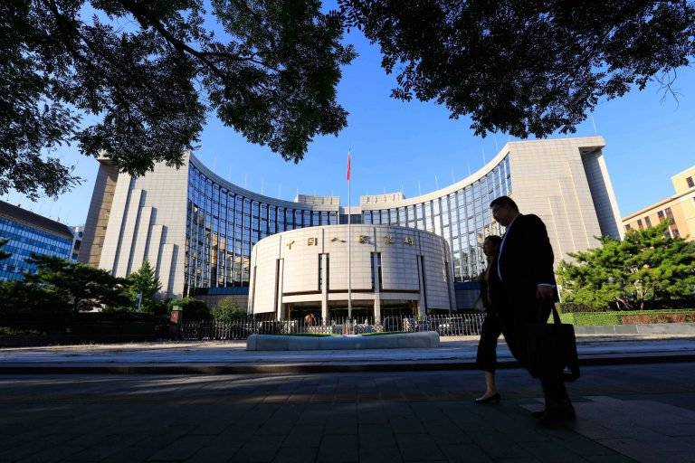
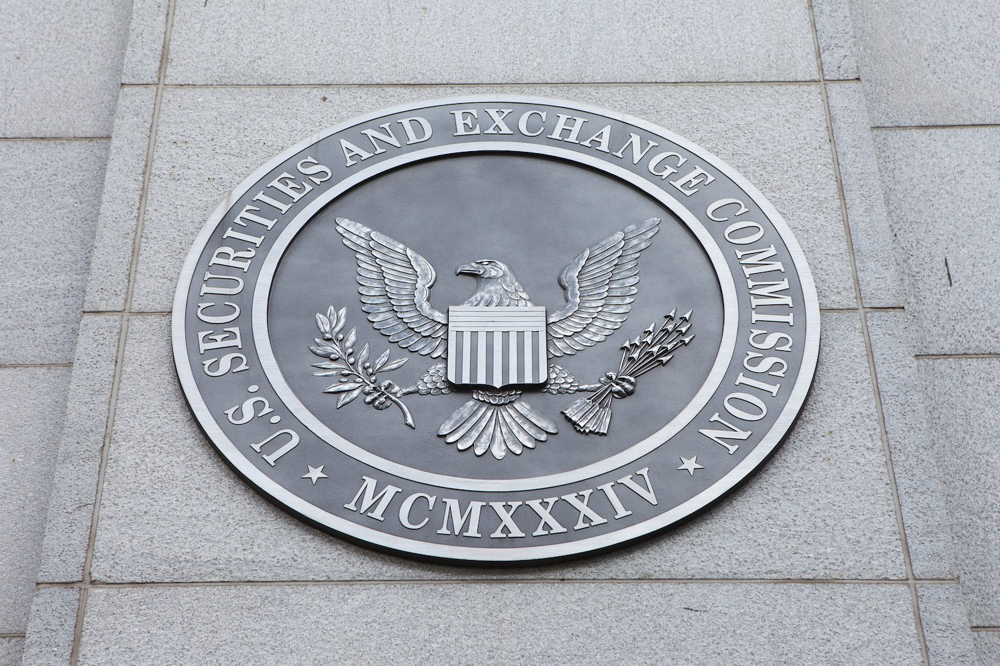
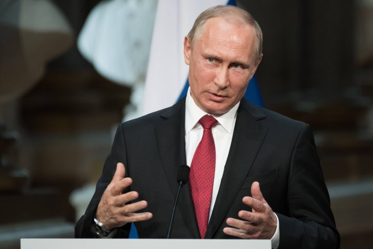

# 2017: A Defining Year for Cryptocurrency Regulation
# 2017年:加密货币监管的元年

> 本文翻译自：https://www.coindesk.com/2017-in-review-how-the-world-regulated-crypto/
> 
> 译者：[区块链中文字幕组](https://github.com/BlockchainTranslator/EOS) [林炜鑫](https://github.com/weixin1993)
> 
> 翻译时间：2018-01-08

In a year of soaring cryptocurrency prices and countless initial coin offerings, it's perhaps unsurprising that, over the course of 2017, regulators worldwide stepped in to define how they would oversee what had been to date a legally murky environment.

From China's crackdown on exchanges to the SEC's report on The DAO, 2017 was perhaps one of the most significant years to date on the regulatory front. Indeed, the year saw regulators from many of the world's leading economies issue investor alerts and cautionary statements about financial use cases for the tech.

在比特币价格飙升和无数首次发行货币的一年里--2017年的时候，世界各地的监管机构都介入，定义他们将如何监管在法律上不明确的环境。

从中国对交易所的打击到美国证交会关于“DAO”的报告，这可能是迄今为止监管方面最重要的一年。事实上，今年全球许多主要经济体的监管机构都发布了对投资者的警告，并对该技术的金融用例提出了警告。

The past two months especially have seen growing activity on the ICO funding model, as seen by bans in major Asian countries to enforcement actions in North America.

In this article, we look at some of the big policy shifts from the past 12 months – many of which may have set the stage for further industry-defining developments in the year ahead.

特别是在过去两个月，ICO资助模式的活动日益增多，亚洲主要国家采取禁止措施，而北美则直接采取执法行动。

在这篇文章中，我们来看看过去12个月来的一些重大政策转变 - 其中许多可能为未来一年进一步确定行业发展奠定了基础。

## The People's Bank vs bitcoin
## 人民银行vs比特币

It was the first week of 2017 and China's "Big Three" bitcoin exchanges – OKCoin, Huobi and BTCC – were being warned by the country's central bank.

That warning about staying compliant with "relevant laws and regulations" was followed in February by a freeze on withdrawals and the creation of new trading fees – both of which were measures imposed by the People's Bank of China in a stated effort to curb the risk of money laundering. And after months of waiting, exchanges ultimately returned access to funds to users in late May.

在2017年的第一周，中国的“三大”比特币交易所——OKCoin、Huobi和BTCC——都受到了中国央行的警告。

17年2月，中国政府出台了一项有关“相关法律法规”的警告，即冻结提款和新增交易费，这两项措施都是中国人民银行为了遏制洗钱风险所采取的措施。经过几个月的等待，交易所最终在5月底恢复了向用户提供资金的渠道。

Officials in the world's most populous nation ultimately ordered those cryptocurrency exchanges to cease trading and shut down in mid-September, which combined with BTCC's closure effectively ended the "Big Three" ecosystem and pushed trading activities within China to over-the-counter markets.

News of the pending shutdowns came just days after the country stopped ICOs within its borders, saying the campaigns operated by "illegally selling and distributing tokens."

Where 2018 will head remains to be seen, though commentators on state-owned television in China have said in recent months that OTC cryptocurrency trading may be deemed against the law as well.

这个世界上人口最多的国家的官员最终命令这些加密货币的交易所在9月中旬停止交易和关闭，这与BTCC的关闭有效地终结了“三大”生态系统，并将中国境内的交易活动推到了场外交易市场。

就在前段时间，该国停止了在其境内的ICOs，称这些活动是“非法销售和分发代币”的活动。

尽管中国国有电视台的评论员最近几个月曾表示，场外的加密货币交易也可能被认为是违法的，但2018年的情况仍有待观察。

## The DAO report
## DAO报告

Rumors had circulated for months that the SEC would move to define how it would regulate ICOs. Yet the agency played its cards close until late July, when it declared that U.S. securities laws could be applied to some token sales depending on the nature of the token itself and the manner in which it was offered.

The funding model, through which the sale and distribution of cryptographic tokens would be used to kickstart work on a new blockchain network, was at the heart of The DAO, the now-defunct funding vehicle that raised millions of dollars in ethers in 2016 through the sale of DAO tokens. It collapsed later that summer following a debilitating exploit, sparking months of infighting, recovery efforts and, ultimately, a split in the ethereum blockchain.

数月来，有传言称SEC将决定如何监管ICOs。然而，该机构在7月下旬之前就已经发行了代币，当时它宣布，根据代币本身的性质和所提供的方式，美国的证券法可以应用于某些代币的销售。

通过出售和分发加密代币来启动新的区块链网络的融资模式，是DAO的核心。DAO是现已不存在的融资工具，通过出售DAO代币，在2016年筹集了数百万美元的资金。在经历了一场让人精疲力竭的开发之后，这个夏天的晚些时候，它崩溃了，引发了几个月的内斗，通过努力恢复了之后，最终在ethereum区块链上出现了分裂。

According to a report published by the SEC in July, the DAO tokens were securities under U.S. law, though the agency said that it had declined to pursue any enforcement action related to the sale.

The SEC wrote at the time:

>"...the Commission deems it appropriate and in the public interest to issue this Report in order to stress that the U.S. federal securities law may apply to various activities, including distributed ledger technology, depending on the particular facts and circumstances, without regard to the form of the organization or technology used to effectuate a particular offer or sale."

根据美国证交会7月发布的一份报告，DAO代币是根据美国法律规定的证券，不过该机构表示，它拒绝采取任何与售股有关的强制措施。

证券交易委员会当时写道:

>“…委员会认为为了强调美国联邦证券法可能适用于包括分布式账本技术在内的各种活动，在特定的事实和情况下，不用考虑组织的形式或技术用于完成特定提供或出售。”

The agency's statements are significant because they sparked a host of similar warnings and publications from other regulators around the world.

The SEC itself would go on to warn about celebrity endorsed ICOs and public-stock scams that use the funding model as a way to entice investors. The agency has also pursued civil lawsuits against ICO organizers since July through a newly-created unit focused on digital investigations.

该机构的声明意义重大，因为它们引发了世界各地其他监管机构发出的类似警告和出版物。

证交会本身将继续警告名人代言的ICOs和公共股票欺诈，利用融资模式作为吸引投资者的一种方式。自7月以来，该机构还通过一个专注于数字调查的新成立单位，对ICO的组织者提起民事诉讼。

## Putin's edicts
## 普京的法令

CoinDesk readers are likely familiar with the long-running saga of cryptocurrency regulation in Russia.

And while recent statements from senior lawmakers suggest that Russia's State Duma may finally approve rules governing the trade and issuance of cryptocurrencies, statements from earlier this year from president Vladimir Putin are arguably more impactful for the tech's future in the country.

CoinDesk读者可能熟悉俄罗斯的长期运行的加密货币管理。

尽管最近国会议员的声明表明，俄罗斯State Duma最终可能会批准加密货币贸易和发行的规则，但今年早些时候普京总统的声明对该国未来技术的影响可以说是更有影响力。

In late October, the Kremlin published five orders from Putin focused on various uses for the tech. He ordered new registration requirements for cryptocurrency miners, the application of securities laws to the initial coin offering (ICO) funding model and research into how the tech could be used as part of a digital payments ecosystem in the Eurasian Economic Union.

十月下旬，克里姆林宫发布了五个来自普京的法令，重点是技术的各种用途。他为加密货币矿工颁布了新的注册要求，将证券法律应用于初始投币（ICO）融资模式，并研究如何将这项技术用作欧亚经济联盟数字支付生态系统的一部分。

Echoing moves by other countries in the past year, Putin also ordered the creation of a regulatory "sandbox" for companies that use technologies like blockchain to develop new products and services.

While the orders undoubtedly nudged forward the work on legislation around cryptocurrencies, Putin's edicts have arguably advanced efforts to integrate the tech into the Russian state government infrastructure. They also came months after the Russian leader briefly met with ethereum creator Vitalik Buterin.

普京在过去一年的回应中，还下令为使用区块链等技术开发新产品和服务的公司设立监管“沙箱”。

尽管这些命令毫无疑问地推动了有关加密货币立法的工作，但是普京的这些法令也可以说是推进了将技术融入俄罗斯政府基础设施的努力。之后的几个月，俄罗斯领导人还与埃菲娜创造者Vitalik Buterin进行了短暂的会面。

Other leaders in Russia have pushed the idea of using blockchain for public-sector purposes as well. Prime minister Dmitry Medvedev, for example, ordered government officials to begin researching uses of blockchain last spring.

俄罗斯的其他领导人也推动了将区块链用于公共部门的想法。例如总理梅德韦杰夫（Dmitry Medvedev），去年春天下令政府官员开始研究区块链的使用。

----------------------------------------------------

#### 区块链中文字幕组

致力于前沿区块链知识和信息的传播，为中国融入全球区块链世界贡献一份力量。

如果您懂一些技术、懂一些英文，欢迎加入我们，加微信号:w1791520555。

[点击查看项目GITHUB，及更多的译文...](https://github.com/BlockchainTranslator/EOS)

#### 本文译者简介

林炜鑫，在读硕士，专注区块链技术研究与行业分析，欢迎加微信号:happyzai1993。

本文由币乎社区（bihu.com）内容支持计划奖励。

版权所有，转载需完整注明以上内容。

----------------------------------------------------

