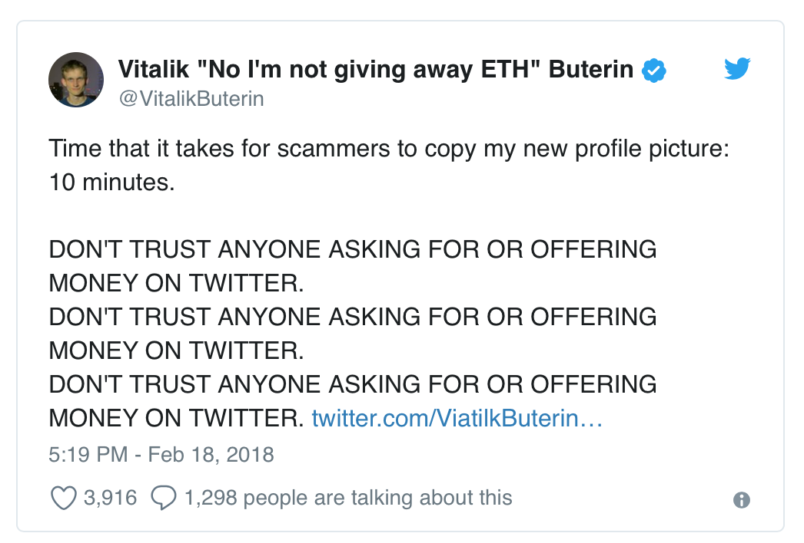
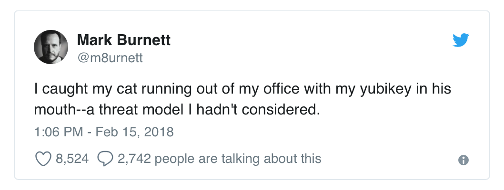

> 本文翻译自：https://media.consensys.net/7-pro-tips-for-keeping-your-crypto-safe-6dfb6fef7ab9
> 作者：ConsenSys
> 译者：[区块链中文字幕组](https://github.com/BlockchainTranslator) [鱼](https://github.com/oscnet)
>
> 翻译时间：2018-3-11
>

**7 Pro Tips for Keeping Your Crypto Safe**
===========================================

** 7 个保障你的数字资产安全的秘诀**
===========================================

*How to protect your digital assets from fire, flood, phishing, forgetfulness, and other forces of nature.*

*如何保护您的数字资产使之免受火灾、洪水、网络钓鱼、遗忘以及其他自然灾害的影响。*

> “Be vigilant and you will thrive.” –*Nick Dodson*

>“谨慎能捕千秋蝉，小心驶得万年船” -  *庄子*

There’s a [“cold room”](https://qz.com/1103310/photos-the-secret-swiss-mountain-bunker-where-millionaires-stash-their-bitcoins/) in Attinghausen, Switzerland — it’s lined with slabs of steel, and it sits some 300 meters down inside a granite mountain in an old, repurposed military bunker. What’s inside? Air gapped hardware with the private keys of high value crypto holders who are looking for a little peace of mind.

瑞士的阿廷豪森有一个[“冷室”]（https://qz.com/1103310/photos-the-secret-swiss-mountain-bunker-where-millionaires-stash-their-bitcoins/） - 内衬钢板，坐落在花岗岩山脉中一个旧的军事掩体的下方 300 米处。里面到底有什么呢？这里存放着许多物理隔离的硬件钱包！钱包里保存着只有在这里能够得到些许安全感的有着高额数字资产者的私钥。

These security measures might sound extreme, but the attack vectors are many in the cryptosphere: shams, scams, [extortion](https://www.nytimes.com/2018/02/18/technology/virtual-currency-extortion.html), [friends turning on friends](https://cryptocurrencynews.com/daily-news/crypto-news/man-holds-friend-at-gunpoint-to-steal-his-cryptocurrency/), spoof friends. Users can’t flag fake accounts fast enough:

这样的安全措施可能听起来有点极端，但是类似攻击在密码圈中实在太多了：假冒，骗局，[勒索](https://www.nytimes.com/2018/02/18/technology/virtual-currency-extortion.html)，[持枪抢劫朋友](https://cryptocurrencynews.com/daily-news/crypto-news/man-holds-friend-at-gunpoint-to-steal-his-cryptocurrency/)、欺骗朋友等。以及不能足够快地识别出假冒帐户：

Fake Vitaliks. Fake Joe Lubins. How hard does anyone really look at social media handles? Someone flying through twitter is prone to miss the “l” in @etlhereumJoseph.

假冒的 Vitaliks。假冒的 Joe Lubins。有多少人能真正看穿社交媒体背后的真实？在 twitter 上浏览的人很容易就会突略 @etlhereumJoseph 中多出的那个 “l”。

For many users, the bulk of their crypto is still sitting “hot” — in online wallets on centralized exchanges, which have had their share of reckonings over the years: the infamous Mt. Gox hack in 2014, in which hackers made out with approximately 740,000 BTC, and the Bitfinex breach more recently, which drained almost 120,000 BTC from the exchange.

对于大多数用户来说，他们的大部分加密货币资产仍然处于“烫手”的状态 - 保存在中心化交易所的在线钱包上，这些交易平台多年来一直都在积累着被黑的历史：臭名昭着的 2014 年 Mt.Gox 黑客入侵事件中，黑客大约偷走 740,000 个比特币，最近的 Bitfinex 交易所也损失了近 12 万比特币。

And then of course the age-old threats, [fire](https://themerkle.com/bitcoin-user-loses-50000-as-wallet-and-backups-get-destroyed-in-fire/) and forgetfulness (one man accidentally [threw out $9 million worth of bitcoin](https://www.forbes.com/forbes/welcome/?toURL=https://www.forbes.com/sites/kellyphillipserb/2013/11/30/from-treasure-to-trash-man-tosses-out-bitcoin-wallet-on-hard-drive-worth-9-million/&refURL=&referrer=#2fbadaed245c)). Attack vectors can be unassuming, furry even:

当然的，接下来还有些“古老”的威胁，[火灾](https://themerkle.com/bitcoin-user-loses-50000-as-wallet-and-backups-get-destroyed-in-fire/)和健忘（一个人不小心[扔掉价值 900 万美元的比特币](https://www.forbes.com/forbes/welcome/?toURL=https://www.forbes.com/sites/kellyphillipserb/2013/11/30/from-treasure-to-trash-man-tosses-out-bitcoin-wallet-on-hard-drive-worth-9-million/&refURL=&referrer=#2fbadaed245c))。更为可怕的是，用来攻击的媒介很可能是不起眼的：

The problem is, misplaced crypto has a way of altogether disappearing — sometimes across jurisdictions and beyond the reach of the law, sometimes into cryptographic black holes (in 2011, 2,609 BTC vanished on Mt. Gox because of a scripting error). What’s liberating about blockchain is that you can become your own bank. But that can also be a daunting thing for many of us who have grown comfortable letting central institutions manage our lives for us. It’s time we educate ourselves.

问题在于，错误放置的数字资产有完全消失的可能 - 有时是跨越管辖区超出法律范围，有时则进入了密码圈的“黑洞”（2011年，由于脚本错误，2,609 个比特币在 Mt. Gox 消失）。区块链的革命点的是，你可以成为你自己的银行。但对于我们中的许多人来说，可怕的是我们已经逐渐适应让中心化机构来管理自己的生活的方式了。现在是我们学习改变的时候了。

Snowden-grade.

升级版的斯诺登。

Thankfully, Nick Dodson, founder of BoardRoom (now GovernX), just published his GitBook, [“Pro Tips for Ethereum Wallet Management,”](https://silentcicero.gitbooks.io/pro-tips-for-ethereum-wallet-management/content/) a security manual for naifs and tin foil hat types alike. Dodson’s personal security measures are admittedly Snowden-grade — we’re talking blanket over the screen and everything — but his mission is to empower users, not scare them off. He acknowledges the tradeoff between convenience and security. Too many security layers and you end up stumping even yourself when trying to access your crypto. Dodson gives you the resources to decide for yourself how sophisticated you want to get.

值得庆幸的是，BoardRoom（现在是 GovernX ）的创始人 Nick Dodson 刚刚发布了他的 GitBook，[“管理以太钱包的专业指南”](https://silentcicero.gitbooks.io/pro-tips-for-ethereum-wallet-management/content/) ，一个基于素朴艺术的、类似于[锡箔帽](https://zh.wikipedia.org/wiki/%E9%94%A1%E7%AE%94%E5%B8%BD)(*锡箔帽是用一层或多层铝箔或者类似材料制成的头饰。声称它可以抵挡电磁场对大脑的影响，或抵挡思想控制和/或读脑。译者注*)类型的安全手册。Dodson 的个人安全措施无可否认是斯诺登级的 - 我们在网络上大谈“毛毯”（用来保持安全的掩盖物，此处可能指初级的安全方法，译者注），但他的使命是增加用户自主权，而不是吓跑他们。他承认便利性和安全性之间的权衡。使用太多的安全层甚至会让你在尝试访问时让自己陷入僵局。Dodson 的文章可以让你自己决定安全设置的复杂程度。

A word of caution: Compiling these pro tips brings with it the meta-anxiety that any tools or security measures we recommend here will now become the focus of bad actors. So stay sharp. But stay with it. Blockchain isn’t just about surviving. It’s about creating choices for yourself. As Dodson writes, “Be vigilant and you will thrive.”

警告：编写这些专业技巧会带来一种担忧，即我们在这里推荐的任何工具或安全措施现在都将成为黑客的焦点。所以要保持敏锐。但请留下来。区块链不仅仅有关生存。更是有关能不能为自己创造更多选择。正如 Dodson 写的：“保持警惕，你就会发展壮大。”

### **1\. Know the attack vectors.**

### ** 1\. 了解攻击媒介**

AKA Know your enemy. Watch out for the proverbial “man in the middle” — someone trying to get in between you and your destination. Spoof sites, malicious websites that mimic other sites, can be picture-perfect nowadays. Make sure you double check URLs. Better yet, bookmark your crypto sites, and stick to your bookmarks ([MetaMask](https://metamask.io/) also blacklists MyEtherWallet clones for you). Verify software downloads. A copy of Tails OS is no good if it’s infested with spyware. A man-in-the-middle attack can even be literal: one guy lost his life savings to a reseller on Ebay who [pulled the recovery seed](https://news.bitcoin.com/mans-life-savings-stolen-from-hardware-wallet-supplied-by-a-reseller/) from a hardware wallet and repackaged the wallet. Always buy your hardware wallet directly from the manufacturer. Now think two steps ahead. Maybe your URLs look good. But how do you know someone hasn’t hacked your Wi-Fi, spoofed the DNS, and redirected you to different IPs? Safe computing is like chess: always assume your opponent is smarter than you.

知己知彼，百战不殆。要注意那些“中间人”角色 - 会有人试图介入你和你的目标中。欺骗网站、模仿其他网站的恶意网站等，现在可以做到完美无缺。你要仔细检查网址确保无误。更好的做法是，将您的加密网站添加到书签，并固定到您的书签上（[MetaMask](https://metamask.io/)它会将 MyEtherWallet 克隆网站列入黑名单）。并且还要对下载软件进行验证。 被间谍软件感染过的 Tails 操作系统肯定是不能用的。中间人攻击甚至可能是字面上的：Ebay 上的一个经销商盗走了某人一生积蓄，因为该经销商从硬件钱包[取得恢复密语](https://news.bitcoin.com/mans-life-savings-stolen-from-hardware-wallet-supplied-by-a-reseller/) 后对硬件钱包重新打包出售，所以一定要直接从制造商购买硬件钱包。思考得更深入点，也许你的网址看起来没有错误。但是，您如何知道没有入侵您的 Wi-Fi，并通过 DNS 劫持将您重定向到了不同的 IP？保证系统安全就像是下国际象棋：总是要假设你的对手比你聪明。

### **2\. Generate strong passwords.**

### ** 2\. 使用强密码**

You should know the drill by now — no birthdays, street addresses, song lyrics, etc. (don’t even get me started on my mom’s passwords). But even if you mash the keys on your keyboard, that’s still not random enough (you are not a good source of entropy). Password-crackers can rifle through [350 billion guesses per second](https://arstechnica.com/information-technology/2012/12/25-gpu-cluster-cracks-every-standard-windows-password-in-6-hours/). Use a random mnemonic generator to create a passphrase, or buy a hardware wallet to generate powerful keys and signatures for you. Multiple passwords are better than one. Multi-signature wallets, like [Gnosis’](https://wallet.gnosis.pm/#/wallets), require multiple keys to validate transactions. And use two-factor authentication for everything: email, exchanges, Steam, etc. Heads up: the countdown might be annoying, but app-based two-factor is much more secure than SMS. Let [this](https://medium.com/@CodyBrown/how-to-lose-8k-worth-of-bitcoin-in-15-minutes-with-verizon-and-coinbase-com-ba75fb8d0bac) be your warning.

你现在应该知道正确的做法了 - 密码不要使用生日、街道地址、歌词等。即便你在键盘上随机按的键，仍然有可能不够随机。密码破解者有可能通过[每秒 3500 亿次猜测](https://arstechnica.com/information-technology/2012/12/25-gpu-cluster-cracks-every-standard-windows-password-in-6-hours/)来得到你的密码。最好使用随机助记符生成器来创建密码，或者购买硬件钱包，由它来生成强大的密钥和签名。使用多重密码肯定比使用一个密码好得多。象[Gnosis](https://wallet.gnosis.pm/#/wallets)这样的多重签名钱包，需要多个密钥才能验证交易。对电子邮件，交易，Steam 等之类要全部使用双因子身份验证。小心：双因子认证的倒计时确实可能很烦人，但基于应用的双因子认证比 SMS 更安全。希望这个[15 分钟如何丢失价值 8000 美元的比特币](https://medium.com/@CodyBrown/how-to-lose-8k-worth-of-bitcoin-in-15-minutes-with-verizon-and-coinbase-com-ba75fb8d0bac)的例子能够对你有警示作用。

### **3\. Use cold storage.**

### ** 3 \. 使用冷存储。**

You don’t have to go 300 meters underground, but you should keep the majority of your crypto “cold” — that is, air gapped and offline. Only keep an amount in exchanges and online wallets that you are willing to lose. You can either build an air gapped computer by removing the network card from your PC or laptop ([Tails](https://tails.boum.org/) is an operating system that you can run offline), or buy a hardware wallet. When generating the seed phrase, plug your hardware wallet into a wall outlet to keep it as cold as possible. Paranoia tips: cover the mic/camera of your laptop and remove any electronic devices from the room.

虽然你不需要到 -300 米的地下，但你应该保持大部分你的加密资产足够“冷” - 即保持隔离和离线。在交易所和在线钱包中你只能保留您能承受损失的金额。您可以通过从您的 PC 或笔记本电脑上移除网卡来构建一个隔离电脑（[Tails](https://tails.boum.org/)是一个可以离线运行的操作系统），或者购买硬件钱包。在生成种子短语时，将硬件钱包插入墙上插座以尽可能保持“冷却”。偏执狂提示：操作时关闭或遮盖住笔记本电脑的麦克风/摄像头，并从房间中移除任何电子设备。

### **4\. Test everything.**

### ** 4 \. 测试一切。**

Make small test transactions or practice with a tiny bit of funds on a test network before going full monty. Never manually type out addresses (over 9000 ETH have been lost forever due to typos). Copy and paste, use [Ethereum Name Service](https://ens.domains/), or scan QR codes. Make sure your scan app is secure (Pro Tip #1: Know the attack vectors). Double-check the identicon of your target address. Before transferring any crypto onto your hardware wallet, test your seed phrase. If you’re building an air gapped computer, record and re-check the MD5 checksum before and after you load data onto the SD card. For the love of Ethereum, *test everything*.

完全使用前，使用小额资金在测试网络上进行小规模的测试交易或练习。切勿手动输入地址（由于输入错误，曾有人永远丢失了超过 9000 个 ETH ）。使用复制并粘贴，最好用[以太坊名称服务](https://ens.domains/) 或扫描 QR 码。并确保您使用的扫描应用安全（专业提示 ＃1：要了解攻击的媒介）。要仔细检查你所发送的目的地址的标识。在将任何数字货币传输到您的硬件钱包之前，要先测试您的种子短语。如果您正在构建一台隔离电脑，在将数据加载到 SD 卡之前和之后记录并重新检查 MD5 校验和。为了以太坊的爱，*请测试一切*。

A little paranoia is a good thing. Maybe not this much. When’s the last time you got out of the house?

有点偏执是一件好事。可能不用这么严格。你还记得最后一次离开房子的时间吗？

### **5\. Store your seed phrase(s) across different devices and locations.**

### ** 5 \. 将种子短语存储在不同的设备和位置。**

A standard Bip39 seed phrase is that curious string of 24 words from which you can derive a private key. Manage your seed with utmost care. If you write it down on paper, consider making two copies and storing them in separate locations. SD cards are another storage option, but they rarely last more than five years, and they could be wiped by a pinch (EMP bomb). Use both analog and  digital just in case (some people hammer their seed phrases into steel). If you want to level up: store pieces of your seed phrase in separate, safe locations. And remember: meticulously record your steps, so you (or your heirs) can recreate the seed.

一个标准的 Bip39 种子短语就是可以生成私钥的 24 个单词。要谨慎管理你的这些助记词。如果你把它写在纸上，请考虑制作两份并将它们存放在不同的位置。 SD 卡是另一种存储选项，但它很少能持续使用五年以上，并且可能被捏坏（或者用电磁炸弹）。为防万一，有些人甚至把他们的种子短语敲入钢块中。如果你想升级安全性：请将你的种子短语存储在不同的安全位置。请记住：要仔细记录你的步骤，让你（或你的继承人）可以通过助记词重建钱包。

### **6.** **Maintain plausible deniability.**

### ** 6. ** **使用合理推诿**

Plausible deniability in the cryptoverse means the ability to keep certain data hidden. Here’s a helpful public emission guideline: don’t broadcast your holdings, and especially don’t tell the world (over social media) the exchanges where you keep all your crypto (again, [this guy](https://medium.com/@CodyBrown/how-to-lose-8k-worth-of-bitcoin-in-15-minutes-with-verizon-and-coinbase-com-ba75fb8d0bac)). All your crypto shouldn’t be hot anyway (Pro Tip #3: Use cold storage). You can hide accounts under different HD paths on your hardware wallet in case someone comes knocking. Also, minimize your risk exposure by distributing your holdings across multiple wallets.

数字货币投资中，合理的推诿在意味着隐藏某些数据的能力。这是一个有用的公共发布指南：不要广播你的财产，特别是不要告诉全世界（在社交媒体上公布）你保存资金的交易所（再次，[看下这家伙的下场](https://medium.com/@CodyBrown/how-to-lose-8k-worth-of-bitcoin-in-15-minutes-with-verizon-and-coinbase-com-ba75fb8d0bac)）。无论如何，你所有的数字资产都不该有“热”度（专业提示＃3：使用冷存储）。您还可以在硬件钱包中使用不同 HD 路径来隐藏你的帐户，以防有人“敲门进入”。此外，可以通过将您的资金分散在多个钱包中，以最大限度地减少您的风险。

### **7\. Level up. Help the ecosystem.**

### ** 7 \. 提高安全级别，并帮助生态系统地建设。**

Dodson finishes his [GitBook](https://silentcicero.gitbooks.io/pro-tips-for-ethereum-wallet-management/content/) by recommending four different levels of wallet setup, Level 4 being for the most rigorous users. It’s your call how sophisticated you want to get. But remember: your security choices affect not only you but the ecosystem. If you don’t use two-factor authentication, and someone seizes your email (that, say, you left open on a library computer), when that bad actor starts phishing your personal network, that’s on you. So challenge yourself to level up. Experiment with hardware wallets, Tails, and multi-sig. Channel your inner Snowden. Learn by teaching. Tell your friends about cold storage, and your mom about strong passwords. Help the community flag spoof sites and fake accounts. Dodson’s [“Pro Tips”](https://silentcicero.gitbooks.io/pro-tips-for-ethereum-wallet-management/content/recommended-wallet-setups/level-4.html) are a gift to the ecosystem, and something we can pay forward.

Dodson 通过推荐四种不同安全级别的钱包设置来完成他的[GitBook](https://silentcicero.gitbooks.io/pro-tips-for-ethereum-wallet-management/content/)，级别 4 是给最严格的用户使用的。也是最复杂的。但请记住：您的安全选择不仅会影响您，还会影响整个生态系统。如果您不使用双因子身份验证，并且有人知道了您的电子邮件（也就是，假如您使用了保持开放状态的图书馆计算机），那么当这位黑客开始网络钓鱼您的个人网络时，其根本的原因还是在您自己身上。所以要挑战自我升级安全级别。试着使用硬件钱包，Tails （前面所说的那个侧重安全的操作系统，译者注） 和多种签名。激活你内在的“斯诺登”。可以通过教会别人来学习。告诉你的朋友关于冷存储的信息，以及你的妈妈关于强密码的使用。帮助社区标记恶搞站点和假帐户。Dodson 的[“专业提示”](https://silentcicero.gitbooks.io/pro-tips-for-ethereum-wallet-management/content/recommended-wallet-setups/level-4.html)是给整个生态的礼物，是值得我们回报的。

##### 摘要
7 个保障你的数字资产安全的秘诀
https://bihu.com/article/
如何保护您的数字资产使之免受火灾、洪水、网络钓鱼、遗忘以及其他自然灾害的影响。
对于我们中的许多人来说，可怕的是我们已经逐渐适应了让中心化机构来管理自己的生活的方式了。现在是我们学习改变的时候了。

----------------------------------------------------

#### 区块链中文字幕组

致力于前沿区块链知识和信息的传播，为中国融入全球区块链世界贡献一份力量。

如果您懂一些技术、懂一些英文，欢迎加入我们，加微信号:w1791520555。

[点击查看项目GITHUB，及更多的译文...](https://github.com/BlockchainTranslator/General)

#### 本文译者简介

鱼 区块链技术爱好者，欢迎加微信号交流：**oscnet**

版权所有，转载需完整注明以上内容。

----------------------------------------------------
