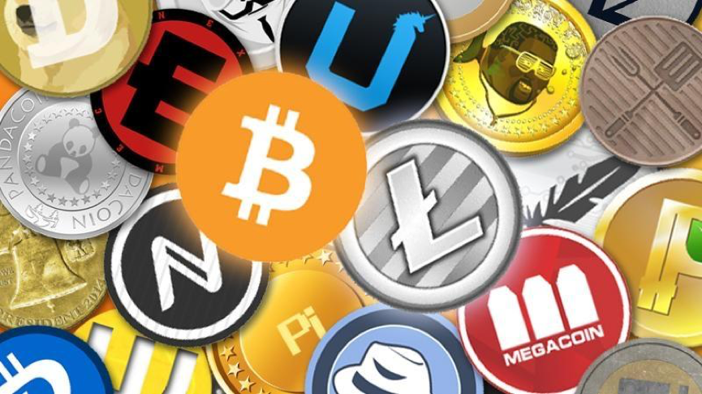
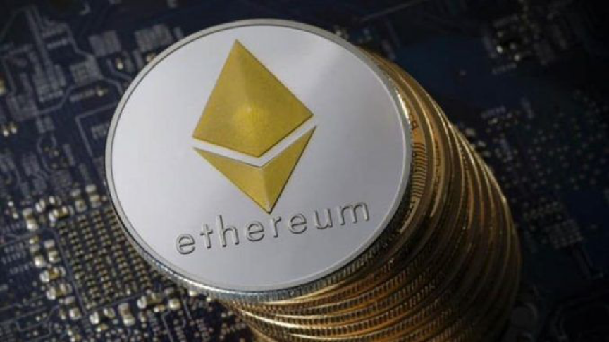
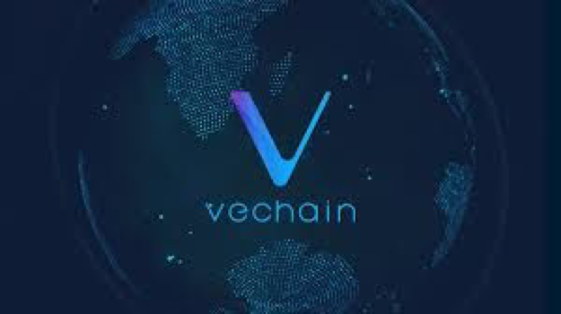
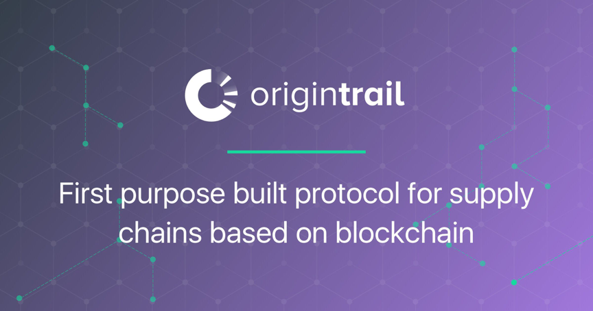
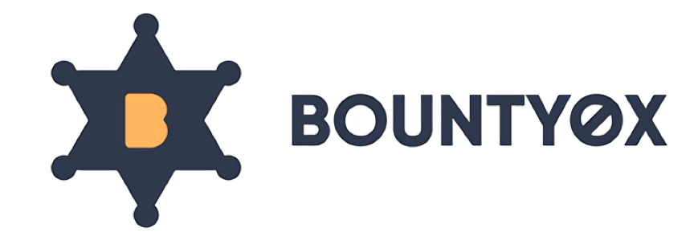

# Best alternatives to Bitcoin: 10 cryptocurrencies to watch in 2018
# 比特币的最佳替代品：2018年要关注的10种加密货币

> 本文翻译自：https://www.techadvisor.co.uk/feature/tech-industry/best-alternatives-bitcoin-10-cryptocurrencies-watch-in-2018-3671141/
> 
> 译者：[区块链中文字幕组](https://github.com/BlockchainTranslator/EOS) [林炜鑫](https://github.com/weixin1993)
> 
> 翻译时间：2018-01-30

While Bitcoin is still the king of cryptocurrencies, 2018 will see the rise of a new breed of technologies that may help its competitors to dethrone it.  Ethereum and Ripple are hot on its heels with both currencies offering more realistic real world applications then their famous predecessor.

尽管比特币仍是加密货币的王者，但2018年将出现一种新技术的崛起，这可能会帮助其竞争对手取代比特币。以太坊和瑞波凭借着他们所提供的更为真实的现实世界应用以及它们的著名前身紧随其后。

The rapid rise of cryptocurrencies over the past few years has not been documented particularly well by mainstream media, but the progress that the technology is making can’t be denied. While Bitcoin still has the largest market cap of any cryptocurrency (190 dollar billion, at $11,348 per coin at the time of writing), the entire crypto sector is worth around the £500 billion mark and is only expanding with each passing month.

加密货币在过去几年的迅速崛起，主流媒体对此并没有特别的记载，但技术进步是不容否认的。 尽管比特币仍然是所有加密货币中最大的市值（1900亿美元，写作时每币11,348美元），而整个加密行业价值约为5000亿英镑，并且只是在逐月扩大。

Confused about blockchain? [Have a look at our article that explains all](https://www.techadvisor.co.uk/feature/internet/what-is-blockchain-3671209/).

对区块链感到困惑？ [看看我们的文章来了解一切](https://www.techadvisor.co.uk/feature/internet/what-is-blockchain-3671209/)。

## 10 cryptocurrencies to keep an eye on in 2018
## 10个要在2018年保持密切关注的加密货币

The newer breeds of cryptocurrencies that are gaining traction are attempting to solve existing problems within various areas of industry. Rather than looking specifically at the currency, it’s the technology behind it where the value resides, and the currency is usually used to access that service in some way.

越来越引人注目的加密货币的新品种试图解决在各个行业领域存在的问题。 与其专门关注货币，倒不如关注其价值所在的技术，而货币通常用于以某种方式接入该服务。

### 1). Ethereum

Ethereum (ETH) currently holds the second largest market cap behind Bitcoin and for good reason. Ethereum is widely used as a ‘middleman’ currency because of its stability and transaction speed, and is perhaps the coin most favoured by the wider crypto community.

以太坊（ETH）目前是继比特币之后的第二大市场，原因很多。 以太坊由于其稳定性和交易速度被广泛用作“中间商”货币，而且可能是更广泛的加密社区最为青睐的代币。

Whereas Bitcoin is designed to be a payment system that tracks ownership of currency across the world, Ethereum was created as platform upon which other applications can be built and use Ethereum’s existing infrastructure to function.

鉴于比特币旨在成为追踪全球货币所有权的支付系统，以太坊被创建为平台，在此平台上可以构建其他应用程序，并使用以太坊现有的基础设施运行。

Ethereum’s “smart contracts” are part of what makes the platform so successful, as they are designed by nature to be an agreement between two parties that operate intelligently without the risk of censorship, downtime, fraud or third party interference.

以太坊的“智能合约”是使平台如此成功的一部分原因，因为它们本质上被设计为双方之间的协议，智能地运行而没有审查，停机，欺诈或第三方干扰的风险。

2). Ripple

Ripple (XRP) is designed to be a global payment system that offers rapid transfer of funds anywhere in the world, on a ‘trust less’ low maintenance system.

瑞波（XRP）被设计成为一个全球性的支付系统，通过“低信赖”的低维护系统，可以在全球任何地方快速转移资金。

The movement of money through the banking system can be complicated, take time and incur fairly substantial fees. Ripple are seeking to disrupt that, by allowing you to send funds to anyone in a matter of seconds for next to nothing.

通过银行系统的资金流动可能会非常复杂，需要时间和相当可观的费用。 瑞波正在试图破坏这一点，允许你在几秒钟内将资金发送给任何人。

Using block-chain technology the records of these transactions are encrypted and secured many times over, which makes them almost impossible to be altered after the fact, but also able to be viewed if there is every a dispute.

使用分组链技术，这些交易的记录被加密和保护了很多次，这使得它们在事后几乎不可能被改变，而且也可以被验证是否存在一些争议。

3). Litecoin

While Ripple seeks to offer an alternative to bank transfers and promotes the ability to move currency between people, Litecoin is positioning itself as a faster, more modern version of Bitcoin.

Ripple试图提供银行转账的替代方案，并提升人们之间货币流通的能力，而Litecoin将自己定位为更快，更现代化的比特币版本。

Litecoin is seeking to become the currency of the future and wants to allow people to pay for anything from a cup of coffee to a flight abroad through their system. Designed to be much faster and more responsive than Bitcoin which can take hours to process a transaction, Litecoin also operates on block chain technology which makes any fraud or disruption to transactions essentially impossible.

莱特币正在试图成为未来的货币，并希望通过他们的系统让人们可以支付包括一杯咖啡到国际航班之类的任何东西。 Litecoin的设计比比特币更快，响应速度更快，可能需要数小时就能完成交易，而且Litecoin也采用了区块链技术，使得任何欺诈或交易中断都是不可能的。

4). VeChain

VeChain is a coin that has seen huge growth recently and has the potential to be one of the largest players in the cryptocurrency world over the next few years.

VeChain是一个近期大幅增长的货币，并有可能在未来几年成为加密货币世界最大的货币之一。

Already holding partnerships with the likes of the Chinese Government, Price Waterhouse Cooper and DNV GL – Vechain seeks to offer a wide array of block chain services to Fortune 500 companies, everything from disaster recovery for data, through to counterfeit prevention in designer clothes and fine wines.

它可能已经与中国政府成为合作伙伴，Price Waterhouse Cooper和DNV GL - Vechain力求为“财富”500强企业提供广泛的区块链服务，例如从数据的灾难恢复到设计师服装的防伪以及美酒行业等。

The currency called VEN which is rebranding to VET at the end of February, will passively generate a secondary currency called Thor, which will be used to pay for services on the Vechain block chain.

2月底将要重被重命名为VET的VEN货币将被动地产生一个名为Thor的辅助货币，用于支付Vechain区块链上的服务。

5). Neo

Neo is positioning itself as the Chinese Ethereum, offering a platform for applications to be built upon that offer block chain as a solution to data issues. Cryptocurrencies are being integrated much more readily in the east, with Korea seeing the most use and the Chinese Government actively partnering with them.

Neo将自己定位为中国以太坊（Ethereum），为应用程序提供一个平台，以此作为解决数据问题的解决方案。 东方的加密货币更容易融合，韩国用场最大，中国政府也积极与他们合作。

Neo also uses Smart Contracts as a part of it’s service, as like VeChain, Neo tokens generate GAS which is used to far for services on the Neo network.

Neo也使用智能合同作为其服务的一部分，就像VeChain一样，Neo代币产生的GAS用于Neo网络上的服务。

6). IOTA

The scale of IOTA’s vision is so large it’s slightly difficult to grasp.

IOTA的远景规模非常之大，有点难以掌握。

IOTA aims to make almost every service tradeable for another. Primarily aimed at B2B but with the potential to expand rapidly into a B2C, and even C2C market, IOTA aims to make transactions between businesses seamless.

IOTA旨在使几乎所有的服务都可以交易。 主要针对B2B，但有可能迅速扩展到B2C，甚至C2C市场，IOTA旨在使业务之间的交易无缝。

Company A requires more storage, and company B has storage that they can sell – this can be facilitated through the IOTA network. Consumer C wants to buy a coffee from company D, and decides to pay with the data that has been gathered on their FitBit over the past week.

例如公司A需要更多的存储空间，而公司B有可以销售的存储空间 - 这可以通过IOTA网络来实现。 又比如消费者C想要从D公司买一杯咖啡，并决定用过去一周在FitBit上收集的数据来支付。

It’s a system that hails back to an era of bartering in Markets, where services are traded for services, rather than going through the middle-man of a currency first.

这是一个回到市场交易时代的系统，在这个时代，服务是以服务的方式进行交易的，而不是先通过货币的中间人。

This is all facilitated through the block chain network, which takes a record of each transaction to ensure things run smoothly.

这一切都是通过区块链网络进行的，它记录了每个交易的情况，以确保一切顺利进行。

7). OriginTrail

OriginTrail (TRAC) is another block chain project that aims to disrupt the way data is handled within the supply chain industry.

Origin Trail（TRAC）是另一个旨在破坏供应链行业数据处理方式的区块链项目。

Allowing for the efficient and seamless movement of information, OriginTrail will allow supply chains to monitor the movement of their contents in real time, without the fear of any tampering or fraud. Knowing exactly where everything is, at any moment in time and being able to access that information instantly.

考虑到信息的高效无缝移动，OriginTrail将允许供应链实时监控其内容的移动，而不用担心被篡改或欺诈。 在任何时候都能准确地知道所有东西在哪里，并能够即时访问这些信息。

8). DeepBrain Chain

DeepBrain Chain (DBC) is one of the more unique projects coming out of the crypto world.

DeepBrain Chain（DBC）是来自加密世界的更独特的项目之一。

Built upon the Neo network, this project seeks to allow companies that wish to work with AI to access the massive amounts of computing power needed to run the necessary calculations and processes required for it’s development.

该项目建立在Neo网络之上，旨在允许研究人工智能的公司能够获得运行所需和流程所需的计算能力来运行所需的计算。

For an AI start-up company, a huge portion of funds are currently being put into computer hardware to crunch the data required to complete the research. By essentially outsourcing this work to a massive network of computers across the world on the DeepBrain network, which are then rewarded with DBC coins for their work – this allows AI start-ups to save money, and regular people to earn money using their home computers to crunch the data.

对于一家人工智能创业公司来说，目前大部分的资金都投入到计算机硬件中去，以完成研究所需的数据。 通过将这项工作基本上外包给DeepBrain网络上世界各地的大型计算机网络，然后再用DBC硬币兑现他们的工作 - 这使得AI初创公司可以省钱，而普通人可以使用家用电脑抓取数据来赚钱。

9). Bounty0x

Another interesting project, Bounty0x (BNTY) is built on the District0x platform and plans to essentially act as a modern day bounty board, initially for software developers.

另一个有趣的项目，Bounty0x(BNTY)是在District0x平台上开发的，它计划作为一个现代的赏金委员会，最初是为软件开发人员准备的。

The idea is that people can post a bounty with an attached reward, which can then be completed by a bounty hunter. So if you’re looking for someone to design your website, you can issue that bounty with an attached price, and have someone do the work and get paid.

这个想法是，人们可以贴上奖金，然后由赏金猎人完成。 所以如果你正在寻找一个人来设计你的网站，你可以用附加的价格来发放这个赏金，并让别人去做这个工作并得到报酬。

This isn’t a new concept, but with block chain technology behind it, the system is almost impossible to cheat or get around – as the process is all handled through the chain, ensuring that both parties are dealt with fairly.

这不是一个新的概念，而是以其背后的区块链技术，使得这个系统几乎不可能作弊或者绕过 - 因为这个过程都是通过链来处理的，确保了双方的公平处理。

10). Request Network

Request Network (REQ) is another financial project that aims to take advantage of block chain technology.

Request Network（REQ）是另一个旨在利用块链技术的金融项目。

Req is being built on Ethereum’s network, and aims to offer payment services to the world. The block chain allows Request to feature an immutable ledger where all transactions are kept for accurate accounting and auditing purposes.

Req是在Ethereum网络上建立的，旨在向世界提供支付服务。区块链允许请求提供一个不可变的分类账，其中所有事务都以保持精确的会计和审计为目的。

Request Network will offer a range of online payments, invoicing, accounting and transparency to people all around the world.

Request Network将为世界各地的人们提供一系列在线支付，发票，审计和透明度的服务。

----------------------------------------------------

#### 区块链中文字幕组

致力于前沿区块链知识和信息的传播，为中国融入全球区块链世界贡献一份力量。

如果您懂一些技术、懂一些英文，欢迎加入我们，加微信号:w1791520555。

[点击查看项目GITHUB，及更多的译文...](https://github.com/BlockchainTranslator/EOS)

#### 本文译者简介

林炜鑫，在读硕士，专注区块链技术研究与行业分析，欢迎加微信号:happyzai1993。

本文由币乎社区（bihu.com）内容支持计划奖励。

版权所有，转载需完整注明以上内容。

----------------------------------------------------

