# Don’t fall for the hype — Why Bitcoin’s $10,000 Price Doesn’t Reflect Its True Value
# 这是炒作？ -- 为何一万美元的比特币未反映其真实价值

> 本文翻译自：https://decentralize.today/dont-fall-for-the-hype-why-bitcoin-s-10-000-price-doesn-t-reflect-its-true-value-6b42a59fce0a
>
> 译者：[区块链中文字幕组](https://github.com/BlockchainTranslator/EOS) [龙心小台](https://github.com/xnylong/EOS)
> 
> 原文发表时间：2017-12-02
>
> 翻译时间：2017-12-03

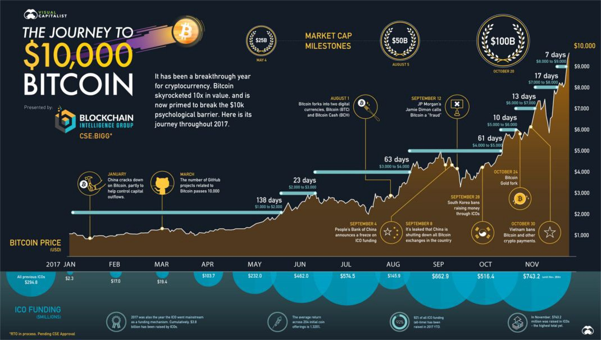

These are some financial news headlines from the last few days: 

[Bitcoin finally hits $10,000!](https://www.economist.com/news/finance-and-economics/21731827-getting-out-such-illiquid-asset-can-be-harder-getting-bitcoins) — The Economist, Nov. 28th, 2017

[Bitcoin surpasses the $10,000 milestone!](https://www.cnbc.com/2017/11/28/bitcoin-surpasses-10000-for-the-first-time.html) — CNBC, Nov. 28th, 2017

[BITCOIN SOARS ABOVE $11,000!](https://www.theguardian.com/technology/2017/nov/29/bitcoin-world-economy-bank-of-england-jon-cunliffe-price)— The Guardian, Nov. 29th, 2017

这些是过去几天的一些财经新闻标题：

[比特币终于到了一万美元！](https://www.economist.com/news/finance-and-economics/21731827-getting-out-such-illiquid-asset-can-be-harder-getting-bitcoins) - “经济学人”，2017年11月28日

[比特币超过一万美元里程碑！](https://www.cnbc.com/2017/11/28/bitcoin-surpasses-10000-for-the-first-time.html) - CNBC，2017年11月28日

[比特币飙升至 1.1 万美元以上！](https://www.theguardian.com/technology/2017/nov/29/bitcoin-world-economy-bank-of-england-jon-cunliffe-price) - 卫报，2017年11月29日

News outlets haven’t even had 24 hours to let the “10K” news simmer and it already went up to $11,500. By the time they published the “11K” piece, it already dropped to $9,000. As soon as they entered the last word on their “Bitcoin is crashing!” article, it’s back at $11,000 per BTC.

新闻媒体甚至还没有 24 小时的时间让 “10000 美元” 的新闻沸腾，比特币已涨到了 11500 美元。 当他们发表 “11000 美元” 新闻的时候，比特币又下跌到了 9000 美元。 正当他们刚写完 “比特币正在崩盘！” 新闻稿件最后一个字的时候，比特币价格又涨回到每个比特币 11000 美元。

This is not unprecedented.

这并非史无前例。

We’ve seen this before, back in 2013. [A media frenzy when Bitcoin was approaching $1,000](https://www.wired.com/2013/11/bitcoin-one-thousand/) that fueled that year’s bubble. In January of that year, one bitcoin was trading at around $15.00, hit $266 by April, crashed back to $50. By November, it had already broken $1,200, peaking at $1,242 on Mt.Gox. That’s an almost 100-fold increase. That’s an order of magnitude larger than this year’s (2017) 10-fold run up.

我们早在 2013 年，便已目睹此事。[当比特币接近 1000 美元的时候媒体变得狂热](https://www.wired.com/2013/11/bitcoin-one-thousand/)，助长了当年的泡沫。 2013年1 月份，一个比特币的交易价格在 15 美元左右，四月份达到了 266 美元，之后又暴跌至 50 美元。 截至十一月份，比特币价格已突破 1200 美元，峰值在 Mt.Gox 交易所到达 1242 美元。 这是一个几乎 100 倍的增长。 这比今年（2017年）的 10 倍增长高了一个数量级。

The charts are almost identical and [news articles look exactly the same](http://money.cnn.com/2013/11/27/investing/bitcoin-1000/index.html). Just add one zero.

今年价格走势与下图几乎相同，[新闻看起来也完全一样](http://money.cnn.com/2013/11/27/investing/bitcoin-1000/index.html)。 只需在价格后面添加一个零。（下图为 2013 年比特币价格走势）

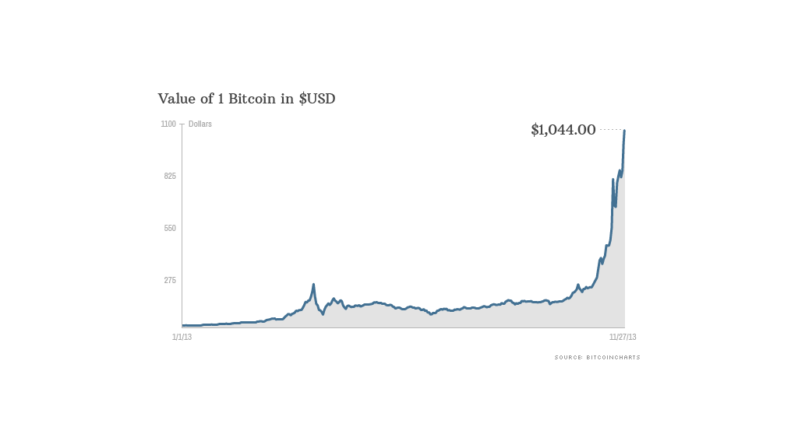
###### Image from CNN Money | 图片出自 CNN Money

The media gobbles this up because people are fascinated by this stuff. [Stories of people finding 5000 BTC](https://www.theguardian.com/technology/2015/dec/09/bitcoin-forgotten-currency-norway-oslo-home) in an old hard drive that they bought for $25 in 2009, [a man throwing away 7500 BTC](http://washington.cbslocal.com/2013/11/29/man-throws-away-7500-bitcoins-now-worth-7-5-million/) by accident and scouring a landfill to try and find it, [a man buying pizzas for 10,000 BTC] — It’s the sizzle to the steak and it sells.

媒体之所以如此喋喋不休，是因为人们对此着迷。 [有人在旧硬盘上找到了在 2009 年花了 25 美元买的 5000 个比特币](https://www.theguardian.com/technology/2015/dec/09/bitcoin-forgotten-currency-norway-oslo-home)， [有人不小心扔掉了 7500 个比特币](http://washington.cbslocal.com/2013/11/29/man-throws-away-7500-bitcoins-now-worth-7-5-million/)并试图在一个垃圾场里寻找它，[有人花了 1 万个比特币买了一个比萨饼](https://www.investopedia.com/news/bitcoin-pizza-day-celebrating-20-million-pizza-order/) -- 这些正如牛排发出的嘶咝声， 能让文章大卖。

## The Other Side | 另一面

People love it when things go up, but what goes up must come down, and Bitcoin is not immune to this. History shows three major “Bitcoin Bubbles”, and a LOT of volatility in between. Swings of 20–30% in one day are not uncommon in the Bitcoin world, but to most people this can be quite terrifying. For example, in the same day when Bitcoin broke $11,500 a couple of days ago, [Bitcoin crashed back to $9,600, and lost 20% of its value overnight](https://www.reuters.com/future-of-money?utm_medium=Social&utm_source=twitter).

当事物上涨之时人们喜爱它，但上涨必伴随下跌，比特币也无法幸免。 历史向我们展示了三个主要的 “比特币泡沫”，及其之间的大量波动。 一天之内 20-30％ 的波动在比特币世界中并不少见，但对大多数人来说，这可能是相当可怕的。 例如，在几天前比特币突破 11500 美元的同一天，[比特币又回落至 9600 美元，一天内价格下跌了 20％](https://www.reuters.com/future-of-money?utm_medium=Social&utm_source=twitter)。

It isn’t just that, there are more. There’s that time it crashed from $260 to $50.

类似事例远不止如此。 那一次，比特币从 260 美元跌到了 50 美元。

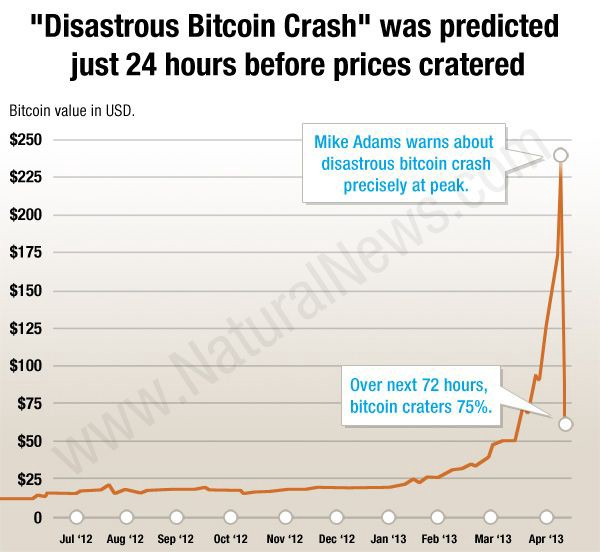

Then there was that time it crashed from $330 to $180.

而那一次，比特币从 330 美元跌到了 180 美元。

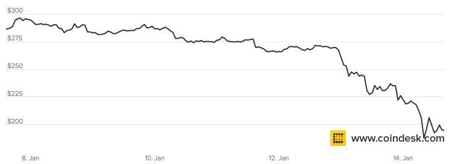

Or that time it crashed from $600 to $250.

或者那一次，它从 600 美元跌到 250 美元。

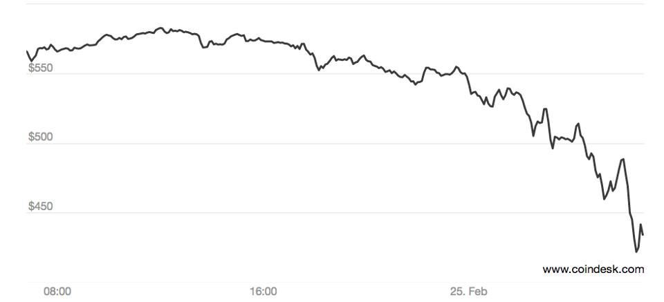

So Bitcoin doesn’t just keep going up, what a surprise. If you look at short term linear charts, yes, there are major downswings at any given point in time. It does not always go up for 12 months straight. Yet if you look at the logarithmic chart below:

所以比特币价格不只是不断上涨的，真想不到。 如果你看短期线性图，是的，它在任何时间段都有主要下跌。 它并不总是连续 12 个月上涨的。 但是，如果你看看下面的对数图：

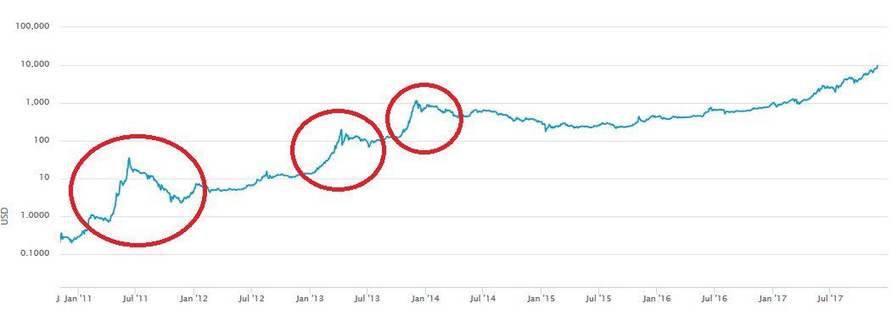

Log charts are better than linear charts in measuring performance over long periods of time. A jump from 1 to 30 will look tiny compared to a jump from 100 to 200 in a linear chart, even though it is a 3000% increase versus a 100% increase. A log chart fixes this problem.

对数图在测量长期表现方面优于线性图。 在线性图中，与从 100 美元到 200 美元的上涨相比，从 1 美元到 30 美元的上涨看起来要小得多，虽然实际上从 100 美元到 200 美元是 100% 的涨幅，而从 1 美元到 30 美元则是 3000% 的涨幅。对数图解决了这个问题。

We can see on this all-time price chart that since Bitcoin was invented, it has been on a steady upward climb, with some major swings in between. You’ll notice that in the early days, the swings were actually bigger and more volatile.

我们可以从这个历史价格图上看到，自从比特币被发明以来，它一直处于稳步上升的状态，其间有一些重大的波动。 你会注意到，在早期，这些波动实际上更大更剧烈。

Three times in the history of Bitcoin, the price went parabolic, meaning it went almost straight upwards on the chart. An almost vertical climb on a log chart is hard to achieve unless the price goes up very very fast. This was the case in 2011 and twice in 2013. In both years, Bitcoin increased by at least 100-fold. As you can see, in this 2017 climb from $1,000 to $11,000, we haven’t formed a parabolic uptrend just yet. It will need to track upward towards $100K really fast for that to happen. We are not there yet and in fact, we have a long way to go.

在比特币历史上，有三次价格呈抛物线走势，这意味着它的价格在图表上几乎直线上升。 在对数图上价格几乎垂直攀升是很难实现的，除非价格上涨极快。 2011 年正是这种情况，而 2013 年又出现了两次垂直攀升。在这两年中，比特币都至少增值 100 倍。 正如你所看到的，在 2017 年比特币从 1000 美元攀升到 11000 美元的过程中，比特币还没有形成抛物线上涨趋势。比特币需要迅速涨到十万美元才能形成抛物线上涨。我们还未到达十万美元，实际上还有很长的路要走。

## The Bitcoin Hype-Cycle | 炒作周期（技术成熟度曲线）

The peculiar thing about Bitcoin’s price is that it has these cycles. First, a slow and steady accumulation by people who understand the tech and buy it when it is ignored as worthless usually after the price just “crashed”. Then it starts to reach a point where the media picks up its growth. And then, a parabolic buying frenzy where even your grandma starts buying Bitcoins. Finally, after reaching a dramatic peak, it finally pops and drops, leaving only those who believe in the tech and support it even after a crash. Back to square one, with a bigger base price and a larger user base. Rinse, repeat.

比特币价格的奇特之处在于它具有这些周期。 首先，由那些理解该项技术的人群缓慢而稳定的积累比特币，通常是在它的价格刚刚 “崩溃” 之后，被忽略为一文不值之时。 然后，它开始达到媒体无法忽视其增长而开始大量报道的时刻。 之后，开始出现抛物线形购买狂潮，甚至你的祖母也开始购买比特币。 最后，在达到一个戏剧性的巅峰之后，它终于破灭下跌，只留下那些相信该技术的人，即使在崩盘之后依然支持它。 于是我们又回到原点，只是此刻基础价格更高，用户群更大。 洗盘，重复。

## The Obsession with the Price While Overlooking the Value | 迷恋价格而忽略价值

Price is not equal to value. Water is cheap, but it is pretty valuable. If water suddenly became scarce, its market price would skyrocket. In the same way, the value of Bitcoin has nothing to do with its exchange rate.

价格不等于价值。 水很便宜，但很有价值。 如果水资源突然稀缺，其市场价格将会飙升。 同样的，比特币的价值与其汇率无关。

[When Bitcoin was worth exactly zero dollars, it already essentially solved the previously unsolvable 30-year old computer science problem called the Byzantine General’s problem](https://bitcoin.org/bitcoin.pdf) — how to reach agreement with other agents over an untrusted network of communication. That value proposition was there from day zero, even if the price of one Bitcoin was zero.

[当比特币的价值恰好为零时，它已经基本上解决了之前 30 年来无法解决的计算机科学问题，被称为拜占庭将军的问题](https://bitcoin.org/bitcoin.pdf) -- 即如何通过不可信的通信网络与其他代理达成协议。 即使一个比特币的价格为零，它的价值也从第一天便存在。

> *“A lot of people automatically dismiss e-currency as a lost cause because of all the companies that failed since the 1990s. I hope it’s obvious it was only the centrally controlled nature of those systems that doomed them. I think this is the first time we’re trying a decentralized, non-trust-based system.” Satoshi Nakamoto, 2009*

> *“很多人自动否认电子货币，是由于所有自 20 世纪 90 年代以来失败的公司，而认为电子货币注定失败。 我希望这是显而易见的，这些系统的失败只是由它们的中心化控制属性导致的。 我想这是我们第一次尝试一个去中心化的，无需信任的系统。" --  中本聪，2009 年*

Because of Bitcoin, we don’t need middlemen to transact — hell, we eliminated the need for trust. We can transfer value over the internet without asking permission from a gatekeeper. The internet did this for the transfer of information, whereas before, we had to go to the post office to send mail, through a telephone operator to call someone overseas, or a publisher to let the world read about our stories and ideas. Bitcoin is doing this today, letting us transfer value from one owner to another without permission, globally, and instantly.

因为比特币，我们不再需要中间人进行交易 -  我们消除了对信任的需求。 我们可以通过互联网传递价值，而不需要守门人的许可。 互联网使无需中介的信息传递成为可能，而在此之前，我们不得不到邮局发送邮件，通过电话接线员打电话给海外的人，或通过出版商让世界了解我们的故事与想法。 比特币今天正在做一样的事，让我们在全球范围内，能够无需许可而瞬间将价值从一个所有者转移到另一个所有者手上。

Just like how the value of your paper money is not in the paper itself but in the government or authority that issues this paper, the value of Bitcoin is not in the tokens used to exchange with each other, but in the network that allows this exchange to happen.

正如纸币的价值不在于纸本身，而是在发行纸币的政府或权威机构中，比特币的价值并不在于用来交换的代币，而在于使这种交换得以发生的网络中。

The price of Bitcoin is the least interesting thing about it. The value of Bitcoin is in its ability to do what it set out to do, and do it best. When you truly understand the technology, you’ll realize it’s true value.

比特币的价格是它身上最不有趣的事情。 比特币的价值在于它有能力做它一开始要做的事情，并做到最好。 当你真正了解这项技术时，你会意识到它的真正价值。

## The Crypto-Renaissance, A Financial Revolution | 加密货币复兴，一场金融革命

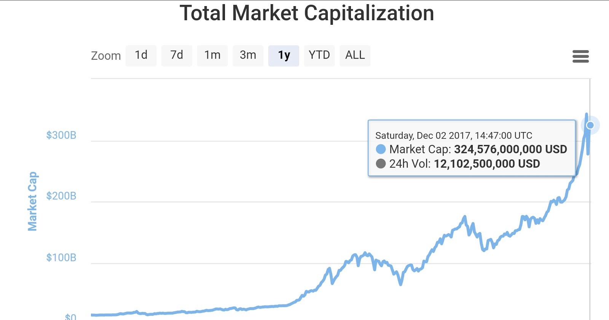

[Over one third of a trillion dollars.](http://coinmarketcap.com/) That’s the total amount of cryptocurrencies in the world. $165 Billion belongs to Bitcoin alone, which just shows how dominant network effects can be. Because of Bitcoin technology, the power to create money was granted to every human being on earth and taken away from kings, oligarchs, and governments. The printing press did the exact same thing for information, which started the renaissance and led to the industrial revolution.

[市值超过一万亿美元的三分之一。](http://coinmarketcap.com/) 这是世界上加密货币的总量。 1650 亿美元仅属于比特币，这只说明了网络效应的优势。 由于比特币技术，创造金钱的权力被赋予给了地球上的每一个人，并从国王、寡头和政府手中转移。 印刷机对信息做了同样的事情，从而开启了文艺复兴，并引发了工业革命。

There is immense wealth being created right before our very eyes, but it is happening so fast that most people are ignoring it. I remember when I was a young boy, I loved reading the Guinness book of world records, and one of the most fascinating things for me there was the list of richest people in the world. [In the late 80s to early 90s, it was consistently the Sultan of Brunei, with his golden throne, 200 Ferraris, and a gold plated Rolls Royce that made the top of the list.](http://factsanddetails.com/southeast-asia/Brunei/sub5_10a/entry-3604.html)

在我们眼前有巨大的财富正被创造，但发生得如此之快以至于大多数人都无视它。 我记得当我还是个小男孩的时候，我喜欢读《吉尼斯世界纪录大全》，其中最让我着迷的是世界上最富有的人的名单。 [在八十年代末至九十年代初，一直是文莱的苏丹，他的纯金宝座，200 辆法拉利，还有镀金的劳斯莱斯，使他名列榜首。](http://factsanddetails.com/southeast-asia/Brunei/sub5_10a/entry-3604.html)

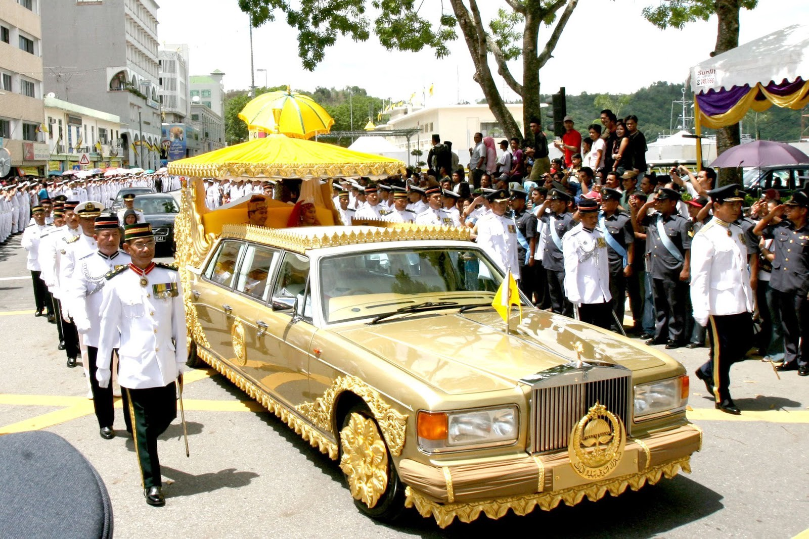

[Then in the late 90s to early 2000s, it suddenly became Bill Gates and a bunch of other geeks that made it to the top.](http://en.classora.com/reports/x23204/ranking-of-the-worlds-wealthiest-people?edition=1998) Where the hell did they come from? How can a bunch of geeks writing software, wearing sneakers, and working from their garages become wealthier than a Sultan with solid gold chairs? Why did this happen?

[然后在九十年代末至二十一世纪初，榜首突然被比尔·盖茨和其他一些极客占据。](http://en.classora.com/reports/x23204/ranking-of-the-worlds-wealthiest-people?edition=1998) 他们到底从哪儿来的？ 一堆写软件，穿运动鞋，在车库里工作的极客怎么可能比一个有着纯金椅的苏丹更富裕呢？ 为什么会发生这种事？

Because there is much more value in a global network allowing people to store, exchange, and transfer information than in yellow shiny rocks and fossil fuels from under the ground.

因为在全球网络中存储、交换和传输信息的价值，要远远超过地底下黄色闪闪发光的石头和化石燃料。

The exact same thing is happening today in the cryptocurrency world. Suddenly, geeks who toiled over establishing the Bitcoin network voluntarily and thanklessly for years and years are being paid back by the very software they helped build. Traders who believed in projects and invested the small amount of money they had left along with time and effort in building these projects are seeing 1000% up to 30,000% increases in the value of their net worth in cryptocurrencies. Pioneers are paving the way for a new generation of financial applications that will usher billions of new users to the internet economy. There are some among them who are already approaching Billionaire status, and many more will follow.

今天，在加密货币世界中也是如此。 突然之间，那些年复一年自愿和吃力不讨好地建立比特币网络的年轻人，正在通过他们帮助建立的软件获得了回报。 那些相信项目的交易者投入少量资金，并投入时间与精力建设这些项目，他们加密货币的净资产值增长达 1000％ 到 30000％。 先驱们正在为新一代金融应用铺平道路，这将为互联网经济带来数十亿的新用户。 先驱中的一些人已几乎成为亿万富翁，还有更多的人会跟随其后。

Wealth creation is not a bad thing, and the concentration of this wealth is also not necessarily a bad thing. How the wealth was acquired is what is important — honest wealth. Bitcoin is honest money. No coercion, no unfair advantage, no abuse of power, and no abuse of labor was needed to establish the newfound wealth of the original Bitcoin and cryptocurrency trailblazers. This is why trust fund babies who have been “trading for decades” shit on Bitcoin — they cant accept the fact that a geek who took a risk early on an unknown technology is now much wealthier than them, in the same way I can imagine a guy sitting on a solid gold throne must have scoffed at the idea of a geek in a garage being richer than him.

财富创造并非坏事，而这些财富的集中也不一定是坏事。 如何获得这些财富才是真正重要的 - 诚实的财富。 比特币是诚实的钱。 没有强迫，没有不公平的优势，没有滥用权力，也无需滥用劳动力，以建立原来的比特币和加密货币开拓者的新财富。 这就是为什么那些已 “交易数十年” 的信托基金宝贝要诋毁比特币 - 他们不能接受这样一个事实，即一个早期在某项不知名的技术上承担了风险的极客，如今比他们更富有，同样地，我可以想象，一个坐在纯金宝座上的人一定会嘲笑一个在车库里的极客比他更富有的这个想法。

Bitcoin and cryptocurrencies will make a lot of people financially independent, and that’s a great thing. Millions of people who never had access to capital will be able to pursue their goals and build things that could ultimately help humanity as a whole.

比特币和加密货币将使很多人获得经济独立，这是一件伟大的事情。 千百万从来无法获得资本的人将能够追求自己的目标，并建立出可能最终帮助整个人类的事物。

A Bitcoin Core developer was asked (and I paraphrase) “If you work voluntarily to help the Bitcoin network, who pays you? Why do you do it?” His response was “Bitcoin pays me, so I pay it back to Bitcoin with my time and effort.”

一位比特币核心开发者被问到（我转述）“如果你自愿为比特币网络服务，谁来支付你？ 你为什么这样做？“  他的回答是 “比特币支付我，所以我用我的时间和精力来回报比特币。”

## The Separation of Cash and State | 现金与国家的分离

Bitcoin is now the 6th most valuable circulating currency in the whole world, and it did this in about eight years, with roughly only about 0.01% of the world’s population owning or using it.

比特币现在是世界上第六大最有价值的流通货币，它在大约八年内就达到了这个地位，且目前世界上大约只有 0.01％ 的人口拥有或使用比特币。

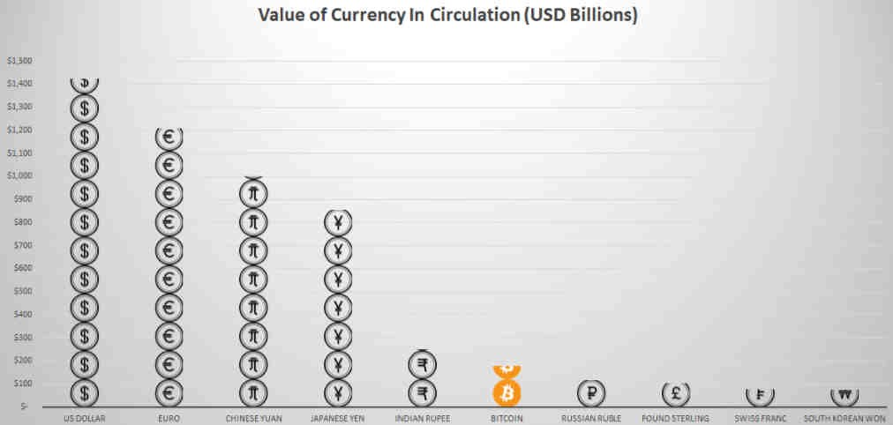

So, we could be watching one of the biggest financial bubbles in history unfold with this cryptocurrency mania. Yet on the other side of the coin, there is also the non-trivial possibility that we are witnessing something remarkable happening before our very eyes — the return of the separation of cash and state.

所以，我们可能正在看到史上最大金融泡沫之一在这加密货币狂热中展开。 然而，在硬币的另一面，也存在一种不平凡的可能性，即我们正在目睹一件非同寻常的事情 - 即现金与国家分离的重现。

People are hungry to be a part of the world of finance. What was once the private playground of the rich and powerful, the middlemen and brokers, institutions and corporations — the world of investing and financial exchange — have been eclipsed by tens of of thousands of common people. People that can’t afford the buy in to the current system, ones who do not pass the vetting of its gatekeepers and are left with nowhere to go. They see Bitcoin and cryptocurrencies as a permissionless option to participate in the global financial economy and a way out of their own rat races. They invest hard earned money, a few bucks here and there, hoping to make honest gains on their own, even risking losses, instead of being at the mercy of consumerism and inflation.

人们渴望成为金融世界的一部分。 投资与金融交易的世界，曾经是富人与权贵、中间商和经纪人、机构和公司的私人游乐场， 现如今已被成千上万的普通人所掩盖。 那些无法达到现有系统支付门槛的人，那些没有通过审查，无处可去的人。 他们把比特币和加密货币看成参与全球金融经济的一种无需许可的选项，也是挣脱自己所处的老鼠赛道的一种方式。 他们投入了辛苦赚来的钱，在这里和那里省下的几块钱，希望能靠自己赚到诚实的钱，即使同时冒着亏损的风险，也不愿受消费主义和通货膨胀的摆布。

And it works. Young men and women, from all walks of life, from the Philippines to Kazakhstan, they’re learning, saving, putting in the time and effort, finding jobs, making good money, and then teaching or inspiring others to do so too.

这样做是有成效的。 来自各行各业的年轻人，从菲律宾到哈萨克斯坦，都正在学习、储蓄、投入时间和精力，找到工作，赚大钱，然后教导或鼓励其他人也这样做。

Children born from 2009 onward are going to live in a world where digital cryptocurrencies always existed and are the norm instead of a fad. They will never understand the need to wait “3 to 5 business days” for money to be transferred, to wait in line at a bank, to pay 10% to send money. It’s easy to think that this is wishful thinking, but remember, lot of people called the internet a fad too. Now we no longer go online, we *live* online.

2009 年以后出生的孩子将生活在一个数字加密货币一直存在的世界，并且是种常态而非一时风尚。 他们永远不会理解需要等待 “3 至 5 个工作日” 才能转账成功，需要在银行排队等待，以及需要支付 10％ 的手续费汇款。 人们很容易认为这是一厢情愿的想法，但请记住，很多人也曾把互联网称为一时风尚。 如今，我们不再上网了，我们*生活*在网上。

Technologies of tomorrow like robotics, Artificial intelligence, autonomous machines, and the Internet of Things will not use credit cards, a technology never intended for an online network, but will use blockchains and cryptocurrencies, with Bitcoin as the global reserve. This is almost a certainty.

像机器人技术、人工智能、自主机器和物联网这样的未来技术将不会使用信用卡，这样一种不是为互联网设计的技术，而是使用区块链和加密货币，且将比特币作为全球储备。 这几乎是确定的。

Will crypto markets crash in between? Most likely. In the same way the dotcom bubble burned over six trillion dollars back in 2000, Bitcoin and cryptocurrencies will probably go through the same cycles. Bubbles establish the true players in the market and eliminate all the ones who are there for a quick buck. What’s important is that the technology is real, and it is here to stay.

加密货币市场会崩盘吗？ 很有可能。 正如六万亿美元的互联网泡沫在 2000 年破灭，比特币和加密货币可能会经历相同的周期。 泡沫可以筛选出市场上真正的参与者，并清洗掉所有想于此赚快钱的人。 重要的是，这项技术是真实的，而将在此停留。

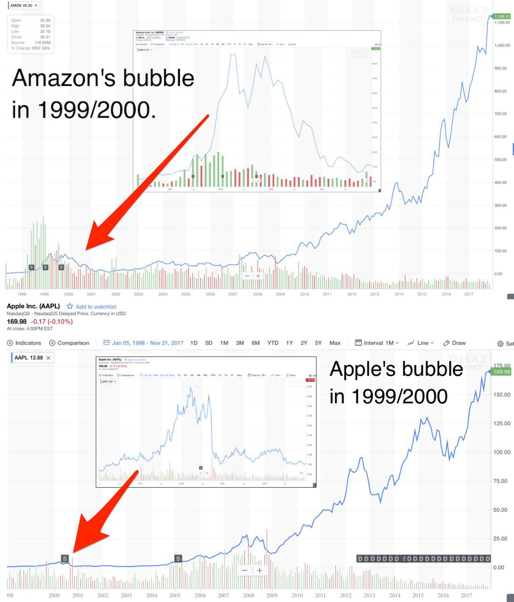

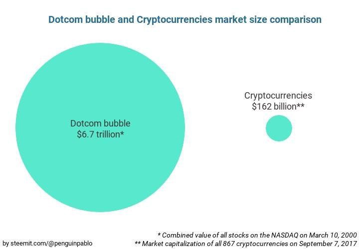

## The Future of Money Itself | 金钱本身的未来

> *“True confidence lies not in being sure you are right, but in not being afraid to be wrong.”*

> *“真正的自信不在于确信你是对的，而在于不害怕错误。"*

So what’s going to happen? Bitcoin’s upward trend becomes logical once you understand the many layers of the technology behind it. Add to that the thousands and thousands of people who, for their own financial self-interest, will work day and night and fight tooth and nail to keep the fire going, building the network, protecting the network, being the network, and you’ve got an unstoppable force or innovation and value pushing us towards the next evolution of money.

那么将会发生什么？ 一旦你了解了它背后的技术层面，比特币的上行趋势就变得合乎逻辑了。 再加上成千上万的人为了自己的经济利益，将日夜工作，全力以赴，以延续燎原之火，建立这个网络，保护这个网络，和成为网络本身， 于是我们拥有了一股来自创新与价值的不可阻挡的力量，推动我们走向货币的下一个演进。

But to answer the question, no one can predict what is going to happen.

但之前问题的答案是，没人能预测将会发生什么。

These are merely possibilities that I and others have explored. To say we know where this growth trend will end up is folly. That’s why the work never stops, that’s why we drive the direction instead of letting it drive us. As I write this, the positive feedback loop and self-reinforcing trend that Bitcoin started keeps moving forward and upward, with no equilibrium in sight, and with the end-game being a global paradigm shift in the way we transfer value to one another.

这些只是我和其他人探索的可能性。 说我们知道这种增长趋势最终会驶向何方是愚蠢的。 这就是为什么工作永不会停止，这就是为什么我们要驱动前行的方向，而非让它驱动我们。 当我写这篇文章时，由比特币开始的正反馈循环和自我强化趋势继续前进和上升，目之所及处无可比拟，最终结果是我们转移价值的方式在全球范围内的模式转变。

The future of money will lie in the hands of its users, the people, the sovereign individual, and not in the powers that be. Money is , in fact, a form of speech. **It is just a message about the transfer of value from one to another. Because of the Bitcoin protocol, we finally figured out how to use our most powerful communication channel, the internet, to exchange value with anyone, anywhere, anytime, without permission or friction, freely.**

金钱的未来将掌握在使用者、人民、主权个体的手中，而不是存在于权力之中。 金钱，实际上，是一种语言形式。 **它只是一个关于价值从一处转移到另一处的信息。 由于比特币协议，我们终于知道如何使用我们最强大的通信渠道 - 互联网，来随时随地、无需许可、没有阻力地与任何人自由交换价值。**

We will live in a future where Bitcoin set money free.

我们将会活在一个比特币使金钱获得自由的未来。

- *Many thanks to @ericzoo for the comments and suggestions, much appreciated.*

- *Thoughts and opinions are my own and in no way reflect any affiliations I have with any organization.*

- *I do not give investment advice. This is not investment advice.*

- *非常感谢 @ericzoo 的意见和建议。*

- *这些是我自己的想法与意见，绝不反映我与任何组织的任何联系。*

- *我不提供投资建议。本文不构成投资建议。*

----------------------------------------------------

#### 区块链中文字幕组

致力于前沿区块链知识和信息的传播，为中国融入全球区块链世界贡献一份力量。

如果您懂一些技术、懂一些英文，欢迎加入我们，加微信号:w1791520555。

[点击查看项目GITHUB，及更多的译文...](https://github.com/BlockchainTranslator/EOS)

#### 文本译者简介

龙心小台，区块链学习者，微信公众号：视听区块链

本文由币乎社区（bihu.com）内容支持计划赞助。

版权所有，转载需完整注明以上内容。

----------------------------------------------------
