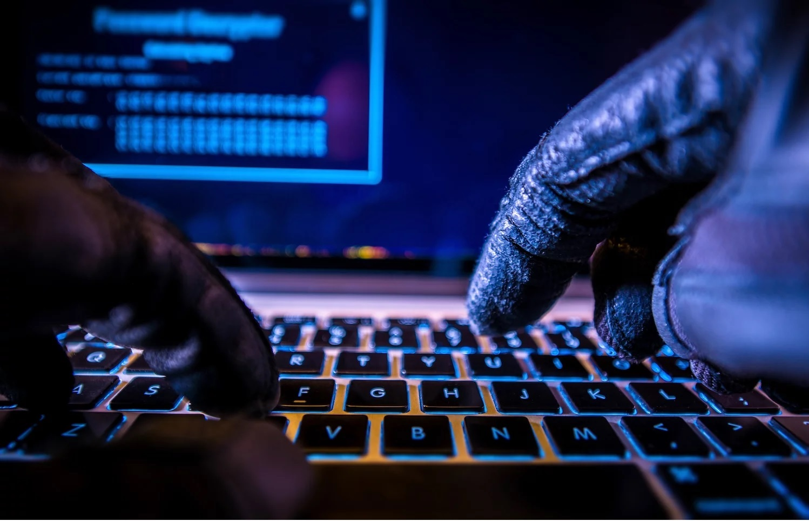

# Hacks, Scams and Attacks: Blockchain's 2017 Disasters
# 黑客，诈骗和攻击：Blockchain的2017年灾难

> 本文翻译自：https://www.coindesk.com/hacks-scams-attacks-blockchains-biggest-2017-disasters/
> 
> 译者：[区块链中文字幕组](https://github.com/BlockchainTranslator/EOS) [林炜鑫](https://github.com/weixin1993)
> 
> 翻译时间：2018-01-09

Hard forks? Soft forks? ICOs?

Bombarded by no shortage of unfamiliar technical terms in 2017, consumers in the blockchain sector once again proved a ripe target for hackers and criminals. But, not all hacks and scams were created equal. Some rose above the froth – either due to their size or impact – as well as what they said about the state of blockchain technology and the industry itself.

硬分叉？软分叉？ICOs？

在2017年不乏陌生的技术术语的情况下，区块链领域的消费者再一次证明了黑客和黑客的成熟目标。 但是，并不是所有的黑客和骗局都是平等的。 有些人因为其规模或影响力以及他们对区块链技术和行业本身的看法而处于教顶层。

Still, the impacts of these incidents were far from academic. Whether it was a simple wallet hack, fraudulent ICO or a bug in a piece of software code, investors lost millions, with nearly 490 million dollars taken in the incidents below.

So far, none of the perpetrators of these crimes has been caught or even identified, and it's questionable whether most of these funds can be found or returned.

不过，这些事件的影响还远远没有达到学术水平。 无论是简单的钱包黑客，欺诈性的ICO还是软件代码中的错误，投资者都损失了数百万美元，在下面的事件中更是损失了近4.9亿美元。

到目前为止，没有发现这些犯罪行为人被抓获甚至被发现，大部分资金是否能够被查获或归还，这是值得怀疑的。

## 1.CoinDash ICO Hack
## 1.CoinDash ICO 遭遇黑客攻击

Payment and shipment startup CoinDash launched an initial coin offering (ICO) campaign early this summer, but it quickly had to pump the brakes after its ethereum address was compromised.

The startup raised 7.3 million dollars before a hacker changed the address, causing donations to go to an unknown party. The company shut down the ICO, but promised to send its native token award, CDT, to those who attempted to donate.

While the company stated that donations sent after it had released its statement would not be honored, some investors continued to show support by donating to the hacked address, inadvertently raising the amount of stolen funds from 7 million dollars to 10 million dollars at the time.

All in all, the incident showcases the growing pains experienced by ICOs, which despite raising massive amounts of funds, still had to navigate the complexities of an early-stage technology.

支付和出货创业公司CoinDash在今年夏天初期推出了初始硬币发行（ICO）活动，但是在其ethereum地址被盗用后，它很快不得不刹车。

这家创业公司在黑客改变地址之前筹集了730万美元，导致资金去了一个未知的地址。 该公司关闭了ICO，但承诺将其本土代币奖CDT发给那些参与ico的人。

虽然该公司表示在发表声明后发出的资金不会得到兑现，但一些投资者继续表示支持，将被盗资金从700万美元无意中提高到了1000万美元。

总而言之，这次事件表明了ICO们所经历的巨大灾难，尽管筹集了大量的资金，仍然不得不驾驭早期技术的复杂性。

2.Parity Wallet Breach
2.Parity钱包漏洞

It was a tough year for cryptocurrency wallet provider Parity, which has the rare distinction of being cited twice on our year-end list.

Issues began in July when the U.K.-based startup discovered a vulnerability in version 1.5 of its wallet software, resulting in at least 150,000 ethers being stolen from user accounts.

The bug was found in its multi-signature wallets, compromising several companies’ ICO fundraisers. At the time, the ethers were worth roughly 30 million dollars, but they're worth closer to 105 million dollars as of mid-December.

The issue was deemed "critical," with the company's CTO, Gavin Wood, announcing at least three compromised addresses and saying efforts were being made to prevent further loss of funds.

It was later found that more than 70,000 ethers were already cashed out or otherwise redeemed in some way, ensuring that their loss was permanent.

今年对密码货币钱包提供商Parity来说是艰难的一年，在我们的年终名单上，这是少有的两次被提及的钱包。

问题从7月的英国开始。该公司在其钱包软件的1.5版中发现了一个漏洞，导致至少15万名用户的钱包账户失窃。

这个漏洞出现在它的多签名的钱包里，危及了几家公司的资金筹集。当时，这些以太坊价值约为3000万美元，但截至12月中旬，它们的价值接近1.05亿美元。

该问题被认为是“至关重要的”，该公司的首席技术官加文伍德宣布了至少三个丢失的地址，并表示正在努力防止资金进一步流失。

后来发现，超过7万的以太坊已被套现或以某种方式赎走，也就是说它们的损失是永久性的。

## 3.Enigma Project Scam
## 3.Enigma项目骗局

Back in ICO-land, issues weren't limited to compromised addresses.

Blockchain startup Enigma saw its website, mailing lists and an administrator account on its Slack channel compromised when fraudsters launched a fake token pre-sale in August, defrauding potential investors of more than 1,500 ethers.

The hijacked accounts promised a large return on investment, and masquerading as the genuine operators of the project, those behind the effort were able to convince unsuspecting consumers to donate to the compromised website.

While the team behind Enigma was able to recover control of the company’s accounts, the ether wallet used by the hacker was emptied, and the funds were not recovered.

回到ICO-land，问题并不局限于丢失的地址。

区块链初创公司Enigma在其Slack频道上看到了欺诈网站，邮件列表和管理员帐户，这些诈骗者在8月份推出了一个虚假的代币，欺骗了超过1,500个以太坊的潜在投资者。

被劫持的账户得到了会有大量的投资回报的承诺，并且伪装成项目的真正运营商，这些诈骗者能够说服不知情的消费者向被入侵的网站汇款。

虽然Enigma背后的团队能够恢复对公司账户的控制，但黑客使用的以太钱包已经被清空，资金也没有恢复。

## 4.Parity Wallet Freeze
## 4.Parity钱包冻结

Perhaps the year's biggest security incident, this entry on the list is also distinguished by being one the few to take place without the apparent aid of a malicious party.

Occurring suddenly this November, a Parity user accidentally found a bug in the software code, freezing more than 275 million dollars in ether in the wallet’s second major incident of 2017.

One of two widely used clients for ethereum, the miscue effectively called into question what was and is a central infrastructure component of the network, prompting some to doubt the company's offerings and renewing criticisms of ethereum itself.

In subsequent updates, developers have pushed to restore the funds, though it's now believed that doing so would require all ethereum users to upgrade their software.

这也许是今年最大的安全事件，名单上的这个条目也是有目共睹的，也是少数不是因为恶意方的攻击而发生的事件。

在今年11月突然发生的一件事，一名Pariyt用户意外发现了软件代码中的一个漏洞，在2017年的第二起重大事件中，冻结了超过2.75亿美元的以太坊。

作为以太坊的两个被广泛使用的钱包之一，这一失误让人们对该网络的核心基础设施构成了质疑，这促使一些人质疑该公司的产品，并重新对以太坊本身的进行了批评。

在随后的更新中，开发者们一直在努力回复这些资金，尽管现在他们知道这样做需要所有以太坊的用户升级他们的软件。

## 5.Tether Token Hack
## 5.Tether代币遭遇黑客攻击

In another incident notable for its unresolved controversies, more than 30 million dollars was stolen from the U.S. dollar-pegged cryptocurrency Tether in late November.

At the time, Tether claimed that roughly 31 million dollars’ worth of tokens were taken from their virtual treasury and sent to an unknown bitcoin address.

Not a significant number in the cryptocurrency economy, the hack was more relevant as it effectively renewed long-standing criticisms of Tether the company, prompting scrutiny in the form of blog posts and mainstream news exposes.

The company later moved to blacklist the tokens stolen through an update to the Omni protocol, the blockchain on which it is based. Still, Tether continues to be dogged by allegations the incident played no small part in stirring up.

另一起以悬而未决的争议而闻名的事件是，11月下旬，美元挂钩的加密货币Tether被盗走了3000多万美元。

当时，Tether声称大约价值3100万美元的代币被从他们的虚拟库中取出，并被发送到一个未知的比特币地址。

在加密货币经济中，这一数字并不是很大的数字，但因为其有效地更新了对公司的长期批评，引发了人们对博客文章和主流新闻的关注。

该公司后来通过对Omni协议进行更新，将被盗的代币列入黑名单，Omni协议是基于区块链的协议。 尽管如此，Tether仍然受到指控的困扰，这一事件起了主要的煽动作用。

## 6.Bitcoin Gold Scam
## 6.比特币黄金骗局

Think forks were confusing? So did scammers, and those seeking to cash out new tokens awarded in blockchain splits often proved all too easy to target.

Shortly after the launch of a bitcoin fork called bitcoin gold, for example, some bitcoin users had their cryptocurrency wallets drained after using a service seemingly endorsed by the project's development team.

Marketed as a way to authenticate whether a user was eligible for bitcoin gold funds (effectively free money for bitcoin owners), the website’s operators instead stole more than 3 million dollars in bitcoin, bitcoin gold, ethereum and litecoin.

Bitcoin gold’s development team claimed no formal relationship with the website’s developer, arguing he reached out offering to build a wallet checking service and offering to make his code open-source. The site’s developer initially claimed the site was hacked, but later wiped his GitHub and ceased responding to users on the fork’s Slack channel.

Overall, though, it was another case of consumers falling into traps over promises of free funds.

认为分叉币太过混乱？诈骗者也是这么想的，那些试图通过区块链获得新代币的人通常都很容易被攻击。

例如，在比特币黄金推出之后不久，一些比特币用户在使用了项目开发团队似乎认可的服务之后，他们的加密货币钱包就被抽空了。

作为验证用户是否有资格获得比特币黄金资金（实际上为比特币所有者免费获取）的一种方式，该网站的运营商反而偷走了比特币，比特币黄金，以太币和莱特币等价值300多万美元的资金。

比特币黄金的开发团队声称与该网站的开发人员没有正式的关系，他争辩说，并主动提出要建立一个钱包检查服务，并提供让他的代码开源的服务。该网站的开发者最初声称该网站被黑客攻击，但后来删掉了自己的GitHub，并停止对该网站的用户的回应。

总体而言，这是另一起消费者因为获得免费基金承诺而陷入陷阱的案例。

## 7.NiceHash Market Breach
## 7.NiceHash市场漏洞

That's not to say that long-standing companies were spared by the year's attacks.

This was the case when cryptocurrency mining marketplace NiceHash, a well-known marketplace for mining power, reported being hacked early in December, later confirming that about 4,700 in bitcoin was stolen. At the time, that was worth approximately 78 million dollars.

It was later revealed an employee’s computer was compromised, allowing the perpetrator to gain access to the marketplace’s systems and remove bitcoin from the company’s accounts.

NiceHash CEO Marko Kobal later announced that his team was trying to determine how the hack occurred, but that it would take time to establish what happened.

这并不是说，长期以来存在的公司就能在今年的攻击中幸免于难。

去年12月初，一个著名的矿业市场——加密货币矿业市场NiceHash报告了被黑客入侵的消息，后来证实，比特币的被盗量约有4700个。当时，这价值约7800万美元。

该公司后来披露，一名员工的电脑遭到了入侵，这让犯罪者得以进入市场的系统，并将比特币从公司账户中删除。

NiceHash的CEO Marko Kobal后来宣布，他的团队正在试图确定这次黑客攻击是如何发生的，但是需要时间来确定到底发生了什么（如何发生）。

----------------------------------------------------

#### 区块链中文字幕组

致力于前沿区块链知识和信息的传播，为中国融入全球区块链世界贡献一份力量。

如果您懂一些技术、懂一些英文，欢迎加入我们，加微信号:w1791520555。

[点击查看项目GITHUB，及更多的译文...](https://github.com/BlockchainTranslator/EOS)

#### 本文译者简介

林炜鑫，在读硕士，专注区块链技术研究与行业分析，欢迎加微信号:happyzai1993。

本文由币乎社区（bihu.com）内容支持计划奖励。

版权所有，转载需完整注明以上内容。

----------------------------------------------------

