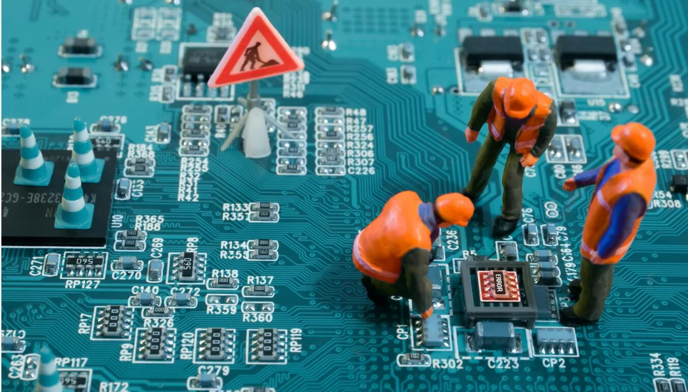

# Don't HODL, BUIDL: How Blockchain Tech Will Add Value in 2018
# 不仅HODL，还要BUIDL：2018区块链增值的方式

> 本文翻译自：https://www.coindesk.com/dont-hodl-buidl-blockchain-tech-will-add-value-2018/
> 
> 译者：[区块链中文字幕组](https://github.com/BlockchainTranslator/EOS) [林炜鑫](https://github.com/weixin1993)
> 
> 翻译时间：2017-01-26

>文中的HODL：(Hold on for dear life)表示坚持持有

>文中的BUIDL：表示建设，开发

Ajit Tripathi is an EMEA partner at Consensys Enterprise, and a former director of fintech and digital banking at PwC, where he co-founded its UK blockchain and smart contracts practice.

作者介绍：Ajit Tripathi是Consensys Enterprise的欧洲，中东和非洲（EMEA）合作伙伴，也是普华永道的金融科技和数字银行业务的前董事，共同创立了英国区块链和智能合约业务。

I have come to trust [Vitalik Buterin](https://www.coindesk.com/information/who-created-ethereum/) to ask the most important questions in blockchain.

我一直在思考[Vitalik Buterin](https://www.coindesk.com/information/who-created-ethereum/)提出区块链中最重要的问题。

The ethereum founder did that again last month when he asked in a [tweet](https://twitter.com/vitalikbuterin/status/940746391256678400?lang=en): "Alright, the crypto market is now worth $525 billion, but how much of that valuation have we really earned?"

Ethereum的创始人上个月再次做了这个，当时他的[推特](https://twitter.com/vitalikbuterin/status/940746391256678400?lang=en)中问道：“好吧，现在加密货币市场的价值达到了5,250亿美元，但是我们真的赚了多少价值呢？

We can answer Vitalik’s question by using the tried-and-true method of discounted cash flows.

我们可以用贴现现金流的可靠方法来回答Vitalik的问题。

## This time isn't different
## 时代并没有什么不同

During the 1990s dot-com boom, valuation by counting eyeballs and various other body parts was rampant.

在20世纪90年代网络热潮期间，普遍通过计算吸睛程度和其他一些指标来估价。

During the housing boom, valuation was whatever you wanted by tuning projects’ default rates, prepayment rates, volatility and correlation.

在房地产繁荣时期，通过调整项目的违约率，提前还款率，波动性和相关性，可以随心所欲地进行估值。

During the current crypto boom, methods rooted in science fiction such as network-based valuation, technical analysis, Metcalfe’s law and Moon-based valuation have all blossomed.

而在目前的加密货币繁荣期，基于网络评估，技术分析，梅特卡夫定律和基于期待值的估计方法都在被应用。

Unfortunately, whenver bubbles burst, discounted cash flows return with a vengeance.

不幸的是，当泡沫破裂时，贴现现金流将会报复性的回跌。

So, while we all believe blockchain technology can solve all our problems including valuation problems, let’s pretend this time is not different, and one day either everyone in crypto will have to generate fiat revenues and profits in some form.

所以，虽然我们都认为区块链技术可以解决包括估值问题在内的所有问题，但假如这一次并没有什么不同，有一天加密货币中的每个人都必须以某种形式产生法定收入和利润。

The less likely that you will get the cash you think you will get in the future, the higher the discount rate. That is a big mess when you are dealing with anything except government bonds, which academic orthodoxy treats as risk-free (never mind the humongous national debt).

您认为将来获得现金的可能性越小，贴现率越高。当你处理除政府债券之外的任何事情时，这是一个很大的混乱，学术正统派认为政府债券是无风险的（不要care巨大的国家债务）。

Asset pricing gets even worse when commodities and currencies are involved and we have to start watching costs and benefits of HODLing all your digital GODL or any "implied interest rate" you might earn on your GODL. That forecast of net benefit to the HODLer is basically your cash flow forecast.

如果涉及商品和货币，资产定价会变得更糟，我们必须开始关注所有数字货币或您HODLing你的代币是可能获得的任何“隐含利率”的成本和收益。 HODLer(持有者)的净收益预测基本上是您的现金流量预测。

So, as Vitalik pointed out – the crypto market is worth 525 billion dollars but what did we do that is worth that in the future?

所以，正如Vitalik所指出的那样 - 密码市场的价值达到了5,250亿美元，但是我们做了什么对于未来来说有价值的事呢？

The question is what did we solve, enhance, or deliver that will make individuals, companies or governments produce more, be more efficient, or enjoy their lives and relationships more?

问题是，我们解决，提高或实现了什么，会使个人，公司或政府生产更多，效率更高，或更多地享受生活和人际关系？

At a high level, we can ask:

站在更高的层次，我们可以问：

1.What features (e.g. Truffle), products (e.g. UPort) or platforms (e.g. Digital Trade Chain) did we build that a consumer is using or benefiting from? No, I don’t mean tether, Telegram chat channels, or proofs of concept.

1.我们是否建立了消费者正在使用或从中获益的功能（例如Truffle框架），产品（例如UPort）或平台（例如数字贸易链）？不，我不是指tether，电报聊天频道，或概念证明。

2.Which enterprise solutions went live and how much new revenue or efficiencies did they create? This includes the work ConsenSys and IBM are doing in Dubai, trade finance platforms by IBM and R3, MUFGCoin and so on.

2.哪些企业解决方案已经上线，创造了多少新的收入或效率？这包括ConsenSys和IBM在迪拜的工作，IBM和R3的贸易融资平台，MUFGCoin等等。

3.How much did we improve the infrastructure and stack by in terms of scalability, privacy, confidentiality and other such nice things? Quorum, zcash, Fabric, Corda, Coco – all count.

3.我们在可扩展性，隐私性，保密性和其他这样的好事方面改善了基础架构和堆栈？法定人数，zcash，织物，Corda，可可 - 都算。

4.What original business models and technologies were created in 2017? ERC-20 tokens and CryptoKitties are included. Stablecoin crypto exchanges are excluded.

4.2017年创造了什么原创商业模式和技术？包括ERC-20货币和CryptoKitties（加密猫）。稳定币加密交易所被排除在外。

5.For each of these, what’re the odds that we will see the invention used by a real person or enterprise over time? In the absence of any information, let’s assume 50% for each.

5.对于每个人来说，我们将看到一个真实的人或企业在一段时间内所使用的发明的可能性是什么？在没有任何信息的情况下，我们假设每中可能性都有50％。

## Incremental value added in 2017
## 2017年实现的增值

There is simply no way that we baked 500 billion dollars worth of additional consumer value last year that we didn’t have in 2016 – and all we had in 2016 was PoCs and a few promising ideas.

去年，我们根本没有办法产生价值5000亿美元的额外消费价值，因为我们在2016年并没有这些——我们在2016年所拥有的只是PoC和一些有希望的想法。

Any which way you make your list, there was just not enough useful kit in consumer or enterprise production last year.

无论你选择哪种方式，去年在消费者或企业生产中都没有足够的有用套件。

Bitcoin scraped through to Segwit and all sorts of forks. A very large set of ethereum tools and solutions was released; Quroum, Corda, and Fabric became useful in the enterprise ecosystem, and a very small number of consortia got into technical production.

比特币被卷进了Segwit和各种各样的分叉风波。一个非常大的以太坊工具和解决方案发布了; Quroum，Corda和Fabric在企业生态系统中变得有价值，少数财团开始了技术生产。

We bypassed VCs and made it possible for good, bad, and ugly blockchain startups alike to fund their runway.

我们绕过了风险投资公司，使得好的，坏的和难看的区块链初创公司都能够得到起步资金。

So how much value did we add in 2017? When we calculate the consumer value of ERC tokens and CryptoKitties, and subtract the future disasters from future Amazons, we will probably get a smaller number than the 3 billion dllars that was raised last year in ICOs.

那么我们在2017年增加了多少价值？当我们计算ERC代币和加密猫的消费价值，并从未来的亚马逊可能的损失时，我们可能会比去年在ICO上筹集的30亿美元少一些。

Then we will thank Vitalik that all this money that could have gone into a largely useless coinware instead went into useful tech.

然后，我们将感谢Vitalik，所有这些可能会进入了一个大体上无用的硬币的钱，投资了有用的技术。

## Why I bet on ethereum
## 为什么我看好以太坊

Yes, there will be a lot more value created with blockchain in 2018 and even more the year after but there’s so much future baked into the prices today – and it may need to be swapped around as we learn more.

是的，2018年区块链将会创造更多的价值，甚至以后会更多，但未来有无限可能，不限于今日的价格，当我们学到更多东西的时候，可能会出现不同。

I suspect that each year, half of the ICO-funded startups from the previous year will die – if they even make it that long.

我怀疑，每年，去年ICO资助的初创企业中，有一半将会死去 - 如果他们坚持不住的话。

Yet there will be the next Amazon or Google or Netflix in there. If you know how to pick them, go ahead. I don’t.

当然，那里将会有下一个亚马逊或谷歌或Netflix。 如果你知道如何选择他们，继续。 而我，不知道如何选。

This is why I am making a big bet of time on ethereum rather than a bet of money in crypto.

这就是为什么我要在以太坊上投入大量时间，而不是在加密货币上赌钱。

Ethereum has momentum, developer adoption, and a team that is willing to address the technical limitations even at risk to the price of ether.

以太坊背后有强大动力支持、大量的开发人员以及能够承受以太坊价格下跌风险的、热衷专注于解决技术问题的团队。

It has people who are serious about the Web 3.0 vision and solving real consumer and business problems.

它有认真对待Web 3.0愿景并解决真正的消费者和商业问题的开发者。

Does that mean 7 dollars, 70 dollars, or 700 billion dollars is a fair value for ether? I can’t say. Whether ether will go to the moon in 2025 depends on if ethereum is still the public blockchain in widespread use or if someone comes up with something much better, and if ethereum continues to evolve unlike some other crypto networks have.

这是否意味着7美元，70美元或7,000亿美元对以太坊来说是一个公平的价值？ 我不能这么说。 2025年以太坊价格是否会登陆月球（上天）取决于以太坊是否仍然是普遍使用的公共链，或者是否有人提出了更好的办法，以及以太坊是否继续发展，不像其他加密货币那样。

Does that mean you should buy ether today? I can’t and don’t offer investment advice.

这是否意味着你今天应该买以太坊？ 我不能也不提供投资建议。

Should you start learning how to use ethereum to build solutions and decentralized businesses? Definitely – my son is learning how to build with ethereum and he is 14. He can do quite well just knowing how to build solutions for other people.

你应该开始学习如何使用以太坊来建立解决方案和去中心化的业务？ 是的 - 我的儿子正在学习如何利用以太坊进行开发，他14岁。他知道如何为其他人建立解决方案，他可以做得很好。

## BUIDL, not HODL
## 创造，不仅是持有

When we are dead, it’s not what we HODL or SODL（卖出） that matters. It’s what we BUIDL

当我们死了，我们HODL或SODL了什么都不重要。 重要的是我们BUIDL了什么。

So I advise everyone to think about that and BUIDL. Those who BUIDL do seem to enjoy it and look happier than the rest of us.

所以我建议大家考虑一下，参与BIUIDL。 那些参与BUIDL的人似乎很沉醉其中，看起来比我们其他人更快乐。

Besides, since BUIDLers don’t have the time to day trade or buy dodgy coins, they are also a lot less likely to get REKT.

此外，由于BUIDLer们没有时间交易或购买可笑的一些代币，他们也不太可能被欺骗。

----------------------------------------------------

#### 区块链中文字幕组

致力于前沿区块链知识和信息的传播，为中国融入全球区块链世界贡献一份力量。

如果您懂一些技术、懂一些英文，欢迎加入我们，加微信号:w1791520555。

[点击查看项目GITHUB，及更多的译文...](https://github.com/BlockchainTranslator/EOS)

#### 本文译者简介

林炜鑫，在读硕士，专注区块链技术研究与行业分析，欢迎加微信号:happyzai1993。

本文由币乎社区（bihu.com）内容支持计划奖励。

版权所有，转载需完整注明以上内容。

----------------------------------------------------

