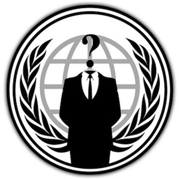
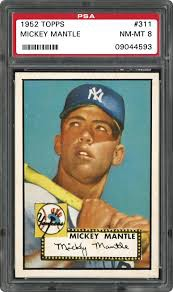
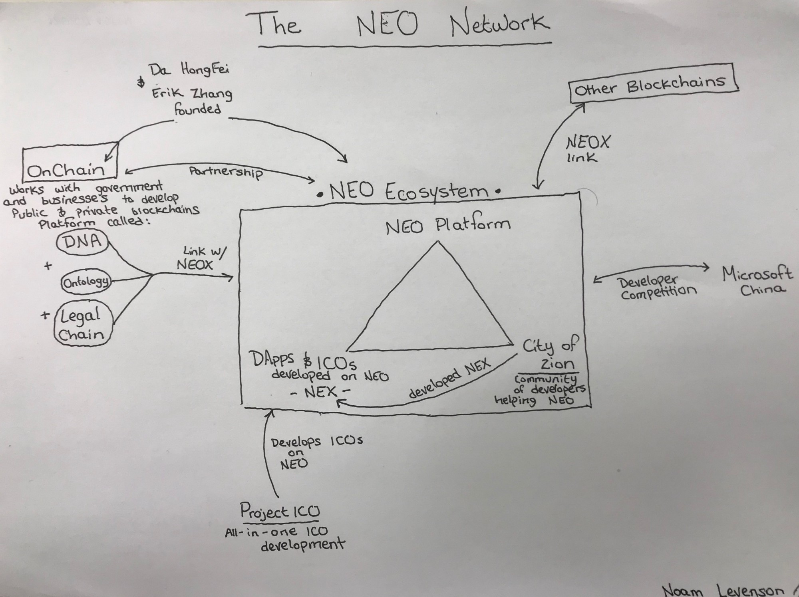

# NEO versus Ethereum: Why NEO might be 2018’s strongest cryptocurrency(二)
# NEO对比Ethereum:为什么NEO可能是2018年最强的加密数字货币（二）

> 本文翻译自：https://hackernoon.com/neo-versus-ethereum-why-neo-might-be-2018s-strongest-cryptocurrency-79956138bea3
> 
> 译者：[区块链中文字幕组](https://github.com/BlockchainTranslator/EOS) [林炜鑫](https://github.com/weixin1993)
> 
> 翻译时间：2017-12-13

### What is NEO doing to prepare itself for the smart economy?
### NEO为智能经济做的准备是什么?

*NEO places particular emphasis on staying regulatory compliant.*
*NEO特别强调要遵守法规。*

To do this, they need:
为了实现这些，他们需要做到：

#### Digital Identity
#### 数字身份

Anonymity is great. I think privacy should be at the forefront of today’s technological developments and discussions. But if companies and governments are operating on the blockchain, digitizing their assets, and issuing smart contracts, all under the watchful eye of the government, they can’t have anonymity. For a platform to be regulatory compliant, digital identity — a verifiable identity in digital form — is a necessary evil.

匿名性是伟大的。我认为隐私应该是当今科技发展和讨论的前沿领域。但是，如果企业和政府在区块链上操作，数字化他们的资产，并发布智能合同，所有这些都在政府的监督下，他们就不能匿名了。对于一个符合监管要求的平台，数字身份——一种可验证的数字形式——是一种必要的邪恶。

Today, digital identity is based on a system called the PKI (Public Key Infrastructure) X.509 standard. This probably means about as much as it does to you as it does to me. It just means that there is an international agreed upon standard for what constitutes a digital identity. NEO’s plan is to issue digital identities in accordance to this standard and then secure them using the blockchain. Bookkeepers (read about them later) will have digital identities and real names. Because of this, judicial action can be taken against them if ever need be. This is imperative when registering financial assets on the network and staying regulatory compliant.

今天，数字身份是基于一个名为PKI(公共密钥基础设施)X.509标准的系统。这可能意味着它对你的意义就像它对我的意义一样。这只是意味着，国际上就什么构成数字身份的标准达成了一致。NEO的计划是按照这个标准发布数字身份，然后使用区块链保护他们。区块链记账员(稍后阅读有关他们的信息)将会有数字身份和真实姓名。正因为如此，如果有必要的话，可以对他们采取司法行动。这使得人们必=在网络上注册金融资产时，必须保持法规遵循。

There could also be businesses and projects that will only transact with people who have a digital identity, for regulatory reasons. NEO enables that possibility.

此外，由于监管方面的原因，企业和项目方也只能与拥有数字身份的人进行交易。NEO使这种愿景成为可能。

NEO is already working in a strategic partnership with THEKEY — a project being developed on NEO’s platform that will assist with providing digital identification.

NEO已经在与THEKEY项目方达成战略合作伙伴。该项目正在NEO的平台上开发，它将为NEO帮助提供数字识别。

**What about Ethereum:** Ethereum requires other DApps to develop digital identities which can then be secured on the Ethereum blockchain. This isn’t so unlike how it will work with NEO — however NEO has made it clear, through its plan to incorporate digital identity with its bookkeeper nodes, that integration of digital identity is of central importance to the NEO ecosystem.

**那Ethereum（以太坊）呢:** Ethereum要求其他DApps开发数字身份，然后在Ethereum区块链上进行保护。这并不是说它与NEO工作方式如何不一样——然而NEO已经明确表示，通过将数字身份与区块链记账员节点结合起来的计划，数字身份的整合对NEO生态系统至关重要。

**TLDR: Governments don’t like anonymity. Industries don’t like pissing off the government. If NEO wants industrial adoption, it needs to have digital identities.**

**TLDR：政府不喜欢匿名。工业不喜欢激怒政府。如果NEO想要实现工业应用，所以它需要有数字身份。**

#### Digital Assets
#### 数字资产

If you want a smart economy based on smart contracts, you need to be able to leverage and exchange assets beyond currency. We need to be able to digitize assets like house, property, and car ownership; gold, diamonds, and other precious elements; computers, clothes, and food; even those baseball cards your mom keeps begging you to throw away. Smart contracts become so much more powerful when we have the ability to digitize all of these assets.

如果你想要一个基于智能合同的智慧经济，你需要能够在货币之外利用和交换资产。我们需要能够将资产数字化，如房屋、财产和汽车所有权;黄金、钻石和其他珍贵的元素;电脑、衣服和食物;即使是那些你妈妈一直恳求你扔掉的棒球卡。当我们有能力将所有这些资产数字化的时候，智能合同就变得更加强大了。

**What about Ethereum:** Very similar to the digital identity blurb. Ethereum absolutely can secure digital assets, but they won’t necessarily be regulatory compliant. NEO is ensuring that issued digital asset certificates will be compliant.

**那以太坊呢：**非常类似于数字身份的简介。Ethereum绝对可以确保数字资产的安全，但它们不一定是符合监管要求的。NEO正在确保发布的数字资产证书能够符合标准。

**TDLR: Just read it**

**TDLR:只需要阅读这里**

### NEO’s complex network
### NEO的复杂网络

The economy is complex; it has so many interconnected pieces. NEO’s platform is complex, with partnerships galore. Fully researching and understanding this is difficult. But I did it, so you don’t have to! Refer back to this visual to have a solid picture of how this network interacts.

经济是复杂的;它有很多相互关联的部分。NEO的平台很复杂，有大量的合作伙伴。全面研究和理解这一点是困难的。但我做到了，所以你不需要！回到这个视角，可以看到这个网络是如何相互作用的。

#### OnChain
#### 在链上

NEO’s founders Da HongFei and Erik Zhang founded a company called OnChain. Understanding [OnChain](http://www.onchain.com/en-us/) is critical to understanding NEO. They’re not the same company, but their interests align and they have a partnership together. OnChain’s system, known as DNA (Decentralized Network Architecture) aims to work with Chinese businesses and government. **NEO acts as the foundation of DNA.** If OnChain can integrate with Chinese businesses and government, that will greatly spur adoption of NEO.

NEO的创始人Da HongFei和Erik Zhang创办了一家名为[OnChain](http://www.onchain.com/en-us/)的公司。理解OnChain对理解NEO是至关重要的。他们不是同一家公司，但他们的利益是一致的，他们有合作关系。OnChain的系统被称为DNA(分散式网络架构)，旨在与中国企业和政府合作。**NEO是DNA的基础。**如果OnChain能够与中国企业和政府进行整合，这将极大地促进NEO的使用。

Ultimately, DNA develops public and private blockchains for businesses. **These blockchains then link up to NEO to join the decentralized economy.** Businesses then have all the benefits of both private and public blockchains. Think of NEO as providing the public blockchains and OnChain’s DNA providing the private blockchains. Then, they can link up and get the best of both worlds.

最终，DNA将为企业开发了公有链和私有链。**这些区块链将通过NEO加入到去中心化的经济模式。**然后，企业就拥有了公有链和私有链的所有好处。考虑到NEO提供了公有链和OnChain的DNA提供了私有链。他们就可以相互连接起来，并获得这两个世界的精华。

OnChain also has several projects and partnerships and newsworthy mentions that all contribute to the DNA ecosystem:

OnChain还有许多项目、合作伙伴以及新闻舆论价值，这些都是对DNA生态系统的贡献:

1.Established in 2014, this is not a fresh-off-the-shelf company

这家公司成立于2014年，并不是一家新成立的公司。

2.First Chinese blockchain company to join [Hyperledger](https://www.hyperledger.org/) — a collaboration of projects that work towards integrating blockchain with established businesses.

首个加入“超级账簿”的中国区块链公司——”超级账簿“是一项致力于将区块链与现有业务整合在一起的项目。

3.**Legal Chain** — works with Microsoft China in digitizing and securing signatures via blockchain technology.

3.**合法的区块链** ——与微软中国公司合作，通过区块链技术进行数字化和保护签名。

4.Strategic partner of Microsoft China on multiple projects

4.微软中国战略合作伙伴。

5.[Worked with the Japanese](http://www.8btc.com/onchain-ribenjingjichanyesheng) Ministry of Economy, Trade and Industry

5.[与日本](http://www.8btc.com/onchain-ribenjingjichanyesheng)经济、贸易和工业部合作。

6.Voted as [KPMG’s top 50](https://assets.kpmg.com/content/dam/kpmg/cn/pdf/en/2016/09/2016-china-leading-fintech-50.pdf) Fintech Company in China

6.在中国被选为[KPMG前50家](https://assets.kpmg.com/content/dam/kpmg/cn/pdf/en/2016/09/2016-china-leading-fintech-50.pdf)金融科技公司

7.[Partnership with Alibaba to provide an email certification service for Ali Cloud](https://siliconangle.com/blog/2016/10/20/onchain-partners-with-alibaba-for-blockchain-powered-email-evidence-repository/)

7.与阿里巴巴合作，为阿里云提供电子邮件认证服务

8.[Investment from Fosun Group](https://in.reuters.com/article/us-fosun-blockchain/chinas-fosun-invests-in-local-version-of-bitcoin-tech-blockchain-idINKCN1B30KM?il=0)—China’s largest private conglomerate — to integrate OnChain across their businesses.

8.复星集团是中国最大的民营企业集团，他们投资OnChain并利用他们的运营来整合OnChain。

9.[Collaboration with Chinese regional government](http://finance.sina.com.cn/roll/2017-04-13/doc-ifyeifqx5554606.shtml) — using OnChain to develop public services and digital identity

9.[与中国地方政府合作](http://finance.sina.com.cn/roll/2017-04-13/doc-ifyeifqx5554606.shtml)——利用OnChain发展公共服务和数字身份

OnChain’s recent development was of the ICO **Ontology**. Ontology uses the same architecture as NEO but ultimately works with businesses in creating a private, encrypted data network. Essentially, this is important when we have information that we need securing, but we also need it to be private. This will enable people to bring this information in a secure manner to blockchains.

OnChain最近的发展是进行本体项目的ICO。本体使用与NEO相同的架构，但最终与企业合作创建一个私有的加密数据网络。从本质上讲，当我们有需要保护的信息时，这是很重要的，但是我们也需要它是私有的。这将使人们能够以安全的方式将这些信息传递给区块链。

References on [OnChain’s roadmap](http://www.onchain.com/en-us/).

详情可查看[OnChain的导航](http://wwjavascript:;w.onchain.com/en-us/)。

**Honestly, I don’t understand why NEO doesn’t advertise their collaboration with OnChain more. NEO in itself is solid, offering several potential benefits over Ethereum. But combined with OnChain, NEO truly has the potential to implement itself as THE smart economy platform of the East.**

**老实说，我不明白为什么NEO没有更多地宣传他们与OnChain的合作。NEO本身是可靠的，它提供了对以太的几个潜在的好处。但与OnChain结合，NEO真正有潜力成为东方的智能经济平台。**

**The Ethereum Comparison:** Ethereum’s equivalent is the Enterprise Ethereum Alliance, an open source blockchain initiative dedicated to linking Ethereum with the business world. Their list of partnerships is robust and impressive — no surprise for those familiar with Ethereum. Included among their members are: BP, HP, Toyota, MasterCard, Microsoft, and Intel, among many others.

**与Ethereum的比较:** Ethereum的等价是企业Ethereum联盟，它是一个开源的区块链项目，致力于将Ethereum与商业世界联系起来。他们的合作伙伴关系非常稳固，令人印象深刻——对于那些熟悉以太的人来说，这并不奇怪。其中包括:BP、惠普、丰田、万事达卡、微软和英特尔等。

**TLDR: OnChain is a company partnered with NEO. They have extensive experience and many accolades in bringing blockchain to businesses. They work with companies and governments in the East. They are a huge component to NEO’s potential.**

**TDLR：OnChain是一家与NEO合作的公司。他们有丰富的经验和许多赞誉，把区块链带到企业。他们与东方的公司与政府合作。它们是NEO潜力的巨大组成部分。**

----------------------------------------------------

#### 区块链中文字幕组

致力于前沿区块链知识和信息的传播，为中国融入全球区块链世界贡献一份力量。

如果您懂一些技术、懂一些英文，欢迎加入我们，加微信号:w1791520555。

[点击查看项目GITHUB，及更多的译文...](https://github.com/BlockchainTranslator/EOS)

#### 本文译者简介

林炜鑫，在读硕士，专注区块链技术研究与行业分析，欢迎加微信号:happyzai1993。

本文由币乎社区（bihu.com）内容支持计划奖励。

版权所有，转载需完整注明以上内容。

----------------------------------------------------

