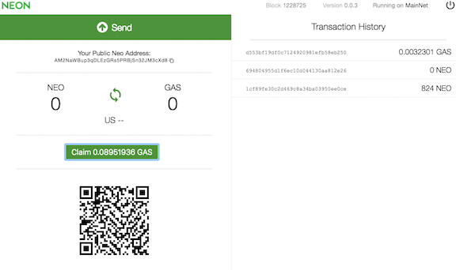

# NEO versus Ethereum: Why NEO might be 2018’s strongest cryptocurrency(四)
# NEO对比Ethereum:为什么NEO可能是2018年最强的加密数字货币（四）

> 本文翻译自：https://hackernoon.com/neo-versus-ethereum-why-neo-might-be-2018s-strongest-cryptocurrency-79956138bea3
> 
> 译者：[区块链中文字幕组](https://github.com/BlockchainTranslator/EOS) [林炜鑫](https://github.com/weixin1993)
> 
> 翻译时间：2017-12-27

### Transaction Speed:
### 交易速度

Because NEO doesn’t run on PoW and has a more streamlined PoS protocol, NEO can process transactions far more quickly than Ethereum. Now when we compare these, there are both theoretical and practical speeds. Theoretical transaction speeds are the absolute maximum speed mathematically possible for the network. For NEO, this number is **10,000tps (transactions/second)**. Ethereum can do **30tps**. In practicality, because of real world inconsistencies and difficulties, NEO can do **1,000tps** in comparison to Ethereum’s **15tps**. As protocols improve it is possible that both platforms will approach their theoretical speed.

由于NEO没有在PoW上运行，而且有一个更精简的PoS协议，所以NEO可以比以太坊更快地处理交易。当我们比较这些的时候，（前提是认为）理论和实际的速度都是一致的。理论上的交易速度是网络的绝对最大速度。对于NEO来说，这个数字是**10,000 tps(交易数/秒)**。Ethereum可以达到**30tps**。在现实中，由于现实世界的不一致和挑战，与以太坊的**15tps**相比，NEO可以达到**1000tps**。随着协议的改进，两种平台都有可能达到各自的理论速度。

This is an enormous difference and a massive advantage for NEO. NEO’s transaction speeds could conceivably accommodate the kind of smart economy they’re envisioning; Ethereum’s can not. Now in exchange for this speed, NEO is not as decentralized as Ethereum. In addition, it’s important to recognize that Vitalik and Ethereum are well aware of this limitation. Solutions such as Raiden and sharding (two fascinating technologies but far beyond the scope of this article) are on the roadmap for Ethereum and could drastically improve Ethereum’s transaction speed.

这是一个巨大的差异，也是NEO的巨大优势。NEO的交易速度可以令人信服地适应他们设想的那种智能经济;但Ethereum不能。现在，作为这种速度的交易，NEO并不像以太坊那样去中心化。此外，重要的是要认识到Vitalik和以太坊很清楚这一限制。像Raiden和sharding这样的解决方案(这两种令人着迷的技术，但是远远超出了本文的范围)已经出现在以太坊的路线图上，它们可以极大地改善以太坊的交易速度。

**TLDR: Ethereum can transact at 15tps with a maximum of 30tps. NEO can transact at 1,000tps with a maximum of 10,000tps. Ethereum has plans and solutions to scale to close this gap.**

**以太坊可以在15tps上进行交易，最多可以达到30tps。NEO可以在1000 tps中进行交易，最多可达到10000 tps。Ethereum有计划和解决方案，以缩小这一差距。**

### Forking and scaling:
### 分叉和规模：

Ethereum forks to update its software, just like Bitcoin. I describe this here. Forks aren’t necessarily bad, but they certainly can be. Look at Ethereum’s DAO fork for an example of this. After millions were stolen from an Ethereum smart contract, Ethereum forked to refund the money to the original holders. Whether or not this decision was correct, it divided the community and Ethereum Classic was created alongside Ethereum.

以太坊就像比特币一样，通过分叉来更新它的软件。我在这里描述一下。分叉不一定是坏的，但他们确实可以这样做。看一下Ethereum的DAO叉分叉，这是一个例子。在以太坊的智能合同中，数百万人被偷走后，以太坊通过分叉将钱退还给原持有者。不管这个决定是否正确，它将社区和以太坊经典分开了。

Forks happen because there is no finality in the consensus mechanism of Ethereum. Multiple chains in the blockchain can be created at once — ultimately, both are valid chains and can continued to be mined on. Forks happen constantly but are usually resolved when the chain with the most computer power is chosen as legitimate. With Ethereum, it’s always recommended that when you place a transaction, you wait until a few blocks have been mined on top of yours before considering the transaction permanent.

分叉是因为以太坊的共识机制没有取得最终的结果。区块链中的多个链可以同时创建——最终，这两个链都是有效的链，还可以继续挖矿。分叉是经常发生的，但是当拥有最多计算机节点的区块链被选为合法的时候，它通常会被解决。对于以太坊，总是建议当你进行交易时，你要等到一些已经被挖的区块，然后再考虑进行永久性交易。

NEO has *finality*. This is because the bookkeepers must reach a 66% consensus for the transaction to be placed into the blockchain. Here is an analogy to understand this. Imagine a first grade class. Timmy asks how much chocolate milk costs. Cynthia has no concept of price (she’s in first grade for God’s sake) and shouts $15! A few students walk over to her in agreement. Bobby’s a chocolate milk aficionado — he knows his milk. He says $1.25. Most of the room walks over to him. He has a majority. Now assuming Cynthia’s group realizes their flaw and joins Bobby’s group, then the group reaches consensus. But if Cynthia is having a particularly stubborn day, she could keep on with her decision — a fork. **It might not be the right answer, but she still has a valid answer.** This is how Ethereum works.

NEO已经能够*终结*。这是因为记账员必须达到66%的共识，才能把交易放到区块链中。这里有一个类比来理解这一点。想象一下一年级的班级。Timmy问巧克力牛奶的成本是多少。Cynthia没有价格的概念(她在一年级的时候会觉得这是因为了上帝的缘故(才能得到巧克力牛奶))，并且喊着15美元！有几个学生同意她的意见。Bobby是个巧克力牛奶迷——他知道他的牛奶价格。他说1.25美元。大部分同学都走到他的身边。他有一个席位。现在，假设Cynthia的跟随者意识到他们的问题并跟随了Bobby，那么这个小组就达成了共识。但如果Cynthia对自己的意见摇摆不定，她就可以继续她的决定——分叉。**这可能不是正确的答案，但她仍然有一个有效的答案。**这就是以太坊的工作原理。

NEO works like this. Imagine the same scenario. Timmy again asks how much chocolate milk costs. First Cynthia speaks up: “$15!” A few murmur in support, but it’s clearly not 66% of the class so her idea is discarded. Next Bobby says “$1.25.” 66% of the class support his claim and thus, his idea is final. With NEO, the bookkeepers each propose the correct state of the next block. When 66% of them support the proposition, the block is finalized.

而NEO却是这样运作的。想象同样的场景。Timmy又问了巧克力牛奶多少钱成本。首先，Cynthia说：“15美元！”。有一些人在支持她，但显然不是66%的人，所以她的想法被抛弃了。Bobby说：“1.25美元”。66%的学生支持他的主张，因此，他的想法会被最终确定下来。对于NEO，记账员每个人都都提出下一个区块的正确状态。当66%的人支持这个提议时，这个区块就能定下来了。

The implications of this are huge. Finality is incredibly important for the type of economy NEO hopes to support. The financial industry and other complicated, fast moving markets (stock markets for example), can’t operate on a system without finality. They need to know that when their information is placed into the blockchain, it is there for good. They also need the assurance that their blockchain won’t suddenly become irrelevant because of a fork.

这其中的含义是巨大的。对于NEO希望支持的经济类型来说，得到最终结果是非常重要的。金融行业和其他复杂的、快速移动的市场(例如股票市场)，不能在一个没有最终结果的系统上运行。他们需要知道，当他们的信息被放入区块链时，它就在那里。他们还需要确保区块链不会因为分叉而突然变得无关紧要。

**TLDR: Ethereum can fork; NEO can’t — this is important for adoption by our real world economy.**

**TLDR:Ethereum可以分叉;NEO不能——这对于我们的现实世界经济来说是很重要的。**

### Decoupling of GAS and NEO
### GAS与NEO的分离

This may very well be NEO’s most ingenious characteristic. The native token of Ethereum is ether. The gas needed to run the Ethereum network (execute contracts, conduct transactions, etc.) is actually just small units of ether. There is no separation between ether and gas.

这很可能是NEO最具独创性的特点。Ethereum的本地代币是ether（以太）。运行以太网络(执行合同，进行交易等)所需要的gas（燃料）实际上只是一个小单位。以太坊并没有把ether和gas分离。

However, NEO decoupled itself from the token needed to run the network: GAS. The NEO token is like partial ownership of the NEO platform. NEO token holders are entitled to vote for bookkeepers. NEO’s use as a share in the company rather than a token is furthered by the fact that NEO is non-divisible. NEO is not meant to be transacted with — that’s why there is GAS.

然而，NEO从运行网络所需的代币中分离出来:GAS。NEO代币就像是NEO平台的部分所有权。NEO代币持有者有权投票给记账员。NEO是公司的一部分，而不是一个代币，这一事实进一步说明，NEO是不可分割的。NEO不打算被交易——这就是为什么会有GAS的原因。

GAS is used for all operations on the NEO network. Now when a company registers or changes assets on the NEO blockchain, they pay in GAS — this GAS is then distributed to all NEO holders. Anyone can claim this GAS by just holding their NEO in a personal wallet. Such as this one: [NEON](https://github.com/CityOfZion/neon-wallet/releases)

GAS用于NEO网络的所有操作。现在，当一家公司在NEO区块链上注册或更改资产时，他们会用GAS支付——这种GAS随后会被分发给所有NEO持有者。任何人都可以通过把自己的NEO放在个人钱包里来认领。比如这个:[NEON](https://github.com/CityOfZion/neon-wallet/releases)

Bookkeepers are entitled to charge a transaction fee (in GAS) for general transactions on the blockchain that only they (the bookkeepers) receive. However, by decoupling NEO and GAS, there is an incentive to keep transaction fees low; here’s why:

记账员有权对区块链上的一般交易收取只有他们(记账员)才能收到的交易费用(在GAS中)。然而，通过对NEO和GAS的脱钩，人们有理由保持低交易费用;原因如下:

High transaction fees, which only benefit the bookkeepers, will prevent people from wanting to register their assets on the blockchain. The less assets registered, the less rewards NEO holders will get. Thus, NEO holders are incentivized to vote in bookkeepers who will keep transaction fees low.

高昂的交易费用只会让记账员受益，这将防止人们想要在区块链上注册他们的资产。注册的资产越少，NEO持有者获得的回报就越少。因此，NEO持有者会被鼓励投票给那些将交易费用保持在较低水平的簿记员。

Bookkeepers are primarily incentivized by their desire to secure the network. They use the network, benefit from it, and have money staked in NEO. Thus, it is advantageous for them to secure it.

记账员的主要动机是他们想要确保网络安全。他们利用网络，从中获益，并把钱押在NEO上。因此，保护NEO是有利的。

It is unclear how rewards will be divided amongst ether holders when Ethereum becomes Proof of Stake. However, it appears that only large Ethereum holders will be able to stake and receive rewards.

目前尚不清楚，当以太坊成为股权的凭证时，奖励将如何分配。然而，似乎只有大型以太坊的持有者才能获得奖励。

The genius of the NEO token is that it allows users to passively acquire GAS in their wallet. No need to run the computer, keep the wallet open, or expend electricity. No need to “stake” your tokens — bookkeepers do this for you. You could even have your NEO in a paper wallet. GAS is collected when you physically push the “claim GAS” button. This also ensures that the NEO network doesn’t need to calculate the interest of NEO holders with every block, reducing traffic and simplifying the compound interest formulas. **The delegated bookkeepers maintain the network; your investment gains interest. This would not be possible without two separate tokens.**

NEO代币的天才之处在于，它允许用户在钱包里被动地获取GAS。不需要运行计算机，不需要打开钱包，也不需要消耗电力。不需要“抵押”你的代币——记账员为你这样做。你甚至可以把你的NEO放在一个纸钱包里。当你按下“认领气体”按钮时，GAS就会被收集起来。这也保证了NEO网络不需要计算每一个区块的NEO持有者的利益，减少流量，简化复合利息公式。**被委派的记账员维护网络和你的投资收益。如果没有两个单独的代币，这是不可能的。**

Both NEO and GAS are capped at 100 million tokens.

NEO和GAS的上限都是1亿。

**TLDR: Ethereum has one token: ether. NEO has two: NEO and GAS. There are huge advantages to having two tokens when using a proof of stake protocol.**

**TLDR:以太坊有一个代币:ether。NEO有两个:NEO和GAS。在使用验证协议时拥有两个代币具有巨大的优势。**

### Smart Contract Language
### 聪明的合约语言

  

The biggest difference between Ethereum and NEO smart contracts is the coding language options available. With Ethereum, contracts must be written in **solidity** — A coding language created specifically for Ethereum. NEO on the other hand supports a variety of different languages, including the most commonly known. NEO supports five programming languages with plans to support an additional five in the future.

Ethereum和NEO智能合同的最大区别是可用的编程语言选项。对于Ethereum，合约必须以**可靠**的形式编写——这是专门为Ethereum创建的一种编程语言。另一方面，NEO支持多种不同的语言，包括最常见的语言。NEO支持五种编程语言，计划在未来支持另外五种编程语言。

There are certainly advantages to crafting a particular language for a particular platform. Ethereum developers designed solidity for Ethereum. However, far fewer people know solidity. By supporting the most common coding languages, **NEO has an advantage in facilitating adoption**. Most programmers today would have to learn solidity before working with Ethereum whereas with NEO, their knowledge is already applicable. It’s also possible that existing business platforms could be placed onto the NEO blockchain without much modification.

为特定的平台设计一种特定的语言当然是有好处的。Ethereum开发人员为以太坊设计了稳定。然而，只有少部分的人知道可靠。通过支持最常见的编码语言，**NEO在促进被采用方面有优势**。今天的大多数程序员在使用以太坊之前都必须学习稳定性，而与NEO相比，他们的知识已经可以应用了。此外，现有的业务平台也有可能被放置在NEO区块链上，而无需进行任何修改。

**TLDR (seriously? It’s like two paragraphs): Ethereum has one coding language: Solidity. NEO supports many different coding languages.**

**TLDR：(真的吗?它就像两段):Ethereum有一种编码语言:稳定性。NEO支持多种不同的编码语言。**

----------------------------------------------------

#### 区块链中文字幕组

致力于前沿区块链知识和信息的传播，为中国融入全球区块链世界贡献一份力量。

如果您懂一些技术、懂一些英文，欢迎加入我们，加微信号:w1791520555。

[点击查看项目GITHUB，及更多的译文...](https://github.com/BlockchainTranslator/EOS)

#### 本文译者简介

林炜鑫，在读硕士，专注区块链技术研究与行业分析，欢迎加微信号:happyzai1993。

本文由币乎社区（bihu.com）内容支持计划奖励。

版权所有，转载需完整注明以上内容。

----------------------------------------------------

