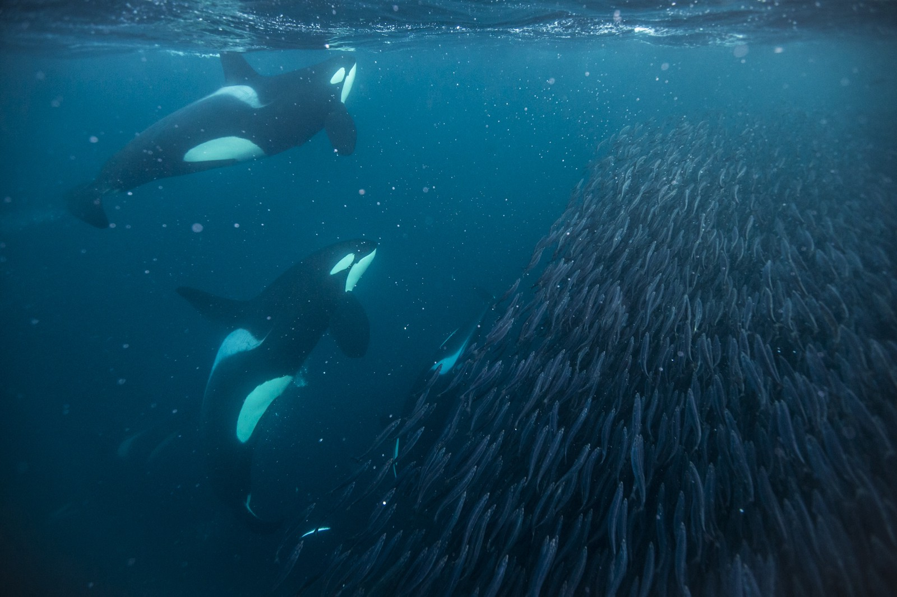
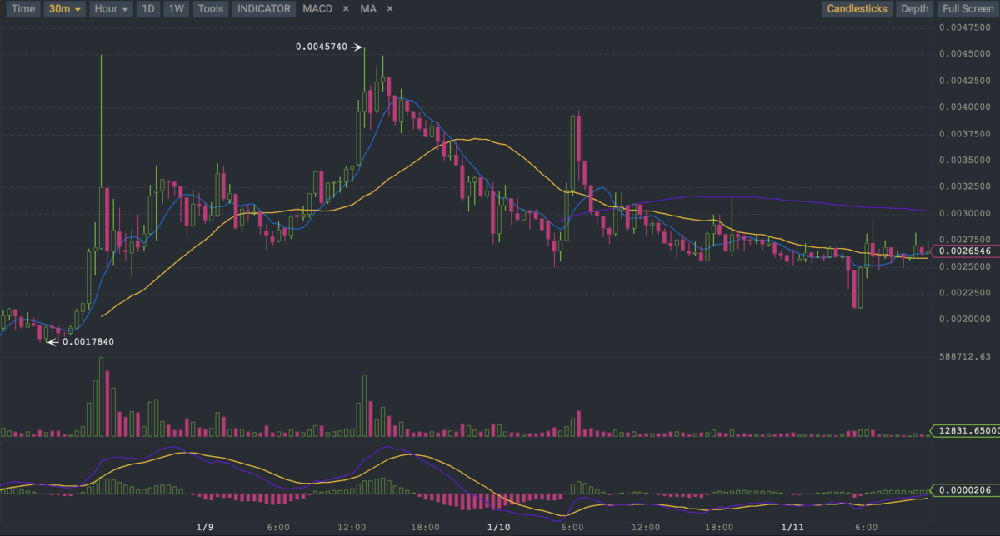
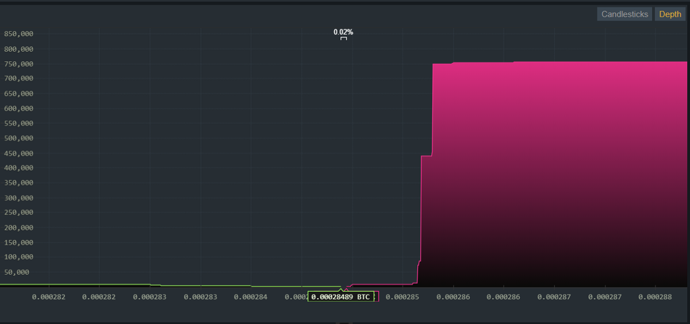
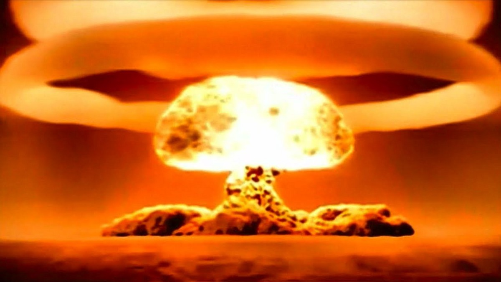

# Whale Tactics
# 鲸鱼战术

> 本文翻译自：https://medium.com/@olivierdejong/whale-tactics-f19b3f33ea92
>
> 原文作者：Olivier de Jong 
>
> 译者：[区块链中文字幕组](https://github.com/BlockchainTranslator/EOS) [龙心小台](https://github.com/xnylong/EOS)
> 
> 原文发表时间：2018-01-18
>
> 翻译时间：2018-01-24

If you look at markets you know there are different players. Some of them are called whales. The image you have of a whale might be based on a Disney character; A big, slow and cuddly creature with a very soft character. The reality is very different. Whales are highly intelligent hunters that sometimes hunt in packs. Some of them prey on smaller fish and seals and they use highly intelligent tactics to do so. So when whales come to the party, you better watch out especially in crypto..

如果你看看市场，你就知道存在不同的玩家。 其中一些玩家被称为鲸鱼。 你对鲸鱼的印象可能是基于迪斯尼人物的： 一个巨大的、缓慢和可爱的动物, 具有非常柔软的性格。 现实中的区别是巨大的。 鲸鱼是相当聪明的猎人，并有时会集群打猎。 其中的一些捕食较小的鱼和海豹，并且使用高智能战术来做到这一点。 所以当鲸鱼来到派对的时候，你最好小心点，尤其是在加密货币世界里。

Let’s take a look at the tactics that whales tend to use in crypto. It might be handy for you as it explains why sometimes prices fluctuate or not and where you expect exactly the opposite.

让我们来看看鲸鱼在加密货币中使用的战术。 了解这些可能会对你有帮助，因为它解释了为什么有时价格会波动，以及为何实际走势与你期望完全相反。

## Pump and Dump | 拉升出货

One of the most common tactics is the pump and dump tactic. Whales have enough funds to artificially pump the price of a certain stock, coin or token. Because there are zero restrictions on crypto-exchanges this happens a lot. Especially with smaller chains which have a market cap below $1bn and which have a promising future.

最常见的战术之一是拉升出货战术。 鲸鱼有足够的资金人为地拉升某种股票或代币的价格。 因为对加密货币交易平台没有任何限制，这种情况经常发生。 尤其是市值低于 10 亿美元且具有前景的较小区块链。

The tactic is simple. A whale or a group of whales will start making large buys. This will result in a large price increase and huge green candles. Sometimes the buys are smeared out over period of days. One thing that is a giveaway, is that the price increase is always immense.

这个战术很简单。 一个鲸鱼或一群鲸鱼开始大量买入。 这将导致价格大幅上涨及出现巨量绿色蜡烛条。 有时这些买单会分布在一段时间内。暴露庄家的一个迹象是，价格涨幅度总是巨大的。

This increase will always get attention and you will see the Telegram channel of the targeted chain full with rocket and moon memes.

这种涨幅总会受到关注，你会看到目标链的电报群充满了火箭和月亮的表情包。

The increase will draw in a lot of new money. This is the so-called FOMO (Fear of missing out) money, so the price increases even more. Sometimes this is exponential. When the margin for a dump is large enough, the whales start to dump. This happens in waves. A wave will maximise the profit as the new money will think it is just a temporary dip. In the end the whales walk away with a killing and the people who got in at the artificially created “all time high” will be left with a hangover. Not good for the trust of a chain. But remember this tactic is most successful with promising chains. 

巨额涨幅将吸引大量的新资金。 这就是所谓的 FOMO（恐惧错过），所以价格上涨得更多。 有时这会是指数型增长。 当出货的利润足够大时，鲸鱼便开始大量抛售。 这会以波段形式呈现。 波段可以使鲸鱼的利润最大化，因为新资金会认为这只是一个暂时的下跌。 最后，鲸鱼带着被捕获的猎物离开，而在人为创造出的“历史新高”时入场接盘的人，会感觉自己经历了宿醉一般。这会影响人们对链条的信任 。 但请记住，这个战术对有前景的链条是最有用的。

A successful execution of this tactic happened recently with Neblio. A very promising chain with a small market cap. A pump and dump tactic always needs an event. In this case it was the dev-4 update. The pump lasted 2 days and the waves are clearly visible. See the huge candles during the short pumps in the image above? That is a second giveaway. The price peaked eventually at $65 and some people bought in around that price. The whales made a nice margin here.

这个战术的成功执行最近便发生在 Neblio 上。Neblio 是一个非常有前景的小市值链条。 拉升出货战术总是需要一个事件。 在这个例子中，这便是 dev-4 的更新。 此次拉升持续了两天，并且波浪清晰可见。 看到上图中短暂拉升的巨大蜡烛条了吗？ 这便是第二个迹象。 价格最终高达 65 美元，有些人在这个价格左右买入。 鲸鱼们在此得到了一个很不错的利润。

Luckily there is the promising part. The ones who bought in at ATH(All Tome High) and that keep their tokens will eventually make their money back. If you look at what happened during the crash yesterday and the day before, the ones that got hit already did. Neblio was the only chain that kept stable in comparison to USD. This is exceptional. This also means that the holders of Neblio really believe in the chain and do not sell out easily. Even when the going gets though. If you looked in their Telegram channel during the crash, it almost looked like a war was going on with a lot of “This is Sparta” gifs. I mean It takes a lot of nerves not to sell out during events like this.

幸运的是希望仍在。 那些在历史高点买入并持有代币的人最终会把钱赚回来。 如果你看昨天与前天崩盘时的情况，会发现该大跌的代币已经大跌了。 Neblio 是唯一与美元相比保持稳定的链条。 这是相当出色的。 这也意味着Neblio的持有人真的相信这个链条，不会轻易卖出。 即使行情险恶。 如果你在崩盘期间看到他们的电报群，那看起来几乎就像正在进行一场战争，群里有许多“这是斯巴达”的动图。 我的意思是，在这样的情况下拿住不卖需要很大勇气。

## The sell wall tactic | 卖墙战术（巨量卖单战术）

A tactic that requires deep pockets and a lot of market intelligence is the sell wall. This usually happens with chains that will most certainly have a huge increase in value in the near future. The near future here means in months. The whales using this tactic always have access to inside info and know before the market knows, that something is about to change.

一个需要巨额资金与大量市场情报的战术是卖墙战术。 这通常发生于，在不久的将来价值将会大幅上涨的链条身上。 这里所说的不久的将来指的是几个月。 使用这种战术的鲸鱼总是拥有内幕消息，并在市场知道之前就已知道，某些情况即将改变。

The way whales will make profit is to buy in low and accumulate. The larger the position the more they can manipulate the price. The way in is to keep the price artificially low. How do they do this? By putting up huge sell walls. Something that is easily spotted in the depth chart. Huge sell walls drive the price downwards. A giveaway in crypto is that an important event does not make the price go anywhere. This will frustrate holders and they are tempted to sell out at a lower price than they should have. So the whales can accumulate at a lower price.

鲸鱼赚钱的方式就是低价买入并积累筹码。 仓位越大，他们就越能操纵价格。其方法是人为压低价格。 他们是如何做到这一点的呢？ 通过建立巨大的卖墙。 这是在交易深度图中很容易发现的东西。在加密货币中，一个这样的迹象是，一个重要事件没有使代币价格发生任何变化。这会让代币持有者感到受挫，使他们试图以低于应有的价格卖出代币。 所以鲸鱼可以以更低的价格积累筹码。

Once the announcement is about to happen, the sell walls are removed. This will cause a massive price surge as the market is being let free. Again, a lot of Lambo and Moon memes and new money flowing in. Once the margin is reached the whales start dumping again. So, this usually results in pumping and dumping. Because they have a huge position, they can keep doing this for a very long time.

一旦公告即将发出，卖墙便被撤销。 由于市场得到解放，这将导致价格大幅上涨。 再次地，许多兰博基尼和月亮的表情包，伴随着新资金，会大量涌入。一旦利润达成，鲸鱼便开始再次抛售。 因此，这通常会导致拉升出货。 因为他们有很大仓位，所以可以持续很长一段时间这么做。

A successful execution this tactic happened and is happening with VeChain. VeChain usually has huge sell walls for weeks on end. The price only increases a bit and does not resemble the real market price. The sell walls are huge, like in the image above. Sometimes they disappear briefly and the market starts to spike. What you see now is that even though the market has crashed, the sell walls are being put up again.

这个策略的成功执行已经发生并正在发生在唯链上。 唯链通常有持续几周的巨大卖墙。 价格只上涨了一点点，并与真实的市场价格不符。 这些卖墙是巨大的，就像上面的图片一样。 有时卖墙会短暂地消失，市场便开始飙升。 你现在看到的是，尽管市场已崩盘，卖墙又被重新立起。

The good thing here is that you can profit as well by buying in. The price will increase over time. If you keep your position, you will get rewarded. 

此时的好处是，你也可以通过买入获利。价格会随着时间的推移而上涨。 如果你保持你的仓位，你将会得到奖励。

The reward with VeChain will probably be huge. All the little signs are pointing in that direction. Government contracts, promising tech, inside lane, etc. If it really turns out that the Chinese government is fully supporting VeChain you will be in for quite a ride this year. It might be the most profitable investment of the year. But, as always, all the pieces need to fall into place and nothing is certain.

与唯链相关的奖励可能会是巨大的。 所有的小迹象都指向那个方向。 政府合同、有前景的技术、处于圈内等。如果事实证明中国政府真的全力支持唯链，那你今年便会乘风而上。 这可能是今年最赚钱的投资。 但是，一如既往地，所有东西都需要落实到位，没有什么是确定的。

## Rigging the market completely with short attacks | 空头袭击操纵市场

I was saving this for a later post, but because we crashed and burned just a day ago, here goes. This is the nuclear option. If something has a market cap of more than half a billion and probably will have a market cap of a trillion in the near future, the big players will be present. The big players here are banks and hedge funds. They have the funds to rig the market completely. In any other market they already have, and crypto is no exception. They are here although they shout that they are not.

我本打算将这部分内容留到下一篇文章，但是因为我们在一天前崩盘了，所以现在就写吧。 这就是那个核选择。 如果某样东西的市值超过了 5 亿（美金）, 并且在不久的将来可能会达到万亿市值, 那么大玩家就会出现。 这里的大玩家是银行和对冲基金。 他们有资金来完全操纵市场。 在任何其他市场上他们已经如此，加密货币也不例外。 他们已在这里，尽管他们大声否认。

If you want to read about how rigged the regular markets are, I would advise you to read the book “Flash Boys”. You already know the market is rigged, but this book shows you how far banks and hedge funds will go to make a buck.

如果你想了解常规市场被操纵得有多厉害，我建议你阅读 “Flash Boys” 一书。 你已经知道市场是被操纵的，但是这本书向你展示了银行与对冲基金为了赚钱可以将底线降到多低。

Because there is zero regulation in crypto, which I think is a good thing, these huge whales are having a party. If you look at the recent crash, it looks kind of weird. We all know that the crypto market has a correction every month and a half. Usually the crash itself only lasts a day. This time it took more than 2 days to bottom out. The weird thing was this:

加密货币市场为零监管市场，我虽认为这是一件好事，但这些巨大的鲸鱼因此正在狂欢。 如果你看看最近的崩盘，它看起来有点奇怪。 我们都知道，加密货币市场每一个半月就有一次回调。 通常崩盘本身只持续一天。 这一次花了两天多的时间才见底。 奇怪的是：

The correction caused by over-leveraged buyers with weak hands (as always) took a day. At the end of the day (European time), the market came back (as always). Then, out of the blue, Bitcoin started to crash hard. And I mean hard. And because of its market dominance, all alts started to dive as well. If you were looking at the charts, you could see a lot sell walls popping up (Read what I wrote about sell walls) driving the price downwards. This created a panic sell. Even experienced traders were taken by surprise by this event.

 由高杠杆弱手盘撤资所造成的回调（一如既往地）需要一天时间。 在那天结束之时（欧洲时间），市场回升了（一如既往）。 然后，突然之间，比特币开始崩盘。 我的意思是大崩盘。 而且受其市场主导地位影响，所有的山寨币也随之开始跳水。 如果你当时在看走势图，你可以看到很多卖墙突然出现（看我上文关于卖墙的部分），推低了价格。 这造成了恐慌性抛售。 即使富有经验的交易者也被此打得措手不及。
 
This downward spiral lasted for another day. Bitcoin reached levels that it had not reached during the December correction and stayed there. Around 10k with spikes going even below that number. The same day a lot of FUD was created. The China ban, headlines with the end of the crypto era and so on. For me this is usually a hint that a short attack is taking place. However, I could not place it yet. There was of course the rumour that the Bitcoin futures had something to do with it, but we have a lot of rumours in crypto land.

这个螺旋性下跌持续了一天。 比特币下跌到了 12 月份回调期间没有到达的价位，并在那里停留。 大约是一万美金，有阴线甚至刺破这个价位。 同一天，许多恐惧、不确定性与疑虑被创造出来。 如中国的禁令，加密货币时代终结的头条，等等。 在我看来，这通常暗示着一场空头袭击正在发生。 但是，我还未能将它确切归因。 当然，有传言说比特币期货跟此有关，但是我们在加密货币领域有太多传言。

But then it happened. These futures had an expiration date and exactly when this date passed, the market started to move upwards and when I say exactly, I mean exactly… The thing is, there is no such thing as a coincidence in trading. Nothing is a coincidence. You do not coincidently sell something to someone. There is always a reason behind a trade. And the reason in this case was the profit margin on BTC/USD 15000 future contracts.

然而，之后石锤来了。 这些比特币期货有一个到期日，正好一过这个到期日，市场便开始上涨，当我说正好，我的意思是真的是正好。事实是，交易中不存在巧合。 没有什么是巧合。 你不会巧合地把某样东西卖给某人。 交易背后总是有原因的。 而这种情况下的原因是 15000 美金比特币期货合约的利润率。

So, the big boys rigged the market to increase their profits by artificially driving the price of BTC down. We know we have big players with big positions in Bitcoin (although they say they have not). We also know that the big exchanges offer so called “dark pool” services to these players to disguise who is behind a trade (Read the book “Flash Boys”, that I recommended to see what that means). And we also see that the timing was perfect. And when something looks and smells like a short attack, it usually is a short attack.

所以，大玩家们通过人为压低比特币价格，以操纵市场，增加利润。我们知道在比特币中存在拥有大量仓位的大玩家（虽然他们自己否认）。 我们也知道，大交易所会为这些玩家提供所谓的 “暗池”服务，以掩饰幕后交易者（阅读我推荐的 “Flash Boys” 这本书，便知道这是什么意思）。 并且，我们也看到此事发生的时机是天衣无缝的。 当某样东西看起来与闻起来像是空头袭击时，它通常就是一场空头袭击。

So, we are looking forward to a volatile year with a lot of boom bust cycles. Be careful out there, it is complete anarchy and ending on top will require nerves of steel and a big pair of balls. Even with all your best knowledge you will make mistakes. It is difficult to see if a whale is manipulating the price or if it is just the market moving up or down. But please look for the red flags. Never follow chains that increase exponentially in a day, you might be the one buying at an artificially created “All Time High”. Think of what the business partner of Warren Buffet once said: “We missed out on Google and Amazon but we have not missed out on others”…

所以，我们预测会迎来动荡的一年，伴随着许多繁荣萧条的周期。 在那里要小心，这是完全无政府状态，想要逃顶需要钢铁般坚强的神经与绝佳胆识。  即使你有最好的知识，你也会犯错。 很难看出来是鲸鱼在操纵价格，还是只是市场自己在上涨或下跌。 但请留意疑点。 千万不要追涨一天内成指数型上涨的链条，你可能是那个在人为创造的“历史最高点”买入的人。 想想沃伦·巴菲特的商业合作伙伴曾经说过的话：“我们错过了谷歌和亚马逊，但我们没有错过其他。"

PS. If you liked the article, please share, tweet etc. You will receive my ever lasting gratitude and you might prevent a novice investor from making a very stupid mistake

如果你喜欢本文，请转发分享。我会永远感谢你，并且你可能会阻止新手投资者犯一个非常愚蠢的错误。

----------------------------------------------------

#### 区块链中文字幕组

致力于前沿区块链知识和信息的传播，为中国融入全球区块链世界贡献一份力量。

如果您懂一些技术、懂一些英文，欢迎加入我们，加微信号:w1791520555。

[点击查看项目GITHUB，及更多的译文...](https://github.com/BlockchainTranslator/EOS)

#### 文本译者简介

龙心小台，区块链学习者，微信公众号：视听区块链

本文由币乎社区（bihu.com）内容支持计划奖励。

版权所有，转载需完整注明以上内容。

----------------------------------------------------
