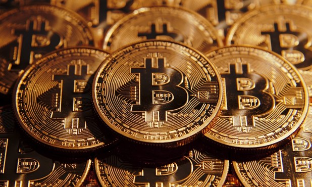

# What trends await us in 2018?
# 2018年有哪些趋势等着我们呢？

> 本文翻译自：http://www.bitlex.win/2018/02/what-trends-await-us-in-2018.html?nsukey=hlI5RDiWMizpBZgyeasjtU79pOlrduqJSPZTkQ8LKMaMK5ChYc2q4valYe8%2FG0eVzRtQgTQCGowP6RQ6mXrDdDJobp%2BxSjmvNT76b2XU87aOkF8W66%2FohGOjuJPNigVsFQMbfnGqnN8nbBAGuDuT2cD6HrBXDTd8q81wLY7YeWiTt4PqnGRXRZW25qyf7GigzzZ4A2ONnsaJuNgOqC4m1g%3D%3D
> 
> 译者：[区块链中文字幕组](https://github.com/BlockchainTranslator/EOS) [林炜鑫](https://github.com/weixin1993)
> 
> 翻译时间：2018-02-01

The cryptocurrency world is changing rapidly and, in the untutored eye, are unpredictable. But if you look at change from the standpoint of the professional analyst, we can distinguish certain trends.

加密货币世界正在迅速变化，而且在一般人的眼中，它是不可预测的。 但是如果从专业分析师的角度来看，我们可以看出一些趋势。

Journal ForkLog appealed to those who closely follow the changes of the market analysts of the investment Fund Crypto Art please describe the most significant trends this year.

Journal ForkLog呼吁那些密切关注投资基金加密技术市场变化的分析师们来描述今年最显著的趋势。

## Famous five, or that will change in the first place

## 著名（重要）的五个，或者一开始就会改变

**1. State regulation**. Now for the cryptocurrency there is no well developed legal base, and this creates a number of difficulties in ensuring the protection of participants ‘ transactions and disputes. Legislation countries have different attitudes to this kind of asset that ultimately affect the stability of the market as a whole and leads to a number of risks. In particular, it creates favourable conditions for fraud.

**1.国家政策**。 现在对于加密货币来说，没有很好的法律基础，这在确保参与者的交易和纠纷保护方面造成了很多困难。 国家对这种资产的立法态度的不同，最终将影响到整个市场的稳定，并导致一些风险。 特别是为欺诈创造了有利的条件。

Despite the fact that cryptocurrencies are inherently not subject to centralized control, legal regulation of the associated processes is required. In particular, for:

尽管加密货币本质上不受中心化控制，但还是有必要对相关流程进行法律规定。 特别是，对于：

**Protection of market participants**. January 29, 2018, the media has reported that hackers broke into the Japanese exchange Coincheck, stealing scriptactive in the amount of $533 million, the Case is loud, but, alas, not the only one. Yes, stock exchange representatives expressed willingness to compensate traders the loss, but it is an individual initiative Coincheck. In most of these situations, especially when it comes to hacking of private wallets, the victims have nowhere to turn. After all, as long as cryptocurrency has no clear legal status will not be the owners of digital assets.

**保护市场参与者**。 2018年1月29日，有媒体报道，黑客闯入日本交易所Coincheck，偷窃金额为5.33亿美元，案件很大，但唉，不是唯一的一个。 是的，证券交易所代表表示愿意赔偿交易者的损失，但这是Coincheck个人主动。 在大多数情况下，特别是涉及私人钱包的黑客攻击时，受害者无法维权。 毕竟，只要加密货币没有明确的法律地位，就不会有所谓的数字资产的拥有者。

**Enhance the security of transactions**. In March 2017, it became known that the creators of the successful ICO with the speaker called Razormind fled with the collected funds (about 10 000 000 dollars), as investors remained only shrug. How to protect your interests, if violated the terms of the transaction? What are the rules to follow when resolving disputes? Definitive answers to these and other questions yet. Now the majority of the participants in the transactions do so at your own risk. As a tool to regulate the relationship of parties to use contracts of the offer, but this is not enough.

**增强交易的安全性**。 2017年3月，的ICO的创始人与Razormind的发言人成功地一起携款了所募集的资金（约1000万美元）潜逃，而投资者只能耸耸肩。 如果违反交易条款，如何保护您的利益？ 解决纠纷时遵循什么规则？ 对这些和其他问题的确切答案呢。 现在大多数交易的参与者自行承担风险。 作为规范合同使用方关系的工具，这是不够的。

**Integration of innovative technologies in everyday life**. In December last there appeared the information about the cryptocurrency charity Fund Pineapple, the founder of which earned cryptocurrencies so much that decided to share the profit with those who need funds. Cryptologically especially good because funds are spent quickly and, most importantly, directly to the recipient.

**在日常生活中集成创新技术**。去年12月，关于密码货币慈善基金Pineapple的信息出现了，这家公司的创始人赚了很多钱，于是决定与那些需要资金的人分享利润。这时密码学尤其有用，因为资金的使用速度很快，而且最重要的是，它直接将资金给了接收者。

Besides the immediate transfer of humanitarian aid, there are other “domestic” sphere of application of blockchain technology. For example, rapid clearance of purchases and credits or automated implementation of the lease agreements. Cryptocurrencies are really able to transform our reality. And this requires a legislative base.

除了人道主义援助的即时转移外，区块链技术还有其他“国内”应用领域。 例如，快速清理采购和信贷或自动执行租赁协议。 加密货币确实能够改变我们的现实生活。 这需要一个立法基础。

>"Do not confuse regulation with centralized control. Legislative regulation will make the cryptocurrency market more stable and protect its participants. At the same time, attempts of control contrary to the essence of the use of cryptocurrencies, and their main advantages – decentralization»— said Vyacheslav Semchenko, the lawyer of the Fund Crypto Art.

>“不要混淆监管和中心化控制的概念。 立法规定将使加密货币市场更加稳定，保护参与者。 与此同时，控制企图与加密货币使用的本质——去中心化——相悖的行为 - ”基金加密艺术的律师维亚切斯拉夫·席姆琴科（Vyacheslav Semchenko）说。

Attempts to “control the uncontrollable”, we all have seen: the bill to transfer control over the movement of cryptocurrency funds to Central banks in raids on cryptocurrency company. The reason is simple: at the beginning of 2018, the cryptocurrency market capitalization reached 700 billion dollars Is a lot of money to attract the attention of the powerful, and not always with good intentions.

试图“控制不可控制的”，我们都看到：通过对加密货币公司的调查，把加密货币基金向中央银行转移的法案。 原因很简单：在2018年初，加密货币市值达到7000亿美元，吸引了很多的注意力，但这些关注并不总是有好的意图。

I want to believe that in the framework of solving the question of the legal status of cryptocurrencies, special attention will be paid to maintaining a balance between legitimate regulation and control, without abuse or misappropriation of private funds.

我愿意相信，在解决加密货币法律地位问题的框架下，要特别注意在合法调控之间保持平衡，不得滥用或挪用私人资金。

**2. Ppl were:** to share or not to share? In 2018, we are likely to have to go through several forks.

**2.Ppl是:**分享还是不分享？ 2018年，我们可能要经过几次分叉。

The cryptocurrency market is growing, there appear new and new projects, and this inevitably increases the load on the computing system. Due to the overabundance of transactions and then there are the failures, exacerbating the volatility of crypto-currency segment.

加密货币市场不断增长，出现了越来越新的项目，这不可避免地增加了计算系统的负担。 由于交易过多而导致失败，加剧了加密货币部分的波动性。

On the one hand, it necessitates the improvement of the codes, and it often entails the forks.

一方面它需要改进代码，并且通常需要经历分叉。

On the other hand, the forks is a serious test for the cryptocurrency ecosystem, so the community does not always support them. For example, in September of 2017 because of the risk of a split in cryptosuite was cancelled SegWit2x. But the problem of reducing system performance and long transaction confirmation has been resolved. This means that the issue of the hard forks sooner or later can stand up again.

另一方面，分叉是对加密货币生态系统的严重考验，所以社区并不总是支持它们。 例如，2017年9月因密码破解的风险被取消了SegWit2x。 但降低系统性能和长期交易确认的问题已经解决。 这意味着硬分叉的问题早晚都会重现。

Against this background a new trend. Began to appear projects with improved architecture of the blockchain in advance calculated on a huge number of transactions and with the ability to implement modifications without forks. For example, this was the way plans to go to the developers of blockchain-platform Tezos, which they are positioning as an alternative to Ethereum.

在这种背景下，一种新的趋势。随着大量的交易和有能力在没有分叉的情况下进行修改，开始出现了区块链结构改进的项目。例如，这就是开发区块链平台Tezos开发人员的方式，他们将其定位为以太坊的替代品。

**3. ICO 2.0 — a new approach to attracting investment. **In the past year, we can say, under the flag of ICO. The project appeared by the hundreds, collecting millions of dollars. Yes there is! Tens and hundreds of millions. But where did these funds go? Whether investors are happy? And what kind of development projects received?

**3. ICO 2.0--一种吸引投资的新方法。** 在过去的一年里，我们可以说，在ICO的旗帜下。 这个项目出现了数百个，收集了数百万美元，甚至有数十亿！ 但这些资金去哪了？ 投资者是否开心？ 哪个开发项目收到了？

Alas, the situation with the ICO 2017 applicable joke beginning of the era of steam engines: “All the steam went into the whistle”. According to analysts ‘ estimates, almost 95% (!) cryptoprocta stalled or seriously stalled in the post phase ICO. Yes, five hundredths lucky investors raised profit to thousands of percent, but in other cases the most that could count the gullible holders tokens, this is an alpha and beta version that will appear… maybe.

可惜的是，在2017年，关于蒸汽引擎时代的一个笑话开始了:“所有的蒸汽都进入了哨子”。根据分析师的估计，近95%加密技术在后期的阶段停滞不前或严重停滞。是的，百分之五的幸运投资者将利润提高到百分之数千，但是在其他情况下，那些容易上当受骗的持有者就会认为这是一个alpha和beta版本，可能会出现...可能。

By the beginning of 2018 emerged an objective necessity to change the approach to ICO. At the preliminary stages and during the consideration of projects as investment assets.

到2018年初， 很有必要在项目初始阶段和作为投资资产的项目审议阶段改变对ICO的策略。

The trend is that the requirements for the ICO projects will become more stringent. Likely to issue their own tokens, teams now have a little more than a commercially attractive idea. You will need to conduct a serious preparatory work and confirm the reliability of the project.

趋势是对ICO项目的要求将变得更加严格。他们很可能会发布自己的代币，现在的团队拥有的不仅仅是一个商业上的吸引人的想法。您需要进行认真的准备工作，并确认项目的可靠性。

This approach will allow to increase the share of viable ICO and make this segment less risky.

这种做法将允许增加可行的ICO份额，并使这个部分风险较小。

**4. The arrival on the market of institutional investors.** While the cryptocurrency market were small and just “learned to walk”, most players in the world of traditional Finance eluded him. With the development of technology and the growth of capitalization, the cryptocurrency began to pay attention, even those who previously called it a soap bubble.

**4. 进入机构投资者市场。**尽管加密货币市场规模很小，只是“学会走路”，但传统金融领域的大多数玩家都避开了他。随着技术的发展和资本的增长，加密货币开始引起人们的注意，甚至是那些以前称之为肥皂泡的人。

What does this mean for the market? Several things at once.

这对市场意味着什么？ 几件事情。

First of all, with high probability we can expect a new stage of development — the growing number of investors and increase trading volume, mainly due to the arrival of the “pillars” of stock exchanges.

首先，很有可能出现新的发展阶段 - 投资者数量增加，交易量增加，这主要是由于证券交易所“支撑”的到来。

You can also assume that the analysis of investment objects will become more rigorous and the requirements of the ICO will increase. After all, the market will come experienced players, who are accustomed not to trust, but verify.

您也可以假设对投资对象的分析将变得更为严格，ICO的要求也会增加。 毕竟市场上会有经验丰富的玩家，他们习惯于不信任，偏向于去做验证。

**5. The introduction of blockchain technology to traditional business.** Long enough the blockchain technology developed, without interfering with traditional business, and has been implemented mainly in the virtual world. But long it could not continue and right now the integration is happening right before our eyes.

**5.将区块链技术引入传统业务。**长期以来，区块链技术发展起来，不影响传统业务，而且主要是在虚拟世界中实现的。但从长远来看它无法一直继续，而现在，这种整合正在我们眼前发生。

For example, the hype associated with the upcoming ICO from the team. If the project implement a TON, this will be the first large-scale project, when created and successfully working not on the blockchain app (Telegram messenger) will go to the cryptocurrency. According to analysts, the success of this idea is based on the fact that its developers have managed to develop a mechanism for the practical application of the blockchain.

例如，与即将到来的来自团队的ICO有关的宣传。如果这个项目实施了TON，这将是第一个大规模的项目，当创建并成功地在区块链应用(Telegram messenger)上工作时，将会使用加密货币。根据分析师的说法，这个想法的成功基于这样一个事实，即它的开发者已经成功地开发出了一种区块链的实际应用。

This will mark the beginning of a new phase of the era of the blockchain.

The integration of technology into everyday life is a very important direction, which are already working Status, TenX, Kik, MobileGo and others.

Probably this path will want to go more and more companies. Why?

这将标志着区块链时代的一个新阶段的开始。

将技术融入日常生活是一个非常重要的方向，甚至有的已经开始实施，如Status、TenX、Kik、MobileGo等。

也许会有越来越多的公司走上这条路。为什么?

First, the blockchain will make user applications more secure from external control, third party access to confidential information and the risk of blocking. Second, applications will become more versatile by combining basic services (e.g., instant messenger or browser) with payment systems. And finally, to use the cryptocurrency will become as easy as Fiat currency.

首先，区块链将使用户应用程序更加安全，通过外部控制、第三方对机密信息的访问以及降低阻塞的风险来实现。其次，通过将基本服务(例如即时消息或浏览器)与支付系统结合起来，应用程序将变得更加通用。最后，使用加密货币将变得像法定货币一样容易。

## Summary
## 总结

In 2018, the cryptocurrency market may get a new impetus to the development, thanks to the arrival of large investors, who had previously recognized only the classic exchange.

在2018年，加密货币市场可能会得到一个新的发展动力，这要归功于大投资者——那些只承认传统交易的投资者——的到来。

>“Cryptocurrency is not just become part of business as usual, but also have a significant impact on social life, technological progress and the global economy»— said Andrew Tonalita, founder of cryptocurrency Crypto Fund Art.

>“加密货币不仅像往常一样成为商业的一部分，而且也对社会生活、技术进步和全球经济产生了重大影响，” - 加密货币Crypto Fund Art创始人Andrew Tonalita说。

In addition, there is every reason to believe that the market will become more regulated and therefore less risky. Also we can expect the emergence of new and exciting projects that, with high probability, will be implemented.

此外，我们完全有理由相信，市场将受到更严格的监管，因此风险也会降低。还有，我们还可以期待，新项目和令人激动的项目将会得到实施。

----------------------------------------------------

#### 区块链中文字幕组

致力于前沿区块链知识和信息的传播，为中国融入全球区块链世界贡献一份力量。

如果您懂一些技术、懂一些英文，欢迎加入我们，加微信号:w1791520555。

[点击查看项目GITHUB，及更多的译文...](https://github.com/BlockchainTranslator/EOS)

#### 本文译者简介

林炜鑫，在读硕士，专注区块链技术研究与行业分析，欢迎加微信号:happyzai1993。

本文由币乎社区（bihu.com）内容支持计划奖励。

版权所有，转载需完整注明以上内容。

----------------------------------------------------

