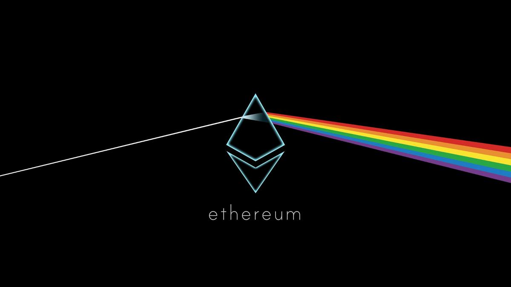

# Why 2018 Will Be The Year Of Ethereum And QTUM(一)
# 为什么2018年将会是以太坊和量子链的一年（一）

> 本文翻译自：http://storeofvalueblog.com/posts/why-2018-will-be-the-year-of-ethereum/
> 
> 译者：[区块链中文字幕组](https://github.com/BlockchainTranslator/EOS) [林炜鑫](https://github.com/weixin1993)
> 
> 翻译时间：2017-01-22

Here’s a prediction - Ethereum will overtake Bitcoin by the end of 2018 and QTUM will be a top 5 cryptocurrency. There are some incredible things brewing for both and I don’t believe the market has fully realized nor appreciated what’s going on. Ethereum has the largest user and developer base in the West. QTUM has gained a strong foothold in the East. If you’re not convinced, keep reading! I list a few developments for both cryptocurrencies that I am incredibly bullish on.

以下是一个预测 - 以太坊将在2018年底超过比特币，而QTUM（量子链）将成为前5名的加密货币。有一些令人难以置信的事情为这种货币做着铺垫，我既不相信市场已经完全实现了其价值，也不相信市场有意识到正在发生些什么。以太坊是西方最大的用户和开发者基地。QTUM在东方已经站稳了脚跟。如果你不相信，请继续阅读！ 我列举了一些我非常看好的这两种加密货币的发展。

## Ethereum
## 以太坊

### Proof of Stake
### 权益证明

Ethereum’s Casper upgrade, which introduces Proof of Stake to Ethereum, is very close to being released. Here’s a brief primer on how Proof of Stake works. Unlike Proof of Work, where powerful computers are used to solve arbitrarily hard mathematical problems to create blocks, Proof of Stake miners only need to “stake” their ether and the amount staked will determine the chance of creating a block.

引入了以太坊权益证明的以太坊Casper升级版非常接近发布。接下来介绍关于权益证明如何工作的简短入门。与利用强大的计算机来解决任意严格的数学问题来创建区块的工作量证明不同，权益证明方式的矿工只需要关心他们的以太，而权益的数量将决定创建区块的机会。

Proof of Stake has many many benefits over Proof of Work. They include:

* drastically lower electricity costs to operate the blockchain
* more incentives to own ether
* less need to issue as many new ethers in each block to incentivize mining, since the cost of mining will be low
* increased decentralization as the barrier to entry for mining is significantly lower than Proof of Work
* 51% attacks are vastly more expensive to carry out than Proof of Work. If you successfully attack a Proof of Stake blockchain, the value of your stake will significantly drop as well
* makes the implementation of Sharding easier. Sharding is another Ethereum scaling upgrade.

权益证明方式有很多很多工作量证明所没有的好处，包括：

* 大幅降低运营区块链的电力成本
* 拥有更多的以太奖励
* 由于采矿成本低，每个区块都需要发放尽可能多的新以太来激励采矿
* 由于采矿的进入壁垒明显低于工作证明，所以权力下放增加
* 51％的攻击比工作量证明要昂贵得多。如果您成功攻击了权益证明区块链，则您的权益价值也将大幅下降
* 使分区的实现更容易。分区是另一种以太坊扩容升级。

### Sharding
### 分区

Currently, Ethereum nodes need to validate every single transaction on the network. This is why people often stress that blockchains are not just distributed, but replicated. Since every node needs to store and validate every transaction, replication is really bad for scalability.

目前，以太坊节点需要验证网络上的每一个事务。这就是为什么人们经常强调区块链不只是分布式的，而是复制的。由于每个节点都需要存储和验证每个事务，所以复制对于其扩展性是非常不利的。

With sharding, the Ethereum blockchain can be securely split into shards such that the nodes in each shard only needs to worry about transactions within that shard. Sharding is an incredibly complicated technology that is really hard to implement as you’d need mechanisms to allow ether to be transferred between shards, to guarantee that mining power will be evenly distributed between shards, and much more. Luckily, proof of stake makes the latter problem easier to solve.

通过分区，可以安全地将以太坊区块链分割成碎片，使得每个分区中的节点只需要关心该分区内的事务。分区是一项非常复杂的技术，实际上很难实现，因为您需要使用以太网在碎片之间传输的机制，以确保采矿能力在碎片之间均匀分布等等。幸运的是，权益证明使这一个问题更容易解决。

If executed well, sharding will reduce the load on Ethereum nodes and since each shard can operate semi-independently like a separate blockchain, Ethereum can sustain a much high transaction throughput. It will be another big leap in Ethereum scalability.

如果实现的很好，分区将减少以太坊节点上的负载，并且由于每个分区可以像独立区块链一样独立运行，因此以太坊可以承受很高的交易吞吐量。这将是以太坊扩展性的又一大飞跃。

A V1 sharding specification document is ready and Vitalik Buterin believes it is “good enough to get us to thousands of transactions per second”. Read more about Ethereum sharding [here](https://github.com/ethereum/wiki/wiki/Sharding-FAQ).

分区规范文档V1版本已经准备就绪，Vitalik Buterin认为它“足以让我们每秒处理数千次交易”。[点击](https://github.com/ethereum/wiki/wiki/Sharding-FAQ)阅读更多关于以太坊分区的信息。

### Plasma
### 等离子智能合约

Plasma is a very cool technology that not only improves Ethereum scaling but also great increases its utility. Here’s a very [cool ELI5 on Plasma](https://www.reddit.com/r/ethereum/comments/7rm98l/eli5_plasma/dsy0v89/) found on /r/Ethereum by /u/enricotal70:

等离子（可扩容自主智能合约）是一种非常酷的技术，不仅可以扩大以太坊的容量，而且还可以大大增加它的实用性。这是/u/enricotal70在/r/Ethereum上发现的一个非常酷的[ELI5智能合约](https://www.reddit.com/r/ethereum/comments/7rm98l/eli5_plasma/dsy0v89/)：

> Plasma is a smart contract to create baby chains.
This new baby chain can run free at its own speed… but once in a while it needs to report back to its parent chain.
To enforce good behaviour on the youngling, the parent chain asks for a cautionary deposit.
If all the activities are the baby chain are within parameters, that’s great.. everybody is happy.
But if a user of the child chain discovers that something is fishy… can report it to the parent, the transactions could be reversed and the depost is gone.
Each baby chain can also give birth to another child chain and therefore theroretically enabling infinite scaling.

> 等离子智能合约是创建子链的一个聪明的合约。
这个新的子链可以以自己的速度自由奔跑......但偶尔也需要向其母链汇报。
为了保证子链的良好运作，母链要求注意存款。
如果所有的活动子链都在参数范围内，那太好了......大家都很开心。
但是，如果子链的使用者发现有些东西是可疑的，可以将其报告给母公司，这样交易就可以被撤销，而且发行方也没有了。
每个子链还可以产生另一个子链，因此在理论上实现无限扩展。

Plasma allows private and permissioned blockchains to interface with and be rooted to Ethereum. These blockchains are often significantly faster due to increased centralization. However, this comes with a greater risk of a loss of integrity and security. By being rooted to Ethereum, it’s possible to detect when the permissioned blockchain is compromised and rollback any damage done to the public chain.

等离子智能合约允许与私人且经过授权的区块链进行交互，并植根于以太坊。由于集中化程度的提高，这些区块链通常要快得多。但是，这带来了更高的完整性缺失和安全性丢失的风险。通过植根于以太坊，可以检测到授权区块链何时受到危害，并回退对公链产生的损害。

One of the most promising Plasma projects is the OmiseGo blockchain. OmiseGo is a payments blockchain that will allow payments across many different types of assets. As such, it needs a trading engine built in and the blockchain will use ether as a central trading pair for liquidity reasons. OmiseGo is a separate blockchain from Ethereum and it will use Plasma to source ether in a decentralized manner into its own blockchain. Plasma allows OmiseGo to have OmiseGo-ether, which is very cool!

最有前途的等离子智能合约项目之一是OmiseGo区块链。OmiseGo是一个支付区块链，允许跨越多种不同类型的资产进行支付。因此，它需要一个内置的交易引擎，基于流通性原因，区块链将使用以太坊作为中央交易对。OmiseGo是来自以太坊的独立区块链，它将使用Plasma以分散的方式将以太坊收集到自己的区块链中。非常酷的是，等离子智能合约允许OmiseGo实现OmiseGo-ether之间的相互兑换！

### MakerDai

MakerDai is a decentralized and homeostatic stable coin system built on Ethereum as a series of smart contracts. Dai, the stable asset of the system, tracks the US dollar. MakerDai launched on December 18th, 2017. I believe it is one of the most important projects for Ethereum out there and great increases Ethereum’s utility. Here’s why:

MakerDai是一个去中心化和稳定的稳定币项目，是以以太坊为基础构建的一系列智能合约。该项目的代币Dai稳定跟踪美元的价值。MakerDai于2017年12月18日推出。我相信这是Ethereum最重要的项目之一，并大大提高了以太坊的效用。原因如下：

The volatility and deflationary nature of cryptocurrencies are two key obstacles stopping cryptocurrencies from being treated as money. Here’s a famous joke:

加密货币的波动性和通缩性是阻止加密货币被视为货币的两个关键障碍。这有一个著名的笑话：

> A boy asked his Bitcoin-investing dad for $10 worth of Bitcoin currency

>Dad: $17? What do you need $132 for?

>一个男孩问他的做比特币投资的爸爸要价值10美元的比特币

>爸爸：17元？ 你需要132美元？

Now imagine you’re a retailer. If you’d just sold an iPhone for 1 ether and the price of ether tanked while you waited for the transaction, you just lost a lot of money. On the other hand, if you were the buyer and the price of ether skyrocketed as you waited for your transaction to clear, you also just lost a lot of money. Volatility in an asset adds risk to using it as money and discourages people from doing so.

现在想象你是一个零售商。如果你刚刚以一个太坊的价格卖掉iPhone，而在等待交易的时候以太的价格却大跌，那么你就损失了很多钱。另一方面，如果你是买方，在你等待交易处理的时候，以太坊的价格猛涨，你也损失了很多钱。货币的波动性增加了将之用作金钱的风险，并阻碍人们这样做。

A deflationary asset also discourages people from using it as money. If people expect the asset’s price to increase over time, they are more inclined to hoard it than spend it. This is why a deflationary currency is really bad for an economy and central banks work really hard to keep inflation stable and positive.

一种通货紧缩的货币也使得人们不会把它当作金钱使用。如果人们预计资产价格会随着时间的推移而增长，那么他们更倾向于囤积货币而不是把它花掉。这就是为什么通货紧缩对经济来说真的很糟糕，中央银行真的很难保持通货膨胀稳定并且有益。

Most cryptocurrencies are deflationary and volatile. This makes them terrible forms of money. To fully realize the peer-to-peer value transfer utility of a cryptocurrency, we need stable coins that track a real world curreny like the USD. Needless to say, this is incredibly hard to achieve in a decentralized manner. This is where MakerDai comes in.

大多数加密货币是通缩和易波动的。这使他们不可能成为金钱。为了充分实现加密货币的点对点价值转移效用，我们需要稳定的货币来跟踪像美元这样的真实世界的货币。毋庸置疑，这是非常难以去中心化的方式实现的。而这就是MakerDai所要实现的。

MakerDai is a decentralized, transparent, and homeostatic stable coin system on Ethereum. It was released in December 2017. It is one of the first stable coins on Ethereum and will allow dApps to charge for services in terms of USD. How cool is that? Imagine if the Brave system and the 0x protocol could work with USD instead of the BAT token or 0x token. It makes Ethereum so much more efficient.

MakerDai是基于以太坊的去中心化，透明，稳定币项目。它是在2017年12月发布的。它是以太坊上第一个稳定的硬币之一，将允许dApps按照美元收取服务费用。设想一下，如果Brave系统和0x协议可以使用USD而不是BAT代币或0x代币。这是多么酷啊？它使得以太坊更加便捷高效。

Buiding a decentralized stable coin is by no means a simple feat. Check out how the team accomplished this by reading [this](https://medium.com/cryptolinks/maker-for-dummies-a-plain-english-explanation-of-the-dai-stablecoin-e4481d79b90) and browsing their [website](https://makerdao.com). It’s fascinating.

建立一个分散去中心化的稳定币绝不是一个简单的工程。通过[阅读](https://medium.com/cryptolinks/maker-for-dummies-a-plain-english-explanation-of-the-dai-stablecoin-e4481d79b90)和浏览[他们的网站](https://makerdao.com)来看看他们的团队是如何完成这个任务的。这很有趣。

### 0x
### 0x协议

0x is a protocol built on Ethereum. I believe it is one of the biggest scaling solutions for Ethereum right now. Here’s why.

0x是一个建立在以太坊上的协议。我相信这是现在以太坊最大的扩容方案之一。接下来解释为什么。

0x is an open, permissionless protocol allowing for ERC20 tokens to be efficiently traded on Ethereum. Specifically, 0x enables offchain order creation and onchain order settling. A user can create a 0x order to buy (or sell) an ERC20 token offchain and another user can take that order and fill it. 0x smart contracts will automatically complete the order onchain. One of the most promising applications of Ethereum is as a platform for the tokenized economy, i.e. the tokenizing of real world assets such that they can be traded on Ethereum trustlessly and transparently. With 0x, you can do that incredibly efficiently too.

0x是一个开放，无权限的协议，允许ERC20代币在以太坊进行有效的交易。具体来说，0x使链下订单的创建和链上订单的解决。用户可以创建一个链下0x订单来购买（或出售）ERC20代币，另一个用户可以锁定该订单并填写它。0x智能合约将自动完成链上订单。以太坊最有前途的应用之一是作为代币经济的平台，如将现实世界的资产代币化，使其可以在以太坊上以无需信任并且透明的方式进行交易。利用0x协议，你也可以非常有效地做到这一点。

As an example, decentralized exchanges benefit tremendously from 0x. The most popular decentralized exchange, EtherDelta, stores an orderbook in the smart contract. In order to update the orderbook, users need to send costly and slow transactions to the smart contract. Highly dynamic data structures like orderbooks are too expensive to run on the blockchain and really, are not meant for the blockchain. With 0x, users can create offchain orders and still hold on to their assets. This allows the orderbook of a decentralized exchange to be moved offchain. Many 0x-based decentralized exchanges have either been announced or have been released. They include RadarRelay, Paradex, The Ocean, and Ethfinex.

例如，去中心话交易就非常得益于Ox协议。最受欢迎的去中心化交易所EtherDelta在智能合约中存储订单。为了更新订单，用户需要向智能合约发送昂贵而慢的交易。高度动态的数据结构（如订单）在区块链上运行起来太昂贵，实际上并不适用于区块链。而使用0x，用户可以创建链下订单，并保留其资产。这使去中心化交易的订单移动到链下。许多基于0x的去中心化交易所已经声明或者发布这种方式。包括RadarRelay，Paradex，The Ocean和Ethfinex。

Although I’ve focused on decentralized exchanges, it’s also important to note that use cases for the 0x protocol extends beyond decentralized exchanges since it’s fundamentally about the exchange of Ethereum assets. Many other dApps such as Augur, district0x, dydx, and Status are planning to use 0x.

尽管我专注于去中心化交易，但也很重要的一点是，0x协议的应用范围远远不止于去中心化交易，因为它基本上是关于以太坊资产交换的。Augur，district0x，dydx和Status等许多其他dApp正在计划使用0x协议。

----------------------------------------------------

#### 区块链中文字幕组

致力于前沿区块链知识和信息的传播，为中国融入全球区块链世界贡献一份力量。

如果您懂一些技术、懂一些英文，欢迎加入我们，加微信号:w1791520555。

[点击查看项目GITHUB，及更多的译文...](https://github.com/BlockchainTranslator/EOS)

#### 本文译者简介

林炜鑫，在读硕士，专注区块链技术研究与行业分析，欢迎加微信号:happyzai1993。

本文由币乎社区（bihu.com）内容支持计划奖励。

版权所有，转载需完整注明以上内容。

----------------------------------------------------

