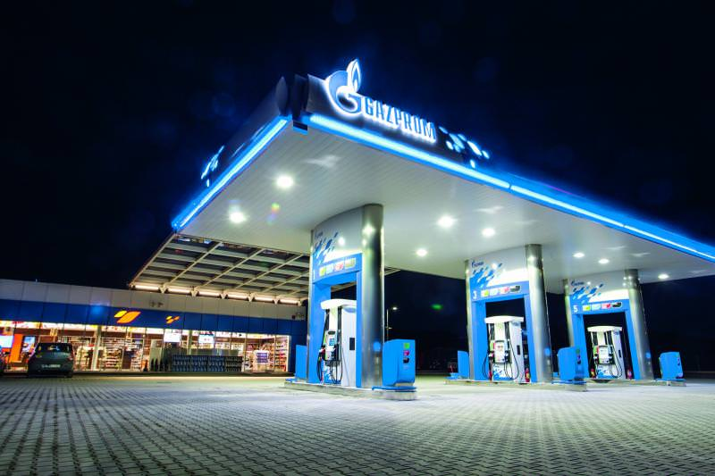
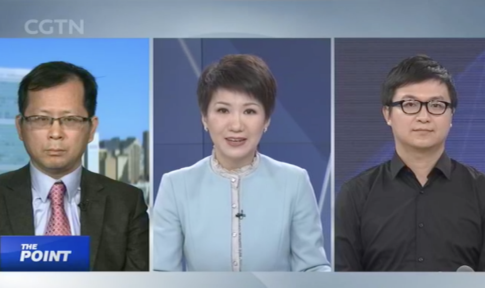

# Why 2018 Will Be The Year Of Ethereum And QTUM(二)
# 为什么2018年将会是以太坊和量子链的一年（二）

> 本文翻译自：http://storeofvalueblog.com/posts/why-2018-will-be-the-year-of-ethereum/
> 
> 译者：[区块链中文字幕组](https://github.com/BlockchainTranslator/EOS) [林炜鑫](https://github.com/weixin1993)
> 
> 翻译时间：2017-01-20

## QTUM
## 量子链

For those that do not know what QTUM is, here’s a brief primer: QTUM is a layered, proof of stake blockchain where the computing layer consists of the EVM and the settlement layer consists of a Bitcoin-based Unspent Transaction Output (UTXO) blockchain. QTUM’s main net was launched in September 2017 and so far there are more than [20 companies building QTUM-based projects](https://eco.qtum.org/dapps). Most of them are Eastern projects and many have been quite successful. These projects include: Vevue, Bodhi, INK, Spacechain, Medibloc, and Energo.

对于那些不知道QTUM是什么的人来说，下面是一个简短的入门指南：QTUM是一个分层的股份证明区块链，其中计算层由EVM(以太虚拟机)组成，结算层由基于比特币的未花费交易输出（UTXO）区块链组成。 QTUM的主要网络于2017年9月推出，迄今为止，已有[20多家公司构建基于QTUM的项目](https://eco.qtum.org/dapps)。 其中大部分是东方的项目，许多项目相当成功。 这些项目包括：Vevue，Bodhi，INK，Spacechain，Medibloc和Energo。

Many of my readers know that I have been bullish on QTUM for quite a while now. I think it is incredibly undervalued, partly because of a distinct lack of interest and awareness of QTUM in the West (QTUM is huge in the East), and partly because many people still do not understand its potential. Here’s a few reasons why I believe QTUM will be a top 5 cryptocurrency by the end of the year.

我的很多读者都知道我对QTUM看涨已经有了一段时间了。 我认为这个数字货币被低估了，部分原因是西方国家对QTUM的兴趣和意识明显缺乏（QTUM在东方的影响是巨大的），部分原因在于很多人还是不了解其潜力。 以下是我相信QTUM将在今年年底成为前5名加密货币的几个原因。

### Ethereum ecosystem wins = QTUM ecosystem wins
### 以太坊生态系统获胜= QTUM生态系统获胜

Because QTUM uses the EVM, any projects building on Ethereum can be easily ported to QTUM. A corollary to this is that any successful dApp or protocol on Ethereum can easily become a successful dApp or protocol on QTUM. QTUM doesn’t need to compete with Ethereum for its developer ecosystem, it shares Etheruem’s developer ecosystem. There are many amazing up-and-coming projects for Ethereum such as 0x and Augur and I can envision a world where QTUM has its own 0x’s and Augurs.

由于QTUM是使用EVM的，所以任何基于以太坊的项目都可以轻松移植到QTUM。 一个必然的结论是任何成功的以太坊dApp或协议都可以很容易地成为QTUM上成功的dApp或协议。 QTUM不需要与Ethereum竞争开发者生态系统，而是共享Etheruem的开发者生态系统。 以太坊有很多令人惊喜的新兴项目，比如0x和Augur，我可以想象到一个拥有自己的0x和Augurs的QTUM的世界。

Some readers might be wondering: why would people use QTUM when Ethereum exists? First of all, I don’t believe that cryptocurrencies is a winner takes all market. Second, I believe that many will choose QTUM over Ethereum because of a number of advantages that QTUM has. I elaborate on some of them below.

有些读者可能会疑惑：为什么人们会在以太坊存在时使用QTUM？ 首先，我不相信加密货币是赢家占领所有市场的。 其次，我相信很多人会选择QTUM而不是ETH，因为QTUM拥有许多优势。 我在下面详细阐述一些。

Keep in mind that I do not believe QTUM can overtake Ethereum anytime soon. Ethereum is king and will remain king for a long time.

请记住，我不认为QTUM可以很快超越以太坊。 以太坊是国王，将继续称王很长一段时间。

### Bitcoin ecosystem wins = QTUM ecosystem wins
### 比特币生态系统获胜= QTUM生态系统获胜

Because QTUM uses a Bitcoin-based UTXO blockchain as its settlement layer, QTUM can take advantage of any upgrades to Bitcoin. Here’s a few examples: QTUM is already using SegWit and is primed to deploy its own version of Lightning. Once deployed, QTUM is essentially Ethereum with Lightning. How cool is that? It’d be even better for QTUM if Lightning turns out to be a massive success.

由于QTUM使用基于比特币的未花费交易输出(UTXO)区块链作为结算层，因此QTUM可以利用任何对比特币的升级。 以下是一些示例：QTUM已经在使用SegWit，并准备部署自己的Lightning版本。 一旦部署，QTUM基本上就是带有闪电的以太坊。 多么酷啊？ 如果Lightning取得巨大成功的话，QTUM会更好。

Of course, there are many more benefits for QTUM to use a UTXO blockchain besides being able to absorb Bitcoin upgrades. I outline them in a previous article: [Is Qtum Overlooked And Undervalued? - A Detailed Analysis](http://storeofvalueblog.com/posts/is-qtum-the-dark-horse/).

当然，除了能够利用比特币的升级之外，使用UTXO区块链的QTUM还有更多的好处。 我在之前的文章中概述了他们：[Qtum是否被忽略和被低估？ - 一个详细的分析](http://storeofvalueblog.com/posts/is-qtum-the-dark-horse/)。

### Bodhi and Qweb3.js
### 菩提和Qweb3.js

It is one thing to have a few companies building dApps on your platform, it is another for these companies to start enriching your developer ecosystem by contributing powerful, open source developer tools.

有几家公司在您的平台上构建dApp是一回事，而这些公司通过贡献强大的开源开发工具开始丰富您的开发者生态系统是另一回事。

Bodhi is one such company. The company is building a decentralized prediction market on QTUM and has also taken the lead to build QTUM’s version of [web3.js, qweb3.js](https://medium.com/@bodhitoken/bodhi-development-tools-qweb3-web3-js-for-qtum-a1cd52abbcc4). Ethereum dApp developers will know how useful web3.js is for dApp development. I have recently been getting my hands dirty with developing dApps and can testify that it is indeed awesome. I believe that qweb3.js is crucial to jump-starting QTUM’s community dApp development and it is very good news that Bodhi has taken the initiative to do so.

菩提就是这样一个公司。 该公司正在QTUM上建立一个去中心化的预测市场，并且还率先构建了QTUM的[web3.js:qweb3.js](https://medium.com/@bodhitoken/bodhi-development-tools-qweb3-web3-js-for-qtum-a1cd52abbcc4)版本。 以太坊dApp开发人员将知道web3.js对于dApp开发有多大用处。 我最近一直在花费大量的功夫开发dApp，可以证明这确实很棒。 我相信qweb3.js是启动QTUM社区dApp开发的关键，而且菩提已经主动这么做了，这是一个非常好的消息。

By the way, for those interested in Bodhi, check out their website and whitepaper [to learn more](http://www.bodhi.network). Bodhi distinguishes itself from Augur and Gnosis by introducing a few novel market mechanics.

顺便说一下，对于那些对菩提感兴趣的人，请查看他们的网站和白皮书以了解[更多信息](http://www.bodhi.network)。 菩提通过介绍一些新颖的市场机制，从Augur和Gnosis中脱颖而出。

### World’s Largest Pension Fund Invests in Ink
### 世界上最大的养老基金投资墨链

Ink is another company building on QTUM. The company recently received an investment from the operators of Russia’s largest pension fund, NPF Gazfond. Gazprom (Russia’s national oil and gas company) and Alor Invest manages NPF Gazfond. Other investors of Ink include Fenbushi Capital’s Bo Shen and Softbank SAIF’s Yan Yan. For such high profile investors to invest in a budding cryptocurrency project is a huge vote of confidence on it.

Ink(墨链)是QTUM的另一家公司。 该公司最近收到了俄罗斯最大养老基金NPF Gazfond的投资。 俄罗斯天然气工业股份公司（俄罗斯国家石油和天然气公司）和Alor Invest管理着NPF Gazfond。 Ink的其他投资者包括Fenbushi Capital的Bo Shen和Softbank SAIF的Yan Yan。 对于如此高调，明确立场的投资者来说，投资一个正在萌芽的加密货币项目是一个巨大的信心投票。

Ink aims to build a blockchain, interoperable with QTUM’s, that can manage IP rights and enable the free trade of cultural assets. Learn more about Ink on their [website](https://ink.plus).

Ink的目标是建立一个与QTUM互操作的区块链，可以管理知识产权，实现文化资产的自由贸易。 在他们的[网站](https://ink.plus)上了解更多关于墨链。

Good news for QTUM’s projects is good news for QTUM. I have only chosen to discuss Bodhi and Ink but many others are also gaining momentum and we should start hearing more about them later in the year. Check out the projects [here](https://eco.qtum.org/dapps).

QTUM项目的好消息对于QTUM来说是也就是个好消息。 我只是选择性地讨论菩提和墨链，但其他许多项目也有正在增长的势头，我们应该在今年晚些时候开始听取更多的信息。 [这里](https://eco.qtum.org/dapps)可以查看这些项目。

### x86 virtual machine
### x86虚拟机

One of the most anticipated upgrades to QTUM is the x86 virtual machine. QTUM merges the EVM with its UTXO blockchain through what’s known as the Account Abstraction Layer (AAL). The AAL enables the EVM to play nice with the UTXO blockchain. This layered architecture also allows QTUM to plug and play different smart contract virtual machines. QTUM is currently developing an x86 virtual machine that offers many benefits over the EVM. For one, any programming language with x86 compiler support today, which is almost all the languages that matter, can be easily ported to QTUM’s x86 virtual machine.

最值得期待的QTUM升级之一是x86虚拟机。 QTUM通过所谓的账户抽象层（AAL）将EVM与其UTXO区块链合并。 AAL使EVM能够与UTXO区块链搭配使用。 这种分层架构还允许QTUM插入和播放不同的智能合约虚拟机。 QTUM目前正在开发一款x86虚拟机，与EVM相比具有许多优势。 例如，几乎任何支持x86编译器的教重要的编程语言，都可以轻松移植到QTUM的x86虚拟机上。

This [blog post](https://medium.com/@earlz/thoughts-and-goals-on-qtums-x86-vm-9622cf349427) by QTUM’s cofounder and lead developer, Jordan Earls, outlines the myriad of advantages an x86 virtual machine has over the EVM much better than I can.

QTUM联合创始人兼首席开发人员Jordan Earls撰写的这篇[博客文章](https://medium.com/@earlz/thoughts-and-goals-on-qtums-x86-vm-9622cf349427)概述了x86虚拟机对EVM的诸多优势，讲的比我更好。

### Growing influence in Asia, and specifically China
### 在亚洲，特别是中国，影响力不断增强

Patrick Dai, a cofounder of QTUM, claimed that QTUM is one of the most influential cryptocurrencies in the East. Many indicators, such as trading volume, media coverage, projects building on QTUM, support this claim. It is a well known fact that the Chinese government dislikes cryptocurrency speculation but is favorable of the development and adoption of blockchain technology. A series of recent events from China strongly hints that QTUM has received tacit support from the government.

QTUM的创始人之一Patrick Dai声称QTUM是东方最有影响力的加密货币之一。 许多指标，如交易量，媒体报道，以QTUM为基础的项目都支持这一说法。 中国政府不喜欢加密货币投机，但是区块链技术的发展和采用，这是众所周知的事实。 来自中国的一系列近期事件暗示了QTUM可能得到了政府的默许支持。

### Patrick Dai was interviewed on Chinese state television
### Patrick Dai 在中国接受采访

Patrick Dai was recently interviewed on China Global Television Network (CGTN). CGTN is the English channel of the China’s predominant state television broadcaster, China Central Television (CCTV). Patrick appeared on the show, The Point with Liu Xin, along with Henry Cao, Professor of Finance at the Cheung Keung Graduate School of Business. Topics covered include an overview of blockchain technology, how the financial industry can make use of blockchains, “blockchain fever”, and the challenges facing the technology. You can read about it [here](https://medium.com/m/global-identity?redirectUrl=https://blog.qtum.org/qtums-patrick-dai-on-china-global-television-network-239a9f4baad5).

帕特里克最近接受了中国全球电视网（CGTN）采访。 CGTN是中国主要的国家电视台中央电视台（CCTV）的英文频道。 帕特里克与刘昕一起出现在节目中，连同长江商学院金融学教授曹Henry。 主题包括区块链技术概述，金融业如何利用区块链，“区块链热”以及技术面临的挑战。 你可以在[这里](https://medium.com/m/global-identity?redirectUrl=https://blog.qtum.org/qtums-patrick-dai-on-china-global-television-network-239a9f4baad5)读到它。

Overall, the interview was very bullish on the technology.

总的来说，这个采访对这个技术非常看好。

### Qihoo 360 partnership
### 奇虎360合伙

Qihoo 360 is one of China’s largest internet security companies. It’s products have over a billion users and its annual revenue reached 1.4 billion dollars in 2014 (couldn’t find any data past 2014). The company is known for its antivirus software, web browser, and mobile application store. Qihoo 360 recently partnered with the QTUM Foundation to establish China’s first ever blockchain research center. The goal of this research center is to commercialize blockchain technology such that it can be deployed into Qihoo 360’s products.

奇虎360是中国最大的互联网安全公司之一。 它的产品用户已超过十亿，2014年的年收入达到了14亿美元（2014年之前无法找到任何数据）。 该公司以其防病毒软件，网页浏览器和移动应用程序商店而闻名。 奇虎360最近与QTUM基金会合作建立了中国第一个区块链研究中心。 该研究中心的目标是将区块链技术商业化，以便将其部署到奇虎360的产品中。

### Baofeng partnership
### 暴风合伙

Baofeng is the company behind the Storm Player, one of the most popular online video players in China with hundreds of millions of users. Baofeng has a market cap of more than 8 billion CNY on the Shenzhen securities exchange. In December 2017, Baofeng announced that its Bokocloud division will help deploy up to 50,000 QTUM nodes. This strategic cooperation will make Baofeng Bokocloud the world’s first BCN (blockchain consensus network) service.

暴风是Storm Player的幕后公司，Storm Player是中国最受欢迎的在线视频播放器之一，拥有数以亿计的用户。 暴风在深圳证券交易所拥有超过80亿元的市值。 2017年12月，暴风宣布其Bokocloud部门将帮助部署多达5万个QTUM节点。 这一战略合作将使暴风播客云成为全球首个BCN（区块链共识网络）服务。

>“We are very excited to sign the world’s first Blockchain Consensus Network (BCN) service agreement with Qtum,” said Reccon Cui, CEO of Baofeng Bokocloud. “Baofeng Group operates the world’s largest P2P network, so we are impressed by the security and superior flexibility of the Qtum’s blockchain architecture, and we found that the current ecosystem of Qtum is rapidly developing. We are very happy to cooperate with one of the best blockchain technical teams in this field.”

>“我们非常高兴与Qtum签署世界上第一个区块链共识网络（BCN）服务协议，”暴风播客云首席执行官崔康康说。 “暴风集团运营着世界上最大的P2P网络，所以我们对Qtum区块链架构的安全性和卓越的灵活性印象深刻，我们发现目前Qtum的生态系统正在迅速发展。 我们很高兴与这个领域最好的区块链技术团队合作。”

### Strong Eastern awareness and interest
### 在东方享有很强的知名度并吸引了人们很大的兴趣

A good indicator of awareness and interest for a cryptocurrency project is the number of people that show up to its community events. QTUM recently held a Taiwan meetup where more than 800 people attended. Not bad.

对于一个加密货币项目来说，一个好的指标就是参与其社区活动的人数。 QTUM近日在台湾举行了800多人参加的聚会。 不错。

----------------------------------------------------

#### 区块链中文字幕组

致力于前沿区块链知识和信息的传播，为中国融入全球区块链世界贡献一份力量。

如果您懂一些技术、懂一些英文，欢迎加入我们，加微信号:w1791520555。

[点击查看项目GITHUB，及更多的译文...](https://github.com/BlockchainTranslator/EOS)

#### 本文译者简介

林炜鑫，在读硕士，专注区块链技术研究与行业分析，欢迎加微信号:happyzai1993。

本文由币乎社区（bihu.com）内容支持计划奖励。

版权所有，转载需完整注明以上内容。

----------------------------------------------------

