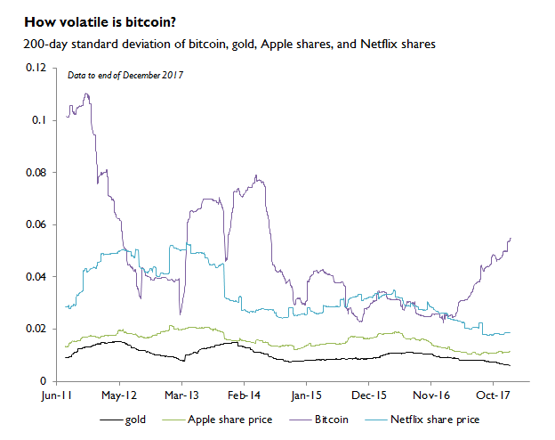

# Why Bitcoin Needs Fiat (And This Won't Change in 2018)
## 为什么比特币需要法定货币(这一情况在2018年不会改变)

> 本文翻译自：https://www.coindesk.com/bitcoin-still-needs-fiat-currency-wont-change-2018/
> 
> 译者：[区块链中文字幕组](https://github.com/BlockchainTranslator/EOS) [林炜鑫](https://github.com/weixin1993)
> 
> 翻译时间：2018-01-10

Imagine a parallel universe in which the U.S. economy could only grow at $50 every 10 minutes generating a mere $2.6 million of output per annum. That due to a hard-coded economic planning computer program, every four years the income its inhabitants collectively generated divided in half. Such that in year nine, its output shrank and was $12.50 every 10 minutes or $657,000 a year.

That is to say, irrespective of how productive and skilled the labor force became or how large the labor force grew, the productive output in the U.S remained fixed and static with the only change (downward in this case) occurring just once every four years.

设想一个平行的世界，美国经济每10分钟只能增长50美元，每年仅产生260万美元的产出。由于计算机程序经过严格编码，每隔四年居民共同生成的收入就减半。这样，在第九年，它的产量就会缩水到，每十分钟$12.50或一年$657,000。

也就是说，无论劳动力多么富有成效，多少劳动力成长，美国的生产产出总是固定的，只有四年一次的变化（乡下变化）。

How many people would volunteer to live and work in that "Upside Down" world?

This situation effectively mirrors the static, internal economy of bitcoin and many other cryptocurrencies.

For instance, with proof-of-work networks like bitcoin, the marginal productivity of labor is zero. It does not matter how many more units of labor are added to the income generation (mining) process as the network will always produce the same amount of economic output.

有多少人愿意在这个“颠倒”的世界中生活和工作？

这种情况有效地反映了比特币和许多其他加密货币的静态内部经济。

比如，像比特币这样的工作证明网络，劳动力的边际生产率就是零。在收入增加（采矿）过程中增加多少劳动力单位并不重要，因为网络将始终产生相同数量的经济产出。

Today, after nearly nine years of operation, the bitcoin network – better referred to as Bitcoinland – generates 12.5 bitcoins roughly every 10 minutes. Irrespective of external economic conditions, of demand, the Bitcoinland economy will generate about 657,000 bitcoins per year in its third epoch.

While comparisons with aggregate measurements like GDP and money supplies may be an imperfect analogy, the fact that economic expansion as measured in output can – with the exception of a fork and rule change – never change in bitcoin due to its inelastic coin supply is arguably detrimental to its unit of account.

如今，经过近9年的运作，比特币网络（更可称为比特币地区）大约每10分钟产生12.5个比特币。无论外部经济条件如何，比特币经济在第三个时代每年将会产生657,000比特币。

虽然与GDP和货币供应量等总量测量结果的比较可能是一个不完美的类比，但是由于其非弹性的硬币供给可能是有害的，因此，除了分叉和规则变化外，经济扩张在产出方面的变化决不会改有效变到其账户单位。

The purposefully planned sameness is often extolled as a "feature not a bug," and many cryptocurrency enthusiasts like to daydream for when regulators and financial institutions of our own world disappear, eaten up by grey goo nanites funded by bitcoins.

有目的地计划的“千篇一律”通常被吹捧为“功能而不是一个bug”，许多加密货币的狂热者喜欢做白日梦：希望我们自己的世界的监管机构和金融机构消失，被比特币产生的巨大影响所吞噬。

But before bitcoiners can reach their Upside Down nirvana state, they need to resolve the underlying omnipresent economic calculation challenge facing their security system and labor force.

The phenomenon is simple to describe: virtually no participant in Bitcoinland conducts economic calculations (such as pricing) for any goods or services in cryptocurrencies such as bitcoin.  There are many reasons for this, including chronic volatility.

但在比特币的“天堂”之前，他们需要解决他们的安全系统和劳动力所面临的无处不在的经济计算挑战。

这种现象很简单:比特币内陆的任何参与者都没有进行比特币等加密货币的任何商品或服务的经济计算(比如定价)。造成这种情况的原因有很多，包括长期的波动。

Or increasingly high ($10+) transaction fees that result in hemorrhaging of merchants (even their very own Cobra Commander acknowledges this issue).

But for this article, let's put aside the typical discussion of payments and merchants and instead focus on labor.

或者越来越高的（$10+）交易费导致商人大量流失（甚至他们自己的Cobra Commander也承认这个问题）。

但是对于这篇文章，让我们搁置支付和商家的典型讨论，而是把精力放在劳动力上。

## Labor force
## 劳动力

If Bitcoinland is viewed as its own sovereign (virtual) nation-state, the only wages any native participant receives in return for any kind of service rendered is what miners are paid to solve and "vote" on a benign problem about once every 10 minutes.

如果比特币大陆被看作是自己的主权国家(虚拟的)民族国家，任何一名本土参与者所获得的唯一报酬是任何一种服务的回报，那就是矿工们为解决和“投票”每10分钟一次的良性问题所付出的代价。

From the perspective of the network: developers, maintainers, administrators, enthusiasts, Twitter sock puppets, meme artisans, flame war veterans, self-appointed thought leaders, pumpers, hat wearers, etc., are all viewed as foreign third parties and can only receive bitcoins after they are first minted by the miners.

Much like multinational corporations (MNC) with large overseas operations, miners of cryptocurrency networks as a whole do not measure the income they receive in terms of bitcoins (or other discrete cryptocurrencies), but instead they measure their income in terms of "fiat" from foreign financial markets, specifically converting bitcoins into the local fiat currency where their mining operation physically resides.

从网络的角度来看，开发者，维护者，管理者，爱好者，推特袜子木偶，模特工匠，退役火焰战士，自我指派的思想领袖，水手，穿戴帽子等都被视为外国第三方，而且只有在被矿工们铸造出来后才能得到比特币。

就像跨国公司（MNC）有大规模的海外运营一样，加密货币网络的矿工整体并不以比特币（或其他离散的加密货币）来衡量他们所得到的收入，而是以“法定货币”外国金融市场，特别是把比特币转换成当地（采矿经营实际所在地）法定货币。

However, unlike MNCs that eventually repatriate some or all of their capital back to their headquarters, aside from a recycling of coins into ICOs, most cryptocurrency-focused companies are still dependent on what amounts to foreign domestic income (FDI), regular injections of foreign capital from venture firms in order to grow or even measure enterprise valuations.

然而，与最终将部分或全部资本汇回其总部的跨国公司不同，除了将硬币再循环到ICO之外，大多数以密码货币为中心的公司仍然依赖于外籍家庭收入（FDI），定期注入外国来自风险投资公司的资本，以增长甚至衡量企业估值。

Miners do this because the unit of account for fiat currency is typically stable and liquid, such that they can pay wages to their employees, pay rent, electrical costs, property taxes, etc. There are exceptions to stability, such as planned economies of Venezuela and Zimbabwe which have suffered from years of political chaos, but in general, most developed countries and even developing countries have relatively stable domestic currencies relative to Bitcoinland.

矿业公司是这样做的，因为法定货币的记账单位通常是稳定和流动的，这样他们就可以向雇员支付工资，支付租金，电费，财产税等等。稳定性也有例外，例如委内瑞拉的计划经济体津巴布韦经历了多年的政治混乱，但一般来说，大多数发达国家甚至发展中国家的本国货币相对于比特币大陆都是相对稳定的。

And because bitcoin is still not used as a unit of account, its labor force (miners), rely on a third-party reference data in order to conduct all economic calculations.  That is to say, in order for Bob the miner to accurately calculate if he should increase or decrease consumption (and investment) of capital, or to measure whether his mining operation is profitable, Bob projects future revenue based on a unit of account that is stable, in this case, currency from foreign capital markets.

而且由于比特币仍然不被用作账户单位，其劳动力（矿工）依靠第三方参考数据来进行所有的经济计算。也就是说，为了让矿工Bob准确地计算出他是应该增加还是减少资本的消耗（和投资），或为了衡量他的采矿作业是否有利可图，在这种情况下，Bob可以根据来自外资市场的稳定货币来计算未来的收入。

During the Cold War there was a joke in academia: that the Soviet Union would conquer the world with the exception of New Zealand (other versions used Switzerland as the cut-out). New Zealand would be left alone because the Politburo needed a functioning market so that the Soviets could know what the market prices were for goods and services.

在冷战期间，学术界有个笑话:苏联除了新西兰以外，将征服世界(其他版本使用瑞士作为切断)。新西兰将会被孤立，因为政治局需要一个运转良好的市场，这样苏联才能知道商品和服务的市场价格。

While Bitcoinland may be attracting large sums of foreign capital, miners continually still need very liquid over-the-counter (OTC) and spot exchanges denominated in foreign currencies because it is with these foreign currencies that they pay their bills.

In this case, despite their own defects and problems, the U.S., eurozone, Japan, South Korea, China and several other countries effectively stand in for "New Zealand," such that the national currencies and prices in these countries reflect dynamic economic conditions that bitcoin miners can use as reference rates in their capital consumption projections.

虽然比特币可能会吸引大量的外资，但矿工们仍然需要非常流动的场外交易（OTC）和以外币计价的现货交易，因为这些外币是他们用来支付账单的。

在这种情况下，美国，欧元区，日本，韩国，中国和其他一些国家虽然有其自身的缺陷和问题，但实际上都是“新西兰”的代表，这些国家的国家货币和价格反映了这些国家的经济状况，而比特币矿商可以在其资本消费预测中使用这些货币作为参考利率。

## Final remarks
## 最后的言论

In 2018, just as the past nine years, miners will still depend on foreign financial markets for both stable pricing and liquidity. If the existing traditional financial markets became chaotic and unstable, miners would be unable to rationally plan and allocate for future investments.

在2018年，就像过去九年一样，矿商依然依靠外资金融市场来稳定定价和流动性。如果现有的传统金融市场变得混乱而不稳定，矿工将无法合理规划和分配未来的投资。

For instance, the unseen costs of hash generation for a hypothetically stable $20,000 bitcoin would be about $13 billion in capital consumed by miners in their rent-seeking race.

And that is just one proof-of-work coin. If there were dramatic bouts of volatility, or even an extended bear market, this could result in bankruptcies like CoinTerra, HashFast or KnC previously went through, though that is beyond the speculation of this article.

例如，在一个假设的价值2万美元的比特币的低成本中，不可见的成本是大约130亿美元的资金，被矿商在他们的寻租竞争中消耗。

这只是一种工作证明的硬币。如果出现剧烈的波动，或者甚至持续的熊市，这可能会导致像CoinTerra、HashFast或KnC之类的破产事件，尽管这超出了本文的推测范围。

Ironically, despite all the bluster, because cryptocurrency ecosystems lack a circular flow of income, they will still be dependent on the very financial system they vilify for daily support and stability.

具有讽刺意味的是，尽管这些都是虚张声势，因为加密货币生态系统缺乏收入的循环流动，他们仍然依赖于他们日常诋毁的稳定的金融体系。

And while there have been many "stablecoin" projects announced and launched over the past year, nearly all of them are not only dependent on commercial bank accounts, but also on the economic stability of a specific economic region they aim to serve. Guess what set of entities provides that type of relative stability?

虽然过去一年已经发布和推出了很多“稳定币”项目，但几乎所有的项目都不仅依赖于商业银行账户，而且还依赖于他们服务的特定经济区域的经济稳定。猜猜什么样的实体提供了这种相对稳定的类型？

Ideological enthusiasts will likely resort to whataboutisms and respond by bitcoinsplaining: how dirty filthy statists will censor your virtuous darknet market transactions and that maintaining proof-of-work networks is worth any cost to the environment! But again, that is for a snarky article on a different day.

意识形态狂热者可能会诉诸合理的措施，并通过比较平易近人的诉求作出回应：肮脏的国家统计局将审查你的良性暗网交易记录，维护工作证明网络对环境的任何成本都是值得的。但同样，这又何尝不是在不同的日子里一篇尖刻的文章。

Empirically with proof-of-work-based blockchains, the labor force and the liquidity providers all still depend on functional, mature foreign capital markets in order to convert their coins into real money. Perhaps this will change as more hedging products, courtesy again of foreign financial markets, are brought online.

经验性的工作区块链证明，劳动力和流动性提供者都依靠功能性的，成熟的外国资本市场来把他们的硬币转换成真正的货币。也许这将随着更多对冲资产的再次受到外国金融市场的影响带到线上而得到改变。

While the traditional financial markets will continue to exist and grow without having to rely on cryptocurrencies for rationally pricing domestic economic activity, in 2018, as in years prior, Bitcoinland is still fully dependent on the stability of foreign economies providing liquidity and pricing data to the endogenous labor force of bitcoin.

而传统的金融市场将继续存在和发展，而不必依靠加密货币来合理定价国内经济活动，到2018年，像以前一样，比特币仍然完全依赖外国经济的稳定性，向其提供流动性和比特币的内生劳动力的定价数据。

----------------------------------------------------

#### 区块链中文字幕组

致力于前沿区块链知识和信息的传播，为中国融入全球区块链世界贡献一份力量。

如果您懂一些技术、懂一些英文，欢迎加入我们，加微信号:w1791520555。

[点击查看项目GITHUB，及更多的译文...](https://github.com/BlockchainTranslator/EOS)

#### 本文译者简介

林炜鑫，在读硕士，专注区块链技术研究与行业分析，欢迎加微信号:happyzai1993。

本文由币乎社区（bihu.com）内容支持计划奖励。

版权所有，转载需完整注明以上内容。

----------------------------------------------------

