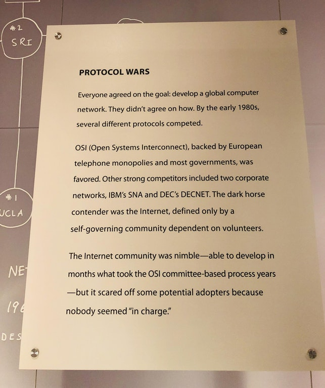

PROTOCOL WARS　协议战争
-------------------

Everyone agreed on the goal: develop a global computer network. They didn't agree on how.By the early 1980s,several different protocols competed.

OSI (Open Systems Interconnect), backed by European telephone monopolies and most governments,
was favored. Other strong competitors included two corporate networks, IBM SNA and DEC DECNET.
The dark horse contender was the Internet, defined only by a self-governing community dependent on volunteers.

The Internet community was nimble － able to develop in months what took the OSI committee-based process years － but it scared off some potential adopters because nobody seemed"in charge".

每个人都认同这个目标:建立全球性计算机网络。但是如何实现，他们意见各不相同。到20世纪80年代初，有几个不同的协议相互竞争。

在欧洲电话垄断和大多数政府的支持下，OSI(开放系统互连)受到青睐。其他强力的竞争对手包括两家公司网络，IBM SNA 和 DEC DECNET。互联网是协议竞争中的黑马，它只由一个依靠志愿者的自治社区来定义。

互联网社区敏捷快速，在几个月内的开发进度，就赶上了OSI委员会数年的进度，但是互联网却吓跑了一些潜在的使用者，因为似乎没有人为之“负责”。

----------------------------------------------------

#### 区块链中文字幕组

致力于前沿区块链知识和信息的传播，为中国融入全球区块链世界贡献一份力量。

如果您懂一些技术、懂一些英文，欢迎加入我们，加微信号:w1791520555。

[点击查看项目GITHUB，及更多的译文...](https://github.com/BlockchainTranslator/EOS)

#### 本文译者简介

荆凯，程序员，相信区块链终将改变潮水的方向．欢迎加微信号:shuke0327，也可以关注公众号: 增长之道

本文由币乎社区（bihu.com）内容支持计划赞助。

版权所有，转载需完整注明以上内容。

----------------------------------------------------
