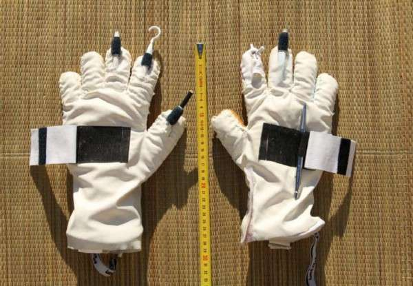
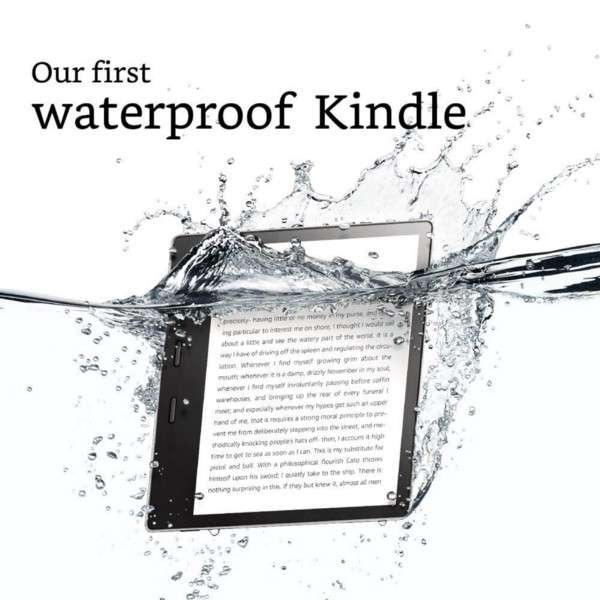
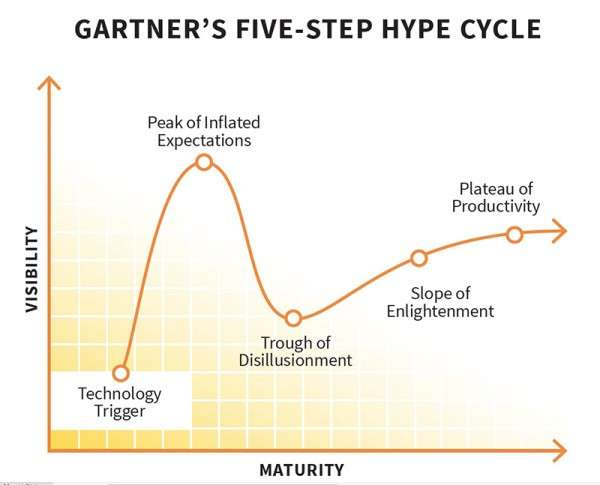

# What Will Bitcoin Look Like in Twenty Years?
# 未来二十年比特币会是什么样？

> 本文翻译自：https://hackernoon.com/what-will-bitcoin-look-like-in-twenty-years-7e75481a798c
>
> 译者：[区块链中文字幕组](https://github.com/BlockchainTranslator/EOS) [shuke0327](https://github.com/shuke0327)
>
> 翻译时间：2017-11-12

----------------------------------------

Prediction is a tricky business.
预测是件棘手的事情。

It’s so easy to be wrong and so hard to be right.But that’s exactly what we’ll do here. **Since we’re rapidly approaching the ten year anniversary of Bitcoin’s whitepaper publication, I’ll attempt to project out twenty years to see the evolution of Bitcoin, blockchain, alternative cryptocurrencies and decentralization.**

很容易犯错，想弄对却很难。
但是，我们现在就要做这事。**因为快接近比特币白皮书发布十周年的纪念日了，我们会尝试预测一下未来二十年内，比特币、区块链、山寨币以及去中心化的进化。**

This is the type of article that will look unbelievably foolish or incredibly brilliant when I’m old and gray.

I don’t care. I’m going for it anyway.

这属于那类文章: 当我白发苍苍垂垂老矣，它看起来要么难以置信的愚蠢，要么不可思议的聪慧。

我不在乎，反正我也要开始写了。

I’m also going to go much, much deeper than “Bitcoin will go to zero” or “Bitcoin will become the reserve currency and be worth $1,000,000”. That’s not really saying all that much and anyone can do it.

与“比特币将会归零”或者“比特币会成为保值货币，价值一百万美元”那类观点相比，我的观点要远远深入得多。那些观点谁都会说，什么都没说。

Instead we’ll look at how the technology will transform and how society will transform with it.

相反，我们将着眼于技术将如何转变，以及社会将如何随之改变。

I’ve got a decent [track record of successfully predicting future trends and technology](https://hackernoon.com/steal-this-idea-and-make-a-billion-dollars-ai-video-game-accelerator-cards-cf5f09fd84e8) but nobody gets it 100% right. Arthur C. Clarke, one of the greatest sci-fi writers of all time, saw the coming of [satellites and GPS](https://gizmodo.com/5597169/arthur-c-clarke-wrote-a-letter-predicting-gps-and-satellite-tv-in-1956), as well as
 [the cloud, the Internet and telecommuting](https://www.wired.com/2013/03/tech-time-warp-arthur-c-clarke/)
but by his own admission he overestimated the importance of rockets and failed to see the importance of a prototype laptop a company gifted to him to write his next novel.

我成功[预测未来趋势和技术的记录良好](https://hackernoon.com/steal-this-idea-and-make-a-billion-dollars-ai-video-game-accelerator-cards-cf5f09fd84e8)，但没有人能做到100%正确。 Arthur C. Clarke，有史以来最伟大的科幻小说家之一，他预见到了[卫星、GPS](https://gizmodo.com/5597169/arthur-c-clarke-wrote-a-letter-predicting-gps-and-satellite-tv-in-1956)的出现，也预测到了[云技术、互联网和远程办公](https://www.wired.com/2013/03/tech-time-warp-arthur-c-clarke/)，但据他自己承认，他高估了火箭的重要性; 一家公司曾经赠送给他一台笔记本电脑原型供他写下一本小说用，他也忽略了这台笔记本原型的重要性。

*Magnum Chaos* represented by [Lorenzo Lotto](https://en.wikipedia.org/wiki/Lorenzo_Lotto "Lorenzo Lotto"), at the [Basilica di Santa Maria Maggiore](https://en.wikipedia.org/wiki/Santa_Maria_Maggiore,_Bergamo "Santa Maria Maggiore, Bergamo") in [Bergamo](https://en.wikipedia.org/wiki/Bergamo "Bergamo").

Chaos theory tells us it’s impossible to predict the future. But that’s not entirely true.

混沌理论告诉我们，预测未来是不可能的。但是这并不全对。

We can never see [black swan events](http://www.investopedia.com/terms/b/blackswan.asp) or completely unexpected technology (try explaining a computer and the Internet to an 18th century farmer) but we can do a kind of [Monte Carlo analysis of tomorrow](https://medium.com/applied-data-science/alphago-zero-explained-in-one-diagram-365f5abf67e0) and see the major pathways spinning out into infinity.

我们永远无法预见到[黑天鹅事件](http://www.investopedia.com/terms/b/blackswan.asp)或完全出乎意料的技术(试着向18世纪的农民解释一下电脑和互联网)，但我们可以对明天做[蒙特卡罗分析](https://medium.com/applied-data-science/alphago-zero-explained-in-one-diagram-365f5abf67e0)，看到通往无限的主要路径。

Few people can do it well.

很少有人能够做好。

In fact, most people get the future laughably wrong so before we leap into our predictions, we need to understand why so we can try to avoid the same mistakes.

事实上，大多数人对未来的预测都错得可笑，所以，在我们开始预测之前，我们需要理解，为什么我们可以尝试避免同样的错误。

## This Internet Thing will Never Work Out 这种叫做因特网的东西永远不会成功

The first reason **people get the future so wrong is because they dedicate about five minutes to looking at something** before they form an opinion on it.

That isn’t thinking.

人们对未来的预测如此错误的第一个原因是，**他们对某件事情形成自己观点之前，只花了五分钟时间去看一看.**

这不是思考。

That’s the [primordial lizard brain](https://www.psychologytoday.com/blog/where-addiction-meets-your-brain/201404/your-lizard-brain)
running a mental heuristic that’s absolutely incapable of understanding anything new and novel. It’s only good at attack, defense, finding food and shelter and avoiding boredom. It’s a survival machine.

这是[原始蜥蜴脑](https://www.psychologytoday.com/blog/where-addiction-meets-your-brain/201404/your-lizard-brain)的启发式运行，完全不能理解任何新事物。它只擅长攻击，防御，觅食，躲避，以及避免无聊。这是一台生存机器。

Unfortunately, many people live almost their entire lives at this level and their opinions are worth zero when it comes to seeing new trends and developments.

不幸的是，很多人几乎一辈子都生活在这个水平上，在看待新的趋势和发展时，他们的观点毫无价值。

**The second major reason people get the future so wrong is it goes against everything they understand about the world.**Think about a company like [Kodak who simply refused to see the power of digital film](http://mashable.com/2012/01/20/kodak-digital-missteps/#nAgI.6uueiq7)because they’d built up a business over a hundred years on the back of chemical film. They had every advantage and they blew it. They mistook the past for the future and they paid a heavy price by going bankrupt as the market roared past them.

**人们对未来的预测如此错误的第二个主要原因是，是它违背了他们对这个世界所了解的一切**。想想[柯达(Kodak)这样的公司](http://mashable.com/2012/01/20/kodak-digital-missteps/#nAgI.6uueiq7)，他们就是拒绝去看到数码影像的力量，因为他们以化学影像为支撑建立起的商业超过百年。他们有充足的优势却搞砸了。他们错把过去当作未来，而当市场从他们身边呼啸而过时，他们付出了沉重的代价。

**To see the future you have to be able to step outside of yourself, forget your past successes and see beyond your current understanding.**

**要看到未来，你必须超越自我，忘掉过去的成功，超越你当下的理解。**

A third major reason **people fail to see the future is because it challenges their position of power.**That’s why [oligarch banker,Jamie Dimon](https://www.cnbc.com/2017/09/12/jpmorgan-ceo-jamie-dimon-raises-flag-on-trading-revenue-sees-20-percent-fall-for-the-third-quarter.html), and a [prince from a country that just allowed women to drive last month](https://stepfeed.com/saudi-prince-alwaleed-suggests-bitcoin-is-a-fraud-9965), all see Bitcoin and cryptocurrencies as a “fraud” or a “scam”.

人们看不到未来的第三个主要原因是**它挑战了他们的权力地位**。这就是为什么[寡头银行家 Jamie Dimon](https://www.cnbc.com/2017/09/12/jpmorgan-ceo-jamie-dimon-raises-flag-on-trading-revenue-sees-20-percent-fall-for-the-third-quarter.html) 以及[一位国家的王子（这个国家上月刚刚准许女性开车）](https://stepfeed.com/saudi-prince-alwaleed-suggests-bitcoin-is-a-fraud-9965)，都把比特币和加密货币视作“欺诈”或“骗局”。

They literally can’t see clearly because they’re the main beneficiaries of the current system. They don’t want to see. So they engage in a kind of information warfare, even if it’s unconscious. It’s nothing but a mental defense mechanism. The rise of new ways of running the world means their position is under fire and they’re terrified.

他们确实看不清楚，因为他们是当前体系的主要受益者。他们不想看到。所以他们参与了一种信息战，即使他们是无意识参与的。这只不过是一种心理防御机制。世界运行新方式的崛起意味着他们的地位受到了挑战，这令他们恐惧。

**Asking these people about Bitcoin is like asking a taxi driver what he thinks about Uber or a horse and buggy manufacturer what he thinks about cars. Their opinions are _worth less than nothing._**

**问这些人关于比特币的问题，就像问出租车司机对优步的看法，或者问马厂老板和马车制造商对汽车的看法一样。他们的意见_一点价值都没有_。**

The fourth major reason **people screw up predictions is because they mistake their opinion for reality.** There’s what you think about the world and there’s actual reality and they’re often not the same thing. One is the map and one is the territory. Don’t mistake the map for the territory.

人们搞砸预测的第四个主要原因是**他们把自己的观点误认为是现实**。你对世界的看法，和现实情况往往不是同一件事。一个是地图，一个是领土。不要把地图误当作领土。

Take this now[**infamous article by Clifford Stoll from Newsweek in 1995 that declared the Internet a total failure**](https://thenextweb.com/shareables/2010/02/27/newsweek-1995-buy-books-newspapers-straight-intenet-uh/) poised for imminent collapse. Stoll writes:

> “Visionaries see a future of telecommuting workers, interactive libraries and multimedia classrooms. They speak of electronic town meetings and virtual communities. Commerce and business will shift from offices and malls to networks and modems. And the freedom of digital networks will make government more democratic.
>  
>
> **Baloney**.” [Emphasis mine.]

1995年《新闻周刊》(Newsweek)的克利福德·斯托尔(Clifford Stoll)撰写的一篇声名狼藉的文章中，宣称互联网完全失败，即将崩溃。斯托尔写道: “

> 空想者看到了远程办公、互动图书馆和多媒体教室的未来。他们谈论电子城镇会议和虚拟社区。贸易和商业将从办公室和购物中心转移到网络和调制解调器中。数字网络的自由将使政府更加民主。
>
>
>**一派胡言**”【粗字的强调是我加的】

(Clifford Stoll: I see nothing but the shadow of my opinions in Plato’s cave.

Clifford Stoll: 我只看到了我自己在柏拉图洞穴中的观念的影子，除此之外，我一无所见。)

Reading that quote it’s impossible not to grin ear to ear as feelings of tremendous superiority wash over you. What an idiot! Who didn’t see the Internet coming?

读到这段话，你当然会笑得合不拢嘴，因为巨大的优越感会将你漫过。真白痴! 谁会看不到互联网的到来?

Answer: Almost nobody.

答案是：几乎没人做到。

Hindsight is 20/20.

事后诸葛亮当然会全答对.

I’m betting almost everyone busting up laughing at the poor guy didn’t see it coming either, if they even knew what the Internet was in the first place. If they did they almost certainly didn’t see a working Wikipedia, the rise of telecommuting and a day when they would buy everything from books to groceries through Amazon.

我敢打赌，几乎所有嘲笑那个可怜家伙的人，如果他们一开始就知道互联网是什么，他们也不会预见到它的到来。如果他们真的知道，几乎可以肯定他们不会预见到一个维基百科的出现，不会预见到远程办公的兴起，并且有一天，他们还可以通过亚马逊(Amazon)购买从书到日常杂货的所有东西。

Actually what’s most striking about the above quote  **_is not how inaccurate it is_**, but **_how accurate it is_** on so many levels.

事实上，上面所引述的那段话中最引人注目的，**_不是它有多么错误_**，而是**_它在如此多的层次上竟然多么精确_**。

That’s right.

没错。

Read the article and you’ll see tons of his predictions are incredibly spot on!

读读这篇文章，你会看到他的很多预测是多么难以置信的准确!

If you go back and strip out all Stoll’s opinions what emerges is an amazingly clear picture of the next two decades of the net. Check it out:

如果你回过头去去掉Stoll的所有观点，你会看到关于网络的接下来二十年的一个非常清晰的画面。查看一下:

> “Nicholas Negroponte, director of the MIT Media Lab, predicts that we’ll soon buy books and newspapers straight over the Internet.”
>
>“ MIT 媒体实验室主任 Nicholas Negroponte 预言，我们很快就会在互联网上直接购买书籍和报纸。”

I yanked two words: “Uh, sure.” His opinion.

我蹦出两个字:“呃，当然。” 他的看法。

** Stoll saw the future, he just refused to see it.** If he managed to get out of his own way and **_just observe instead of interpreting and filtering what he saw,_** the article would have gone down in history as one of the most forward thinking and accurate ever written. That brings us to our next reason.

斯托尔看到了未来，他只是拒绝去看。如果他设法摆脱自己的方式，**_只是观察而不是解释和过滤他所看到的_**，那么这篇文章将会载入史册，成为有史以来最前卫、最准确的文章之一。这就引出了我们的下一个原因。

The fifth reason **people get the future wrong is a complete and total lack of patience.**

人们把未来弄错的第五个原因**是完全缺乏耐心**。

Take the opening line of Stoll’s article:

> “After two decades online, I’m perplexed.”

Stoll 的文章开头写道:

> “在网上20年之后，我感到困惑。”

Stoll had already lived with the Internet for twenty years but it just wasn’t coming together for him. It’s easy to think it’s never going to happen when that much time goes by.

斯托尔已经与互联网共同生活了20年，但它(那些新的发明)就是没有向他走来。人们很容易认为，既然那么多的时间都过去了， 它将永远不会发生。

The waiting is the hardest part. It takes patience to let things develop naturally.

**Patience. Patience. Patience.**

等待是最艰难的部分。让事情自然发展需要耐心。

**耐心，耐心，耐心。**

Creativity requires setbacks and failures and tremendous tenacity. Once you expose your idea to the reality of rust, gravity and friction, things tend to fall apart. No plan survives contact with the enemy. Reality is a whetstone that either shatters you or sharpens your ideas.

创造力需要经历挫折、失败，需要巨大的毅力。一旦你把你的想法暴露在充斥着铁锈、重力和摩擦的现实中，事情往往会分崩离析。跟敌人接触后没有计划能存活下来。现实是一块磨石，要么将你粉碎，要么让你的想法更清晰。

**Things take time. 事情发生需要时间。**

A classic example of the real creative process and how long it takes comes from [George de Mestral, the inventor of Velcro](https://en.wikipedia.org/wiki/George_de_Mestral).

关于真实的创新过程以及所需要花费的时间，一个典型的案例来自[Velcro(维可牢魔术贴)的发明者 George de Mestral]((https://en.wikipedia.org/wiki/George_de_Mestral))。

He first came up with the idea in 1941, after taking his dog for a walk in the woods and seeing a bunch of burrs attached to his fur. The concept didn’t fully take root in his mind for another seven years. He started working on recreating the tiny hooks in 1948 and it took him ten years to make it work and mass produce it.

他第一次想到这个主意是在1941年，他带着狗在树林里散步，看到一束毛刺附在狗的皮毛上。这一概念用了七年时间才在他的头脑中完全扎根。1948年，他开始着手重建小钩子，花了他10年的时间，让它能工作并大规模生产。

After that he opened his company in the late 1950s, he expected immediate high demand.

It didn’t happen.

在20世纪50年代末，他开办了自己的公司，他预计很快就会有高需求。
这却没有发生。

It took _another five years_ before the budding space program in the 1960’s saw Velcro as a way to solve the problem of getting astronauts in and out of bulky and unwieldy space suits. The rest _of the world only cares about the problems things solve for them_ not the idea or ideology behind it. Soon after the ski industry noticed it would work on boots.

_又过了5年_，在1960年的太空计划中，Velcro成为了一种解决宇航员穿着笨重的宇航服进出宇航仓的方法。世界上的其他国家_只关心怎么解决问题_，而不是它背后的思想或意识形态。不久之后，滑雪行业就注意到它将在靴子上发挥的作用。

All in all from initial idea to functioning, profitable business?

从最初的想法到可运行能盈利的生意，总共花费了多长时间？

About twenty five years.
大约二十五年。

Lastly, we can take one more lesson from Stoll before I launch into my predictions for crypto.

最后，在我发表对crypto的预测之前，还有另一个教训我们可以从斯托尔那里得到。

**His biggest mistake is the sixth and final reason people are blind to the future. He took current inventions, air lifted them forward and imagined them as the solution to future problems. Wrong!**

**他的最大错误，是人们看不到未来的第六个也是最后一个原因。他接受了当前的发明，把它们高高举起，并将它们想象成未来问题的解决方案。错了!**

Current inventions solve current problems. Future problems will take brand new solutions.
In the article Stoll mentions that CD books would never replace real books. He was right that reading books on CD with a crappy CRT monitor that rips apart your retinas was a miserable experience. **But understanding that helps us understand the necessary characteristics of a future solution.**

当前的发明解决当前的问题。未来的问题将需要全新的解决方案。
在 Stoll 的文章中提到，CD书永远不会取代真实的书。在一台糟糕到要把你的视网膜“撕裂”的显示器上阅读CD上的书，是一种痛苦的经历，在这一点上他是对的。**但理解它有助于我们理解未来解决方案的必要特征。**

**It’s nearly impossible to know what form those solutions will take, but we can figure out what traits the solution will have** so we can recognize it when it gets here.

**几乎没可能知道这些解决方案会是什么样的形式，但是我们可以找出来解决方案的特征，**当它出现时候我们就能够辨认出来。

Let’s see how it works:

让我们看下运作的原理：

CDs are clunky. Monitors back then were blurry and hard to read. They hurt the eyes. Computers were huge and not very portable. Even laptops were bricks that burned your legs that nobody would want to read a damn thing on.

CD 挺笨重。当时的监视器还很模糊，很难阅读，损害眼睛。庞大的计算机难以携带。即使是笔记本电脑也像砖头一样，会让你的腿烧坏，没人会想在上面读什么该死的东西。

But he also missed the shortcomings of books.

但是他也忽略了书籍的缺陷。

Books are heavy too. They’re made of trees! And they can easily get lost or damaged by the elements. You can only carry so many before you’re carrying a huge weight around.

书籍同样很重，它们是用树做的！它们很容易丢失或损坏。 你能携带的书籍数量有限，不然就要带着太重的东西到处走了。

From there we can see that a good solution would be:

从上面的思考里面，我们可以知道一个良好的解决方案会：

- Super-portable and lightweight.
- Have a crystal clear display.
- Hides the data storage completely from the user.
- As easy to use as a book. Just open and read.
- Protect the data so if we lose it or damage it, we can recover it without needing to buy it again.
- Allow you to carry lots of books at once.

- 超级便携，重量很轻。
- 有一个水晶般清晰的显示器。
- 将数据存储完全对用户隐藏。
- 像书籍一样易于使用。打开即读。
- 可以保护数据，如果我们丢失或损坏了数据，我们不需要重新购买就能够恢复。
- 让你可以一次携带很多书籍。

(The Kindle improved reading and now it’s even waterproof which makes it better than traditional books. New solutions must offer the same feature set plus new and improved features to really take off.Of course we know the answer now: the Kindle and the iPad.

Kindle改善了阅读，现在它甚至可以防水了，这让它比传统书籍更好。新的解决方案必须提供相同的特性，以及新的和改进的特性来让它真正流行。当然，我们现在知道答案了:Kindle和iPad。)

Both have tremendous ease of use, hide the storage media from the user completely, protect the data by backing it up and they’re easy on the eyes.

两者都有很好的易用性，存储介质对用户完全隐藏，通过备份数据来保护数据，而且它们让眼睛很轻松就可以去阅读。

**Solutions start by pointing out what’s wrong, asking the right questions about how to fix it and correctly defining what properties we would need to have a better experience.**

**解决方案源于指出什么是错误的，询问正确的问题－如何解决错误，并正确定义为了更好的体验我们所需要的特性。**

From the above, we have three principles to help us predict the future:

从上文可以知道，我们有三个原则来帮助我们预测未来:

**1 Patience.**

**2 Observe, don’t interpret.**

**3 Don’t graft today’s solutions onto tomorrow’s problems.**

**1 耐心。**

** 2 观察,不解释。**

**3 不要把今天的解决方案移植到明天的问题上。**

All right, let’s break out the crystal ball and peer into the fate of Bitcoin and crypto.

Hopefully we’ll have better luck than Stoll and this article won’t get trotted out by tomorrow’s Boing Boing replacement to call me an idiot.

好了，让我们打开水晶球，窥视比特币和加密货币的命运。
希望我们的运气比 Stoll 好一些，这篇文章不会被明天的作者（直译: Boing Boing 博客的取代者)拎出来，叫我白痴。

## The Rise of Bitcoin, Crypto and Decentralization 比特币、加密和去中心化的兴起

We’ll start with a few easy predictions and move on to some more complex and far reaching ones as well as some seriously controversial ones.

我们将从一些简单的预测开始，然后转向一些更复杂、更深入的预测，以及一些非常有争议的问题。

I’ll also include a confidence meter to let you know how strongly I feel about the scenario playing out.

我还会引入一个信心测量仪，好让你知道我对这一场景的感受有多强烈。

### 1) The Bubble Bursts 泡沫破裂

**People in and out of crypto see them as bubble that will pop, causing prices to crash badly.**

**They’re right.**

**But so what?**

**That’s not the end of the story. It’s just the beginning.**

**进进出出加密货币的人将其视为会破裂的泡沫，从而导致价格暴跌。**

**他们是对的。**

**但是又怎么样呢？ 这不是故事的结局，而只是开头而已。**

Right now we’re in the grips of tremendous euphoria. There’s so much potential. We can practically taste the decentralized future. It’s just around the corner! Any day now.

现在我们正处于极度亢奋之中。有这么多的潜力。我们几乎可以嗅到去中心化的未来。它就在拐角处! 当下的任何一天它都可能出现。

Of course, that’s almost certainly not how it will work out.

 **The bubble will pop.** [**Vitalik is right. 90% of tokens will fail**](https://coinjournal.net/vitalik-buterin-90-icos-will-fail/)**.**

 当然，这几乎肯定不是它的运作方式。**泡沫会破裂。**

 [**Vitalik是正确的，90%的代币将会失败**](https://coinjournal.net/vitalik-buterin-90-icos-will-fail/)**.**

But after the pop comes the real working ideas.

但真正有用的想法会出现在泡沫破裂之后。

**Eight years into the crypto experiment, everyone is working on the railroad tracks of the future but we don’t have much to show for it other than speculative trading and some smart contracts.** The apps are hideous and practically unusable. It’s nerve wracking when you push “send” and blast $5000 across the web to someone. Better hope you copy and pasted that address right so your money doesn’t disappear into the void!

在八年的加密技术实验中，每个人都在研究未来的轨道，但是除了投机交易和一些智能合约之外，我们并没有多少可以展示的。
这些应用程序丑陋不堪，几乎无法使用。当你点击“发送”按钮把5000美元从网上转给别人时，会觉得胆战心惊。最好希望你复制粘贴的地址是对的，这样你的钱才不会凭空消失!

When the Internet bubble burst many of today’s marquee companies saw their stocks crash 85%. Yet they survived and the best was yet to come. Amazon and Google went on to dominate the world.

当互联网泡沫破灭时，如今许多大公司的股价暴跌了85%。然而它们活了下来，最好的还没有到来。亚马逊和谷歌继续称霸世界。

**The same will happen in crypto.**

**加密货币会同样如此。**

**The 10% of projects that make it through the bloodbath will turn into the Amazon, Google and Facebook of tomorrow and likely even the JP Morgan and Goldman Sachs as well, not to mention maybe even the governments of the future, like digital direct democracies or liquid democracies.**

**在血腥竞争之中存活下来的10%的项目，将会变成未来的亚马逊(Amazon)、谷歌和Facebook，甚至可能是摩根大通(JP Morgan)和高盛(Goldman Sachs)，更不用说甚至未来的政体形式了，比如说可能是数字直接民主或者流动民主（digital direct democracies or liquid democracies）。**

Innovation is hard work. You’re literally trying to create something that doesn’t exist!

创新是项艰难的工作。你是想创造一些不存在的东西!

There are no guidelines, no working templates, no business models to clone. There’s nothing. You’re on your own! It’s just you and your imagination. With those odds of course 90% of people and companies fail!

没有指导方针，没有工作模板，没有可供克隆的商业模式。什么都没有。你完全要靠自己! 只有你和你的想象力。当然，90%的人和公司都失败了!

It doesn’t matter.

[**Crypto, blockchain and triple entry accounting are probably the most important invention of the last 500 years**](https://hackernoon.com/why-everyone-missed-the-most-important-invention-in-the-last-500-years-c90b0151c169) **so they’re not going to go gently into that good night.**

没关系。

[**加密技术，区块链和三式会计可能是过去500年里最重要的发明**]((https://hackernoon.com/why-everyone-missed-the-most-important-invention-in-the-last-500-years-c90b0151c169) )，**所以它们不会温和地走入那个良夜( go gently into that good night.)。**

The bubble burst is just the next step. Three years after that the tech will really mature and take off running.

泡沫破裂只是下一步。三年后，技术会真正成熟并开始运作。

### 2) Government Cryptocurrencies will Flourish 政府主导的加密货币会蓬勃发展

The community won’t like this one, but it’s a no brainer.
社区不会喜欢这一条，但这是显而易见的。

Many governments will not sit by and lose control of the money supply without a vicious fight. Anyone working on a project right now should be anticipating protocol level assaults on decentralized cryptos and designing defenses against them.

很多政府不会坐视不管，不会不经激烈的斗争就失去对货币供应的控制。现在每个做（加密货币）项目的人，都应该预见到对去中心化加密技术的协议级别的攻击，并对其进行设计防御。

A distributed, decentralized DDoS stopping grid, like the one from **[Gladius](http://gladius.io/)** is a great first step but there is a lot more work to be done. We’ll talk about some additional defenses cryptos needs to survive later when I come to the evolution of protocols.

一个分布式的，去中心化的DDoS停止网格，就像**[Gladius](http://gladius.io/)**的那样，是伟大的第一步，但是还有很多工作要做。后面我提到协议进化的时候会讲到，加密技术存活下来所需要的一些额外的防御方式。

Governments will lose the battle in the long run, probably in thirty to one hundred years (maybe faster depending on how many wars or financial crises strike). That’s provided we survive as a race, don’t nuke ourselves, and push out into space. But in ten or twenty years expect very strong government cryptocurrencies to come to power and dominate the flow of money for many, if not most, people around the world.

从长远来看，可能在30到100年之间政府将会输掉这场战争(可能会更快，这取决于会爆发多少次战争或金融危机)。这就是我们作为一个种族生存下来的前提条件，不要被我们自己核武器炸飞到太空中去。但在未来10年或20年的预期中，会有非常强大的政府加密货币来掌权，并支配着世界上许多人(如果不是大多数的话)的资金流动。

“But no one will adopt them!” scream the crypto faithful!
“但是没有人会采用它们!” 加密货币的信徒喊着！

Of course, they will.
不，人们会使用的。

The average person has zero understanding of just about anything that actually matters and they absolutely don’t see a need for privacy and security until it’s physically ripped away from them under extreme circumstances like a war. When soldiers invade your house and take everything you own suddenly the need for privacy becomes very real to people.

普通人对任何重要的事情都毫不理解，在战争这类极端情况下被剥夺之前，他们完全看不到对隐私和安全的需要。当士兵们入侵你的房子，突然把你所有的一切都拿走时，人们对隐私的需求才会变得非常真实。

Remember this interview with Snowden about government surveillance on the John Oliver show?

还记得斯诺登关于政府监视 John Oliver show的采访吗?

Watch the look on Snowden’s face when he realizes that the average man on the street doesn’t know a damn thing about privacy and doesn’t care about it in the least! The only time they care is when the government has a picture of their dick on file. Seriously.

当斯诺登意识到街上的普通人根本不知道什么是隐私，也一点都不在乎时候，看看他的表情。认真地说，只有当政府文件中有他们的不雅照时候，他们才在乎。

People will adopt government cryptos like good little sheep without a second thought. Even better, they’ll think it’s absolutely the right thing to do and they’ll even be willing to kill for it if told that’s right. Count on it!

人们会像善良的小绵羊一样，毫不犹豫地接受政府的加密货币。如果被告知这是正确的，他们会认为这是绝对正确的事情，甚至愿意为之而杀戮。当然这样!

Of course, in many ways government issued cryptocurrencies are utterly ridiculous, as Naval Ravikant points out in his epic blockchain tweetstorm:

> 32/ It's nonsensical to have a blockchain controlled by a sovereign, a corporation, an elite, or a mob.
>
>—[ @naval](https://twitter.com/naval/status/877470766249369601)

当然，在许多方面政府发行加密货币都是非常荒谬的，正如 Naval Ravikant 在他的史诗区块链(epic blockchain) tweetstorm 中指出的那样:

> 32/ 一个由主权国家、公司、精英或暴徒控制的区块链是荒谬的.
>
> —[ @naval](https://twitter.com/naval/status/877470766249369601)

**They’re nonsense because the very purpose of blockchain is to distribute power across a system.** By not allowing a single group to control or change the rules arbitrarily, **decentralized cryptos and apps provide a powerful set of checks and balances against harmful actions to the system.**

**它们毫无意义，因为区块链的目的是在系统中重新分配权力。**通过禁止某个小群体控制或任意改变规则，**去中心化的加密货币和应用程序提供了一套有力的制衡机制来应对对系统有害的行为。**

When five different banks own a blockchain, that’s not a blockchain, that’s a database. Only when the banks, the regulators, the shareholders and the customers of the bank hold the keys to the blockchain at the same time and can counteract each other’s power is it a true blockchain.

**The checks and balances on power are exactly the point!**

当区块链由五个不同的银行所拥有时，这不是区块链，这是数据库。只有当银行、监管机构、股东和银行的客户同时持有区块链的密钥时，才能抵消彼此的力量，这才是真正的区块链。

**权力制衡正是关键!**

Government crypto will represent a total and complete corruption of that idea.

But it won’t matter. They’ll do it any way.

政府加密货币的出现，意味着着上述理念的彻头彻尾的腐败。但这不关键，不管怎样他们还是会去做这件事。

In fact, instead of distributing power, they’ll look to concentrate even more power, by giving themselves the ability to track every single citizen’s spending with impunity and automatically collect taxes from wages and sales of goods and services. That’s why authoritarian governments are racing to build official state cryptos. **They can’t wait to have panopticon money in your pocket as soon as possible.**

事实上，他们不是要分配权力，他们是要攫取更多的权力，他们要让自己有能力跟踪每一位公民的消费而不受惩罚，他们想要自动从工资和商品和服务的销售中收取税收。这就是为什么威权政府正在竞相建造官方的加密货币。**他们迫不及待地想在你的口袋里装上圆形监狱货币(panopticon money)。**

They will absolutely outlaw physical cash and they will do it under the guise of one of three excuses:

- Stopping money laundering
- Stopping terrorists
- Stopping crime

Of course, knowing that you spend half your paycheck on Amazon, groceries and rent has nothing to do with any of those things but hey, if you trot out any or all of the above reasons you can easily get half the population to do whatever you want and even better they’ll believe it with all their hearts.

他们绝对会将实物现金作为非法手段，他们会用如下三个借口来做伪装:

- 防止洗钱
- 组织恐怖分子
- 防止犯罪

当然,知道你花一半的薪水在亚马逊,食品和房租,所有这些都与上述理由无关，但是，嘿, 如果你大肆宣扬上述原因的任何一个或者全部，你可以很容易地让一半人口去做任何你想让他们做的事情, 甚至更好的情况下，他们会全心全意地相信。

Remember American psychologist [Gustave Gilbert’s talk with Nazi Herman Goring during the Nuremberg trials](https://en.wikiquote.org/wiki/Hermann_G%C3%B6ring)? Goring told him that most people will go along with whatever their leaders tell them to do without question, whether it’s a democracy or fascist dictatorship.

还记得美国心理学家 古斯塔夫·吉尔伯特（Gustave Gilbert）在[纽伦堡审判中与纳粹赫尔曼·戈林的谈话](https://en.wikiquote.org/wiki/Hermann_G%C3%B6ring)吗? 戈林告诉他，不管是在民主政体还是法西斯专政下，大多数人无论他们的领导人让他们去做任何事情，他们都会毫不怀疑地去做。

Naively, Gilber replied, “There is one difference. In a democracy, the people have some say in the matter through their elected representatives, and in the United States only Congress can declare wars.”

吉伯天真地回答: “ 有个区别。在民主国家，人们通过他们选出的代表来表达意见，在美国，只有国会才可以宣战。”

But Goring only laughed and said, “Oh, that is all well and good, but, voice or no voice, the people can always be brought to the bidding of the leaders. That is easy. All you have to do is tell them they are being attacked and denounce the pacifists for lack of patriotism and exposing the country to danger. It works the same way in any country.”

但戈林只是笑着说:“哦，这一切都很好，但是，不论人们是否发声，总能够让他们按照领导的命令做事( the people can always be brought to the bidding of the leaders. )。这很容易。你所要做的就是告诉他们，他们正在遭受攻击，并谴责和平主义者缺乏爱国精神，并将国家暴露在危险之中。在任何国家，这一招都奏效。"

Government cryptos will be a very, very bitter pill to swallow for current true believers in the crypto space but they better get used to them.

政府的加密货币将是一粒非常非常苦的药丸，当前加密货币空间里的真正信徒很难吞下，但他们最好习惯于此。

A better bet is to assume there’ll be hybrid systems of decentralized and centralized crypto and to design for it right now to avoid getting swallowed in the tsunami to come. Better to embrace the current system with blockchain and then overwhelm it from within rather than ignore it so that it becomes hostile.

一个更好的选择是假设将会有去中心化和中心化加密技术的混合系统，并现在就为此设计设计，以避免在海啸中被吞噬。最好是用区块链拥抱当前的系统，然后从内部击败它，而不是忽略它，让它变得敌对。

## 3) Decentralized Cryptocurrencies Will Become a Parallel Economic Operating System for the Planet

## 3) 去中心化的加密货币将成为地球上并行的经济操作系统

Just because centralized cryptos rise to prominence doesn’t mean the decentralized cryptos will go away. Oh, many governments will try, but in the end they’ll fail to stamp them out. The reasons are simple.

中心化加密货币兴起，并不会意味着去中心化的加密货币就得因此消失。许多政府都会尝试，但最终他们会失败。原因很简单。

**The same factors that make it hard to form consensus across a blockchain, make it hard for all the world’s governments to agree on anything.** They won’t be able to do it. Some governments will love decentralization and others will hate it.

**同样的因素，使得人们很难在区块链达成共识，也使得世界各国政府很难在任何事情上达成一致。** 他们不可能做到。有些政府喜欢去中心化，而有些政府则憎恨去中心化。

Even as some countries openly rail against them, many others will **openly embrace decentralized cryptocurrencies, especially the ones who suffered the worst under the dominance of Europe and the US dollar over the last century.**

虽然一些国家公开抨击去中心化，但是另外许多国家**却公开地接受去中心化的加密货币，尤其是那些在过去一个世纪中严重受制于欧洲和美元统治地位的国家。**

I see the Latin American countries, freewheeling no-holds-barred globalists like Singapore, historical bankers-to-the-world Switzerland and many of the Asian and African countries welcoming decentralized crypto with open arms, if only to stick it to the current empires.

我看到了拉丁美洲国家，自由放任的全球主义者如新加坡，有世界银行历史的瑞士，以及许多亚洲和非洲国家，他们张开双臂欢迎去中心化加密货币，如果能够坚持它，直到成为现在的（经济）帝国就好了。

If all the countries don’t agree, then decentralized cryptos are never going away, even as centralized cryptos come to power.

如果所有国家不能达成一致，就算中心化的加密货币上台，去中心化的加密货币也永远不会消失。

But to remain relevant, decentralized cryptos need to move fast. **They need a killer app**. Right now they’re vulnerable to attack. **To really take root they need that killer app to spread virally across the globe.** It’s got to be something so indispensable that people can’t imagine their lives without it. This will bring existing power players into the system and they will then use that power to defend it against attacks from outside powers.

但为了保持相关性，去中心化的加密货币需要快速行动。**它们需要一个杀手级应用。** 现在它们很容易受到攻击。**为了真正扎根，它们需要一个杀手级的应用在全球范围内广泛传播。**这个应用必须是不可缺少的，人们无法想象没有它能怎么生活。这将把现有的强势参与者带入到系统中，他们将使用这种权力，抵御来自外部势力的攻击。

I outlined one of the ways that can happen in my article for **[gamifying the distribution of money](https://hackernoon.com/gamifying-the-delivery-of-money-c55c25cecaee)**. But that’s just one way it can play out. There are many, many more. If you’re working on a platform now, know that it’s a race against time before central cryptos take root.

在我的文章中我概述了**[将货币分配游戏化的一种方法(gamifying the distribution of money)](https://hackernoon.com/gamifying-the-delivery-of-money-c55c25cecaee)**。但这只是它能发挥作用的一种方式。还有很多很多其他方式。如果你现在在一个平台上工作，知道这是一场在中心化的加密货币扎根之前，与时间的赛跑。

### 4) The Killer App for Crypto is NOT a Browser 加密技术的杀手级应用不是浏览器

This is a classic example of grafting old inventions onto a new system. The [**Brave Browser**][1]is awesome and I bet I’ll really love it as it gets paired with [**BAT**][2]and/or a **universal payment system that **[**automatically swaps cryptocurrencies**][3]without the need for an exchange but I don’t see it as the final interface to the blockchain. I see it as a potential intermediate step.

[1]:https://brave.com/
[2]:https://basicattentiontoken.org/
[3]:https://themerkle.com/what-is-an-atomic-swap/

这是将旧发明嫁接在新系统上的经典范例。[**Brave 浏览器**][1]很棒，我打赌我一定会喜欢它，因为它会搭配 [**BAT**][2] 和/或一个通用支付系统，不需要交易所就可以[**自动交易加密货币**][3]，但我不认为它是区块链的最终界面。我将它视作是潜在的中间步骤。

So what does the killer app look like?
I don’t know.
But I know it is:

- **Ubiquitous**
- **Easy to use**
- Acts as a **platform** for everything from changing money to getting tickets to protecting privacy and information.
- **Open source**

那么，杀手应用程序是什么样的呢?
我不知道。
但我知道它会有这些特性:

- **无处不在**
- **易于使用**
- 作为一个万物交易的**平台**，从货币交换，到获取门票，并保护隐私和信息。
- **开源**

It’s also something totally new and original that expands and extends the best characteristics of the blockchain while minimizing its greatest weaknesses.

它也是一种全新的、新颖的东西，扩展区块链的最佳特性，同时将区块链最大的弱点降到最少。

Maybe a decentralized AI assistant or attention filter? The possibilities are endless so get moving!

也许是一个分散的人工智能助手或注意力过滤器? 有无限可能，所以行动起来吧!

### 5) Blockchain is Just the Beginning of Decentralized Consensus 区块链只是去中心化共识的开始

Blockchain systems are only the first successful implementation of decentralized consensus mechanisms.

区块链系统只是去中心化共识机制的第一次成功实现。

People are already inventing new ones like [IOTA’s Tangle](https://iota.org/) and the [HashGraph](http://hashgraph.com/)

It doesn’t really matter if both of those projects prove failures in the long run because some other project will create another method. This is virtually guaranteed.

人们已经有了新的发明, 像[IOTA的 Tangle](https://iota.org/) 和 [HashGraph](http://hashgraph.com/) 。
即使从长期来看这两个项目都失败了，也没什么关系， 因为其他的项目会创建另一种方法。这是肯定的。

Over the next twenty years, I predict dozens, of experimental distributed consensus protocols, capable of transaction levels that blow away Visa level processing, augmented by artificial intelligence systems.

It’s also strongly possible that none of these systems will be designed by humans.

Instead AI’s will rapidly iterate on ideas and come up with systems that no human ever could if they had a hundred years. They’ll draw their inspiration from nature and systems of insects or roots or other biological systems like proteins.

在接下来的20年里，我预测会有数十个实验分布一致的协议出现（如果不是几百个的话），能够处理 Visa 级别的交易水平，通过人工智能系统来增强。

很有可能所有这些系统都不会由人类来设计。相反，人工智能将迅速地迭代想法，并创造一个系统，即便人类用百年的时间，都无法创造出来。它们将从昆虫、树根或其他生物系统(如蛋白质)中汲取灵感。

One or two of these systems will come to dominate all coins and become the meta-system to rule them all, uniting many different kinds of coins and running the entire system like a massive fractal that enables countless daughter networks to flourish inside of it.

其中一两个系统将主宰所有的货币，成为统治所有货币的元系统，将许多不同种类的货币统一起来，让系统像一个巨大的分形一样运行，让无数的子网络在其中蓬勃发展。

### 6) Crypto Will Get a LOT Easier to Use 加密货币会变得非常易用

Today’s user experience in crypto is awful.
If I mistype something or copy and paste wrong, my money disappears forever. If there’s a software glitch I lose my money forever. If someone hacks my computer or phone my money is gone forever.

今天加密货币的用户体验很糟糕。
如果我打错字或者复制黏贴错误，我的钱就永远消失了。如果出现软件故障，我的钱就永远消失了。如果有人攻击我的电脑或手机，我的钱就永远消失了。

See a trend there? Make any mistake you’re toast. It’s like driving a motorcycle on the edge of a one inch mountain road with no rail.

看到了么? 犯了任何错误，你就完了。这就像在一条只有一英寸窄的山路边缘开摩托车，还没有栏杆。

The core wallets are slow, hard to use and ugly. When I last upgraded Ethereum, it forgot to keep my private keys so I had to go restore them all. Earlier this year I had an old Bitcoin stuck in an ancient version of Multibit from 2013. It took me a week to free it after the software mistakenly thought I had sent a transaction that was never actually broadcast.

核心钱包速度慢，难用，又丑陋。我上一次升级 Ethereum 时，它忘记了保留我的私钥，所以我必须全部恢复。今年早些时候，我有一个旧比特币，它被卡在了2013年的一个老古董版本中。我花了一个星期的时间才把它解锁，因为软件错误地认为我发送了一个从来没有广播过的交易。

Imagine these wallets going into cold storage and coming out five years later. Will they even be usable? What happens when quantum computers come out and we need to completely update the basic protocols that underscore the system?

想象一下这些钱包放在冷存储中，五年后再放出来。它们还能用吗? 当量子计算机问世，我们需要彻底更新支撑系统的基础协议时，会发生什么?

The average person will never be able to do these procedures. Zero chance. Two decades in IT taught me that people can and will screw up their machines in ways that are utterly unimaginable to tech people. Murphy’s Law rules.

普通人 会永远无法完成这些程序。一点机会都没有。过去的二十年在IT 行业的经验告诉我，人们可以也会以一种技术人员完全无法想象的方式来搞砸他们的机器。墨菲定律起着作用。

Even worse, there’s no way to reverse any transaction or to secure it against mistakes. I foresee many algorithmic methods to freeze, roll back and protect transactions, as well as ways to self-escrow money and recover stolen money. Think of them as automated versions of calling the bank and declaring a card stolen.

更糟糕的是，没有办法逆转任何交易，也没有办法防止错误发生。我预见到会有许多算法的方法实现冻结、回滚和保护交易，以及自托管资金和恢复被盗资金的方法。把它们看作是打电话告知银行信用卡被盗这一过程的一个自动化的版本。

**Only systems that provide all the features of the old system plus brand new features achieve mass adoption.**

**只有能够提供旧系统的所有特性并具有全新特性的系统，才能被大规模的采纳。**

Think about CD-ROM books from the 80’s again. They had a bunch of new features, like charts and color and you could back them up.

再想想80年代的cd-rom书。他们有一堆新功能，比如图表和颜色，还可以备份。

But it wasn’t good enough because CD’s had fatal flaws. Ray Kurzweil calls this the [“false pretender”]((https://www.technologyreview.com/s/402705/kurzweils-rules-of-invention/)) phase of evolutionary development in his book [The Singularity is Near](http://amzn.to/2ihZKeQ). The new tech has some advantages but too many disadvantages to really make it with the wider world and replace the old technology.

但它不够好，因为CD有致命的缺陷。Ray Kurzweil 在[《奇点降临》(The Singularity is Near)](http://amzn.to/2ihZKeQ)这本书中，将其称之为发展进化的 [“虚假伪装体”](https://www.technologyreview.com/s/402705/kurzweils-rules-of-invention/) 阶段。新技术有一些优点，但也有太多的缺点，无法真正使它与更广阔的世界共存，取代旧技术。

It wasn’t until Kindles and iPads came along that eReaders had all the old features of reading a book, such as portability and being easy on the eyes, plus new features like the ability to carry a thousand books with you at once, something no dead tree could compete with, that it could really take off.

直到 kindle 和 ipad 的出现，电子书阅读器才具备一本书的所有旧特性, 如便携性和易读性, 并具有额外的新功能 -- 用死去的树做成的纸质书籍无法与之竞争的功能，如能够一次就随身携带一千本书等, 直到此时，电子阅读器才真的开始腾飞。

Cryptos must follow a similar path from fatally flawed to bringing untold new powers to people and businesses to acheive world dominance.

加密货币必须遵循类似的路径，从致命的缺陷发展到给人们和企业带来数不清的新的权力，以获得世界主导地位。

I also see many of the kinds of systems we really need arising from the desire to pass digital money down to your children. For that we will need ad-hock banks formed with groups of people as needed or algorithmic banks and bullet proof multi-signature wallets with decentralized cloud or foglet services to act as the final arbiter.

我也看到了许多我们真正需要的系统的产生，是由于人们想要把数字货币传给他的孩子。为此，我们需要 ad-hock 银行，由人们根据需要来组成，或者算法银行，以及防弹的多重签名钱包，由去中心化的云服务或 foglet 服务承担最后仲裁。

It won’t be enough to simply shard up your keys and give them to trusted friends or loved ones. That is a first pass solution. Friends stop being friends, people get divorced or die or worse. We need something better and completely automated.

只是把你的密钥分送给值得信赖的朋友或爱人是不够的。这是第一种继承的解决方案。朋友会闹掰，人们会离婚、死亡甚至更糟。我们需要更好的、完全自动化的方式。

**Think about how hard it would be to pass your Bitcoin down to your loved ones now.** What if you died tomorrow or got hit on the head and forgot your password?

**想想现在要把你的比特币传给你的爱人有多难。**如果你明天死了，或者，头部被击中而忘记了密码怎么办?

Even if you plan for it, it kind of sucks too.

即使你做好了应对计划，也会很糟糕。

You would have to create a will, lock a backup of your private keys and wallet in a safe, give the password to an estate lawyer and hope that he doesn’t make off with it or the USB stick or [Trezor/Nano](http://amzn.to/2iPesOp) doesn’t die. You could also create a multi-signature wallet with some friends and family members and hope someone doesn’t check a different version into Github with a backdoor or bug and screw it up. All of it is ugly and immature. It’s unacceptable.

你必须创建遗嘱，把你的私钥备份和钱包锁在保险箱里，把密码交给一个不动产律师，希望他不会用它，或者是不会死的u盘或 [Trezor/Nano](http://amzn.to/2iPesOp)。你也可以和一些朋友和家人一起创建一个多重签名的钱包，希望不会有人[把一个包含后门或bug 的不同版本签入到Github中，然后搞砸](https://blog.ethcore.io/the-multi-sig-hack-a-postmortem/)。所有这些方式都是丑陋和不成熟的。无法接受。

**By the way, if you want to start a cyrpto business that everyone will need in the future, solve the inheritance problem.** Everyone will pay you gladly.

**顺带说一下，如果您想要启动一项加密货币的业务，用来解决每个人将来都会需要的继承问题**，每个人都会很高兴地付给你钱。

I foresee drag and drop smart contracts and AI generated wills with self-escrowing money. In essence, the blockchain itself will be the bank and the customer service department, perhaps using your biometric markers and third party proof-of-staked groups or a decentralized AI that can verify your loved ones, as well as trigger events like your end of days. Automated password and key recovery will be STOP.

我预测，会出现可以拖放的智能合同和人工智能产生的实现货币自我托管的遗嘱。从本质上讲，区块链本身就是银行和客户服务部，可能使用你的生物特征标记和第三方验证的权益证明（proof-of-staked ）群组，或者是去中心化的人工智能来验证你的爱人，也可以由类似你去世这样的事件触发。自动密码和密钥恢复将会停止。

**Whatever it looks like, we’ll need algorithmic approximations of the controls we have now for giving money to people we want and keeping it out of the hands of people who want to rob us**. We also need the system to protect us from accidents, death and going nuts.

**我们现在可以把钱给我们想要给的人，也可以让钱避免落入那些想要抢劫我们的家伙手中。我们需要算法可以实现类似的控制，不管它看起来是什么样子。**　我们也需要这个系统来保护我们免于事故，死亡和发疯的影响。

## 7) The protocols of Coins will Get Abstracted from the Coins Themselves 货币的协议将从货币本身抽离

Right now all the coins that exist are inextricably bound to their protocols.

现在所有的数字货币都与他们的协议密不可分。

I expect us to abstract away the protocols for exchanging, sending and receiving as well as securing, defending and storing our coins.

我希望我们能把用于交换、发送和接收的协议，以及保护，保卫和储存数字货币的协议抽象出来。

This will mirror the evolution of today’s servers from bare metal to virtualization to containers to serverless.

这将反映了当今服务器从裸机到虚拟化、容器、无服务器(serverless)架构的演进。

To start with, most coins can’t scale. We can’t even come close to hitting Visa level transaction processing on chain, the holy grail of any crypto system and the subject of much in-fighting and controversy. [Bitcoin can do 7 transactions per second at its peak.](https://en.bitcoin.it/wiki/Scalability)

首先，大多数数字货币不能规模化。我们甚至无法在链上实现接近 Visa 级别的交易处理，这是任何加密货币系统的圣杯，以及许多内斗和争议的主题。[比特币在峰值时每秒钟可交易7次而已](https://en.bitcoin.it/wiki/Scalability)。

Some people have gone so far as to consider this a virtue of the coin as it encourages people to save and store it rather than send it.
That’s just absurd.

有些人甚至认为这是数字货币的优点，因为这鼓励人们保存和储存，而不是发送。
这真是荒唐。

We should be able to move the coin as fast and as far and as often as we like.

Let’s face it, the 1 MB limit is nothing but a hack. **Originally Bitcoin had no limit**. Then Satoshi snuck it in overnight with no mention of it and no explanation in the source code. It was most likely nothing but a ham-fisted way to prevent DDoS attacks.

我们应该能够按照心愿，快速、频繁地移动数字货币。

让我们正面事实，1mb的极限不过是一个hack。**最初比特币并没有限制**。然后，中本聪在一夜之间悄悄加了进去，没有提及，也没有在源代码中解释。这很可能是防止DDoS攻击的一种糟糕的方法。

**We can and will come up with better flooding protections.**

**我们可以并且将提出更好的防洪泛攻击的方式。**

Are you a 1MB adherent? How about SegWit2X’s 2MB? Maybe you go for Bitcoin Cash’s 8MB block?

Wrong. All of them wrong and ridiculous.

你是1MB的追随者吗? SegWit2X 的 2mb 怎么样? 也许你赞同比特币的8MB 区块?

错。所有这些都是错误和荒谬的。

According to the folks at the [Lightning Network](https://lightning.network/) if we had seven billion people doing a mere two transactions a day it would take:

按照[闪电网络](https://lightning.network/)的成员所说，如果我们有70亿人每天只做两笔交易，那将是:

24 GB blocks
3.5 TB/day
1.27 PB per year

24 GB 大的区块
每天 3.5 TB
每年 1.27 PB

We need to think differently and evolve beyond petty nonsense to design real solutions. To survive Bitcoin and crypto must change. It’s got to be easy to integrate new defenses, newer cryptographic algorithms when quantum computers come knocking and better speeds and innovations.

我们需要思考不同的方式，超越琐碎的无用的东西，去设计真正的解决方案。为了生存，比特币和加密货币必须做出改变。当量子计算机来敲门，有更好的速度和创新时，集成新的防御系统，新的加密算法会是很容易的。

We can’t just rest on the laurels of the Satoshi vision and assume he thought of everything.
He didn’t.

我们不能仅仅停留在对 Satoshi  想法的赞美上，并且假设他考虑到所有的事情了。
不，他没有。

And frankly, who gives a fuck what Satoshi thinks? He left the project. If he really wanted to guide it he could have stuck around like Linus did with Linux. But he didn’t. He left it up to the rest of us to figure it all out.

坦白地说，谁 TMD 知道中本聪怎么想的? 他离开了这个项目。如果他真的想要指引它发展，他就可以像Linus一样，在 Linux 项目上留下来。但他没有。他把这件事留给了我们其他人来解决。

So let’s really start to do that because the current system won’t stand or will just become dominated by mega-payment processors just like the system we have right now.

因此，让我们真正开始做吧，因为当前系统不能持久，或者像我们现在的系统那样，会被巨型支付处理器所统治。

One way to do that is to abstract all the protocols and run all the older coins as something equivalent to virtual machines or containers. Then the rules are separate from the coins themselves.

一种方法是抽象出所有的协议，并将所有的旧加密货币作为类似于虚拟机或容器的东西运行。规则与货币本身分开。

That’s just one way, but to really become the promised breakthrough technology, blockchain needs real innovation.

这只是一种方法，但为了真正成为所承诺的具有突破性的技术，区块链需要真正的创新。

Either way, people need to think quick, or we’ll still be debating 1 MB versus 2 MB while the CryptoRuble and CryptoYuan blow past us.

无论哪种方式，人们都需要快速思考，否则我们仍将在争吵 1 MB与2 MB的问题，而 CryptoRuble  和 CryptoYuan  会从我们身边呼啸而过。

We’ll also need this because it will become necessary to defend against hostile actors and [APTs (advanced persistent threat)](https://www.fireeye.com/current-threats/anatomy-of-a-cyber-attack.html) protocol level attacks. Think the Great Firewall of China attacking or blocking transactions by screwing with packets and headers with [state level man in the middle attacks](https://blog.thousandeyes.com/deconstructing-great-firewall-china/). The NEM architecture is a good first step, as it includes firewall like protection for nodes.

我们需要这么做，因为我们将需要防御敌对者和[APTs(高级持续性威胁)](https://www.fireeye.com/current-threats/anatomy-of-a-cyber-attack.html)的协议级别攻击。想想中国的 GFW ，会攻击和阻止交易，采用的方式是[国家层面的中间人攻击](https://blog.thousandeyes.com/deconstructing-great-firewall-china/)来混淆数据包和报头。[**NEM**的架构](https://nem.io/technology/)是良好的开始，因为它包含了对节点的类防火墙的保护。

But it needs to go further to stop even more insidious and devastating assaults and it can’t take fours years and a hard fork to implement the solution.

但它需要更进一步，以阻止更阴险和更具破坏性的攻击，而且不能要花上数个四年的时间和硬分叉才能实现这个解决方案。

The best solutions will likely be externalized security rule chains downloaded to all nodes in the network that act as intrusion detection, firewalls and protocol inspectors and AI based auto-evolving rulesets and countermeasures.

最好的解决方案很可能是外部化的安全规则链（设计），它被下载到网络中的所有节点上，用于入侵检测、防火墙和协议检查器以及基于AI的自动进化规则集和对抗措施。

Think  [Neuromancer's](https://www.amazon.com/Neuromancer-William-Gibson/dp/0441569595/ref=as_li_ss_tl?s=amazon-devices&ie=UTF8&qid=1509408684&sr=8-1&keywords=neuromancer&linkCode=sl1&tag=authordanjeff-20&linkId=e41acc8361716c69f25502d4ded1f6a4) [ICE](http://williamgibson.wikia.com/wiki/Intrusion_Countermeasures_Electronics).

想一想 [Neuromancer](https://www.amazon.com/Neuromancer-William-Gibson/dp/0441569595/ref=as_li_ss_tl?s=amazon-devices&ie=UTF8&qid=1509408684&sr=8-1&keywords=neuromancer&linkCode=sl1&tag=authordanjeff-20&linkId=e41acc8361716c69f25502d4ded1f6a4) 的 [ICE](http://williamgibson.wikia.com/wiki/Intrusion_Countermeasures_Electronics)。

### 8) We will have Four Dominate Meta Coins, Plus Fifty to One Hundred Minor Coins, and Infinite Virtual Variations of These Coins, Plus State Coins

会有四种元货币主导，再有五十到一百种小货币，以及这些货币的无限虚拟变种，另加国家加密货币

Right now we’re making coins for everything.
Got an identity platform like Civic? Make a coin.
Created decentralized DNS? Make a coin and ICO!
Building a scratch-your-ass on the blockchain app? You need a coin my friend!

现在我们在为每件东西制造数字货币。
想要像思域（Civic）这样的身份平台?  造币吧。
想创造分散的DNS ? 造个货币，发ICO !
想在区块链上造一个抓屁股(scratch-your-ass) app? 你需要造个加密货币，朋友!

Actually you don’t need a coin.

实际上，你并不需要一个货币。

Coins will start to shake out into various meta categories. At this point I can only see four types of coins needed, with a blockchain of blockchains (or post-blockchain tech) seamlessly swapping them as needed to consume services:

货币将会分成不同的元类别。目前，我看到只需要四种类型的数字货币，有一条区块链的区块链(或后区块链技术)，可以无缝地交换，以消费服务:

- **Deflationary Saver Coin**
- **Inflationary Spender Coin**
- **Action Token**
- **Reward Token**

- **通缩的存储货币**
- **通胀的消费货币**
- **行为代币**
- **奖励代币**

Deflationary coins are for hoarding and investing. They will rise over time and benefit savers. Everyone needs this kind of investment and it’s the reason Bitcoin started in the first place.

通货紧缩的货币是用来囤积和投资的。他们会随着时间的推移而升值，使储蓄者受益。每个人都需要这种投资，这就是比特币最开始出现的原因。

An inflationary coin mirrors the dollar today. Nobody likes spending Bitcoin on a flat screen TV only to realize that they paid $175,000 for it a few years later as the price of Bitcoin rockets up. We need stable, spendable coins. Imagine this as the classic “store of value” Paul Krugman is always bitching about and know that we actually do need this to buy and sell every day goods.

通货膨胀的货币对应的是今天的美元。没有人喜欢把比特币花在平板电视上，却在几年之后发现，随着比特币的价格上涨，他们竟然花了175000美元。我们需要稳定、可使用的货币。将它想象成经典的“保值”作用（Paul Krugman一直抱怨的那样），我们知道我们确实需要它（通胀货币）来买卖日常商品。

An action token is for actions on the network that should always be free such as voting or sending a text message. These are not microtransactions. Resetting my password on something should not cost the equivalent of two pennies. As the [EOS](https://eos.io) folks say “If you went to Amazon and it cost three cents to load the page, nobody would load the page.”

行为代币用于在网络上采取行动所用，它应该始终是免费的，像投票或发送一条短信。这些并不是微交易。重设密码不应该花费相当于两便士的代价。正如[EOS](https://eos.io)的成员所说的: “如果你访问亚马逊，加载网页要花费3美分，那就没人会加载网页了。”

Reward tokens are designed to flow around the system as a digital representation of karma, incentivizing good behavior and punishing bad behavior.

奖励代币被设计成在系统中流动，作为业力（karma）的数字表征，激励良好的行为，惩罚不良行为。

You could literally build the ultimate universal system with just these four coins. Every other coin could simply act as a subcomponent of those coins with different metadata.

你确实可以只用这四种货币就能建造出最终的通用系统。其它的每种货币都可以作为这些货币具有不同元数据的子成分而存在。

### 9) We’ll Learn We Didn’t Know Crap About Economics 我们将了解到我们对经济学一无所知

Are you a [Keynesian planner](http://www.investopedia.com/terms/k/keynesianeconomics.asp) or an [Austrian free market](http://lexicon.ft.com/Term?term=Austrian-economics) adherent?

你是[凯恩斯主义者](http://www.investopedia.com/terms/k/keynesianeconomics.asp)，还是[奥地利学派自由市场理念](http://lexicon.ft.com/Term?term=Austrian-economics) 的拥护者?

The answer is who cares?

答案是谁会在乎呢?

**All of our economic theories are based on studies conducting with limited data in the analog age of ink and wood pulp.** All current economic theory will prove about as advanced as cave paintings as we experiment with new economic systems over the coming years.

**我们所有的经济理论都是基于在纸笔上的模拟时代通过有限的数据所作出的研究**。在未来数年内，随着我们对新经济系统的实验，当今的所有理论都会被证明跟远古时代的岩画一样。

**That’s what these new coins are: Micro-economic systems at war.**

**这就是这些新的数字货币的作用： 战争中的微观经济系统。**

**It’s Darwinian economics.**

**这是达尔文主义经济学。**

A few basic laws of economics will hold true but many of them will simply fall by the wayside. That’s because with blockchain dominate systems we’ll have real time economic data on a global scale not just a bunch of guesses done with pencil and paper a hundred years ago.

一些基本的经济学定律将会继续成立，但许多定律会被搁置一旁。这是因为，在区块链主导的系统中，我们将在全球范围内拥有实时的经济数据，而不仅仅是一百年前用铅笔和纸做的猜测。

As artificial intelligence tracks statistics in real time around the globe we’ll be able to see the real effects of a steel tariff enacted in one country as prices shoot up for building in another country dependent on that steel. We’ll track global production and manufacturing with unbelievable precision and what we learn will very much surprise us in so many wonderful ways.

随着人工智能在全球范围内对统计数据的实时追踪，我们将能够看到一个国家的钢铁关税的实际影响，因为在另一个国家依赖于钢铁的房屋价格会飙升。我们将以令人难以置信的精确度追踪全球的生产业和制造业，我们所学到的东西，会以相当多的奇妙方式让我们感到非常惊讶。

### 10) A DAO Will Grow to Fortune 500 Status 会有DAO (去中心化组织) 进入财富500强之列

The most likely DAO to reach this milestone will be a DAO that mirrors an open version of Visa, in that it will likely take cuts from the transactions and miners on the most dominate network and it will help fund the future development and governance of that network.

最有可能达到这一里程碑的 DAO，将会是一个映射 Visa 开放版本的 DAO，它可能会从主宰网络中的交易和矿工那里获取抽成，为该网络的未来开发和治理提供资金。

It will not hoard all the money but act as a nexus that flows the money down to other businesses and DAOs via smart contract as well as to state and local governments and other non-governmental entities that benefit the network.

它不会囤积所有的钱，而是作为一种关系网，通过智能合约让资金流向其它企业和DAOs，流向国家和地方政府，以及其他对网络有利的非政府实体。

To do that though the DAO has to evolve.

要做到这一点，DAO 仍然需要进化。

Right now we think of DAO’s as a smart contract. Not even close.
现在我们认为 DAO 是一种智能合约。差远了。

(“How beauteous mankind is! O brave new world, / That has such people in ‘t!”
“多么美丽的人类! 啊，勇敢的新世界，/那里有这样的人!）

A DAO will require AI to help manage and mitigate its rulesets and it will need to be able to auto-generate **templated governance models**. **Governance is everything in DAOs** and there are no good scalable models yet to manage a company the size of a major corporation today as an open source meritocratic workplace. Early DAOs failed because they have what I call the **_Brave New World_**(http://amzn.to/2gNg6fk) problem.

DAO 将需要人工智能来帮助管理和精简它的规则集，并且它需要能够自动生成模板的治理模型。**在 DAO 中治理就是一切**，当前还没有合适的可扩展的模型来管理一家大企业规模的、作为开源的精英工作场所的公司。早期的 DAO 失败了，因为他们都存在我所说的**_勇敢新世界_**(http://amzn.to/2gNg6fk)的问题。

**Everyone imagines they’re the chief and nobody wants to take out the trash.**

**每个人都幻想自己是老大，没人想去倒垃圾。**

It’s hard to order paperclips when everyone is a king in a DAO.

当每个人都是国王时，连订购回形针都很难。

**To function effectively a team needs role players and stars.** People also have to understand their role and accept it, even if it will change later as they build merit and experience in the system.

**要有效地发挥作用，团队需要角色扮演者和明星**。人们也必须了解并接受他们的角色，当他们在系统中创造了价值，积累了经验之后，他们的角色也会改变。

Management is hard enough as it is in corporate environments. How do you fire someone for non-performance in a DAO? How do you ensure that the guy in charge of ICO security is actually qualified and not just elected because everyone likes him? You can’t risk someone running off with $45 million in Bitcoin because Bob got elected for his great stories about Burning Man and his painting skills.

（DAO的）管理跟在企业环境中一样，也是非常困难的。如何在一个 DAO 中解雇一个不做事的人? 你如何确保负责 ICO 安全的人实际上是合格的，而不是因为每个人都喜欢他而当选的? 你不能因为 Bob 能够讲述关于燃烧人的高超故事和他优秀的绘画技巧而选他，却冒着丢失价值4500万美元比特币的风险。

The automated corporate and non-profit architectures of tomorrow will have to **evolve incredible tools for ongoing management and decision making as well as operating agreements that function like code to become a reality.**

未来的自动化企业和非营利性架构将会**进化出不可思议的工具用于持续的管理和决策制定，并且将类似于代码一样运作的运行协议变成现实。**

## 11) The Gig Economy Will Grow Big Time 零工经济（Gig Economy）将会发展得很好

People from the World War II generation had one or two jobs their whole life.

二战一代的人一生中有一到两份工作。

Today we have five or six.

今天，我们一生中会有五六份工作。

**Tomorrow’s people will have five or six at the same time.**

**明天人们将同时有五六份工作。**

Half of those income streams will be automated and passive, likely some kind of crypto UBI. We will also see the rise of AI job matching services. The machines will know your capabilities and skill sets and match short term gigs to you so you don’t even have to look for a job.

其中一半的收入流将是自动和被动的，比如某种加密货币的UBI(国民基本收入)。我们还将看到人工智能匹配服务的兴起。机器将会了解你的能力和技能，并与你匹配短期的零工，所以你甚至都不用去寻找工作。

Imagine a software project that requires an insane amount of code, something like ten trillion lines. Software projects are only getting more complicated and will continue to grow. AI’s will write and test half of it but people will write the other half. The project would get fed into a distributed, decentralized system that chunks up and parses out the work, acts like a project manager and delivers the work to coders all across the worldwide network based on the reputation and skillset fingerprint.

假设一个软件项目需要相当大量的代码，大约10万亿行。软件项目只会变得越来越复杂，而且还会继续增长。人工智能将编写和测试其中的一半，人们会写另一半。这个项目将会被分配到一个分布式、去中心化的系统中，就像项目经理一样将工作分成多个部分分发出去，并根据声誉和技能的指纹（fingerprint），将工作分发给全世界网络上的程序员。

Think of it like an AI Github married to UpWork and the Mechanical Turk system.

把它想象成一个结合了 UpWork 和 Mechanical Turk 系统的AI Github。

It could work for manufacturing and all kinds of blue collar work as well, which can make a big dent in the haves and have-nots divide we see today.

它可以用于制造业和各种蓝领工作，这可以大大削弱我们今天看到的贫富差距。

The [Hong Kong subway AI](https://gizmodo.com/the-worlds-best-subway-system-is-powered-by-an-advanced-1601103048) is perhaps the first prototype of this kind of network, even if it’s not a perfect analogy. It predicts what will fail on the subway and sends engineers to get ahead of the failures. That makes the uptime of the world’s busiest subway 99%.

[香港地铁 AI ](https://gizmodo.com/the-worlds-best-subway-system-is-powered-by-an-advanced-1601103048)可能是这类网络的第一个原型，即使这个类比并不完美。该系统预测地铁会发生什么，并派工程师在出错前就行动。这使得这条世界上最繁忙的地铁正常运行时间达到了99%。

Much of this will be governed by Externalized Reputation Banks powered by blockchains that will be the social credit of tomorrow.

这其中的大部分将由外部的[声誉银行(Reputation Banks)](https://github.com/the-laughing-monkey/cicada-platform/blob/master/Identity-Without-Authority-2017.21.3.BETA.pdf)治理，这些银行由区块链驱动，它将是未来的社会信用体系。

This will be both good and very, very evil.
这既有好的一面，也有非常、非常邪恶的一面。

(Black Mirror’s Social Credit.黑镜的社会信用)

On the evil side of the house we have the [**Chinese Social Credit system**](http://www.businessinsider.com/china-social-credit-score-like-black-mirror-2016-10) that is about as **Black Mirror** as it gets today. It will get infinitely worse as nation-states use Reputation Banks to cram ideology down people’s throats.

在邪恶一方的例子中，我们有[中国的社会信用体系](http://www.businessinsider.com/china-social-credit-score-like-black-mirror-2016-10)，今天变得像**黑镜**一样。民族国家利用声誉银行把意识形态灌进人们的喉咙时，情况将变得更加糟糕。

But open, publicly managed Rep Banks will help us find relationships and work and figure out who to trust in business and in life.

但开放、公开管理的声誉银行将帮助我们发现关系，找到工作，并发现在商业和生活中谁值得信任。

It will be a double edged sword.

这将是一把双刃剑。

The main challenge is that very few people can agree on what is good or bad in a system and ideology tends to warp those concepts into unrecognizable messes. It will be incredibly easy to create a ruleset that enslaves us all if we’re not careful.

主要挑战在于，很少有人能在一个系统中达成共识，而意识形态往往会将这些概念扭曲成无法辨认的混乱。如果我们不小心，创建一个奴役我们所有人的规则集将非常容易。

### The Controversy Kings 争议中的诸王

I just cranked through some of the easier predictions to make. Now let’s toss out a few that just might spark fierce debates and controversy in the community.

我只做了一些比较简单的预测。现在让我们来讨论一些可能会在社区引发激烈争辩和争议的事情。

## 12) The Blockchain Will Enable All Kinds of Evil 区块链会带来各种各样的邪恶

Crypto enthusiasts will have to come to terms with the fact that the blockchain can and will enable as much evil as it does good.

加密货币的狂热追随者们将不得不接受事实，区块链会带来很多益处，但是也可以并且将会带来很多邪恶。

Nothing is all good or evil. Everything exists on a continuum. You can kill someone with a gun but you can also feed your family by hunting. Water sustains life but it can also drown you or even [poison you](https://www.ncbi.nlm.nih.gov/pmc/articles/PMC1770067/).

没有什么全是好的，或者全部是坏的。一切都存在于一个连续体中。你可以用枪杀人，但你也可以通过狩猎来养活家人。水能维持生命，但它也会淹没你，甚至[毒害你](https://www.ncbi.nlm.nih.gov/pmc/articles/PMC1770067/)。

If you’re out there designing a system right now with the “move fast and break things” DevOps approach, just know that it’s most likely a disaster for systems that can algorithmically govern many aspects of our lives.

如果你现在正在以“快速行动，推陈出新”的DevOps方法来设计一个系统，要知道对于一个可以通过算法来管理我们生活许多方面的系统而言，这很可能会是一个灾难。

**Instead, you should adopt a go slow, think about it and don’t break things approach.**

**相反，你应该采用另外一种方式：放慢速度，仔细思考，不要造成破坏。**

You should start thinking about all the ways to destroy your system or you won’t be able to defend it. If you aren’t imagining all the ways a hostile group will use the power of blockchain, one that doesn’t share your views on openness and freedom and collaboration, then you’re just naive.

你应该从一开始就考虑到所有会摧毁你的系统的方法，否则你将无法保护它。如果你没有想到一个敌对的群体，一个不同意你对开放、自由和合作的观点的群体所使用区块链力量的种种方式，那么你就太天真了。

I’m half way through an article called **“What If Hitler Had the Blockchain?”** Frankly, I don’t want to publish it because I don’t want to give the bad guys any fresh ideas but rest assured it probably doesn’t matter. Their dark minds are already hard at work imagining how to use blockchain as a system of repression and control.

我有一篇文章写了一半:　**“如果希特勒有区块链呢?”**　坦白说，我不想公开它，因为我不想给坏人提供任何新想法，但请放心，这可能并不重要。他们的黑暗思想已经投入了大量的工作，去思考如何将区块链用作一个压制和控制的系统。

I will be somewhat intentionally vague here, so as not to put all of these ideas out into the collective unconscious but think digital tracking of all aspects of your life from where you go and what do, to statistical predictions about your behavior, as well as behavioral algorithms designed to incentivize you to conform to an ideology, and lastly think unbreakable digital rights management and outright genocide.

我故意有所模糊, 这样就不会把所有的这些想法的集体无意识,但想一下，对你生活的所有方面进行数据跟踪，从你去哪里、做什么，到对你的行为统计预测,以及行为算法旨在激励你符合意识形态,最后，想想看牢不可破的数字版权管理和彻底的种族灭绝吧。

Genocide?　
Yeah.

种族灭绝？ 是的。

**Don’t forget that [IBM helped the Nazis manage the holocaust with punch cards for tracking victims.](https://en.wikipedia.org/wiki/IBM_and_the_Holocaust)**

**不要忘记， [IBM曾经帮助纳粹用打孔卡记录受害者，来帮他们管理屠杀](https://en.wikipedia.org/wiki/IBM_and_the_Holocaust)。**

What could they have done with blockchain? Answer: Many more horrible atrocities that we can only begin to imagine now.

他们能用区块链做什么? 答案:更多可怕的暴行，我们现在才能刚刚开始想象。

Maybe you think that an open system will always prevent abuses?

也许你认为开放系统总能防止滥用?

Wrong.

错了。

If the Internet has taught us anything it’s that open systems tend towards centralization and given enough time central powers can [and will subvert and corrupt any system](http://www.businessinsider.com/wannacry-nsa-cyber-weapon-leakers-shadow-brokers-promise-monthly-data-dumps-2017-5) to their own ends.

如果说互联网教会了我们什么，那就是开放式系统倾向于集中化，[经过足够长的时间后，集权会颠覆和破坏任何系统]((http://www.businessinsider.com/wannacry-nsa-cyber-weapon-leakers-shadow-brokers-promise-monthly-data-dumps-2017-5))，以达到他们自己的目的。

If you’re working in crypto and you’re not thinking about all the ways to misuse crypto then it’s very likely that instead of designing a system to save the world you just created a prison for it.

如果你在开发使用加密货币，却没有考虑到滥用加密货币的所有可能性，那么很可能，你并没有创造一个系统来拯救世界，相反，你为它建造了一座监狱。

## 13) Bitcoin Has a 50/50 Shot At Surviving　比特币的存活几率只有一半

Most true believers will not like this one but honestly, 50/50 might be really, really high here.

大部分比特币的信仰者不会喜欢这一条，但是说实话，对半开已经是非常高估了。

I know, I know. You’ve heard it all before! The Money Badger can’t be stopped! New ATH!!!! Buy and HODLz forever!

我知道，我知道。你肯定早就听说过了！　货币之王不会停止！　新的ＡＴＨ!购买，然后永远持有！

Look you stuck with me this long so stick with me a little longer so I can explain.
First off, I’m rooting for Bitcoin to live until my dying days but let’s look at this objectively for a few minutes to see why it might go down hard. It’s probably not what you think.
Bitcoin has first mover advantage. It’s the absolute first of its kind and still dominates the global market share but it also suffers from a number of major flaws that could kill it.

看在你已经伴随我阅读了这么长时间的份上，请你多留一点时间给我，我会对此做些解释。首先，我坚信比特币会活到我去世之后，但是让我们花一点时间客观的看下，为什么它可能走向衰落。也许不是你想的样子。比特币有先发优势，它是当之无愧的第一，仍然主宰着了全球的市场份额，但是，仍然有一些主要的缺陷可能会弄死它。

Basically, it’s the Model T of the blockchain revolution.　
基本上，它是区块链革命中的的Model T（历史上的一款福特车型）。

How many Model T’s do you see on the street today?
你今天在街上看到多少Model T?

Can you retrofit a Model T to make it burn rubber like a Lamborghini? Can you add sophisticated electronics to make it a self-driving Tesla? Nope.

你能改造一台　Model T　让它像兰博基尼那样飙车吗? 你能添加一些复杂的电子设备让它成为自动驾驶特斯拉吗?　不。

To start with, Bitcoin has no built-in governance. This is a crucial flaw. Only a few ways to change it exist. The first is to [submit a proposal](https://coin.dance/blocks/proposals) where almost everyone agrees and as we have seen with SegWit, that’s incredibly hard. It took four years for the change to get adopted.

首先，比特币缺少内在治理，这是一个关键的缺陷。只有几种方法可以改变它的存在。第一是提交一个几乎所有人都同意的[提案](https://coin.dance/blocks/proposals)，这很难做到，正如我们在 SegWit　中所看到的那样。这一变更花了四年时间才获通过。

The second is to start a new project and hard fork it. This might be the only way this actually works in the end. A team might fork it and build in governance, but it’s a long shot.

第二种方式是，开创一个新项目，将比特币硬分叉。到最后，这也许是唯一能行的方式了。可能会有某个团队进行分叉然后创建内在治理，但这个过程很漫长。

A coin with well designed, widespread, build-in governance will have a massive advantage over Bitcoin and could easily replace it, as it makes upgrades seamless and smooth.

具有良好设计，广泛传播，并且有内在治理的货币，相比比特币会有巨大的优势，能够轻而易举就取而代之，因为它可以无缝平滑升级。

Upgrades and responses to attacks by well funded hostile forces will need to move fast and percolate throughout the network in hours or days, not years.

有雄厚资金支持的敌对力量发起攻击后，全网络需要能够迅速行动，应对攻击，升级系统，这需要在数小时或几天内就该完成，而不是数年。

What about scaling? We already talked about that problem. Changing the blocksize won’t cut it. It will require something more radical.

扩容呢?　我们已经讨论过这个问题了。改变区块的大小不能解决问题。它需要一些更激进的改变。

What if China turns the Great Firewall on it? Would it even be possible to retrofit private relays and other anti-interference code into the system at this late stage?

如果中国使用GFW屏蔽比特币呢?　在这一阶段，是否有可能将私有中继器和其他抗干扰代码转换到系统中?

What if governments simply decide that they will spend a billion dollars on a datacenter and secretly designed ASICs to run the system? Could any miners compete?

如果政府决定在数据中心上花费10亿美元，并秘密设计ASICs来运行系统呢? 有任何矿工能够与之竞争吗?

What if hostiles just decided to round up all the core developers? How easy would it be to replace them considering the tremendous shortage of talent in the crypto world now?

如果敌对力量决定把所有核心开发者都召集起来怎么办?　考虑到现在世界上存在着巨大的人才短缺问题，要取代他们会容易么?

These are only some of the nearly insurmountable problems of my favorite crypto. I point them out not to kill it but to make people think. If you can really see a problem you can find a way to fix it. But if we’re only going to deal with fake problems like the blocksize limit we will get nowhere.

这些只是我所喜爱的加密货币领域中几乎无法克服的问题中的一部分。我指出来，不是为了杀死比特币，而是为了让人们思考。如果你真的能看到问题，你就能找到解决问题的方法。但如果我们只是处理像区块大小限制这样的假问题，我们将一事无成。

Bitcoin is a beautiful, brilliant idea and it’s already changed the world. It won’t fail because it’s a fraud or a scam, but because of its own hard coded rules, in-fighting and lack of governance.

比特币是一个漂亮、绝妙的主意，它已经改变了世界。比特币如果失败，不会是因为欺诈或骗局而失败，却会因为自己的硬编码规则、内讧和缺乏治理而失败。

Of course, it doesn’t have to fail. We can start thinking about how to save it right here, right now.

当然，它不一定会失败。我们要现在就开始思考如何让它在这里存活下来。

As I noted earlier, some kind of virtualization or containerization that allows Bitcoin to adapt and evolve by migrating to an abstracted set of protocols and defenses would help ensure that it not only survives but thrives.

正如我前面提到的，使用某种虚拟化或容器化的技术，通过迁移到抽象的协议和防御系统让比特币适应和进化，不仅有助于确保它的生存，而且还能繁荣。

I’m rooting for it. I’m betting if you’re reading this, you are too.

我坚定地支持它。我打赌，如果你在看这个，你也是。

The best way to make sure it survives is to understand all the real reasons it could fail and start designing real solutions to those problems today, so that when they do arrive, we’re ready.

确保它能存活下来的最好方法是了解可能失败的所有真正原因，并开始为这些问题设计真正的解决方案，这样当“敌人”到达时，我们就准备好了。

## The Final Frontier　终极先锋

I have a lot more predictions but I’ll save them for [my fiction](https://www.amazon.com/Daniel-Jeffries/e/B00D1HG62U). Maybe I’ll do a followup if this article goes viral.

我有更多的预测，但我会把它们保存在我的[小说里](https://www.amazon.com/Daniel-Jeffries/e/B00D1HG62U)。如果这篇文章像病毒一样传播的话，也许我会后续更新。

I also left a few evil ideas off the table because I don’t want to see them come to pass. If someone else comes up with them, there’s nothing I can do about it but the worst scenarios in the Monte Carlo pathways of tomorrow will not come from my keyboard.

我也保留了一些邪恶的想法，因为我不想看到它们发生。如果有其他人想到了这些坏主意，我也无能为力，但明天蒙特卡罗路径上最糟糕的情况不会来自于我的键盘。

**Cryptocurrencies represent a fundamental upgrade to the economic systems of the world.** Once they’re fully booted up and integrated into the global and interplanetary networks of the future, the world will look very, very different in ways we can only begin to understand.

**加密货币是世界经济体系的根本升级**。一旦他们爆发性发展，并融入到未来的全球和星际网络中，世界将会变得非常非常不同，我们才刚刚开始去理解。

Hundreds of years from now, today’s economies will look like the feudal economies of the past.

几百年以后，今天的经济体看起来就像过去的封建经济一样。

Cyrptocurrencies, decentralized apps and DAOs even hold the possibility of bootstrapping us into **Star Trek like post-scarcity economies** but it will take time.

加密货币，去中心化应用程序和 DAOs 甚至有可能发展成**“类似星际迷航”(Star Trek)中所描述的后短缺经济体那样**，但这需要时间。

I’m not betting on Singularity level acceleration taking us there tomorrow, even if I sprinkle the Singularity into all my sci-fi work because it’s the stuff of great fiction. But it’s probably not reality.

我不相信奇点级别的加速会让我们明天就能到达，即使因为它是好小说的素材，我把奇点的概念加到了我所有的科幻作品里，我也不相信。但这可能并非现实。

If I’m wrong, then my uploaded and snapshotted virtual mind, running on a global fog of computronium in a [Matroishka brain ](https://www.youtube.com/watch?v=Ef-mxjYkllw) will just have to deal with it.

如果我错了，那么我做了快照并上传的虚拟思想将不得不去处理，它运行在一个[Matroishka大脑]((https://www.youtube.com/watch?v=Ef-mxjYkllw))之中的全球性计算 fog 之上(a global fog of computronium in a Matroishka brain)。

But I doubt it.

但我对此表示怀疑。

So where does that leave us?

那么，我们该怎么办呢?

Crypto will be both good and evil like everything in life.

加密技术将是善与恶并存的，就像生活中的一切事物一样。

If you’re working on crypto then you’re building the world of tomorrow but don’t expect it to arrive next week.

如果你正在打造加密货币，那么你正在构建明天的世界，但别指望它会在下周就来临。

Inertia has a way of slowing down even the fastest rockets.

即使是最快的火箭，也可能会被惯性拖到减速。

Just enjoy the ride while we boldly go where no one has gone before.

我们勇敢地去往无人去过的地方，享受这段旅程吧。

##################################

----------------------------------------------------

#### 区块链中文字幕组

致力于前沿区块链知识和信息的传播，为中国融入全球区块链世界贡献一份力量。

如果您懂一些技术、懂一些英文，欢迎加入我们，加微信号:w1791520555。

[点击查看项目GITHUB，及更多的译文...](https://github.com/BlockchainTranslator/EOS)

#### 本文译者简介

荆凯 程序员，坚信区块链会改变潮水的方向
欢迎加微信号: shuke0327，或者关注公众号：增长之道

本文由币乎社区（bihu.com）内容支持计划赞助。

版权所有，转载需完整注明以上内容。

----------------------------------------------------
