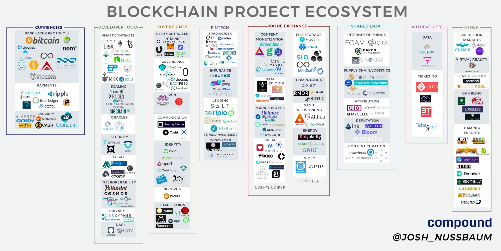
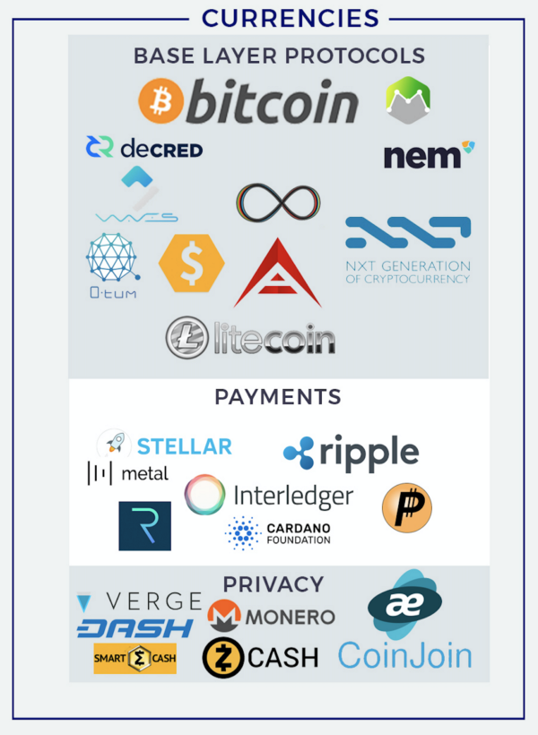
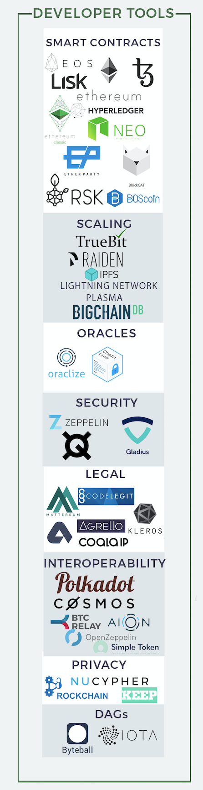
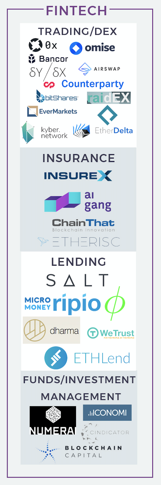
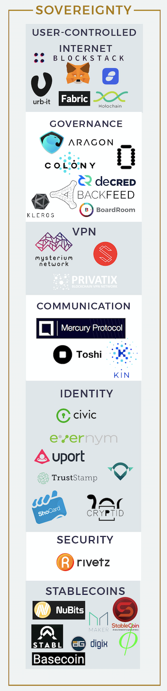
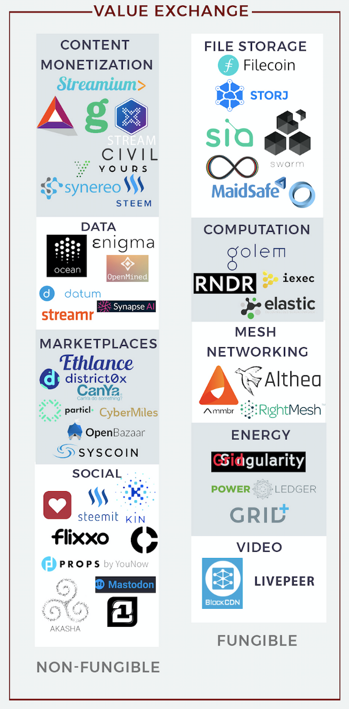
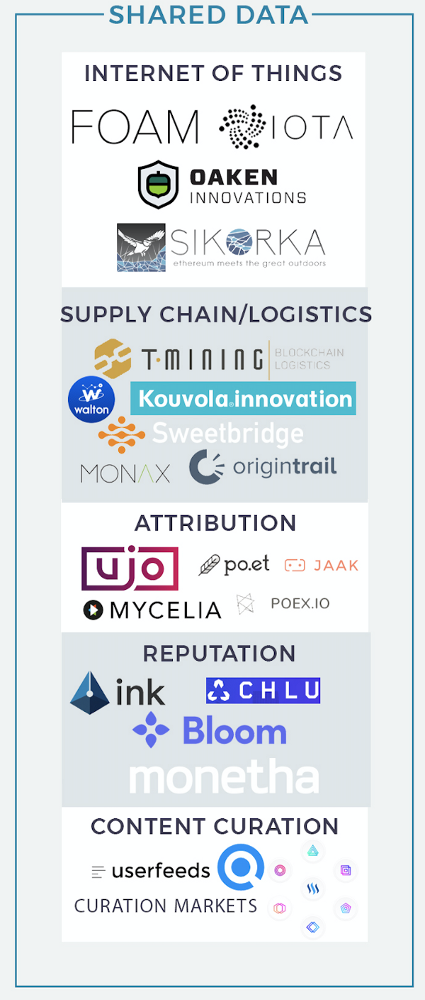
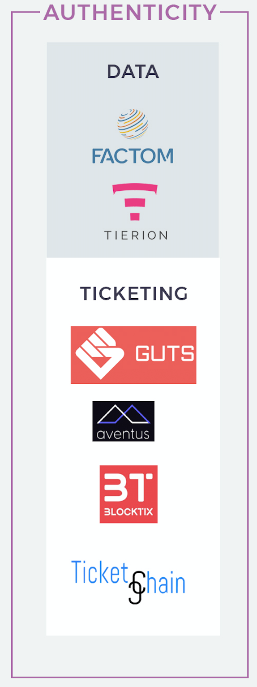

Blockchain Project Ecosystem - 区块链项目生态系统
--------------------------
### Market Map and Musings on the State of the Ecosystem 市场分析图及对生态系统思考现状的思考

> 本文翻译自：https://medium.com/@josh_nussbaum/blockchain-project-ecosystem-8940ababaf27
>
> 译者：[区块链中文字幕组](https://github.com/BlockchainTranslator/EOS) [何德林](https://github.com/BlockchainTranslator/EOS)
>
> 翻译时间：2017-10-22

---------------------------

As I previously wrote about in my [ICO Bubble post][1] post, blockchain technology, cryptocurrencies, and token sales are all the rage right now. In the 5+ years I’ve been working in the VC industry, this is by and large the fastest I’ve seen any area of technology take off in terms of new company (or project) formation. It wasn’t too long ago that founders and VCs were mainly focused on centralized exchanges, enterprise or private blockchain solutions, wallets, amongst several other popular blockchain startup ideas that dominated the market from 2012 to somewhere around 2016.

正如我以前在[ICO Bubble帖子][1]中所写的，区块链技术、加密货币和代币销售现在都处于爆发期。在五年多的时间里，我一直在风险投资行业工作，这使我能够根据新公司（或新项目）的情况看到各种新技术的快速发展。不久前，创始人和风险投资主要集中在中心化的交易所、企业或私有区块链解决方案、钱包以及其他几个从2012年到2016年大部分时间主导市场的区块链想法。

However, as I wrote about a few months ago, the rise of Ethereum with its turing-complete scripting language and the ability for developers to include state in each block, has paved the way for smart contract development. This has led to an influx of teams building decentralized projects seeking to take advantage of the most valuable property of blockchains — the ability to reach a shared truth that everyone agrees on without intermediaries or a centralized authority.

然而，正如我在几个月前所写的那样，随着以太坊的发展，图灵完备的脚本语言，以及允许开发人员在每个区块中写入状态，为智能合约开发铺平了道路。这吸引了大量的团队构建去中心化的项目，以试图充分利用区块链的最大价值 - 一种不需要通过中间人或中心权威达成共识的能力。

There are many exciting developments coming to market both in terms of improving existing blockchain functionality as well as the consumer’s experience. However, given the rapid pace at which projects are coming to market, I’ve found it to be difficult to keep track of each and every project and where each one fits into the ecosystem. Furthermore, it’s easy to miss the forest for the trees without a comprehensive view of what the proverbial forest looks like. As a result, I have compiled a list of all of the decentralized blockchain-based projects that I have been following, was able to dig up through research, along with recommendations from friends in the ecosystem. This [market landscape][2] is the output of that work.

在改进现有区块链功能以及消费者体验方面，市场上已有许多令人激动的进展。由于市场上区块链项目出现的速度很快，我难以跟踪每一个项目，并确定其在生态系统中的位置。此外，也很容易一叶障目不见森林，因为不能全面理解整个森林的样子。我已经列出了一个基于区块链的去中心化项目清单,清单中包括我一直在追踪的项目，通过研究挖掘的项目，以及在生态圈中朋友推荐的项目。以下的[市场总览图][2]就是这项工作的产出物。

A quick disclaimer: While it’s difficult to pigeonhole a number of projects into one category, I did my best to pinpoint the main purpose or value proposition of each project and categorize them as such. There are certainly many projects that fall into the gray area and could fit into multiple categories. The hardest ones are the “fat protocols” which offer functionality in more than a couple of areas. Below is an overview of each broader category I’ve identified, touching on some of the subcategories they’re comprised of:

快速免责声明：虽然很难把许多区块链项目列入某个分类，但我尽力确定每个项目的主要目的或价值主张，并对其进行归类。肯定会有许多项目落入灰色地带，可以列入多个类别。最难的是“fat protocols”，实现了多个方面的功能。以下是我已经确定的项目分类概述，其中也涉及到其子类构成：

## Currencies 货币

For the most part, these projects were created with the intention of building a better currency for various use cases and represent either a store of value, medium of exchange, or a unit of account. While Bitcoin was the first and is the most prominent project in the category, many of the other projects set out to improve upon a certain aspect of Bitcoin’s protocol or tailor it towards a specific use case. The Privacy subcategory could probably fall into either the Payments or Base Layer Protocols categories, but I decided to break them out separately given how important anonymous, untraceable cryptocurrencies (especially Monero and ZCash) are for users who would like to conceal a transaction because they prefer not to broadcast a certain purchase for one reason or another, or for enterprises who don’t want to reveal trade secrets.

在大多数情况下，这些项目的创建目的是为某种使用场景建立一个更好的货币，代表着一种价值储存，或者交换媒介，或者一个账户单位。虽然在该类别中，比特币是第一个，也是最突出的项目，但还有许多其他项目，旨在改进比特币协议的某些方面或针对某些功能进行裁剪。 “隐私”子类可属于“支付”或“基础层协议”，但我决定将其单列出来，因为匿名、不可追踪的加密货币（特别是Monero和ZCash）非常重要，对于那些希望隐藏交易的用户，因为由于某种原因不希望他们的交易被广播出去，或者对于企业而言不想透露其商业秘密。

## Developer Tools 开发工具

Projects within this category are primarily used by developers as the building blocks for decentralized applications. In order to allow users to directly interact with protocols through application interfaces (for use cases other than financial ones), many of the current designs that lie here need to be proven out at scale. Protocol designs around scaling and interoperability are active areas of research that will be important parts of the Web3 development stack.

这类项目主要为开发人员提供工具，用于为去中心化的应用构建区块链，为方便用户通过应用界面直接操作底层协议（为各种应用场景，不仅是金融领域）。当前许多设计都在做这方面的工作，但还需要在规模上进一步验证。关于扩展和互操作性的协议设计是目前活跃的研究领域，将成为Web3开发栈的重要组成部分。

In my opinion, this is one of the more interesting categories at the moment from both an intellectual curiosity and an investment standpoint. In order for many of the blockchain use cases we’ve been promised to come to fruition such as fully decentralized autonomous organizations or a Facebook alternative where users have control of their own data, foundational, scalable infrastructure needs to grow and mature. Many of these projects aim at doing just that.

在我看来，这是很有趣的类别之一，从知识探索和投资的角度来看。为实现许多我们被允诺的区块链应用目标，如完全去中心化的自治组织或用户可以控制自己数据的Facebook替代产品，可扩展的基础设施需要进一步的发展和完善。许多项目正是瞄准了这一点。

Furthermore, these projects aren’t in a “winner take all” area in the same way that say a cryptocurrency might be as a store of value. For example, building a decentralized data marketplace could require a a number of Developer Tools subcategories such as [Ethereum][3]for smart contracts, [Truebit][4] for faster computation, [NuCypher][5]for proxy re-encryption, [ZeppelinOS][6] for security, and [Mattereum][7] for legal contract execution to ensure protection in the case of a dispute. Because these are protocols and not centralized data silos, they can talk to one another, and this interoperability enables new use cases to emerge through the sharing of data and functionality from multiple protocols in a single application. [Preethi Kasireddy][8] does a great job of explaining this dynamic [here][9].

而且，这些项目领域不是“赢者通吃”，就像一种加密币可以存储一种价值一样。构建去中心化数据市场可能需要一系列的开发工具，例如用于智能合约的[Ethereum][3]，用于更快计算的[Truebit][4]，用于代理再加密的[NuCypher][5]，用于安全的[ZeppelinOS][6]，以及用于法律合同执行的[Mattereum][7]。因为它们是协议而不是中心化的数据孤岛，所以它们可以相互通信。这种互操作性使新的应用案例出现，通过单个应用程序中共享多个协议的数据和功能。 [Preethi Kasireddy][8]在解释这方面的动态上做得很好,详见[此处][9]。

## Fintech 金融科技

This category is fairly straightforward. When you’re interacting with a number of different protocols and applications (such as in the Developer Tools example above), many may have their own native cryptocurrency, and thus a number of new economies emerge. In any economy with multiple currencies, there’s a need for tools for exchanging one unit of currency for another, facilitating lending, accepting

这个类别相当简单清楚。当您与许多不同的协议和应用程序进行交互时（例如上面的“开发工具”示例）中，许多应用可能有自己的加密货币，从而会出现一些新的经济形式。在任何具有多种货币的经济体中，需要一种货币交换的，便于贷款、收款。

investment, etc. 投资等

The Decentralized Exchanges (DEX) subcategory could arguably have been categorized as Developer Tools. Many projects are already starting to integrate the [0x protocol][10] and I anticipate this trend to continue in the near future. In a world with the potential for an exorbitant number of tokens, widespread adoption of applications using several tokens will only be possible if the complexity of using them is abstracted away — a benefit provided by decentralized exchanges.

去中心化的交易所（DEX）一般来说，可以归为开发工具。许多项目已经开始整合[0x协议][10]，我预计不久的将来，这种趋势将继续下去。在一个代币数量巨大的世界中，广泛采用多种代币的应用程序才是唯一可能的解决方案，如果使用它们的复杂性被消除 - 这是去中心化交换所提供的好处。

Both the Lending and Insurance subcategories benefit from economies of scale through risk aggregation. By opening up these markets and allowing people to now be priced in larger pools or on a differentiated, individual basis (depending on their risk profile), costs can decrease and therefore consumers should in theory win. Blockchains are both stateful and immutable so because previous interactions are stored on chain, users can be confident that the data that comprises their individual history hasn’t been tampered with.

贷款和保险，受益于规模经济，通过风险聚合。通过开放这些市场，让人们可以在更大的资金池上，或者根据差异化的个人情况（取决于他们的风险状况），进行定价，成本将会降低，消费者从而成为赢家。区块链是有状态和不可变的，以前的交易行为被存储在链上，用户可以确信包含其个人的数据历史没有被篡改。

## Sovereignty 自治

As the team at [Blockstack][11]describes in their [white paper][12],

就像[Blockstack][11]团队在[白皮书][12]中描述的，

> Over the last decade, we’ve seen a shift from desktop apps (that run locally) to cloud-based apps that store user data on remote servers. These centralized services are a prime target for hackers and frequently get hacked.
>
> 在过去十年中，我们已经看到从桌面应用（本地运行）到云端应用（用户数据存储于远端服务器）的转变。这些集中式应用服务是黑客攻击的主要目标，并经常被成功入侵。

Sovereignty is another area that I find most interesting at the moment. While blockchains still suffer from scalability and performance issues, the value provided by their trustless architecture can supersede performance issues when dealing with sensitive data; the safekeeping of which we’re forced to rely on third parties for today. Through cryptoeconomics, users don’t need to trust in any individual or organization but rather in the theory that humans will behave rationally when correctly incentivized.

自治是目前我觉得最有趣的另一个领域。虽然区块链仍然存在可扩展性和性能的问题，但它们无需信任的架构提供的价值超过了性能问题的重要性，在处理敏感数据的时候。我们今天还被迫依赖第三方的保管来保证安全。通过加密经济学，用户不需要信任任何个人或组织，而是基于一种理论，通过正确激励，人会理性行事。

The projects in this category provide the functionality necessary for a world where users aren’t forced to trust in any individual or organization but rather in the incentives implemented through cryptography and economics.

这一类项目提供了必要的功能，为用户不用被迫信任任何个人或组织，而是为密码学和经济学的激励措施所引导。

## Value Exchange 价值交换

A key design of the Bitcoin protocol is the ability to have trust amongst several different parties, despite there being no relationship or trust between those parties outside of the blockchain. Transactions can be created and data shared by various parties in an immutable fashion. It’s widely considered fact that people begin to organize into firms when the cost of coordinating production through a market is greater than within a firm individually. But what if people could organize into this proverbial “firm” without having to trust one another? Through blockchains and cryptoeconomics, the time and complexity of developing trust is abstracted away, which allows a large number people to collaborate and share in the profits of such collaboration without a hierarchical structure of a traditional firm. Today, middlemen and rent seekers are a necessary evil in order to keep order, maintain safety, and enforce the rules of P2P marketplaces. But in many areas, these cryptoeconomic systems can replace that trust, and cutting out middlemen and their fees will allow users to exchange goods and services at a significantly lower cost.

比特币协议的一个关键设计是能够在几个不同主体之间取得信任，尽管他们在区块链之外没有任何关系或信任。交易可以被创建，并以不可篡改的方式，各方共享的数据。人们普遍认为，当通过市场协调生产的成本大于企业内部的成本时，人们开始组织成公司。但是，如果人们可以组织成这个“公司”，而不必相互信任，会怎么样？通过区块链和加密经济学，发展信任的时间和复杂性被消除，这使得大量的人，能够在没有传统公司的层次结构情况下，进行协作并分享这种合作的利润。今天，为了保持秩序、维护安全、执行P2P市场的规则，中间商和寻租者还是必不可少。但在许多方面，这些加密经济系统可以取代这种信任，削减中间商及其费用，使用户以更低的成本购买商品和服务。

The projects in the subcategories can be broken down into two main groups: fungible and non-fungible. Markets that allow users to exchange goods and services that are fungible will commoditize things like storage, computation, internet connectivity, bandwidth, energy, etc. Companies that sell these products today compete on economies of scale which can only be displaced by better economies of scale. By opening up latent supply and allowing anyone to join the network (which will become easier through projects like [1Protocol][13]) this no longer becomes a daunting task, once again collapsing margins towards zero.

这类项目可以分为两种：可替代和不可替代。可替代的市场允许用户购买可替代的商品和服务，诸如存储、计算、互联网连接、带宽和能源等。出售这些产品的公司靠规模赢得竞争，并只能被更大的规模公司击败。通过开放潜在的供应，并允许任何人加入网络（这将变得更容易，通过像[1Protocol][13]这样的项目），这不再是一个很难的事情，并且将中介利润率趋零。

Non-fungible markets don’t have the same benefits although they still allow providers to earn what their good or service is actually worth rather than what the middlemen thinks it’s worth after they take their cut.

在不可替代的市场，没有同样的好处，他们仍然允许商品或者服务提供者挣钱，不过价格不再是考虑中间人利润后的定价。

## Shared Data 共享数据

One way to think about the shared data layer model is to look at the airline industry’s Global Distribution Systems (GDS’s). GDS’s are a centralized data warehouse where all of the airlines push their inventory data in order to best coordinate all supply information, including routes and pricing. This allows aggregators like Kayak and other companies in the space to displace traditional travel agents by building a front end on top of these systems that users can transact on. Typically, markets that have been most attractive for intermediary aggregators are those in which there is a significant barrier to entry in competing directly, but whereby technological advances have created a catalyst for an intermediary to aggregate incumbents, related metadata, and consumer preferences (as was the case with GDS’s).

考虑共享数据模型的一个方法是查看航空业的全球分销系统（GDS）。 GDS是一个中心化的数据仓库，所有的航空公司都推送他们的数据，以便最好地提供服务信息，包括路线和定价。这样，像Kayak 和其他公司可以取代传统的旅行社，建立一个前端系统，以便用户可以进行直接交易。通常，市场对于中间聚合公司来说，最具吸引力的是，直接进入竞争有障碍，但技术创造了机会，中介机构可以聚合在职者、相关元数据和消费者偏好（就像GDS中的情况）。

Through financial incentives provided by blockchain based projects, we’re witnessing the single most impactful technological catalyst which will open up numerous markets, except the value no longer will accrue to the aggregator but rather to the individuals and companies that are providing the data.

通过区块链项目提供的金融激励，我们目睹了最有影响力的技术催化剂，将开启众多的市场，价值不再会累积到中间聚合者，而是分配给提供数据的个人和公司。

In 2015, Hunter Walk [wrote][14] that one of the biggest missed opportunities of the last decade was eBay’s failure to open up their reputation system to third parties which would’ve put them at the center of P2P commerce. I’d even take this a step further and argue that eBay’s single most valuable asset is reputation data which is built up over long periods of time, forcing user lock-in and granting eBay the power to levy high taxes on its users for the peace of mind that they are transacting with good actors. In shared data blockchain protocols, users can take these types of datasets with them as other applications hook into shared data protocols, reducing barriers to entry; increasing competition and as a result ultimately increasing the pace of innovation.

在2015年，Hunter Walk [写道][14]，过去十年最大的错失机会之一，是eBay未能向第三方开放其评价系统，这本会使其成为P2P商业的中心。我甚至会进一步说，eBay唯一最有价值的资产是长期建立的评价数据，从而强制锁定了用户，并让eBay有能力，向其用户高额征税，让用户认为自己正在与非常好的供应商进行交易。在共享数据区块链协议中，用户可以拿到这些数据，并通过其他应用挂接到共享数据协议中，从而减少进入门槛；通过竞争，最终导致创新步伐加快。

The other way to think about shared data protocols can be best described using a centralized company, such as [Premise Data][15], as an example. Premise Data deploys network contributors who collect data from 30+ countries on everything from specific food/beverage consumption to materials used in a specific geography. The company uses machine learning to extract insights and then sells these datasets to a range of customers. Rather than finding and hiring people to collect these datasets, a project could be started that allows anyone to collect and share this data, annotate the data, and build different models to extract insights from the data. Contributors could earn tokens which would increase in value as companies use the tokens to purchase the network’s datasets and insights. In theory, the result would be more contributors and higher quality datasets as the market sets the going rate for information and compensates participants accordingly relative to their contribution.

中心化的公司（如[Premise Data][15]），是描述共享数据协议的另一种方法。 Premise Data部署了网络信息员,从30多个国家收集数据,从特定食品/饮料消费到特定地理区域的使用材料。该公司使用机器学习来获得洞察力，然后将这些结果数据出售给一系列客户。区块链不是通过雇用人来收集这些数据，而是启动一个项目，允许任何人收集和共享数据，注解这些数据，并构建不同的模型，从数据中获取洞察力。贡献者可以赚取代币，数据公司通过代币购买网络上的数据并获取洞察力。在理论上，结果将会有更多的贡献者和更高质量的数据，因为代币的价格上涨，回报了参与者，根据他们相应的贡献。

There are many similar possibilities as the “open data platform” has been a popular startup idea for a few years now with several companies finding great success with the model. The challenge I foresee will be in sales and business development. Most of these companies sell their dataset to larger organizations and it will be interesting to see how decentralized projects distribute theirs in the future. There are also opportunities that weren’t previously possible or profitable as a standalone, private organization to pursue, given that the economics don’t work for a private company.

有许多类似的可能性，因为“开放数据平台”已经成为一个流行的创业想法，好几个公司都在这个模型上发现了巨大的成功机会。我预见未来的挑战将在于销售和业务发展方面。大多数这些公司将其数据出售给较大的组织，而且有趣的是，看未来去中心化的项目如何支配他们的数据。还有一些私人组织可以考虑的机会，以前可能对于私人公司是不合适的。

## Authenticity 存证

Ultimately, cryptocurrencies are just digital assets native to a specific blockchain and projects in this category are using these digital assets to represent either real world goods (like fair tickets) or data. The immutability of public blockchains allows network participants to be confident in the fact that the data written to them hasn’t been tampered with or changed in any way and that it will be available and accessible far into the future. Hence why, for sensitive data or markets for goods which have traditionally been rife with fraud, it would make sense to use a blockchain to assure the user of their integrity.

最后一类，加密货币只是数字化资产。这类的项目正在使用数字化资产来表示现实世界的商品（如门票）或数据。公有链的不可篡改性使得网络参与者有充分信心，对于他们的数据没有被篡改，并且将来可以访问或得到。因此，对于敏感数据或者传统上充斥着假货的市场来说，使用区块链来确保用户的完整性是有意义的。

## Takeaways 小贴士

While there’s a lot of innovation happening across all of these categories, the projects just getting started that I’m most excited about are enabling the web3 development stack by providing functionality that’s necessary across different use cases, sovereignty through user access control of their data, as well as fungible value exchange. Given that beyond financial speculation we’ve yet to see mainstream cryptocurrency use cases, infrastructure development and use cases that are vastly superior for users in either cost, privacy, and/or security in extremely delicate areas (such as identity, credit scoring, VPN’s amongst others) seem to be the most likely candidates to capture significant value.

虽然所有这些类别都有很多创新，但是我最开始兴奋的项目是通过提供不同用例所需的功能来实现web3开发栈，通过用户访问控制数据，以及可替换价值交换。在金融领域以外，我们尚未看到主流的加密货币使用案例。基础设施开发和项目案例，在成本、隐私、特地领域（如身份，信用评分，VPN）的安全，对于用户来说具有优先级，是最有可能成功的。

Longer-term, I’m excited about projects enabling entire ecosystems to benefit from shared data and the bootstrapping of networks (non-fungible value exchange). I’m quite sure there are several other areas that I’m not looking at correctly or haven’t been dreamt up yet!

长期来看，我对能够使整个生态系统从共享数据和网络引导（非替代价值交换）中受益的项目感到兴奋。我应该还有其他几个方面，我没有看到，或者没有想过！

As always if you’re building something that fits these criterion or have any comments, questions or points of contention, I’d love to hear from you.

像往常一样，如果你正在创建符合上面原则的项目，或者有任何意见，问题或争论点，我很乐意收到到你的回信。

Thank you to [Jesse Walden][16], [Larry Sukernik][17], [Brendan Bernstein][18], [Kevin Kwok][19], [Mike Dempsey][20], [Julian Moncada][21], [Jake Perlman-Garr][22], [Angela Tran Kingyens][23]and [Mike Karnjanaprakorn][24] for all your help on the market map and blog post.

感谢[Jesse Walden][16], [Larry Sukernik][17], [Brendan Bernstein][18], [Kevin Kwok][19], [Mike Dempsey][20], [Julian Moncada][21], [Jake Perlman-Garr][22], [Angela Tran Kingyens][23]和 [Mike Karnjanaprakorn][24]。

Disclaimer: Compound is an investor in Blockstack and two other projects mentioned in this post which have not yet been announced.

免责声明：Compound 是Blockstack的投资者，还有两个文中提到但未正式公布的项目。

[1]:https://medium.com/@josh_nussbaum/the-ico-bubble-6cadefaf8cbc
[2]:https://imgur.com/a/xvTjM
[3]:https://ethereum.org/
[4]:https://truebit.io/
[5]:http://www.nucypher.com/
[6]:https://zeppelinos.org/
[7]:https://mattereum.com/
[8]:https://twitter.com/iam_preethi
[9]:https://medium.com/swlh/the-synergies-gained-from-building-on-ethereums-decentralized-app-ecosystem-22a709a675d2
[10]:https://0xproject.com/
[11]:https://blockstack.org/
[12]:https://blockstack.org/whitepaper.pdf
[13]:https://1protocol.com/
[14]:https://hunterwalk.com/2015/07/20/a-is-ebays-reputation-system-a-hidden-gem/
[15]:https://www.premise.com/
[16]:https://twitter.com/jessewldn
[17]:https://twitter.com/lsukernik
[18]:https://twitter.com/BMBernstein
[19]:https://twitter.com/kevinakwok
[20]:https://twitter.com/mhdempsey
[21]:https://twitter.com/JulianMoncadaNY
[22]:https://twitter.com/jakeperlmangarr?lang=en
[23]:https://twitter.com/ATKingyens?lang=en
[24]:https://twitter.com/mikekarnj

----------------------------------------------------

#### 区块链中文字幕组

致力于前沿区块链知识和信息的传播，为中国融入全球区块链世界贡献一份力量。

如果您懂一些技术、懂一些英文，欢迎加入我们，加微信号:w1791520555。

[点击查看项目GITHUB，及更多的译文...](https://github.com/BlockchainTranslator/EOS)

#### 本文译者简介

何德林 区块链技术爱好者，热衷于区块链业务创新研究与分析，欢迎加微信号:tongxwl

本文由币乎社区（bihu.com）内容支持计划赞助。

版权所有，转载需完整注明以上内容。

----------------------------------------------------
