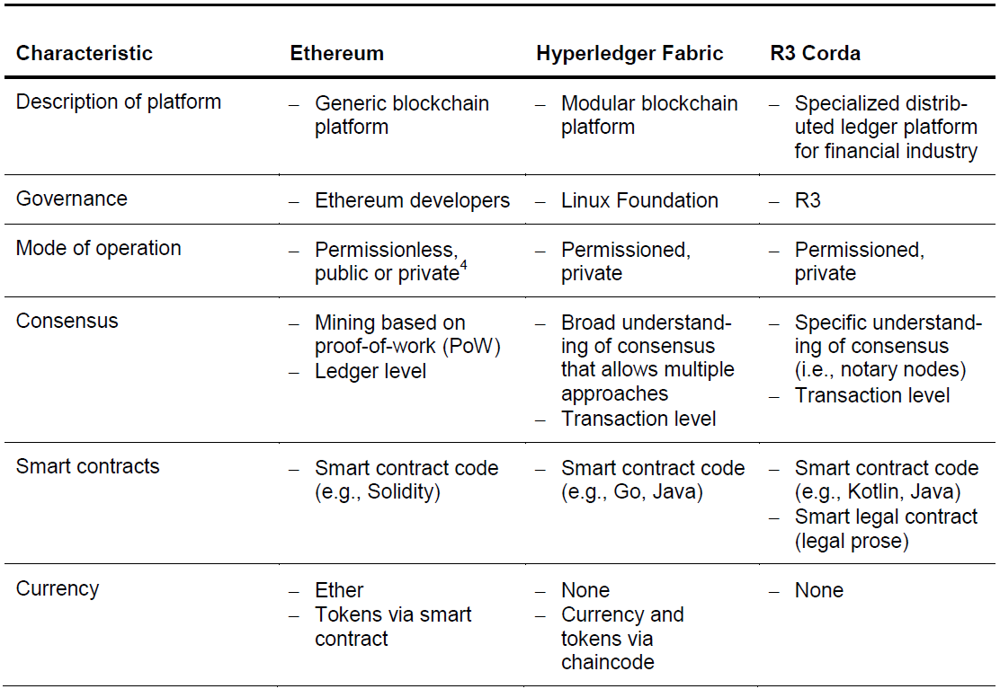
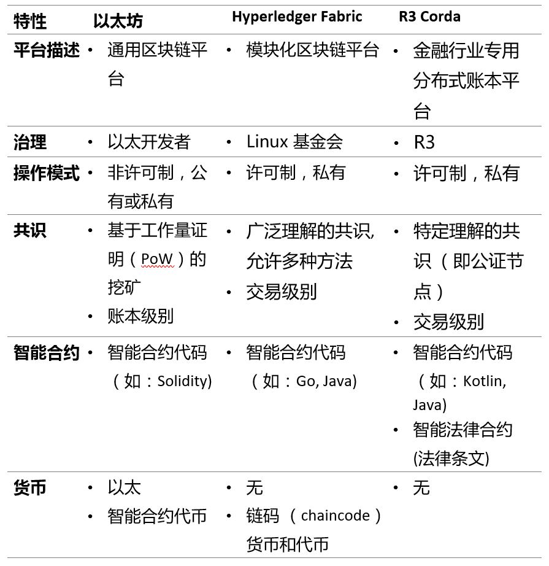

# Comparison of Ethereum, Hyperledger Fabric and Corda 
# 以太坊, Hyperledger Fabric 与 Corda 的对比

> 本文翻译自：https://medium.com/@philippsandner/comparison-of-ethereum-hyperledger-fabric-and-corda-21c1bb9442f6
> 
> 译者：[区块链中文字幕组](https://github.com/BlockchainTranslator/EOS) [龙心小台](https://github.com/xnylong/EOS)
> 
> 原文发表时间：2017-06-25
>
> 翻译时间：2017-10-29

*Authors: Martin Valenta, Philipp Sandner.*

*作者：Martin Valenta, Philipp Sandner.*

*Download the article as [PDF file](http://explore-ip.com/2017_Comparison-of-Ethereum-Hyperledger-Corda.pdf). More information about the the Frankfurt School Blockchain Center on the [Internet](http://www.fs-blockchain.de/), on [Twitter](http://www.twitter.com/fsblockchain) or on [Facebook](http://www.facebook.de/fsblockchain).*

*下载本文[PDF版本](http://explore-ip.com/2017_Comparison-of-Ethereum-Hyperledger-Corda.pdf)。更多关于 Frankfurt School Blockchain Center 的信息请看 [Internet](http://www.fs-blockchain.de/), [Twitter](http://www.twitter.com/fsblockchain), 或 [Facebook](http://www.facebook.de/fsblockchain) .*

With this paper, we provide a brief analysis of the most notable differences between the distributed ledger technologies (DLT) Hyperledger Fabric, R3 Corda and Ethereum. Our intention is to give decision makers new to DLT guidance for what use cases Hyperledger Fabric, Corda and Ethereum are most suitable.

通过本文, 我们简要分析了分布式账本技术 (DLT) Hyperledger Fabric、R3 Corda 和以太坊之间最显著的差异。我们的目的是为了给刚接触分布式账本的决策者提供指导，使其了解 Hyperledger Fabric, Corda 与以太坊的适用场景。

## Three different frameworks  

From the white papers of Hyperledger Fabric, R3 Corda (in the following only referred to as Fabric and Corda, respectively) and Ethereum it becomes obvious that these frameworks have very different visions in mind with respect to possible fields of application. Development of both Fabric[i] and Corda[ii] is driven by concrete use cases, whereas Corda’s use cases are drawn from the financial services industry. Consequently, this is where Corda sees its main field of application. In contrast, Fabric intends to provide a modular and extendable architecture that can be employed in various industries, from banking and healthcare over to supply chains. Ethereum also presents itself as utterly independent of any specific field of application.[iii] However, in contrast to Fabric, it is not modularity that stands out but the provision of a generic platform for all kinds of transactions and applications. Table 1 provides a summary of the three frameworks.

## 三种不同框架

从 Hyperledger Fabric, R3 Corda （以下分别简称为 Fabric 和 Corda ) 和以太坊的白皮书来看，显然这些框架在潜在应用领域上有着非常不同的愿景。Fabric [i] 和Corda [ii] 的开发是由具体用例驱动的，其中 Corda 的用例来自金融服务行业。因此，这也是 Corda 应用的主要领域。相比之下，Fabric 打算提供一个模块化和可扩展的架构，可以在银行和医疗保健到供应链等的各种不同行业中使用。以太坊也完全独立于任何具体应用领域。然而, 与 Fabric 不同的是, 使其与众不同的并不是模块化, 而是它为各种交易和应用程序提供了一个通用平台。表 1 提供了三个框架的摘要。

###### Table 1: Comparison of Ethereum, Hyperledger Fabric and Corda

###### 表 1 ：以太坊, Hyperledger Fabric 和 Corda 的对比

## Participation of peers  

With conventional central data storage, only a single entity, the owner, keeps a copy of the underlying database, e.g. a ledger. Consequently, this entity controls what data is contributed and what other entities are permitted to contribute. With the advent of DLT this radically changes in favor of distributed data storage where multiple entities hold a copy of the underlying database and are naturally permitted to contribute. All entities that participate in distributed data storage form a network of so-called nodes or peers. Due to distributed data storage, the difficulty arises to ensure that all nodes agree upon a common truth, e.g. the correctness of a ledger, as changes made by one node have to be propagated to all other peer nodes in the network. The result of arriving at a common truth is called consensus among nodes and is described below.

## Peers 的参与

对于常规的中央数据存储, 只有单个实体 (所有者) 保留底层数据库的副本, 例如帐本。因此, 该实体控制了数据贡献内容以及谁可参与贡献。随着分布式账本技术（DLT） 的出现, 数据存储发生了巨大改变，这种改变有利于分布式数据存储, 其中多个实体保存了底层数据库的副本, 并因而可以参与贡献。参与分布式数据存储的所有实体在网络上形成了所谓的节点 ( nodes ) 或者peers。分布式数据存储的难点在于难以确保所有节点都认同一个普遍真理，例如，帐本的正确性，这是由于一个节点所做的更改必须传播到网络中的所有其他对等节点。 对普遍真理达成认同的结果称为节点之间的共识，如下所述。

With respect to participating to consensus, there are two modes of operation:permissionless and permissioned. If participation is permissionless, anybody is allowed to participate in the network. This mode is true for Ethereum as a public blockchain. On the other hand, if participation is permissioned, participants are selected in advance and access to the network is restricted to these only. This is true for Fabric and Corda. The mode of participation, permissionless or permissioned, has a profound impact on how consensus is reached.

在参与区块链达成共识方面，有两种操作模式：非许可制和许可制。如果参与是非许可制的，任何人都可参与其中。以太坊作为公有链便采用此模式。另一方面，如果参与是许可制的，则参与者需被提前授权认证，并且参与权限仅限于特定网络。Fabric 和 Corda 便是如此。参与模式，许可制或非许可制，对达成共识有深远影响。 

## Consensus  

**Ethereum.** With Ethereum, all participants have to reach consensus over the order of all transactions that have taken place, irrespectively of whether a participant has taken part in a particular transaction or not. The order of the transactions is crucial for the consistent state of the ledger. If a definitive order of transactions cannot be established there is a chance that double-spends might have occurred, that is, two parallel transactions transfer the same coin to different recipients, thus making money out of thin air. As the network might involve mutually distrusting and anonymous parties, a consensus mechanism has to be employed that protects the ledger against fraudulent or adverse participants that attempt double-spends. In the current implementation of Ethereum, this mechanism is established by mining based on the proof-of-work (PoW) scheme. All participants have to agree upon a common ledger and all participants have access to all entries ever recorded. The consequences are that PoW unfavorably affects the performance of transactions processing.[v] Concerning the data stored on the ledger, even though records are anonymized, they are nevertheless accessible to all participants, which is problematic for applications that require a higher degree of privacy.

## 共识机制

**以太坊.** 对于以太坊来说, 所有参与者都必须就已发生的所有交易的顺序达成共识, 不论参与者是否参与某项交易。交易顺序对于账本的一致状态至关重要。如果无法确定交易的确定顺序，则有可能出现双重支付的情况，也就是说，两个并行交易将相同的代币转移给不同的收款人，从而凭空赚钱。由于网络可能涉及相互不信任并且匿名的当事方, 因此必须采用一种达成共识的机制, 以保护账本免遭试图双重支付的欺诈者或不良参与者的影响。在当前的以太坊中, 该机制是由基于工作量证明（PoW ) 的挖矿建立的。所有参与者都必须商定一个共同的账本, 并且所有参与者都可以访问所有记录的条目。其后果是 PoW 对交易处理的性能造成不利影响。[v] 至于存储在账本上的数据, 虽然记录是匿名的, 但所有参与者都可以访问它们, 这对于对保密性有更高需求的应用程序来说是有问题的。

In contrast to Ethereum, Fabric’s and Corda’s interpretation of consensus is more refined and does not merely boil down to mining based on PoW or a derivative thereof. Due to operating in a permissioned mode, Fabric and Corda provide a more fine-grained access control to records and thus enhance privacy. Furthermore, a gain in performance is achieved as only parties taking part in a transaction have to reach consensus.

与以太坊相反，Fabric 和 Corda 对共识的解释更加完善，并不仅仅是基于工作量证明（PoW） 或其衍生物的挖矿。 由于在许可制模式下运行，Fabric 和 Corda 为记录提供了更细粒度的访问控制，从而增强了隐私。 此外，由于只需参与交易的当事方达成共识, 性能也得到提升。

**Fabric.** Fabric’s understanding of consensus is broad and encompasses the whole transaction flow, starting from proposing a transaction to the network to committing it to the ledger.[vi] Furthermore, nodes assume different roles and tasks in the process of reaching consensus. This contrasts to Ethereum where roles and tasks of nodes participating in reaching consensus are identical.

**Fabric.** Fabric 对共识的理解是广泛的, 涵盖了整个交易流程, 从向网络提出一个交易到将其提交到账本中。[vi] 此外, 节点在达成共识的过程中扮演不同的角色和承担不同的任务。这与以太坊不同，在以太坊中，参与达成共识的各个节点扮演的角色和承担的任务是相同的。

Within Fabric, nodes are differentiated based on whether they are clients,peers or orderers.[vii] A client acts on behalf of an end-user and creates and thereby invokes transactions. They communicate with both peers and orderers. Peers maintain the ledger and receive ordered update messages from orderers for committing new transactions to the ledger. Endorsers are a special type of peer, whereas their task is to endorse a transaction by checking whether they fulfill necessary and sufficient conditions (e.g. the provision of required signatures). Orderers provide a communication channel to clients and peers over which messages containing transactions can be broadcasted. With respect to consensus in particular, the channels ensure that all connected peers are delivered exactly the same messages with exactly the same logical order.

在 Fabric 中，节点是根据他们是 clients （客户端），peers 或者 orderers 进行区分的。[vii] 客户端代表最终用户并创建且调用交易。 他们与 peers 和 orderers 进行通信。 Peers 负责维护账本，并从 orderers 处收到更新消息，将新交易提交给账本。Endorsers 是一种特殊的 peer，他们的任务是通过检查交易是否满足必要和充分的条件（例如提供所需的签名）来认可交易。 Orderers 为客户端和 peers 提供通信通道（channel )，通过该通道 (channel) 可以广播有关交易的消息。 对于达成共识来说，通道 (channel) 确保所有连接的 peers 以完全相同的逻辑顺序传送完全相同的消息。

At this point, the problem arises that there might occur faults in the delivery of messages when many mutually untrusting orderers are employed. As a consequence, a consensus algorithm has to be used in order to reach consensus despite faults, e.g. inconsistent order of messages, thus making the replication of the distributed ledger faults tolerant. With Fabric, the algorithm employed is “pluggable”, meaning that depending on application-specific requirements various algorithms can be used. For example, in order to deal with random or malicious replication faults as outlined above a variant of the Byzantine fault-tolerant (BFT) algorithms could be used. Furthermore, channels partition message flows, meaning that clients only see the messages and associated transactions of the channels they are connected to and are unaware of other channels. This way, access to transactions is restricted to involved parties only with the consequence that consensus has only to be reached at transaction level and not at ledger level as with Ethereum.

此时，出现的问题是，当使用许多互不信任的 orderers时，可能会使信息传输出错。因此，必须使用一致的算法才能做到即使出错，例如消息的顺序不一致，也可以达成共识，从而使分布式账本的复制容错。对于 Fabric 来说，所使用的算法是 “可插拔” 的，这意味着根据应用程序的特定要求，可以使用不同算法。例如，为了处理如上所述的随机或恶意复制的故障，可以使用拜占庭容错（BFT）算法的变体。此外，通道（channel ) 对信息流进行分区，这意味着客户端仅看到它们接入的通道（channel ) 的消息和关联交易，并且对其他通道（channel) 一无所知。如此一来，对交易的访问权限仅限于参与方，所以只需要在交易层面达成共识，而非像以太坊那样须在账本层面达成共识。

The roles of nodes outlined above are now described in the context of the transaction flow: A client sends a transaction to connected endorsers in order to initiate an update of the ledger. All endorsers have to agree upon the proposed transaction, thus some sort of consensus has to be reached regarding the proposed ledger update. The client now successively collects approval of all endorsers. The approved transaction is now sent to connected orderers which again reach consensus. Subsequently, the transaction is forwarded to peers holding the ledger for committing the transaction.

下面我们对以上提及的节点作用在交易流程中进行描述：客户端将交易发送给连接的 endorsers，以便启动账本更新。 所有的 endorsers 都必须同意提议的交易，因此必须就提议的账本更新达成一些共识。 客户端现在先后收到了所有 endorsers 的批准。 经批准的交易现在被发送给连接的 orderers 再次达成共识。 随后，交易转发给持有帐本的 peers 以提交交易。

Without going further into detail, it becomes clear that Fabric allows fine-grained control over consensus and restricted access to transactions which results in improved performance scalability and privacy.

此处不深入细节，也可明显看出，Fabric 允许对共识进行细粒度的控制，并限制对交易的访问，从而提高了性能的可扩展性和增强了隐私。

**Corda.** Similar to Fabric, consensus in Corda is also reached at transaction level by involving parties only. Subject to consensus is transaction validity and transaction uniqueness[viii]. Validity is ensured by running the smart contract code (smart contracts are described in detail below) associated with a transaction, by checking for all required signatures and by assuring that any transactions that are referred to are also valid. Uniqueness concerns the input states of a transaction. Specifically, it has to be ensured that the transaction in question is the unique consumer of all its input states. In other words, there exists no other transaction that consumes any of the same states. The reason for this is to avoid double-spends. Consensus over uniqueness is reached among participants called notary[ix] nodes, whereas the employed algorithm is “pluggable” as with Fabric. So once again a BFT algorithm might be used.

**Corda.** 与 Fabric 相似, Corda 的共识达成也是在交易层面且只涉及参与方。需要达成共识的地方包括交易有效性 （validity ) 和交易唯一性 ( uniqueness ) [viii] 。通过运行交易关联的智能合约代码 (下面详细描述了智能合约), 通过检查所有必需的签名并确保所提及的任何交易都有效, 有效性得以确保。唯一性与交易的输入状态有关。具体来说, 必须确保有关交易是其所有输入状态的唯一使用者。换言之, 没有任何其他交易会消耗相同的状态。这样做的原因是为了避免双重支付。对唯一性达成共识的参与者称为公证 [ix] 节点, 而使用的算法则与 Fabric 一样是 "可插拔" 的 。因此, 可以再次使用拜占庭容错 （BFT） 算法。

## Smart contracts  

The term “smart contract” causes considerable misunderstanding when first encountered as it evokes the idea of some sort of contract that intelligently acts on one’s behalf. The contract’s nature, however, remains vague, but intuitively appears to be linked to legal matters. That said, focal contracts are neither smart in the sense that they are e.g. driven by artificial intelligence, at least not yet, nor do they generally encode obligations and rights that are legally binding. Clark and colleagues[x] provide a useful terminology by highlighting two different ways the term “smart contracts” is commonly used. The first refers to smart contract code, the second to smart legal contracts, two distinctions that prove to be beneficial in the context of this comparison.

## 智能合约

"智能合约" 一词起初引起了很大的误解, 因为它使人联想到某种可以智能地代表某人行事的合约。合约的性质仍然模糊不清, 但让人直觉上感觉似乎与法律问题有关。尽管如此, 智能合约在某种意义上并非智能, 因为它们至少目前还不是由人工智能驱动的, 它们也没有对具有法律约束力的权利和义务进行编码。Clark 和其同事 [x] 为我们提供了一个有用的术语，重点提及了通常使用“智能合约”这个术语的两种不同方式。第一个是指智能合约代码（smart contract code), 第二个是智能法律合约 (smart legal contract), 这两种区分有益于本文的比较。

Smart contract code simply denotes software written in a programming language. It acts as a software agent or delegate of the party that employed it with the intention that it fulfills certain obligations, exercises rights and may take control of assets within a distributed ledger in an automated way. Thus, it takes on tasks and responsibilities in the distributed ledger world by executing code that models or emulates contract logic in the real world, though its legal justification may be unclear.

智能合约代码指的是用编程语言编写的软件。 它作为软件代理人或使用方的代表，意图是履行某些义务，行使权利，并可通过自动方式控制分布式账本中的资产。 因此，它通过执行模拟现实世界中合约逻辑的代码来执行分布式帐本世界中的任务和履行相应责任，尽管其法定权限并不明晰。

All DLTs feature smart contracts in the sense of smart contract code that can be written in Go or Java for Fabric[xi], in Solidity[xii] for Ethereum and in Java or Kotlin for Corda[xiii]. In Fabric, the term “chaincode” is used as a synonym for smart contract. As an illustrative example, the reader is reminded of the usage of a smart contract code in the consensus mechanism of Corda in order to ensure transaction validity. However, there is a notable difference between Fabric and Ethereum on the one hand and Corda on the other that is connected to the second way the “smart contracts” term is used.

所有分布式账本技术（DLT）都具有智能合约特点，因其可以编写智能合约代码，Fabric  可以通过 Go 或 Java 语言编写[xi]，而以太坊可以使用 Solidity [xii] 语言编写，Corda 可以通过Java 或者 Kotlin 语言编写 [xiii]。 在 Fabric 中，“chaincode” 被当作智能合约的同义词。 作为一个例证，我们想提醒读者智能合约代码在 Corda 共识机制中的作用是确保交易的有效性。 然而，Fabric 和以太坊与 Corda 之间存在的显著差异，与“智能合约”术语的第二种使用方式相关。

In Corda, smart contracts not only consist of code but additionally are allowed to contain legal prose. Thus above smart legal contracts are legal prose that are formulated in a way that they can be expressed and implemented in smart contract code. The rationale behind this is to give the code legitimacy that is rooted in the associated legal prose. Such a construct is called Ricardian Contract[xiv]. At this point, it again becomes clear that Corda was explicitly designed to account for the highly regulated environment of the financial services industry. Both Fabric and Ethereum lack this feature.

在 Corda 中，智能合约不仅包括代码，而且还可包含法律条文。 因此，上述的智能法律合约是以一种可以在智能合约代码中表达与实施的方式制定的法律条文。 其背后的理由是为了赋予代码一种植根于相关法律条文的合法性。 这样的一种结构称为李嘉图合约 （Ricardian Contract） [xiv]。 此刻，我们可以再次明显看出，Corda 是为了金融服务行业高度监管的环境而特别设计的。 Fabric 和以太坊都缺乏这个功能。

## Built-in currency  

Another noteworthy difference is that Ethereum features a build-in cryptocurrency called Ether. It is used to pay rewards to nodes that contribute to reach consensus by mining blocks as well as to pay transaction fees. Therefore decentralized apps (DApps) can be built for Ethereum that allow monetary transactions. Furthermore, a digital token for custom use cases can be created by deploying a smart contract that conforms to a pre-defined standard.[xv] This way, own currencies or assets can be defined.

## 内置货币

另一个值得关注的区别在于，以太坊拥有被称为以太币的内置加密货币。 它被用于向通过挖矿来对达成共识做出贡献的节点支付奖励，并用于支付交易费用。 因此，去中心化应用（DApps）可以在允许货币交易的以太坊中构建。 此外，可以通过部署符合预定义标准的智能合约来创建用于自定义用途的数字代币。[xv]这样，可以定义自己的货币或资产。

Fabric and Corda do not require a build-in cryptocurrency as consensus is not reached via mining. With Fabric, however, it is possible to develop a native currency or a digital token with chaincode.[xvi] With Corda, a creation of digital currencies or tokens is not intended.[xvii]

Fabric 和 Corda 不需要内置的加密货币，因为其共识并非通过挖矿达成。 然而，在 Fabric 上，可以使用 chaincode 来开发本币或数字代币。[xvi] 对于 Corda 来说，创建数字货币或代币本就不在计划之内。[xvii]

## Summary: customized vs. generic platform  

To sum up, the examined DLTs span a continuum. On the one side, there is Fabric and Ethereum. They both are highly flexible, but in different aspects. Ethereum’s powerful smart contracts engine makes it a generic platform for literally any kind of application. However, Ethereum’s permissionless mode of operation and its total transparency comes at the cost of performance scalability and privacy. Fabric solves performance scalability and privacy issues by permissioned mode of operation and specifically by using a BFT algorithm and fine-grained access control. Further, the modular architecture allows Fabric to be customized to a multitude of applications. An analogy to a versatile toolbox can be drawn.

## 总结：定制与通用平台

综上所述，上文所介绍的分布式账本技术跨度极大。一方面，Fabric 和以太坊都是高度灵活的，不过是在不同的方面。 以太坊强大的智能合约引擎使其能够成为任何类型应用程序的通用平台。 然而，以太坊的非许可制模式及其完全透明性是以性能可扩展性和隐私为代价的。 Fabric 通过许可制模式解决了性能可扩展性和隐私问题，特别是通过使用拜占庭容错（BFT）算法和细粒度访问控制来达成此目的。 此外，模块化架构使 Fabric 可以针对多种应用程序进行定制，如同一个多功能工具箱。

Corda is located at the other end. It has been consciously designed as DLT for the financial services industry. Most notably, it takes the highly regulated environment into account by augmenting smart contracts with legal prose.

Corda 的定位则在另一端。它被特意设计为金融服务业的 DLT。最值得注意的是, 它通过为智能合约增加法律条文来适应高度监管的环境。

Apparently, Corda’s focus solely on financial services transactions simplified its architectural design compared to Fabric. Therefore, it might offer a more out-of-the-box experience. However, it might be possible that Fabric, due to its modularity, can be tailored to resemble Corda’s feature set. Efforts exist that seek to integrate Corda into the Hyperledger project. Corda therefore cannot be seen as a competitor to Fabric but more as a complement.

显然，Corda 仅关注金融服务交易，从而与 Fabric 相比，它的架构设计被简化了。 因此，它可能会提供更多开箱即用的体验。 然而，Fabric 由于其模块化，可能可以量身定制类似 Corda 的功能集。 人们仍在努力将 Corda 整合到Hyperledger 项目中。 因此，Corda 不能被视为 Fabric 的竞争对手，而应作为其补充。

## Remarks  

*If you like this article, we would be happy if you forward it to your colleagues or share it on social networks.*

*Download the article as [PDF file](http://explore-ip.com/2017_Comparison-of-Ethereum-Hyperledger-Corda.pdf). More information about the the Frankfurt School Blockchain Center on the [Internet](http://www.fs-blockchain.de/), on [Twitter](http://www.twitter.com/fsblockchain) or on [Facebook](http://www.facebook.de/fsblockchain).*

## 备注

*如果你喜欢这篇文章, 请你把它转发给你的同事或者在社交网络上分享, 我们将会很高兴。*

*下载本文[PDF版本](http://explore-ip.com/2017_Comparison-of-Ethereum-Hyperledger-Corda.pdf)。更多关于 Frankfurt School Blockchain Center 的信息请看 [Internet](http://www.fs-blockchain.de/), [Twitter](http://www.twitter.com/fsblockchain), 或 [Facebook](http://www.facebook.de/fsblockchain) .*

***Martin Valenta** is blockchain engineer and consultant at the Frankfurt School Blockchain Center. You can contact him via mail (martin.valenta@gmx.net).Prof. Dr. Philipp Sandner is head of the Frankfurt School Blockchain Center. You can contact him via mail (email@philipp-sandner.de), via LinkedIn (https://www.linkedin.com/in/philippsandner/) or follow him on Twitter (@philippsandner).*

***Martin Valenta** 是法兰克福学校区块链中心的区块链工程师和顾问。 您可以通过邮件联系他（martin.valenta@gmx.net）。 Philipp Sandner 博士是法兰克福学校区块链中心的负责人。 您可以通过 LinkedIn（https://www.linkedin.com/in/philippsandner/），通过邮件（email@philipp-sandner.de）与他联系，或者在Twitter（@philippsandner）上关注他。*

[i] https://docs.google.com/document/d/1Z4M_qwILLRehPbVRUsJ3OF8Iir-gqS-ZYe7W-LE9gnE/pub
[ii] https://docs.corda.net/_static/corda-introductory-whitepaper.pdf
[iii] https://github.com/ethereum/wiki/wiki/White-Paper
[iv] e.g. https://github.com/jpmorganchase/quorum
[v] Vukolić M. (2016). The Quest for Scalable Blockchain Fabric: Proof-of-Work vs. BFT Replication, in: Camenisch J., Kesdoğan D. (eds.) Open Problems in Network Security, iNetSec 2015, Lecture Notes in Computer Science, Vol. 9591, Springer.
[vi] https://hyperledger-fabric.readthedocs.io/en/latest/fabric_model.html#consensus
[vii]https://github.com/hyperledger/fabric/blob/master/proposals/r1/Next-Consensus-Architecture-Proposal.md
[viii] https://docs.corda.net/key-concepts-consensus.html
[ix] https://docs.corda.net/key-concepts-notaries.html
[x] http://arxiv.org/abs/1608.00771
[xi] http://hyperledger-fabric.readthedocs.io/en/latest/chaincode.html
[xii] http://solidity.readthedocs.io/en/latest/
[xiii] https://docs.corda.net/tutorial-contract.html
[xiv] http://iang.org/papers/ricardian_contract.html
[xv] https://www.ethereum.org/token
[xvi] https://hyperledger-fabric.readthedocs.io/en/latest/Fabric-FAQ.html#chaincode-smart-contracts-and-digital-assets
[xvii] https://discourse.corda.net/t/mobile-consumer-payment-experiences-with-corda-on-ledger-cash/966?source_topic_id=962

----------------------------------------------------

#### 区块链中文字幕组

致力于前沿区块链知识和信息的传播，为中国融入全球区块链世界贡献一份力量。

如果您懂一些技术、懂一些英文，欢迎加入我们，加微信号:w1791520555。

[点击查看项目GITHUB，及更多的译文...](https://github.com/BlockchainTranslator/EOS)

本文由币乎社区（bihu.com）内容支持计划赞助。

版权所有，转载需完整注明以上内容。

----------------------------------------------------
