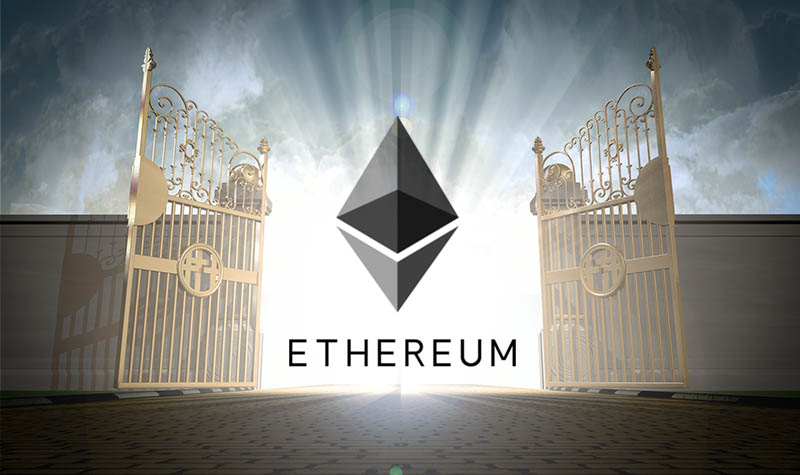

# Ethereum - What is it
# 以太坊是什么？

> 本文翻译自：https://www.cryptoambit.com/blog/ethereum
>
> 推荐：@币乎 咕噜
>
> 原文作者：Connor Dempsey 
>
> 译者：[区块链中文字幕组](https://github.com/BlockchainTranslator/EOS) [龙心小台](https://github.com/xnylong/EOS)
> 
> 原文发表时间：2017-12-13
>
> 翻译时间：2017-12-15

By now, most people know Ethereum as the second most valuable cryptocurrency, currently valued at over $70 billion dollars. Well, it turns out that Ethereum isn't actually a cryptocurrency - it's a software platform that lets programmers build applications on top of blockchain technology. Within the ethereum platform is a cryptocurrency called ether that is used to power applications built on the Ethereum blockchain.

到目前为止，大多数人都知道以太坊是第二个最有价值的加密货币，目前市值超过700亿美元。 事实证明，以太坊实际上并不是一个加密货币 - 它是一个让程序员在区块链技术之上构建应用程序的软件平台。 在以太坊平台内有一个名为以太币的加密货币，用于为以太坊区块链上的应用程序提供动力。

Before I dive into how it works, let's lay out where it came from. 

在深入了解以太坊的工作原理之前，让我们先来看看它的起源。

## From Bitcoin to Ethereum | 从比特币到以太坊

Bitcoin uses a global network of computers that maintain a shared ledger called a blockchain that keeps track of who owns bitcoin. Once blockchain technology was introduced to the world, people realized that blockchains could be used to keep track of anything of value. In 2013, a 19 year old named Vitalik Buterin introduced the Ethereum white paper. It proposed an open source platform that would let programmers build blockchain applications that could facilitate the exchange of money, content, property, shares or anything of value. As with Satoshi Nakamoto's paper, Buterin's was met with widespread excitement, and software developers around the world began building toward the vision Buterin had laid out.

比特币使用一个全球性的电脑网络，维护一个名为区块链的共享账本，用来跟踪记录谁拥有比特币。 当区块链技术被引入世界之时，人们便意识到区块链可以用来记录任何有价值的东西。 2013年，19岁的 Vitalik Buterin 发表了以太坊白皮书。 它提出了一个开源平台，让程序员构建区块链应用程序，可以促进货币、内容、财产、股份或任何有价物的交换。 与中本聪的论文一样，Buterin 的白皮书也受到了广泛关注，世界各地的软件开发人员开始朝着 Buterin 所设想的方向努力。

Much like Bitcoin, Ethereum isn't owned or controlled by any one person. Unlike Bitcoin, whose creator remains anonymous, Ethereum has a leader in Vitalik Buterin (pictured below). While Buterin doesn't control Ethereum in the way that a CEO does, his word carries tremendous weight in dictating the direction of the project - this might be considered a strength or a weakness, depending on who you ask.

就像比特币一样，以太坊不是由任何一个人拥有或控制的。 又与比特币不同，比特币创造者保持匿名，而以太坊则在 Vitalik Buterin（如下图）的领导下发展。 虽然 Buterin 并不像一个 CEO 那样控制以太坊，但他的想法对决定这个项目的方向是非常重要的 - 这被认为是优势还是弱势，取决于你所问的对象。

###### Rumored to be an alien from the planet Neptune (or maybe Canada), this guy is really smart. 

###### 据传是来自海王星 (或加拿大) 的外星人, 这家伙真的很聪明。

## Smart Contracts | 智能合约

The basic function that programs built on Ethereum perform are called smart contracts. Smart contracts are digital agreements that execute automatically based on real world data. An easy way to think of them is an "If-then statement." IF condition A exists, THEN perform function B. 

基于以太坊的程序的基本功能被称为智能合约。智能合约是基于真实世界数据自动执行的数字协议。为了便于理解，可以把智能合约当做  "if-then 语句"。  即如果条件 A 存在, 则执行函数 B。

Let's say for example Grandma wants to make sure she never forgets to give Little Billy birthday money each year. She could write a smart contract that says IF it's Little Billy's birthday, THEN pay him $10 from Grandma's account. Once this contract is broadcast to the Ethereum network, it will execute automatically each year on Little Billy's birthday. 

让我们举个例子，比如说，祖母想要确保她每年都不会忘记给小孙子生日红包。 她可以写一个智能合约，如果是小孙子的生日，则从祖母的账户中支付他 10 美元。 一旦这个合约被广播到以太坊网络，它将每年在小孙子的生日时自动执行。

Smart contracts have applications far beyond improving the reliability and efficiency of Grandmothers around the world. *Another simple application of a smart contract is for rental payments: IF date = 1st of the month, THEN pay landlord rent amount.* Processes that currently involve manual interactions between two parties can now be automated and the value can be moved in real time over the blockchain rather than settling days later as with traditional banking. 

智能合约的应用范围远远不只是提高了世界各地祖母们的可靠性与效率。*智能合约的另一个简单的应用是租赁付款：如果日期 = 每月的第一天，则支付房东租金金额。* 目前需要手动交易的流程通过智能合约可以实现自动化，价值可以通过区块链实时移动，而不是像传统的银行业务那样在几天后才完成。

## A Real World Example | 一个真实世界的例子

Ethereum and smart contracts are a big deal because they have the ability to usher in what's been dubbed the "smart economy" - one in which slow manual processes prone to human error and deceit are replaced with automated processes that are completely transparent and trustworthy. A real world example that typifies the new "smart economy" is a project being run by a French insurance company called AXA. 

以太坊和智能合约有很大前景，因为它们有能力引入 “智能经济” - 一个缓慢的、容易出现人为错误和欺骗的手动过程，被完全透明可靠的自动化过程所取代。 一个真实的代表 “智能经济” 的例子，是一个由法国保险公司 AXA 运行的项目。

AXA offers a flight insurance product that pays out a policy holder in the event that a flight is delayed by two hours or more. It currently has a product in trial that will pay out [insurance claims using smart contracts and the Ethereum blockchain](https://www.coindesk.com/axa-using-ethereums-blockchain-new-flight-insurance-product/). The smart contract is simple: IF flight is over two hours late, THEN pay policyholder. The smart contract is connected to a database that monitors flight times. If the database shows that the flight is over two hours late,  the smart contract is triggered and the policyholder is paid automatically over the blockchain. 

AXA 提供飞行保险产品，在航班延误两小时或以上的情况下支付保单持有人的费用。 它目前有一个试用产品，[将使用智能合约和以太坊区块链支付保险索赔](https://www.coindesk.com/axa-using-ethereums-blockchain-new-flight-insurance-product/)。 智能合约很简单：如果航班晚点两个小时以上，则支付保单持有人。 智能合约连接着监控航班时间的数据库。 如果数据库显示航班延迟了两个多小时，智能合约就会被触发，投保人自动通过区块链获得赔偿。

Without the smart contract, the policyholder would have to file a claim and wait for the insurance company's claims department to process it, which could take anywhere from 1 to 2 weeks. With the smart contract, neither the insurance company nor the policyholder has to do anything. This also creates trust between the two parties because there are no grey areas - the customer can review the smart contract prior to purchasing the policy and feel comfortable that he will receive his claim in the event of a delay. 

如果没有智能合约，投保人将不得不提出索赔要求，然后等待保险公司索赔部门处理，这可能需要 1  到 2 周的时间。 有了智能合约，保险公司和投保人都不须做任何事情。 由于没有灰色地带，客户可以在购买保单之前先查看智能合约，并感到心安，因为知道如果航班延迟，他将收到索赔。

## Ethereum vs. Ether | 以太坊 vs. 以太币

As stated in the intro, Ethereum is a platform for building blockchain applications using smart contracts. What you may have just purchased on Coinbase is called Ether, which is the cryptocurrency that fuels the Ethereum network.  

如介绍中所述，以太坊是一个使用智能合约构建区块链应用程序的平台。 你可能刚刚在 Coinbase 上购买的产品叫以太币，它是作为以太坊网络燃料的加密货币。

Ether functions more like a digital commodity than a digital currency. Just like you need gasoline to fuel your car, you need Ether to run applications on the Ethereum blockchain. In the Grandmother example cited above, Grandma would have to purchase small amounts of Ether to fuel her smart contract that pays Little Billy his birthday money. 

以太币更像数字商品，而非数字货币。 就像你需要汽油来加油，你需要以太币才能在以太坊区块链上运行应用程序。 在上文引用的祖母的例子中，祖母将不得不购买少量的以太币，以使用智能合约来向她的小孙子支付生日红包。

The Ethereum blockchain functions in the same way as the Bitcoin blockchain: a network of computers run software that validates transactions through majority consensus. The people running these computers are called miners. Bitcoin miners are compensated for their resources by being paid in Bitcoin. Ethereum miners are compensated in Ether. On Little Billy's birthday, Grandma's ether transaction fee will go to whichever miner adds the block containing Grandma's transaction to the blockchain. That miner will also receive new Ether in the process.

以太坊区块链的运行方式与比特币区块链相同：计算机网络运行软件，以通过大多数人的共识验证交易。 运行这些计算机的人被称为矿工。 比特币矿工通过获得比特币来补偿他们付出的资源。 以太坊矿工通过获得以太币得到报酬。 在小孙子生日的时候，祖母的以太币交易费将付给那个把包含祖母交易的区块添加到区块链上的矿工。这个矿工也将在该过程中得到新的以太币。

The same supply/demand economics that apply to commodities like oil and gas also apply to Ether. Oil is valuable because it powers many of the things we use in our everyday life - it heats our homes and fuels our engines. The more people and enterprises that rely on Ethereum based applications, the higher the demand will be for Ether which will increase its value. As with all cryptocurrencies, there's plenty of speculation baked into the price - speculation that the demand for Ether will increase in the future. Since Ether is valuable, exchangeable and transferable, certain merchants are also starting to accept it as a currency. 

适用于石油和天然气等商品的供需经济学也适用于以太币。 石油有价值，是因为它为我们在日常生活中使用的许多东西提供动力 - 它为我们的家提供热量，为我们的引擎提供燃料。 依靠以太坊应用的人和企业越多，对以太币的需求就越高，从而增加其价值。 与所有加密货币一样，以太币的价格中包含了市场投机因素 - 预测未来以太币需求将会增长。 既然以太币是有价值的、可交换和可转让的，某些商家也开始接受它作为货币。

## dApps - Decentralized Apps | dApps - 去中心化应用 

Applications that run smart contracts on the Ethereum blockchain are called "dApps," or decentralized apps. Just as any app developer can build apps on top of Apple's IOS operating system, developers can build on top of Ethereum's blockchain infrastructure. To the end user of a dApp, it might not look and feel any different than the apps you use today. It's the underlying blockchain infrastructure that make them different.

在以太坊区块链上运行智能合约的应用程序被称为 “dApps”，或去中心化应用程序。 正如任何应用程序开发人员都可以在苹果的 IOS 操作系统之上构建应用程序一样，开发人员也可以在以太坊的区块链基础架构上进行构建。 对于 dApps 的终端用户来说，去中心化应用可能与你今天使用的应用程序看起来或用起来没有任何不同。 它们不同的地方在于底层区块链基础设施。
 
 
Since dApps function on top of the blockchain, they can be used to transfer value peer-to-peer. To return to our Grandmother example, there could be a dApp that Granny can download that lets her schedule Little Billy's birthday payments without having to code the smart contract herself. dApps are also completely open sourced so other people can access the code and build on top of them. Someone could take the code to the birthday payment dApp and add the ability for Grandma to add a note that says, "Happy Birthday Billy!" Running dApps on the blockchain also offers added security benefits. Since the transactions are distributed and encrypted across the Ethereum blockchain, there is no central place for a hacker to breach and gain access to all of the world's Grandmother to grandson birthday payment data.

由于 dApps 在区块链之上运行，它们可以用于进行点对点价值转移。 回到我们祖母的例子，可能有一个 dApps 可以让老太太下载，让她通过该应用安排小孙子的生日付款，而不必自己编写智能合约。 dApps 也是完全开源的，所以其他人可以访问代码并在其上进行构建。 人们可以把代码用在生日付款的 dApps 上，并且添加一个功能可以让祖母加上“生日快乐！”的字条。 在区块链上运行 dApps 还提供了额外的安全优势。 由于这些交易是在以太坊区块链中分发和加密的，因此黑客没有中心化的位置可以攻破，来获取全球所有祖母对孙子生日付款数据的访问权。
 
 
At this point, I'm really beating the Grandmother/Little Billy example to death because I think it represents a simple illustration for the kinds of applications that can be built on the Ethereum blockchain. In reality, the dApps that are being built are much more complex. Here are a few examples: 

此刻，我真的已经把祖母与小孙子的例子用烂了，因为我认为它代表了以太坊区块链上可以构建的各种应用程序的简单例证。 实际上，正在构建的 dApps 要复杂得多。 这里有一些例子：

- Weifund - blockchain crowdfunding: Users can launch traditional crowdfunding campaigns, but through the use of smart contracts, backers can gain a financial stake in the project. If an indie film gets funded on Weifund, a backer who financed 10% of the project can collect 10% of the film's revenues. Payments will be issued in real time as the film generates revenue. 

- Weifund - 区块链众筹：用户可以开展传统的众筹活动，但通过使用智能合约，支持者可以获得项目的财务利益。 如果一个独立电影在 Weifund 获得资助，一个资助了项目 10％ 的支持者可以获得电影收入的 10％。 随着电影收入的增加，付款将实时发放。

- Ujo Music - Music licensing via the blockchain: An artist can create an original song and register it on Ujo's platform and set their own licensing terms. If a film producer wants to use that song in a movie, they can purchase the rights based on the terms set by the artist who will then get paid directly. This erases the need for industry middlemen like Warner Brothers who end up taking the lion's share of their artist's profits. 

- Ujo 音乐 - 通过区块链进行音乐授权：艺术家可以创建一首原创歌曲，并在 Ujo 的平台上进行注册并设置自己的授权条款。 如果电影制片人想在电影中使用这首歌曲，他们可以根据艺术家设定的条款购买使用权，然后艺术家将会直接获得收入。 这消除了对像华纳兄弟这样的行业中间商的需求，中间商们常常最终拿走艺术家利润的最大份额。

- Virtue Poker - Online poker secured by the blockchain: At the height of it's popularity, online poker platforms like PokerStars were marred with issues that ranged from deck rigging to the abuse of player funds held by the company. Virtue Poker using Ethereum allows players to fund their bets directly, insuring that no central party can access and misappropriate player money. Their code is open sourced so that users can understand how hands are dealt, insuring that no one can rig the deck. Lastly, players are paid out their winnings in real time over the blockchain so no more waiting weeks for a check to come in the mail. 

- Virtue Poker - 区块链上的在线扑克：在其最受欢迎的时候，Pokerstars 等在线扑克平台出现了各种问题，包括欺骗玩家以及滥用公司持有的玩家资金。 基于以太坊的 Virtue Poker 允许玩家直接下注，确保没有中央机构可以访问和盗用玩家的钱。 他们的代码是开源的，所以用户可以理解发牌机制，确保没有人可以出老千。 最后，玩家们可以通过区块链实时获得赢的钱，而不用再等待几周时间。

## Ethereum Tokens | 以太坊代币

So now that you understand that Ethereum is a network for building decentralized applications that require a cryptocurrency called Ether in order to run, I'm going to introduce a confusing concept. Many dApps built on Ethereum have their own cryptocurrencies or "tokens." In order to interact with the dApps, customers need to purchase the dApp's native token. 

所以现在你明白了以太坊是一个构建去中心化应用的网络，需要一个名为以太币的加密货币才能运行，现在我要引入一个容易令人困惑的概念。 建立在以太坊上的许多 dApp 都有自己的加密货币或“代币”。 为了与 dApp 进行交互，客户需要购买 dApp 自己的代币。

Here's a [helpful analogy](https://blockgeeks.com/guides/ethereum-token/) I came across - when you go to a waterpark, you pay the admission fee and in return, you get a wristband. That wristband gives you the ability to ride the waterslides in the water park. With certain dApps, the token is the wristband, and a user must purchase it to interact with whatever the dApp offers.  

[下面这个类比](https://blockgeeks.com/guides/ethereum-token/)可能会对你有帮助 - 当你去水上乐园时，你支付入场费，作为回报，你会得到一个腕带。 那个腕带可以让你在水上公园里滑水。 对于某些 dApp，代币便是腕带，用户必须购买它才能使用 dApp 提供的内容与服务。

Let's take a dApp called Golem as an example. Golem lets people rent out their excess computing power to people who need it - kind of like a computer AirBnb. To cite this article [from Laura Shin](https://www.forbes.com/sites/laurashin/2017/07/10/how-crypto-tokens-work-a-close-look-at-golem/#11ab90fc5da3), if I'm a computer graphics artist that wants to render some kind of computationally intense animation, I can purchase Golem tokens that let me tap into the Golem network to generate my animation. I then pay the people who are renting me their computers with the Golem tokens. The Golem token is a form of smart contract and this transaction is recorded on the Ethereum blockchain. 

让我们以一个名为 Golem 的 dApp 为例。 Golem 可以让人们将多余的算力出租给需要它的人 - 有点像电脑 AirBnb。 引用 [Laura Shin 的这篇文章](https://www.forbes.com/sites/laurashin/2017/07/10/how-crypto-tokens-work-a-close-look-at-golem/#11ab90fc5da3)，如果我是一个计算机图形艺术家，想要渲染某种计算量较大的动画，我可以购买 Golem 代币让我进入 Golem 网络来生成我的动画。 然后我再支付 Golem 代币给那些把电脑租给我的人。 Golem 代币是智能合约的一种形式，并且该交易被记录在以太坊区块链中。

Since Golem tokens are also a cryptocurrency, they can be traded on the free market. If I'm a speculator who has no intention of using the Golem network to rent computing power, I can still buy the Golem token on an exchange in hopes that it appreciates in value. Like bitcoin, there is a fixed supply of Golem tokens so if the demand for the service increases, so will the value of the token. If I bought Golem at its original price of around 1 penny and still held it today, I would have made 35X my initial investment, since Golem tokens currently trade at round 35 cents apiece. 

由于 Golem 代币也是一种加密货币，因此可以在自由市场上进行交易。 如果我是一个无意使用 Golem 网络租用算力的投机者，我仍然可以在交易所购买 Golem 代币，以期它能升值。 像比特币一样， Golem 代币的供应量是不变的，所以如果对它所提供的服务的需求增加了，代币的价值也会随之增加。 如果我以 1 美分左右的原始价格购买了 Golem 代币，并且今天仍然持有 Golem，那么我现在的代币价值就是初始投资的 35 倍，因为 Golem 代币现在以每个 35 美分的价格交易。

## ICOs | 首次代币发行

ICO stands for "Initial Coin Offering" which is a fundraising mechanism for cryptocurrencies that has exploded in popularity this year - the majority of them are held on the Ethereum network. Similar to a kickstarter campaign, they allow entrepreneurs to raise money for projects by giving investors an early opportunity to purchase the cryptocurrency before the final product has been built. If the project is successful, the value of the cryptocurrency will rise in value and early investors can sell it on the open market for a profit.

ICO 代表“首次代币发行”，这是今年相当火热的加密货币筹款机制 - 其中大部分是在以太坊网络上举行的。 类似于众筹活动，他们允许创业家让投资者在最终产品建成之前提早购买加密货币，以此来为项目筹集资金。 如果这个项目成功了，那么该加密货币的价值就会上升，早期的投资者可以在公开市场上出售以获利。

ICOs have stirred up a lot of controversy because they represent a risky proposition with zero investor protection. Let's say I wanted to build a casino and, to finance it, I gave investors the opportunity to buy chips that could be used at my roulette tables once the casino opened. If you bought $100K in roulette chips from me and I decide that I no longer want to build the casino, you're stuck holding worthless chips. If investors don't form their due diligence, they may end up buying tokens for a project whose creators never intended to build it in the first place - the creators walk away with the money and the investors have no way of recouping their funds. 

ICO 激起了很多争议，因为 ICO 有很大风险且没有任何投资者保护机制。比如说，我想建立一个赌场，为了给它融资，我给了投资者一个机会，让他们可以购买到一旦赌场开张，便可在轮盘赌桌上使用的筹码。 如果你从我这里买了 10 万美元的轮盘赌筹码，而我决定不建造赌场了，那么你的手里就将只剩下一堆无价值的筹码。 如果投资者没有进行尽职调查，他们最终可能会购买到一个发起人从来没有打算完成的项目的代币 - 发起人拿走了钱，投资者却无法收回资金。

On the other hand, early investors in projects that go on to be successful have the opportunity to make enormous returns. For example, people who invested $1,000 in the Golem ICO would be sitting on $35,000 at it's [current price of $0.35](https://coinmarketcap.com/currencies/golem-network-tokens/) - if it ever goes to $10, they will be millionaires. Another positive aspect of ICOs is that they let anyone, rich or poor, get involved in early stage investing. To invest in a company like Twitter or Facebook pre-IPO (initial public offering), you need to be an accredited investor - this basically means you're already a person of means. With ICOs, all you need is an internet connection and a little bit of money and you have the potential to become wealthy by investing in the right projects.

另一方面，投到成功项目的早期投资者有机会获得丰厚的回报。 例如，在 Golem ICO 时投资 1000 美元的人现在会拥有 3.5 万美元，因为[目前价格为每个代币 0.35 美元](https://coinmarketcap.com/currencies/golem-network-tokens/) - 如果价格某天达到 10 美元，早期投资者将变成百万富翁。 ICO 的另一个积极方面是，它可以让任何人（无论贫富）都能参与到早期投资中去。 要想在 IPO (首次公开募股）之前投资到像 Twitter 或 Facebook 这样的公司，你需要成为一名合格投资者 - 这基本上意味着你已经是一个有钱人。 有了 ICO，你所需要的只是互联网和一点点钱，你便有可能通过投资于正确的项目而变得富有。

## Far From Perfect | 远非完美

Ethereum has the potential to change the way humans transact with one another, but it is still a very young technology and it hasn't been without its problems. While the blockchain architecture underlying the Ethereum network is secure, not all of the applications built on top of it are. Faulty code can and has made applications vulnerable to hacking and malfunctions. Here are two prime examples: 

以太坊有可能改变人类之间的交易方式，但它仍然是一个非常早期的技术，且一路走来问题不断。 虽然以太坊网络底层的区块链架构是安全的，但并不是所有建立在它之上的应用程序都是安全的。 有漏洞的代码可以并且已经导致应用程序容易受到黑客攻击和发生故障。 这里有两个最好的例子：

- **DAO Hack** - DAO was a dApp built on Ethereum that enabled crowd based venture capital. DAO token holders were given the right to vote on projects they wanted to support - if projects went on to be successful, DAO token holders would receive financial rewards. The DAO ICO received $168 million in funding. The DAO software was hosted on the Ethereum blockchain and was publicly visible by all. A hacker spotted a flaw in the DAO's code that enabled him to route $55M in ether held by the DAO into an account that he controlled. The Ethereum team had to do something called a hard fork (something I won't get into now) to reverse the hack and return the stolen funds.

- **DAO 黑客攻击事件** - DAO 是一个基于以太坊构建的 dApp，使众筹式风投得以实现。 DAO 代币持有者有权对他们想支持的项目进行投票 - 如果项目取得成功，DAO 代币持有者将获得经济回报。 DAO ICO 募集了1.68 亿美元的资金。 DAO 软件托管在以太坊区块链中，并对所有人公开可见。 一名黑客在 DAO 的代码中发现了一个漏洞，使他能够将 DAO 持有的价值 5,500 万美元的以太币转到他控制的账户中。 以太坊团队不得不通过硬分叉（在此暂不解释）来逆转黑客的入侵并归还被盗的资金。

- **Parity Wallet Freeze** - Parity is a wallet where people store Ether. A flaw in Parity's code let a user delete a specific line of code that was necessary for accessing funds in a Parity wallet. This led to $280 million dollars worth of ether being frozen - it hasn't been stolen but it can't be accessed either. Parity Technologies has proposed another hard fork to correct the issue - something that is sure to divide the Ethereum community and rattle user confidence.

- **Parity 钱包冻结** - Parity 是人们存放以太币的一个钱包。 Parity 代码中的一个缺陷让一个用户删除了在 Parity 钱包中访问资金所必需的特定代码行。 这导致价值 2.8 亿美元的以太币被冻结 - 它没有被盗，但也不能被访问。 Parity 公司已经提出了另一个硬分叉来解决这个问题 - 这肯定会分裂以太坊社区，并动摇用户信心。

Despite the world changing implications that Ethereum dApps and smart contracts have, the trouble is that any programmer can write them - if they aren't written properly, they can behave in unintended ways and be exploited as in the above listed examples. Ethereum is still a very young network and security issues with dApps and smart contracts will have to be sorted out if it's to reach its true aspirations.

尽管以太坊 dApps 和智能合约能带来可以改变世界的影响，但问题是，任何程序员都可以编写它们 - 如果写得不好，这些智能合约与 dApps 可能会以意想不到的方式运行，并如上述例子一样被加以利用。 以太坊仍然是一个非常年轻的网络，若要达成愿景，dApps 和智能合约的安全问题必需解决。

Additionally, the network needs be able to handle a higher volume of transactions. Similar to Bitcoin, Ethereum is subject to congestion when transactional volume gets high. Recently a dApp called Cryptokitties, where users trade digital cats, got so popular that it bogged down the entire network. Ethereum does have scaling plans in place, that they'll need to implement. 

此外，以太坊网络需要能够处理更大的交易量。与比特币类似，当交易量大增时，以太坊也会拥堵。 最近一个名为云养猫（Cryptokitties）的 dApp，用户可以在上面交易虚拟猫，它变得如此受欢迎以至于使整个以太坊网络变得拥堵不堪。 以太坊已经有了待实施的扩容计划。

## Leading The Decentralized Revolution | 引领去中心化革命

*“Ethereum aims to take the promise of decentralization, openness and security that is at the core of blockchain technology and brings it to almost anything that can be computed.”*  
                                                                                            — Vitalik Buterin - Ethereum creator

*“以太坊旨在将区块链技术核心中的去中心化、开放性和安全性的承诺，带到几乎任何可以计算的东西上。”*  
                                                                                            —  Vitalik Buterin - 以太坊创造者

Imperfections aside, Ethereum is currently leading the decentralized revolution. Bitcoin is the world's first decentralized currency that operates on a global network of computers outside of central intermediaries. Ethereum gives programmers a platform to develop a decentralized version of just about anything.

抛开缺陷不谈，以太坊目前正引领着去中心化革命。 比特币是世界上第一个去中心化的货币，在中央中介机构之外的全球计算机网络上运作。 以太坊为程序员提供了一个可以开发几乎任何事物的去中心化版本的平台。

Decentralized networks like Ethereum have the power to remove the intermediaries that currently exist between producer and consumer. Let's take a company like Uber. Uber is a platform that brings people who need rides together with people who have cars. To facilitate this interaction, Uber collects 20% of every fare. With Ethereum and blockchain technology, there is nothing to prevent a bunch of software developers from writing a dApp that creates a decentralized Uber. Instead of 20% per ride, transaction fees are paid to the network and the driver takes home the lion's share of the transaction. Tokens can be issued that represent ownership in the network. Coders who work on improving the network can get paid for their efforts in ownership tokens. Non-technical people can come up with marketing campaigns that spread awareness for the network and also get compensated in ownership tokens. As the decentralized Uber network grows and improves, the value of its ownership token increases, rewarding the people that built it. The result is what is referred to as a "Decentralized Autonomous Organization", and there's a strong possibility that DAOs replace a lot of the world's biggest corporations. 

像以太坊这样的去中心化网络，有能力去除目前存在于生产者和消费者之间的中介。让我们来看看像 Uber 这样的公司。 Uber 是一个将需要乘车的人和有汽车的人连接在一起的平台。为了促进这种互动，Uber 收取每次乘车费用的 20％。有了以太坊和区块链技术，没有什么可以阻止一群软件开发人员编写一个 dApp, 来创建一个去中心化 Uber。交易费用不再是每次乘车费用的 20％，而是直接支付给网络，并且司机可以将乘车费的绝大部分收入囊中。代币可以被发行以代表网络的所有权。为改善网络做出贡献的编程人员可以通过获得所有权代币来得到相应报酬。非技术人员可以发起宣传该网络的营销活动，并获得所有权代币作为补偿。随着去中心化 Uber 网络的发展和完善，其所有权代币的价值越来越高，这便是对帮助构建它与完善它的人的奖励。结果就出现了所谓的“去中心化自治组织（DAO）”，DAO 很有可能会取代许多世界上最大的公司。

This may sound like a radical concept, but blockchain technology enables these kinds of decentralized organizations to exist - Ethereum provides the tools for people to go out and build them. 

这可能听起来像一个激进的概念，但区块链技术使这些去中心化的组织得以存在 - 以太坊为人们提供了建设它们的工具。

*If you found this to be informative, hit the like button down below and share this post on social media. To stay up to date on all things blockchain and cryptocurrencies, subscribe to my website. Send any feedback to connor@cryptoambit.com.* 

*如果你发现本文让你增长了见识，请点击下面的按钮，并在社交媒体上分享本文。 要及时了解所有区块链和加密货币，请订阅我的网站。 任何反馈请发送给 connor@cryptoambit.com。*

----------------------------------------------------

#### 区块链中文字幕组

致力于前沿区块链知识和信息的传播，为中国融入全球区块链世界贡献一份力量。

如果您懂一些技术、懂一些英文，欢迎加入我们，加微信号:w1791520555。

[点击查看项目GITHUB，及更多的译文...](https://github.com/BlockchainTranslator/EOS)

#### 文本译者简介

龙心小台，区块链学习者，微信公众号：视听区块链

本文由币乎社区（bihu.com）内容支持计划奖励。

版权所有，转载需完整注明以上内容。

----------------------------------------------------
