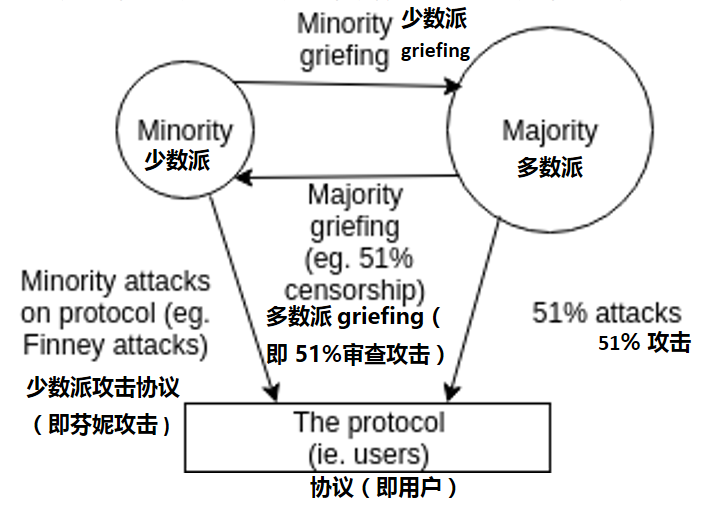

# The Triangle of Harm 
# 危害三角形

> 本文翻译自：http://vitalik.ca/general/2017/07/16/triangle_of_harm.html
> 
> 译者：[区块链中文字幕组](https://github.com/BlockchainTranslator/EOS) [龙心小台](https://github.com/xnylong/EOS)
> 
> 原文发表时间：2017-07-16
>
> 翻译时间：2017-11-4

The following is a diagram from a slide that I made in one of my presentations at Cornell this week: 

下面是我本周在康奈尔的演讲中所做的一张幻灯片中的图表：

If there was one diagram that could capture the core principle of Casper’s incentivization philosophy, this might be it. Hence, it warrants some further explanation.

如果有一个图表能够体现出 Casper 激励哲学的核心原则，那么可能就如上图所示。 因此，这值得我们做出进一步解释。

The diagram shows three constituencies - the minority, the majority and the protocol (ie. users), and four arrows representing possible adversarial actions: the minority attacking the protocol, the minority attacking the majority, the majority attacking the protocol, and the majority attacking the minority. Examples of each include:

该图显示了三个选区 - 少数派、多数派和协议（即用户），以及四个箭头代表可能的对抗行动：少数派攻击协议，少数派攻击多数派，多数派攻击协议，多数派攻击少数派。 每个类型的例子包括：

(1) **Minority attacking the protocol** - [Finney attacks](https://bitcoin.stackexchange.com/questions/4942/what-is-a-finney-attack) (an attack done by a miner on a proof of work blockchain where the miner double-spends unconfirmed, or possibly single-confirmed, transactions)
	
(1) **少数派攻击协议** - [芬妮攻击（Finney attacks）](https://bitcoin.stackexchange.com/questions/4942/what-is-a-finney-attack)（矿工对 PoW 区块链进行的攻击，矿工双重支付未确认或可能只被确认一次的交易）
	
(2) **Minority attacking the majority** - [feather forking](https://bitcointalk.org/index.php?topic=312668.0) (a minority in a proof of work chain attempting to revert any block that contains some undesired transactions, though giving up if the block gets two confirmations)
	
(2) **少数派攻击多数派** - [feather forking](https://bitcointalk.org/index.php?topic=312668.0)（PoW 区块链中的少数派试图逆转包含某些不符合其利益的交易的区块，尽管如果该区块获得两个确认，则须放弃）
	
(3) **Majority attacking the protocol** - traditional 51% attacks
	
(3) **多数派攻击协议** - 传统的51％攻击
	
(4) **Majority attacking the minority** - a 51% censorship attack, where a cartel refuses to accept any blocks from miners (or validators) outside the cartel
	
(4) **多数派攻击少数派** - 51％审查攻击，即卡特尔拒绝接受卡特尔之外的矿工（或验证人）的区块

The essence of Casper’s philosophy is this: **for all four categories of attack**, we want to put an upper bound on the ratio between the amount of harm suffered by the victims of the attack and the cost to the attacker. In some ways, every design decision in Casper flows out of this principle.

Casper 哲学的本质在于：**对于这四类攻击**，我们都想把攻击受害者受到的损失与攻击者的成本之间的比例设置一个上限。 在某种意义上来说，Casper 的每一个设计决定都来自这个原理。

This differs greatly from the usual proof of work incentivization school of thought in that in the proof of work view, the last two attacks are left undefended against. The first two attacks, Finney attacks and feather forking, are costly because the attacker risks their blocks not getting included into the chain and so loses revenue. If the attacker is a majority, however, the attack is costless, because the attacker can always guarantee that their chain will be the main chain. In the long run, difficulty adjustment ensures that the total revenue of all miners is exactly the same no matter what, and this further means that if an attack causes some victims to lose money, then the attacker gains money.

这与通常的 PoW 激励学派有很大不同，PoW 工作量证明对最后两类攻击是不设防的。 前两类攻击，芬妮攻击（Finney attacks) 和 feather forking，成本高昂，因为攻击者冒着他们的区块不被纳入区块链的风险，从而损失收入。 但是，如果攻击者占多数，攻击就是无成本的，因为攻击者总能保证他们的链条将成为主链。 从长远来看，难度调整确保所有矿工的总收入无论如何都完全相同，这就意味着如果一次攻击导致一些受害者损失金钱，那么攻击者就会获得金钱。

This property of proof of work arises because traditional Nakamoto proof of work fundamentally punishes dissent - if you as a miner make a block that aligns with the consensus, you get rewarded, and if you make a block that does not align with the consensus you get penalized (the penalty is not in the protocol; rather, it comes from the fact that such a miner expends electricity and capital to produce the block and gets no reward).

PoW 工作量证明之所以有这种性质，是因为传统的 Nakamoto 工作量证明是从根本上惩罚异议的 - 如果你作为一个矿工做出了一个与共识相符的区块，你会得到奖励，如果你做出的区块与共识不符，你将受到惩罚 （惩罚并不在协议中；而是由于这样一个矿工花费电力和资金产生区块而得不到奖励造成的）。

Casper, on the other hand, works primarily by punishing equivocation - if you send two messages that conflict with each other, then you get very heavily penalized, even if one of those messages aligns with the consensus (read more on this in the [blog post on “minimal slashing conditions”](https://medium.com/@VitalikButerin/minimal-slashing-conditions-20f0b500fc6c)). Hence, in the event of a finality reversion attack, those who caused the reversion event are penalized, and everyone else is left untouched; the majority can attack the protocol only at heavy cost, and the majority cannot cause the minority to lose money. 

另一方面，Casper 主要是通过惩罚模棱两可来工作 - 如果你发送两个互相冲突的消息，那么即使其中一条消息与共识一致，你也会受到严重的惩罚（在博客文章中阅读更多内容  [“最小削减条件”](https://medium.com/@VitalikButerin/minimal-slashing-conditions-20f0b500fc6c)）。 因此，如果发生最终共识逆转攻击，造成逆转事件的人就会受到惩罚，而其他人则不受影响； 多数派只能以沉重的代价攻击协议，且多数派不会导致少数派损失金钱。

It gets more challenging when we move to talking about two other kinds of attacks - liveness faults, and censorship. A liveness fault is one where a large portion of Casper validators go offline, preventing the consensus from reaching finality, and a censorship fault is one where a majority of Casper validators refuse to accept some transactions, or refuse to accept consensus messages from other Casper validators (the victims) in order to deprive them of rewards.

当我们谈到另外两种攻击 - 活跃度错误和审查错误时，这变得更具挑战性。 活跃度错误是大部分 Casper 验证者下线，阻止共识变成最终共识，而审查错误是大多数 Casper 验证者拒绝接受某些交易，或拒绝接受来自其他 Casper 验证者（受害者）的共识信息，以此剥夺他们的报酬。

This touches on a fundamental dichotomy: **speaker/listener fault equivalence**.

这涉及到一个基本的二分法：**说话者/听众错误等价**。

Suppose that person B says that they did not receive a message from person A. There are two possible explanations: (i) person A did not send the message, (ii) person B pretended not to hear the message. Given just the evidence of B’s claim, there is no way to tell which of the two explanations is correct. The relation to blockchain protocol incentivization is this: if you see a protocol execution where 70% of validators’ messages are included in the chain and 30% are not, and see nothing else (and this is what the blockchain sees), then there is no way to tell whether the problem is that 30% are offline or 70% are censoring. If we want to make both kinds of attacks expensive, there is only one thing that we can do: **penalize both sides**.

假设 B 说他们没有收到 A 的信息。有两种可能的解释：（1）A 没有发送信息，（2）B 假装没有听到信息。 在只有 B 的证词的情况下，并无法知道这两个解释中的哪一个是正确的。 这与区块链协议激励的关系是这样的：如果你看到一个协议执行，其中 70％ 的验证者的消息被包含在链中，30％ 没有，并且没看到其他任何东西（这就是区块链所看到的），那么就无法判断问题到底是 30％ 的验证者下线了还是 70％ 在审查。 如果我们想使这两种攻击都代价高昂，那我们只能做一件事：**惩罚双方**。

Penalizing both sides allows either side to “grief” the other, by going offline if they are a minority and censoring if they are a majority. However, we can establish bounds on how easy this griefing is, through the technique of **griefing factor analysis**. The griefing factor of a strategy is essentially the amount of money lost by the victims divided by the amount of money lost by the attackers, and the griefing factor of a protocol is the highest griefing factor that it allows. For example, if a protocol allows me to cause you to lose $3 at a cost of $1 to myself, then the griefing factor is 3. If there are no ways to cause others to lose money, the griefing factor is zero, and if you can cause others to lose money at no cost to yourself (or at a benefit to yourself), the griefing factor is infinity.

惩罚双方允许任何一方去 “grief” 另一方，如果他们是少数派，则下线，如果他们是多数派，则审查。 但是，通过 **griefing factor 分析**的技巧，我们可以给这种 griefing 的容易程度设限。 一个策略的 griefing factor 本质上是受害者所损失的金额除以攻击者所损失的金额，而一个协议的 griefing factor 是它所允许的最高 griefing factor。 例如，如果一个协议允许我以 1 美元的成本让你损失 3 美元，那么 griefing factor 就是 3 。如果无法使别人损失金钱，则 griefing factor 是零，如果你能使别人损失金钱而自己无成本 (或对自己有利), 则 griefing factor 为无穷大。

In general, **wherever a speaker/listener dichotomy exists, the griefing factor cannot be globally bounded above by any value below 1.** The reason is simple: either side can grief the other, so if side A can grief side B with a factor of x then side B can grief side A with a factor of 1/x; x and 1/x cannot both be below 1 simultaneously. We can play around with the factors; for example, it may be considered okay to allow griefing factors of 2 for majority attackers in exchange for keeping the griefing factor at 0.5 for minorities, with the reasoning that minority attackers are more likely. We can also allow griefing factors of 1 for small-scale attacks, but specifically for large-scale attacks force a chain split where on one chain one side is penalized and on another chain another side is penalized, trusting the market to pick the chain where attackers are not favored. Hence there is a lot of room for compromise and making tradeoffs between different concerns within this framework.

一般来说，**在任何说话者/听众二分法存在的地方，griefing factor 的整体上限都不能低于1**。原因很简单：任一方都可以 grief 另一方，所以如果 A 方可以用 x 因子 grief B 方,  那么 B 方就可以用 1 / x 因子 grief A 方; x 和 1 / x 不能同时小于 1。 我们可以围绕这些因子考虑不同情况； 例如，允许多数派攻击者的 griefing factor 为 2 ， 以使少数派的 griefing factor 维持在 0.5 ， 这可能被认为是可以的，因为少数派攻击的可能性更大。 我们也可以允许小规模攻击的 griefing factor 为 1，但是特别是对于大规模的攻击来说，我们可以强制链条分裂，在一个链条上是一方受到惩罚，而在另一链条是另一方受到惩罚，并且信任市场会最终选择那条攻击者被惩罚的链条。因此，在这个框架内，有许多妥协的余地和不同的关注点之间的权衡。

Penalizing both sides has another benefit: it ensures that if the protocol is harmed, the attacker is penalized. This ensures that whoever the attacker is, they have an incentive to avoid attacking that is commensurate with the amount of harm done to the protocol. However, if we want to bound the ratio of harm to the protocol over cost to attackers, we need a formalized way of measuring how much harm to the protocol was done.

惩罚双方有另一个好处：它确保如果协议受到损害，攻击者就会受到惩罚。 这确保了无论攻击者是谁，他们都会有动机避免发动对协议造成相等伤害的攻击。 但是，如果我们想要将协议所受伤害与攻击者成本的比率限制在一定范围内，那么我们就需要一种正式的方法来衡量对协议的伤害程度。

This introduces the concept of the **protocol utility function** - a formula that tells us how well the protocol is doing, that should ideally be calculable from inside the blockchain. In the case of a proof of work chain, this could be the percentage of all blocks produced that are in the main chain. In Casper, protocol utility is zero for a perfect execution where every epoch is finalized and no safety failures ever take place, with some penalty for every epoch that is not finalized, and a very large penalty for every safety failure. If a protocol utility function can be formalized, then penalties for faults can be set as close to the loss of protocol utility resulting from those faults as possible.

这引入了**协议效用函数**的概念  -  一个公式，告诉我们协议的执行情况，并且理想情况下可以在区块链内计算。 在 PoW 链上，这可以是所有生产的区块在主链中所占的百分比。 在 Casper 中，完美执行的情况下效用函数为零，即每一个 epoch 都达成最终共识，且从未发生安全故障，而对每个没有达成最终共识的 epoch 做出一些惩罚，并且在发生安全故障的时候会有很大惩罚。 如果协议效用函数可以形式化，那么可以将对错误的处罚设置为尽可能接近由这些错误导致的协议效用的损失。

