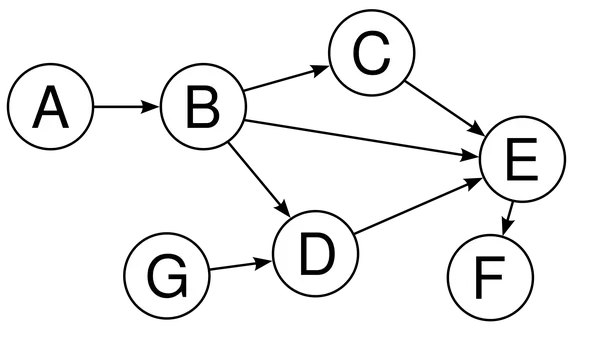
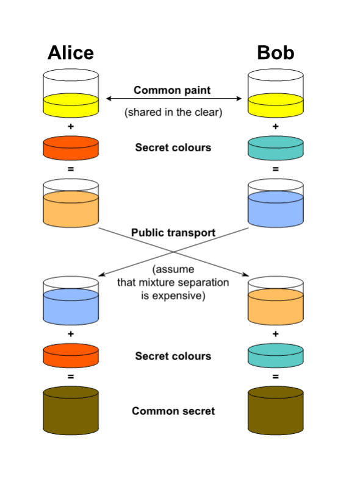
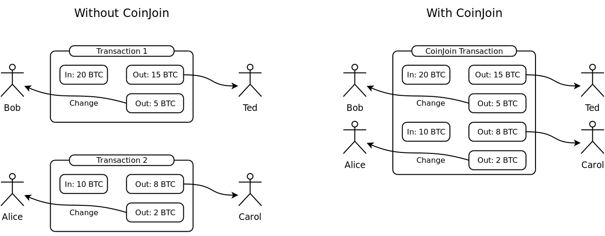
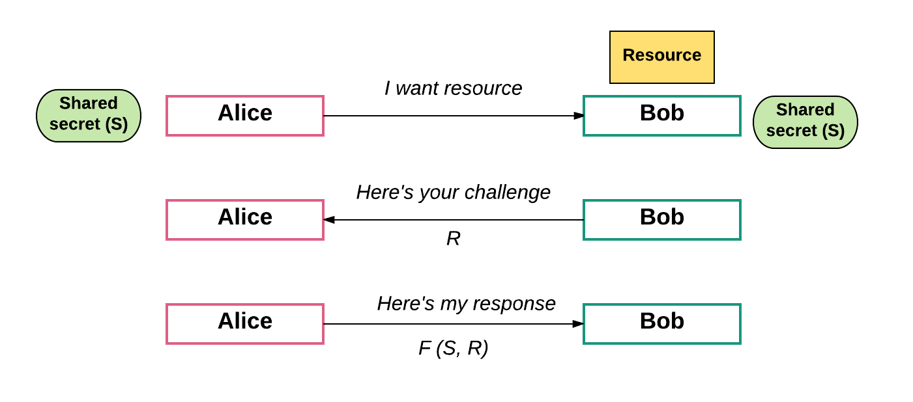
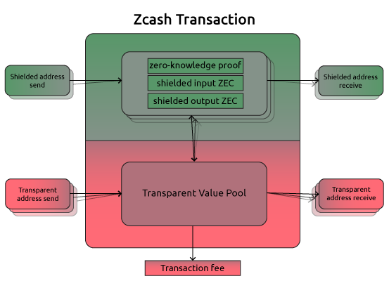
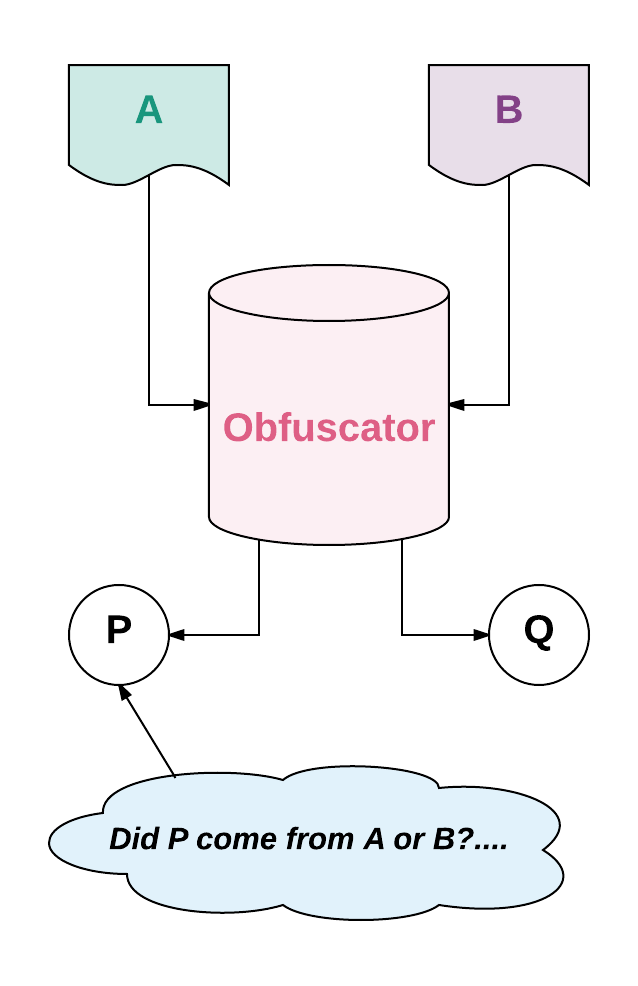
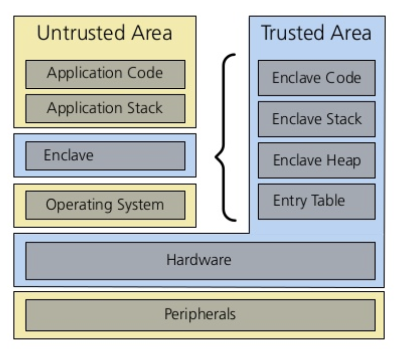

## Fundamental challenges with public blockchains | 什么是Iota
------------------------------------------------------

> 本文翻译自：https://medium.com/@preethikasireddy/fundamental-challenges-with-public-blockchains-253c800e9428
>
> 译者：[区块链中文字幕组](https://github.com/BlockchainTranslator/EOS) [小丹](https://github.com/zhuangjun)
>
> 翻译时间：2018-01-01

---------------------------

There’s no question that blockchain technology has enormous potential.

毫无疑问, 区块链技术具有巨大的潜力。

Decentralized exchanges, prediction markets, and asset management platforms are just a few of the exciting applications being explored by blockchain developers.

去中心化交易所、预测市场和资产管理平台只是区块链开发人员正在探索的一些令人兴奋的应用。

Exciting enough, in fact, to raise over billions in ICOs and drive massive price rallies throughout 2017. The hype is real.

令人兴奋的是, 事实上, 整个2017 ICO筹集了超过数十亿美元, 并推动价格大幅上涨。炒作是真的。

Don’t get me wrong. I love the fact that blockchain “hype” is helping popularize it with mainstream users. Finally, I don’t get blank stares from people when I say “Bitcoin” or “Ethereum”.

别误会，我喜欢这个事实, 区块链的 "炒作" 正让它融入主流用户。最后, 当我说 "比特币" 或 "以太坊" 时, 我也不会被人忽视。

However, there’s a flipside to this story that isn’t getting enough attention: **blockchains have several major technical barriers that make them impractical for mainstream use today.**

然而, 这个故事的另一方面没有得到足够的关注: **区块链有几个主要的技术障碍, 使他们现在还不能成为主流。**

I believe that we will get there, but we need to be realistic as developers and investors. And the reality is that it could be many years before trustless systems are ready for mainstream use at scale.

我相信我们最终会做到的, 但作为开发者和投资者，我们需要正视现实。现实情况是, 在 trustless 系统准备好被大规模主流使用之前, 可能还需要很多年。

Some of these technical barriers include:
其中一些技术障碍包括:

- Limited scalability
- Limited privacy
- Lack of formal contract verification
- Storage constraints
- Unsustainable consensus mechanisms
- Lack of governance and standards
- Inadequate tooling
- Quantum computing threat

… and more.

- 有限的可伸缩性
- 有限的隐私
- 缺乏正式的合约核查
- 存储限制
- 不可持续的共识机制
- 缺乏治理和标准
- 工具不足
- 量子计算威胁

还有更多

In this post, I’ll walk through these technical barriers and share examples of solutions for overcoming them.

在这篇文章中, 我将介绍这些技术障碍, 并分享克服它们的解决方案的例子。

As developers, I believe **it’s critical that we shift some of our focus away from shiny new ICOs to the real technological challenges standing in our way**.

作为开发人员, 我认为**关键是我们要把我们的一些注意力从新 ICOs 转移到真正的技术挑战上**。

NOTE: There’s no way I can cover every problem and every solution out there, but I covered the ones I’m most familiar with. Please refrain from too harshly criticizing me for not including something. I’d love for you to post anything I missed in the comments and I’ll add it if I see fit :) … And if I’ve made any mistakes or wrong assertions, please let me know!

注意: 我没有办法覆盖所有的问题和解决方案, 但我还是把我最熟悉的东西都覆盖了。请不要太苛刻地批评我不包括什么。如果你在评论区发表你的观点, 我会添加它, 如果我认为适合的话:)..。如果我犯了任何错误或错误的断言, 请让我知道!

### 1. Limited scalability
### 1. 有限的可扩展性

Currently, all public blockchain consensus protocols have a challenging limitation: every fully participating node in the network must process every transaction.

目前, 所有的公共区块链的共识协议都有一个挑战性的限制: 网络中每个全节点都必须处理每个交易。

Why? Well, recall that blockchains are fundamentally “decentralized” — which means that no central party is responsible for securing and maintaining the system. Instead, every single node on the network is responsible for securing the system by processing every transaction and maintaining a copy of the entire state.

为什么?嗯, 回想一下, 区块链基本上是 "去中心化的"-这意味着没有中央机构负责保护和维护系统。相反, 网络上的每个节点都负责通过处理每个交易并维护整个状态的副本来保护系统。

While a decentralization consensus mechanism offers us the core benefits of blockchain that we all care about — security guarantees, political neutrality, censorship resistance, etc. — it comes at the cost of scalability, since decentralization by definition limits the number of transactions the blockchain can process to the limitations of a single fully participating node in the network.

虽然去中心化共识机制为我们提供了我们所有人都关心的区块链的核心利益--安全保障、政治中立、审查阻力等等--但它是以可伸缩性为代价的, 因为根据定义, 去中心化限制了区块链可以处理到网络中单个完全参与节点的限制的交易数。

Two practical implications here:

两个实际的含义:

1. **Low throughput**: Blockchains can only process a limited number of transactions

2. **Slow transaction times**: The time required to process a block of transactions is slow. For example, Bitcoin block times are 10 minutes, while Ethereum block times are around 14 seconds. These times are even take longer during peak moments. Compare that to the nearly instantaneous confirmations you get when using services like Square or Visa.

As a result, public blockchains are forced to make a tradeoff between low transaction throughput and high degree of centralization.

1. **低吞吐量**: 区块链只能处理有限数量的交易

2. **交易时间较慢**: 处理一个交易块所需的时间很慢。例如, 比特币块的时间是10分钟, 而以太坊区块的时间大约是14秒。在高峰时刻, 这些时间甚至会更长。然而，对比之下，Square 或 Visa 等服务几乎可以即时确认。

因此, 公共区块链被迫在低交易吞吐量和高度中心化之间做出权衡。

In other words, as the size of the blockchain grows, the requirements for storage, bandwidth, and compute power required by fully participating nodes in the network also increase. At some point, it becomes unwieldy enough that it’s only feasible for the few nodes that can afford the resources to process blocks — leading to the risk of centralization.

换言之, 随着区块链的大小的增长, 网络中完全参与节点所需的存储、带宽和计算能力的要求也在增加。在某种程度上, 它变得非常笨拙, 只有少数几个节点能够负担得起处理区块的资源, 从而导致中心化的风险。

At that point, we’ve made a full 360-degree turn and gotten back to a centralized system that requires trust in a few big players, whereas what we want is a system that handles thousands of transactions per second with the same levels of decentralization that cryptocurrency originally promised to offer.

这样, 我们就做了一个360度的回转, 回到一个需要几个可信的大集群的中心化系统。 而我们想要的是一个系统, 每秒能处理数以千计的交易，并且去中心化。

### Scalability Solutions
### 可伸缩性解决方案

Ideally, we want a blockchain design that has similar or better security properties to Bitcoin and Ethereum, while being able to function without every single node having to process more than a certain percentage of the total transactions in the network. In other words, we need a mechanism to limit the number of nodes that need to validate each transaction, without losing the network’s trust that each transaction is valid and authentic. It might sound simple in words, but is technologically very difficult.

理想情况下, 我们希望有一个区块链设计, 既能具有比特币和以太坊安全属性,又不需要每个节点处理超过一定百分比的网络交易。换句话说, 我们需要一种机制来限制需要验证每个交易的节点的数量, 而不丢失网络对每个交易都有效和可信的信任。它可能听起来简单的话, 但在技术上非常困难。

Scalability is a large roadblock to the future success of the platform. There are a few proposed solutions that are currently being worked on by various development teams in the ecosystem. I’ve written about this topic extensively in a previous post, which I recommend you read if you’re interested. For a brief summary of some of the current solutions, see below:

可伸缩性是平台未来成功的一个巨大障碍。目前, 生态系统中的各个开发团队正在提议一些解决方案。我在以前的帖子中广泛地写过这个话题, 如果你感兴趣, 我建议你阅读。有关当前解决方案的简要摘要, 请参阅以下内容:

#### Off-chain payment channels
#### 链下支付渠道

The idea behind a micropayment channel network is to keep most transactions off the blockchain. It’s essentially a mechanism by which blockchain interactions that would normally occur on the blockchain instead are conducted off of the blockchain. The blockchain is used purely as a settlement layer to process the final transaction of a series of interactions for the final settlement, which helps lifts the burden from the underlying blockchain.

 小额支付网络背后的想法是使大多数交易发生在链下。它本质上是这样一种机制, 用链下交易代替链上交易。链上纯粹用作结算层来处理交易的最终结算, 这有助于缓解底层区块链的负担。

This solves the throughput problem we discussed above because now the blockchain can scale to magnitudes of larger transaction volumes. Moreover, because a transaction happens as soon as the payment channel processes it s and not when a block gets confirmed, micropayment channels solve the transaction speed problem, eliminating the typical latency.

这解决了我们前面讨论的吞吐量问题, 因为现在的区块链可以扩展到更大的交易量。此外, 由于一个交易在付款通道处理后立即发生, 而不是在区块得到确认时, 支付通道解决了交易速度问题, 消除了典型的延迟。

Some examples of micropayment

小额支付的一些例子

 channel networks in the ecosystem include Raiden Network and Lightning Network.

在这个生态系统中, 雷电网络和闪电网络就是例子。

#### Sharding
#### 切分

The concept behind sharding is that the overall state of the blockchain is separated into different “shards,” and each part of the state is stored and processed by different nodes in the network. Each shard only processes a small part of the state and does so in parallel. Blockchain sharding is similar to sharding in the traditional database world, except with the extra hard challenge of needing to maintain security and authenticity amongst a decentralized set of nodes.

切分背后的概念是, 区块链的整体状态被分成不同的"分区", 每个部分的状态由网络中的不同节点存储和处理。每个分区只处理状态的一小部分, 并以并行方式进行。区块链的切分与传统的数据库世界中的切分相似, 除了在去中心化节点组中需要维护安全性和真实性的额外难题。

#### Off-chain computations
#### 链下计算

This is similar to state channels, except larger in scope. The idea is to execute computations (and not just token transfers) off-chain that would be otherwise prohibitively expensive to execute on-chain, in a way that is secure and verifiable. Moving the computations and verification process off the blockchain into a separate protocol, can achieve high transaction throughput. An example of this for Ethereum is TrueBit.
这类似于状态通道, 但范围更大。这样做的目的是执行链下计算 (而不仅仅是转移代币), 否则以一种安全和可验证的方式在链上执行会代价高昂。将计算和验证过程从区块链移到单独的协议中, 可以实现较高的交易吞吐量。以太坊的一个例子是 TrueBit。

#### DAGs

A “DAG,” short for Directed Acyclic Graph, is a graph data structure that has vertices and edges. (A vertex is a point on the graph, and an edge is the path from one vertex to another.) DAG guarantee that there is no way to start at any vertex and follow a sequence of edges that eventually loops back to that vertex again (i.e. no loops). This allows us to have a sequence of nodes (or vertices) in topological order.

DAG是有向无环图的缩写， 是一个具有顶点和边的图形数据结构。(顶点是图上的一个点, 而边是从一个顶点到另一个的路径）。它保证没有办法在任何顶点开始, 并遵循一系列的边, 最终循环回到那个顶点 (即没有循环)。这允许我们有一个拓扑顺序的节点 (或顶点) 序列。

#### DAG

The premised behind DAG-based protocols, such as IOTA’s Tangle, for example, is to ditch the global linear blockchain altogether, and instead use DAG data structures to maintain the state of the system. To secure the network, these protocols rely on their own novel approaches that don’t require every node to process every transaction in a linear fashion.

基于DAG协议，比如IOTA，前提是将全局线性区块链完全抛在脑后, 而使用DAG数据结构来维护系统的状态。为了保护网络, 这些协议依赖于它们自己的新方法, 不要求每个节点以线性方式处理每个交易。

Another DAG-based approach, SPECTRE protocol, for example, uses Direct Acyclic Graph (DAG) of blocks and mines DAG blocks in parallel to allow for more throughput and higher transaction times.

另一种基于DAG的方法, 例如, 幽灵协议, 并行使用直接的无环图块和区块, 以允许更多的吞吐量和更高的交易时间。

I hope to write more about DAG-based approached in future posts; the reality is that these protocols, still in very early days, have yet to be implemented and used at scale. Frankly, they have some fundamental limitations / weaknesses that have yet to be addressed to be considered viable scalable solutions.

我希望在今后的帖子中多写一些关于 DAG的文章;事实是, 这些协议, 仍然在早期, 还没有得到实施和使用的规模。坦率地说, 它们有一些基本的局限性/弱点, 它们还没有被认为是可行的可伸缩解决方案。

For a more detailed overview of these scalability solutions as well as a few others, I suggest you read the post I wrote before on scalability.

有关这些可伸缩性解决方案的更详细的概述以及其他一些, 我建议您阅读我以前写的关于可伸缩性的文章。

### 2. Limited privacy
### 2. 有限的隐私

Given that blockchain transactions are not tied directly to your identity, they may appear more private. Anyone in the world can create a new wallet anonymously and transact using it.

鉴于区块链的交易并不直接与你的身份挂钩, 它们可能显得更私密。世界上任何人都可以匿名创建一个新的钱包, 并使用它进行交易。

However, it’s not quite that simple.

然而, 这并不那么简单。

On one hand, it’s certainly true that the great promise of this technology is pseudonymity: transactions are recorded and stored in a public ledger, but they are linked to an account address comprised solely of numbers and letters. With no real-world identity attached to this address, the transaction’s originator seems impossible to track.

一方面, 这项技术的巨大承诺是匿名使用: 交易记录和存储在公共分类账中, 但它们与仅由数字和字母组成的帐户地址相关联。由于没有连接到这个地址的真实世界的身份, 交易的发起者似乎无法跟踪。

However, this appearance of total security is misleading. It’s true that a person can preserve his or her privacy as long as the pseudonym is not linked to the individual, but as soon as somebody makes the connection, the secret is revealed. One instance of such an occurrence was revealed when law enforcement agencies admitted that they were able to identify specific Bitcoin users during investigations, thus ‘deanonymizing’ them and breaking with the overall premise of a blockchain’s total transactional invisibility.

但是, 这种完全安全的外表是有误导性的。诚然, 一个人可以保持他或她的隐私, 只要假名是没有关联的个人, 但一旦有人作出关联, 秘密就被揭露了。一个例子是执法机构承认在调查过程中, 他们能够识别特定比特币用户, 从而去匿名化，打破区块链交易匿名的承诺。

How was this accomplished?

这是怎么做到的？

Web trackers and cookies on merchant websites make it incredibly easy to leak information about a transaction onto the Web, where anyone, including governments, law enforcement agencies, and malicious users can readily make use of that information.

网络跟踪器和商家网站上的 cookie 使得在网页上泄露有关交易的信息变得非常容易, 包括政府、执法机构和恶意用户在内的任何人都可以随时使用这些信息。

Furthermore, with a blockchain platform like Ethereum, users are interacting with smart contracts that handle more than just simple value transfers. All the details about these smart contracts are public on the Ethereum blockchain, including senders and recipients, transaction data itself, the code executed, and the state stored inside the contract.

此外, 使用区块链平台 (如以太坊), 用户正在与智能合约进行交互, 这些合约处理的不仅仅是简单的价值转移。有关这些智能合约的所有详细信息都在以太坊区块链上公开, 包括发送者和接受者、交易数据本身、执行的代码以及在合约中存储的状态。

Uploading critical business data into a blockchain where hackers, competitors, or other unauthorized parties can view the information is simply not an option for most companies. Consider:

将关键业务数据上载到区块链中, 在这种情况下, 黑客、竞争对手或其他未经授权的各方可以查看这些信息, 这对大多数公司来说都不是一个选择。考虑以下这些例子:

**Electronic medical records**, which are extremely private and sensitive information. It’s unacceptable to ever have that information publicly visible on public blockchains, thereby jeopardizing patient confidentiality.

**电子病历**, 这是非常私人和敏感的信息。在公开的区块链上公开显示这些信息是不能接受的, 从而危及患者的机密性。

**Identity verification data** such as social security numbers cannot be openly stored in a public smart contract.
**身份验证数据** (如社会安全号码) 不能公开存储在公共智能合约中。

**Credential management** such as passwords and keys have no place in an open, ultimately unsecured smart contract.

**凭据管理** (如密码和密钥) 在开放式、最终无担保的智能合约中没有任何位置。

**Financial documents** such as e capitalization tables or employee salaries should never be publicly associated with addresses that are easily traceable.

**财务文档** (如大写表或员工工资) 不应与易于跟踪的地址公开关联。

The list goes on.

名单还有很长

Privacy remains a fundamental hindrance for individuals, organizations, and industries that care about privacy and individual sovereignty. Many of us who are obsessed with blockchain and cryptocurrency have a concerted interested in enabling a trustless and censorship-resistant system that brings financial empowerment to the individual. Paradoxically, we’re using a public, easily traceable ledger to do so. (Makes my head go sideways when I think about it!)

隐私仍然是个人、组织以及关心隐私和个人主权的行业的根本障碍。我们中的许多人都对区块链和数字货币的一个共同点着迷, 通过 trustless 和抗审查性, 给个人带来经济上的权力。自相矛盾的是, 我们使用的是公开的、容易追踪的分类账。

### Privacy solutions
### 隐私解决方案

Here are a few examples of solutions that different development teams have been working towards.

以下是不同开发团队正在努力解决的一些例子。

#### Elliptic Curve Diffie-Hellman-Merkle (ECDHM) addresses
#### 椭圆曲线 diffie-hellman-Merkle (ECDHM) 地址

To understand ECDHM addresses, you need to understand Diffie-Hellman Key Exchange. The idea behind a Diffie-Hellman Key Exchange is that it establishes a shared secret between two parties. This can then be used to exchange messages privately over a public network.

要了解 ECDHM 地址, 您需要了解 diffie-hellman密钥交换。diffie-hellman密钥交换背后的想法是, 它在双方之间建立了一个共享的秘密。这样可以用于在公用网络上私下交换消息。

#### How?
#### 如何实现?

The sender and receiver can share ECDHM addresses publicly, then use their shared secret to derive anonymous Bitcoin addresses. These Bitcoin address can only be revealed by those in possession of the secret. The only thing publicly visible is the reusable ECDHM addresses. Therefore, a user doesn’t have to worry about transactions being traced.

发送方和接收方可以公开共享 ECDHM 地址, 然后使用他们的共享密钥来派生匿名比特币地址。这些比特币的地址只能由拥有密钥的人透露。公开可见的唯一的东西是可重用的 ECDHM 地址。因此, 用户不必担心被跟踪的交易。

Conceptual diagram that illustrates the general idea of the key exchange by using colors instead of very large numbers (Source: https://en.wikipedia.org/wiki/Diffie%E2%80%93Hellman_key_exchange)

概念图, 通过使用颜色而不是非常大的数字来说明密钥交换的一般概念 (源: https://en.wikipedia.org/wiki/Diffie%E2%80%93Hellman_key_exchange)

Some examples of ECDHM address schemes include Stealth Addresses by Peter Todd, BIP47 reusable payment codes by Justus Ranvier, BIP75 Out of Band Address Exchange by Justin Newton, and others. However, working implementations and actual use of these such schemes is scarce.

ECDHM 地址方案的一些例子包括由Peter Todd提出的隐形地址,  Justus Ranvier 在BIP47 提出中的可重用的付款代码, Justin Newton等人 在BIP75 中提出的从带地址交换。然而, 这些方案的工作实施和实际使用都是缺乏的。

#### Mixers
#### 混合器

The idea behind a mixer is that a group of people can combine their payments into one pool, keeping track of debts in a private ledger. Then, when funds from the pool are spent, the origins of each payment are obscured. Anyone observing the blockchain can see the amounts paid, along with the recipients, but theoretically, the person who specifically authorized the payment can’t be traced. An example of a mixing service is CoinJoin.

混合器背后的想法是, 一组人可以把他们的付款合并成一个池, 在一个私人的账本上记录债务。当资金从池中被花费, 每个付款的起源被遮蔽。任何观察区块链的人都可以看到支付的金额, 包括接受者, 但理论上, 具体授权付款的人不能追查。混合服务的一个例子是 CoinJoin。

Source: https://en.wikipedia.org/wiki/CoinJoin
资料来源: https://en.wikipedia.org/wiki/CoinJoin

Unfortunately, mixers have proven to be an unreliable solution. For example, researchers were able to easily identify CoinJoin transactions and proved that by spending just $32,000, an attacker can unanonymize transactions with 90% success. Moreover, researchers also proved that mixers provide little protection against Sybil attacks and Denial-of-Service attacks.

不幸的是, 混合器已被证明是一个不可靠的解决方案。例如, 研究人员能够很容易地识别 CoinJoin 的交易, 并证明, 只要花费3.2万美元, 攻击者就可以去匿名化 90% 的交易。此外, 研究人员还证明, 混合对女巫攻击和拒绝服务攻击提供的保护很少。

Even more disconcerting is the fact that a mixer’s purportedly private ledger needs to be managed by some central entity, which means it requires a trusted third party to “mix” transactions.

更令人不安的是, 据称混合器的私人分类帐需要由一些中央机构管理, 这意味着它需要一个受信任的第三方 "混合" 交易。

Since CoinJoin is a solution that users opt into using, rather than a default methodology, very few people have historically been involved in these types of mixers’ pools, making the anonymity set too small. Therefore, it’s easy to identify whether a particular output originated from one of those few people.

由于 CoinJoin 是用户选择使用的解决方案, 而不是一种默认的方法, 所以很少有人在这些类型的混合器池中参与, 使得匿名设置太小。因此, 可以很容易地确定某个特定的输出是否来源于少数几个人。

Another example of a mixing solution is CoinShuffle, which is a decentralized mixing protocol developed by a group of researchers at Saarland University in Germany. CoinShuffle tried to improve upon CoinJoin by not requiring a trusted third party to assemble the mixing transactions.

混合的另一个例子是 CoinShuffle, 它是由德国萨尔大学的一组研究人员开发的分散混合协议。CoinShuffle 试图通过不要求受信任的第三方来组装混合交易来改善 CoinJoin。

#### Monero

Another way to tackle privacy is to create a cryptocurrency that’s private by default, such as Monero. Unlike many altcoins, Monero isn’t a fork of Bitcoin. Instead, Monero is based on an alternative protocol, CryptoNote.

解决隐私问题的另一种方法是创建默认情况下为匿名的数字货币, 如 Monero。不像许多山寨币, Monero 不是比特币的分叉币。相反, Monero 是基于一个替代协议, CryptoNote。

The primary feature that Monero offers is an alternative “ring signature” scheme.

Monero 提供的主要功能是一种替代的 "环签名" 方案。

Ring signatures are a type of group signature, and each signer in the group has a secret and public key. Unlike traditional cryptographic signatures that prove that a transaction was “approved” by a single signer using a said private key, a group signature proves that one signer from a fixed group approved a transaction, without exposing who.

环签名是组签名的一种类型, 组中的每个签名者都有一个密钥和公钥。与传统的加密签名相比, 通过使用所述私钥证明单个签名人 "批准" 了一个交易, 组签名证明了一个固定组的签名者批准了一个交易, 而不暴露谁。

#### Zero-knowledge proofs
#### 零知识证明

A zero-knowledge proof is when a prover convinces a verifier that they have some secret knowledge, without revealing the knowledge directly. In other words, a program can have secret inputs and the prover reveals nothing to the verifier. Zero-knowledge proofs provide fundamental primitives that can be used to build privacy-preserving mechanisms. Examples include:

一个零知识证明是当一个证明说服一个验证人他们有一些秘密知识, 而不直接显露知识。换句话说, 一个程序可以有秘密输入, 而不对验证人透露任何东西。零知识证明提供了可用于构建隐私保护机制的基本基元。示例包括:

Example 1: Challenge / response games
示例 1: 挑战/响应游戏

In computer security, challenge-response authentication is a family of protocols in which one party presents a question (“challenge”) and another party must provide a valid answer (“response”) to be authenticated. This “game” can be used on the blockchain to verify transaction. If a particular transaction is invalid, another node can choose to “call attention” to the invalidity. This then requires that a verifiable proof is provided, confirming that a transaction is invalid. Failing that, a “challenge” is produced that requires the originator of the transaction to produce a “response” proving e that the transaction is valid.

在计算机安全方面, 质询-响应身份验证是一个协议系列, 其中一方提出一个问题 ("挑战"), 另一方必须提供有效的应答 ("响应") 以进行身份验证。此 "游戏" 可用于区块链以验证交易。如果某个特定的交易无效, 则另一个节点可以选择 "注意" 失效。这就要求提供一个可验证的证据, 确认交易无效。如果不这样做, 就会产生一个 "挑战", 要求交易的发起者产生一个 "响应", 证明交易是有效的。

Let’s look at an example: Say “Bob” has sole access to some resource (e.g. his car). Alice now wants access to it as well so she can use it to go to the grocery store. Bob issues a challenge, perhaps “52w72y.” Alice must respond with the one string of characters which fits the challenge Bob issued. The only way to find the answer that is by using an algorithm known only to Bob and Alice. Moreover, Bob issues a different challenge each time. Knowing a previous correct response therefore doesn’t give Alice any advantage.

让我们看一个例子: 说 “Bob" 有唯一的访问资源 (例如他的汽车)。Alice现在也想访问它, 所以她可以用它去杂货店。Bob提出了一个挑战, 也许是 "52w72y"。Alice 必须用一串字符来响应 Bob 发出的挑战。找到答案的唯一方法是使用只知道 Bob 和 Alice 的算法。此外, Bob 每次都提出不同的挑战。因此, 知道以前正确的回应并没有给Alice任何优势。

Challenge / response games are already in use in blockchains like Ethereum. However, we need libraries and tools to make these types of authentication schemes much, much easier to use.

挑战/响应游戏已经在使用区块链上，比如以太坊。但是, 我们需要库和工具来使这些类型的身份验证方案更容易使用。

Example 2: zkSNARKs

示例 2: zkSNARKs

What exactly are zkSNARKs? Let’s break down the definition:

zkSNARKs 到底是什么？让我们来分解这个定义:

zk = zero-knowledge. Doesn’t require knowledge of the information to prove that the information exists

SNARK: Succinct Non-interactive Adaptive ARgument of Knowledge.

“Succinct” means a succinct proof that can be verified quickly.

“Non-interactive” means doesn’t require the verifier to interact with the prover. Instead, the prover can publish their proof in advance, and a verifier can make sure it’s correct.

“Adaptive argument of knowledge” means a proof of knowledge of some computation.

While I hope to one day cover zkSNARKs in a post, I’ll skip the technical details here. zkSNARKs are an exciting and promising privacy-building block, with a few caveats:

zk = 零知识。不需要信息的知识来证明信息的存在

SNARK: 简洁的非交互式的知识自适应论点。

"简洁" 指的是可以快速验证的简洁的证明。

"非交互式" 意味着不需要验证者与证明者交互。相反, 证明可以提前发布他们的证据, 并且验证者可以确保它是正确的。

"知识的自适应的论据" 意味某一计算的知识的证明。

虽然我希望有一天能把 zkSNARKs 在一个帖子里, 我会跳过这里的技术细节。zkSNARKs 是一个令人兴奋和充满希望的隐私构建块, 有几个警告:

SNARKs are resource intensive.

SNARKs allows a user to prove they have access to a secret, but the user is held responsible for maintaining the secret and having it available when needed.

SNARKs have a setup phase during which the circuit, or computation you want to prove, is fixed. This phase needs to happen in advance among a private trusted group of people. This not only requires you to trust the people preparing the setup, but also means that SNARKs aren’t a good fit to run arbitrary computations since there’s always a preparation phase required.

SNARKs是资源密集型的。

SNARKs允许用户证明他们有访问秘密的权限, 但是用户有责任维护这个私钥, 并在需要时让它可用。

SNARKs有一个设置阶段, 在此期间, 电路, 或计算你要证明, 是固定的。这一阶段需要在一个私人受信任的人群中提前发生。这不仅要求您信任准备安装的人员, 还意味着SNARKs不适合运行任意计算, 因为总是需要准备阶段。

Example 3: zkSNARKs + Zcash

示例 3: zkSNARKs + Zcash

Zcash is a privacy-preserving cryptocurrency based on zk-SNARKs. Zcash has what are called “shielded transactions,” where there is an anonymity set spanning every coin used. Shielded transactions use “shielded addresses,” which require the sender or receiver to generate a zero-knowledge proof that allows others to verify a transaction’s encrypted data without it being revealed.

Zcash 是一个基于 zkSNARKs的隐私保护的数字货币。Zcash 有所谓的 "受保护交易", 其中有一个匿名设置跨越每一个代币使用。受保护交易使用 "受保护地址", 它要求发件人或接收方生成零知识证明, 允许其他人在不泄露数据的情况下验证交易的加密信息。

Zcash is definitely an interesting project that is worth keeping an eye on.

Zcash 绝对是一个有趣的项目, 值得密切关注。

Example 4: zkSNARKs + Ethereum

In Ethereum’s next protocol upgrade, Metropolis, developers will have the ability to efficiently verify zk-SNARKs on-chain.

What can we do with a SNARKs-enabled Ethereum? Certain contract variables can be effectively made private. Instead of storing the secret information on-chain, it can be stored with users, who prove they’re abiding by the rules of the contract using SNARKs. Each of these users require their own trusted setup, which adds a bit of preparation overhead. But once a circuit exists, it can be used for as many transactions as needed.

What you can’t achieve with SNARKs on Ethereum, however, is autonomous privacy, separate from a user. Since SNARKs on Ethereum rely on a user to maintain the secret off-chain, without that user, there’s nowhere to keep track of the secret.

示例 4: zkSNARKs + Ethereum

在以太坊的下一个协议升级, 大都会, 开发者将有能力有效地验证 zkSNARKs。

如何使用启用了SNARKs的以太坊？某些合同变量可以有效地进行私有。而不是存储在链上的秘密信息, 它可以存储在用户, 谁证明他们遵守合同的规则使用SNARKs。每个用户都需要自己的受信任安装, 这会增加一些准备开销。但是, 一旦电路存在, 它可以用于尽可能多的交易。

但是, 在以太坊上的SNARKs上无法实现是独立于用户的自主隐私。由于SNARKs对以太坊依赖于用户维护链下密钥, 没有该用户, 就无处跟踪密钥。

Example 5: zkSTARKs

ZK-SNARKs have a newer, shinier cousin: ZK-STARKs, with the ‘T’ standing for “transparent.” ZK-STARKs resolve one of the primary weaknesses of Zk-SNARKs: its reliance on a trusted setup. They’re also simpler because they rely purely on hashes and information theory, and are more secure against quantum computers since they don’t use elliptic curves or exponent of exponent assumptions.

Overall, despite the amazing progress we’ve made on the privacy front with some of the zero-knowledge proof based approaches mentioned above, there’s still a lot of work to do. Zero-knowledge proof libraries need to be substantially researched, battle-tested, and matured. zkSNARKs and zkSTARKs need to be experimented with on various public blockchains. Zcash needs to prove out use cases at scale in real world scenarios. We’re still a ways away from all that.

示例 5: zkSTARKs

zkSTARKs有一个更新, 它的表兄弟: ZK-STARKs。 "T”代表了"透明"。ZK-STARKs解决了 ZK-SNARKs的主要弱点之一: 它依赖于受信任的安装。它们也更简单, 因为它们完全依赖于哈希和信息论, 并且对量子计算机更安全, 因为它们不使用椭圆曲线或指数假设指数。

总的来说, 尽管我们在隐私方面取得了惊人的进步, 但在上面提到的一些基于零知识的方法, 仍有很多工作要做。零知识证明库需要进行大量的研究、战斗测试和成熟。zkSNARKs 和 zkSTARKs 需要在各种公共区块链上进行试验。Zcash 需要在现实世界的场景中证明用例的规模。我们还有很远的路要走。

#### Code Obfuscation
#### 代码混淆

Another privacy mechanism is code obfuscation. The goal is to find a way to obfuscate a program P such that the obfuscator can produce a second program O(P) = Q, such that P and Q return the same output if given the same input, BUT Q reveals no information about the internals of P. This allows us to keep hide private data inside of Q, such as passwords, social security numbers, etc., but still make use of it within programs.

另一个隐私机制是代码混淆。目标是找到一种方法来混淆程序 p, 这样, 混淆可以产生第二个程序 O (p) = Q, 这样, p 和 q 返回相同的输出, 如果给予相同的输入, 但 Q 揭示没有信息的内部 p。这使得我们可以在 Q 中隐藏私有数据, 如密码、社会安全号码等, 但在程序中仍然可以使用它。

While researchers claim that total black box obfuscation is impossible, there is a weaker notion of obfuscation, known as indistinguishability obfuscation, that researchers say is possible. The definition of an indistinguishability obfuscator O is that if you take two equivalent programs A and B (i.e. same inputs to either A or B produce the same outputs) and calculate O(A) = P and O(B) = Q, then there is no computationally feasible way for someone who doesn’t have access to A or B to tell whether P came from A or B.

虽然研究人员声称, 完全黑盒混淆是不可能的, 有一个较弱的混淆概念, 被称为不可混淆, 研究员说是可能的。不可混淆 O 的定义是, 如果你采取两个等价的程序 a 和 b (即相同的输入到 a 或 b 产生相同的输出), 并计算 o (a) = P 和 o (b) = Q, 那么就没有一个人 可以使用 a 或 b 来判断 P 是否来自 a 或 b。

Recently, researchers Craig Gentry, Amit Sahai, et al. were able to accomplish indistinguishable code obfuscation. However, the algorithm comes with high computational overhead.

最近, 研究人员Craig Gentry, Amit Sahai, et al. 能够完成难以区分的代码混淆。但是, 该算法具有较高的计算开销。

If this construction can be improved upon, the potential benefits are massive. The most interesting possibility in the world of cryptocurrency is the idea of an on-blockchain contract containing private information.

如果这一结构可以改善, 潜在的利益是巨大的。数字货币世界中最有趣的可能性是能有一个包含私人信息区块链合约。

For example, we can imagine an Ethereum contract which contains a user’s password to Coinbase. Then we can write a program such that if certain conditions of the contract are satisfied, the contract will initiate an HTTPS session with Coinbase using some intermediary node, log in with the user’s password, and make a trade. Because the information in the contract will be obfuscated, there will be no way for the intermediary node, or any other player in the blockchain, to modify the request in-transit or determine the user’s password.

例如, 我们可以想象一个以太坊合约, 其中包含用户Coinbase的密码。然后, 我们可以编写一个程序, 如果合约的某些条件得到满足, 合约将启动一个 HTTPS 会话与 Coinbase 使用一些中间节点, 用用户的密码登录, 并进行交易。由于合约中的信息将被混淆, 因此, 中间节点或区块链中的任何其他参与者都无法修改传输中的请求或得知用户的密码。

#### Oracles

#### 预言机

In the blockchain space, an oracle is a party which relays information between smart contracts and external data sources. It essentially acts as a data carrier between smart contracts on the blockchain and external data sources off the blockchain. So one approach to keeping information “private” is simply to use oracles to fetch private information from an external data source.

在区块链空间中, 预言机是在智能合约和外部数据源之间中继信息的一方。它实质上充当了区块链上的智能合约和区块链外部数据源之间的数据载体。因此, 保持信息 "私有" 的一种方法就是使用预言机从外部数据源获取私有信息。

Trusted Execution Environments

受信任的执行环境

Trusted Execution Environment (TEE) is a secure area of the main processor. It guarantees code and data loaded inside is protected with respect to confidentiality and integrity. This trusted environment runs in parallel with the user-facing operating system, but is intended to be more private and secure than the user-facing OS.

受信任的执行环境 (TEE) 是主处理器的一个安全区域。它保证代码和载入的数据在保密性和完整性方面受到保护。这种受信任的环境与面向用户的操作系统并行运行, 但其目的是要比面向用户的操作系统更私密、更安全。

Source: https://www.slideshare.net/JavierGonzlez49/operating-system-support-for-runtime-security-with-a-trusted-execution-environment-phd-thesis

There’s early research and development going on into TEEs to determine how they can be used to enable privacy on the blockchain. I’m personally very excited for more security experts to tackle these solutions. We definitely need more experts looking into this.

资料来源: https://www.slideshare.net/JavierGonzlez49/operating-system-support-for-runtime-security-with-a-trusted-execution-environment-phd-thesis

已经有早期的对TEE的研究和开发, 以确定他们可以被如何使用, 使得区块链具有隐私性。我个人非常高兴能有更多的安全专家来解决这些问题。我们确实需要更多的专家来研究这个。

### 3. Lack of formal contract verification
### 3. 缺乏正式的合约验证

Formal verification of smart contracts remains a HUGE unsolved problem. First, let’s understand what it even means to “formally verify” a contract by understanding what a “formal proof” is. A “formal proof” in mathematics means a mathematical proof that has been checked by a computer using the foundational axioms of mathematics and primitive inference rules.

对智能合约的正式验证仍然是一个巨大的未决问题。首先, 让我们通过理解什么是"正式证明"来理解什么是 "正式验证" 合约。数学中的 "正式证明" 是指用数学和原始推理规则的基础公理由计算机检查的数学证明。

More broadly, formal verification in relation to a software program is a methodology to determine whether the program behaves according to a specification. In general, this is done with a concrete specification language used to describe how the inputs and outputs of functions should relate. In other words, we first state an invariant about the program, and then we are obliged to prove that statement.

更广泛地说, 与软件程序有关的正式验证是确定程序是否按照规范进行的方法。通常, 这是用一种具体的规范语言来描述函数的输入和输出如何相关的。换句话说, 我们首先陈述一个关于程序的不变量, 然后我们证明这一说法。

One example of a specification language is Isabelle, which is a generic proof assistant that allows mathematical formulas to be expressed in a formal language and provides tools for proving those formulas in a logical calculus. Another specification language is Coq, which is a formal language to write mathematical definitions, executable algorithms, and theorems.

规范语言的一个例子是Isabelle, 它是一个通用的校对助手, 它允许用一种正式的语言表达数学公式, 并提供了在逻辑演算中证明这些公式的工具。另一种规范语言是Coq, 它是编写数学定义、可执行算法和定理的一种形式化语言。

So why is it important to do formal verification for programs encoded within smart contracts?

那么, 为什么对在智能合约中编码的程序进行正式验证很重要呢？

For one, smart contracts are immutable, meaning you can’t update or fix them once they’ve been deployed onto the main Ethereum network. So that means we need to get everything right to the tee before we can deploy and use those contracts in real-world applications. Moreover, smart contracts are publicly accessible and anything stored within smart contracts is open for anyone to view; anyone can also call into the public methods of smart contracts. While this provides openness and transparency, it also makes smart contracts very attractive targets for hackers.

第一, 智能合约是不可变的, 这意味着一旦将它们部署到以太坊的主网上, 就无法更新或修复它们。这意味着我们需要在实际应用中部署和使用这些合约之前把所有的东西都放到发球台。此外, 智能合约是公开访问的, 任何存储在智能合约中的内容都是开放的, 任何人都可以查看;任何人也可以调用智能合约的公共方法。虽然这提供了开放性和透明性, 但它也使智能合约成为黑客的极具吸引力的目标。

The reality is that writing trustworthy smart contracts that are bug-free is difficult, regardless of much how many precautions you take. Moreover, with Ethereum, for example, verifying EVM code is incredibly difficult because of the way the EVM instructions are designed. This makes building formal verification solutions for Ethereum even more difficult. Regardless, formal verification is a strong approach to reducing the risk of bugs and attacks. They provide a higher guarantee of correctness than traditional approaches (e.g. testing, peer reviews, etc.) and we desperately need better solutions.

现实情况是, 编写可信赖的无 bug 的智能合约是困难的, 不管你采取多少预防措施。此外, 在以太坊上, 例如, 验证 EVM 代码是非常困难的, 因为 EVM 指令的设计方式。这使得为以太坊构建正式的验证解决方案更加困难。无论如何, 正式验证是减少 bug 和攻击风险的一种强有力的方法。它们提供了比传统方法 (如测试、同级评审等) 更高的正确性保证, 我们迫切需要更好的解决方案。

### Formal verification solutions
### 正式验证解决方案

I wish I had more publicly available solutions to show off in this section, but unfortunately there aren’t many. One very early set of examples I found was done by Yoichi Hirai, who is a formal verification engineer for the Ethereum foundation. He was able to produce early results for verifying several smart contracts, including a small “deed” contract. Although very small, this is the first “real” contract that I’ve seen analyzed in a theorem proving environment.

我希望我有更多的公共解决方案在这一方面炫耀一下, 但不幸的是没有很多。我发现的一个非常早期的例子是Yoichi Hirai写的, 他是以太坊基金会的正式验证工程师。他能够为验证几个智能合约, 包括一个小的 "契约" 合约, 产生早期的结果。虽然非常小, 这是第一个 "真正的" 合约, 我已经看到了分析在一个定理证明环境。

As Yoichi himself says…

正如Yoichi本人所说..。

“The verification result is far from perfect. I am still finding more problems in the verification setup than in the verified contracts. The EVM (Ethereum Virtual Machine) implementation is not tested against others! I am making this public already because this project makes a good example on the amount of work (and the level of detail) required to verify a smart contract using the machine-assisted logical inference. At this point already, if I were to implement a smart contract that holds more than 100k dollars, and if I am in charge of the schedule, I would consider this kind of development (the other option is to try the contract with smaller values first).”

"验证结果远非完美。在验证设置中, 我仍然发现了更多的问题, 而不是在已验证的合约中。EVM (以太坊虚拟机) 实现不是针对其他人进行测试的!我已经公开了这一点, 因为这个项目在使用机器辅助逻辑推理验证智能合约所需的工作量 (以及详细程度) 方面做了一个很好的例子。在这一点上, 如果我要负责一个超过10万美元的智能合约, 我会考虑这种发展，如果我负责时间表的话 (另一种选择是尝试与较小的价值的合同第一)。

There are other teams like Tezos which are completely forgoing using Solidity as the language and the EVM as the VM, and instead are building their own smart contract programming language and VM that facilitate formal verification.

还有其他团队, 如 Tezos, 完全放弃使用Solidity作为语言和 EVM 作为 vm, 而是建立自己的智能合约编程语言和 vm, 以促进正式的验证。

Whatever the right approach, whether it be overhauling the EVM to make it easier to formally verify or building a whole new language that is inherently easier to verify, we need more work put into this effort. We need more researchers and developers working on formal verification. We need formal verification libraries and standards in every possible programming language.

无论是哪种正确的方法, 无论是改进 EVM, 使其更容易正式验证或建立一个全新的语言, 使其天生更容易验证, 我们需要更多的工作投入。我们需要更多的研究人员和开发人员进行正式的验证工作。我们需要在每种可能的编程语言中使用正式的验证库和标准。

### 4. Storage constraints
### 4. 存储限制

Most applications that get built on a public blockchain will require some sort of storage solution. (User identities, financial information, etc.).

大多数在公共区块链上构建的应用程序都需要某种存储解决方案。(用户身份、财务信息等)。

However, storing information on a public blockchain database means that the data is:

但是, 在公共区块链数据库中存储信息意味着数据是:

Stored by every full node in the network.
Stored indefinitely since the blockchain database is append only and immutable.
Therefore, data storage imposes a huge cost on a decentralized network where every full node has to store more and more data into infinity. As a result, storage remains a huge hurdle for any realistic application that gets built on the blockchain.

由网络中的每个完整节点存储。

无限期存储, 因为区块链数据库只追加和不可变。
因此, 数据存储在分散的网络上造成了巨大的成本, 每个完整节点都必须将越来越多的数据存储到无穷大的空间。因此, 存储对于在区块链上构建的任何实际应用程序来说仍然是一个巨大的障碍。

### Storage Solutions
### 存储解决方案

There are several early projects that are using various strategies for splitting up the data into shards and storing it in a distributed fashion across participating nodes (i.e. distributed storage). The basic premise here is that instead of every node storing everything, there are a set of nodes that split or “distribute” the data among themselves. A few example of projects include:

有几个早期的项目使用各种策略将数据分解成碎片并以分布式方式将其存储在参与节点 (即分布式存储) 中。这里的基本前提是, 不是每个节点都存储了所有的东西, 而是有一组节点在它们之间分裂或 "分布式" 数据。几个项目的例子包括:

Swarm: Swarm is a peer-to-peer file sharing protocol for Ethereum that lets you store application code and data off the main blockchain in swarm nodes which are connected to Ethereum blockchain. You can later exchange this data on the blockchain.

Storj: A solution where files and data are first sharded, encrypted and then distributed to multiple nodes such that each node only stores a small portion of the data: hence, “distributed storage.” Then the Storj Coin (SCJX) is used to pay for storage and acts as an incentive for nodes that store a portion of the user’s files or data.

IPFS: An alternative p2p hypermedia protocol that provides a high throughput, content-addressed block storage model, with content-addressed hyperlinks. Essentially, it allows files to be stored in a permanent and decentralized fashion, while providing historic versioning for files and removing duplicates.

Decent: Decent is a decentralized content sharing platform which allows users to upload and monetize/share their work (videos, music, ebooks, etc.) without relying on a centralized third party. Users can access content in a more affordable way by skipping these intermediaries while the nodes that host the content are rewarded with fees.

… and more.

Swarm: Swarm是以太坊的对等文件共享协议, 允许您在连接到以太坊区块链的群节点中的主链中存储应用程序代码和数据。您可以稍后在链上交换此数据。

Storj: 一种解决方案, 文件和数据首先切分, 加密, 然后分发到多个节点, 这样每个节点只存储一小部分数据: 因此, "分布式存储"。然后, Storj 代币 (SCJX) 是用来支付存储和行为, 作为一个节点, 存储一部分的用户的文件或数据的奖励。
IPFS: 一种可替代的 p2p 超媒体协议, 提供高吞吐量、内容寻址的块存储模型以及内容寻址超链接。实质上, 它允许以永久和去中心化的方式存储文件, 同时提供文件的历史版本控制和删除重复项。

Decent: Decent是一个去中心化的内容共享平台, 允许用户上传和赚钱/分享他们的工作 (视频, 音乐, 电子书等), 而不依赖于一个集中的第三方。用户可以通过跳过这些中介来以更经济实惠的方式访问内容, 而承载内容的节点则会获得费用。

### 5. Unsustainable consensus mechanisms
### 5. 不可持续的共识机制

Blockchains are “trustless”. Users don’t have to trust anyone else with their transactions. Not needing to trust anyone else affords users attractive properties such as autonomy, censorship resistance, authenticity, and permissionless innovation.

区块链是 “trustless"的。用户不必信任其他人的交易。不需要信任其他人, 就能为用户提供具有吸引力的属性, 如自主性、审查能力、真实性和许可创新。

The mechanism used over time to enable a trustless blockchain, not easily subverted by attackers, is called a “consensus protocol.” Consensus protocols are not new to Bitcoin and other blockchains. For example, in 1992, Dwork and Naor created one of the first “proof-of-work” systems where one could generate cryptographic proof of computational expenditure to get access to a resource, without having to rely on trust. This system was used to combat junk mail. Adam Back later created a similar system called Hashcash in 1997. Then in 2003, Vishnumurthy et al. used proof-of-work to secure a currency for the first time, except in this case, the token was used not as a general currency but to maintain a peer-to-peer file trading system.

随着时间的推移, 用于启用 trustless 区块链的机制 (不容易被攻击者破坏) 称为 "共识协议"。对于比特币和其他区块链, 共识协议并不新鲜。例如, 在 1992年, Dwork 和 Naor 创建了第一个工作量系统, 其中一个可以生成计算开销的加密证明, 以获得对资源的访问, 而不必依赖于信任。这个系统被用来对付垃圾邮件。Adam Back后面在1997年创造了一个相似的系统叫 Hashcash。然后在 2003年, Vishnumurthy et al. 第一次使用工作量来担保货币, 除了在这种情况下, 令牌不是作为一种通用货币, 而是用来维持一个对等的文件交易系统。

Five years later, Nakamoto came out with proof-of-work as a mechanism to secure a value token, Bitcoin. This underlying consensus mechanism allowed Bitcoin to become the first widely adopted global decentralized transaction ledger.

五年后, 中本村公开发表了基于工作量证明的代币, 比特币。这一基本的共识机制使比特币成为第一个被广泛采用的全球分散交易分类账。

#### Proof-of-work consensus

#### 工作量证明共识

Proof-of-work is a scheme that consists of solving problems that are difficult to solve, but easy to verify. Miners carry out computationally expensive calculations using their compute power, and the Bitcoin system rewards miners that present such solutions with new Bitcoins and transaction fees. The more compute power a miner has, the more “weight” they have on deciding on the consensus.

工作量证明是一个方案, 它包括解决难以解决的问题, 但易于验证。矿工用他们的计算能力进行计算费用昂贵的演算, 并且比特币系统奖励提供这些解答的矿工以新的比特和交易费。矿工拥有的计算能力越多, 他们在决定共识上的 "权重" 就越多。

Proof-of-work consensus allowed Bitcoin to become the first truly widely adopted form of decentralized digital currency. It solved the “double-spend problem” without requiring any trust third party. However, proof-of-work isn’t perfect, and there’s still a great deal of research and development required to build a more viable consensus mechanism.

工作量证明的共识使比特币成为第一个真正广泛采用的去中心化的数字货币形式。它解决了双花问题, 而不需要任何信任第三方。然而, 工作量证明不是完美的, 还有大量的研究和开发需要建立一个更可行的共识机制。

What are the issues with proof-of-work?
工作量证明的问题是什么？

1. Specialized hardware has an advantage
1. 专用硬件有优势

One downside of proof-of-work is the use of specialized hardware. In 2013, devices called “application-specific integrated circuits” (ASICs) were designed solely for the purpose of mining Bitcoin, providing a 10–50x rise in efficiency. Ever since, mining with a regular computer’s CPU and GPU has become completely unprofitable, and the only way to mine is with ASICs that you manufacture yourself or buy from an ASIC manufacturer. This is far from the “decentralized” nature of the blockchain, where everyone has the opportunity to contribute to the security of the network.

工作量证明的一个缺点是使用专用硬件。在 2013年, 所谓的 "应用专用集成电路" (asic) 的设备是专为挖掘比特币的目的, 提供了10–50x 提高效率。从那时起, 用普通计算机的 CPU 和 GPU 进行挖掘已经变得完全无利可图, 唯一的方法就是用 asic 来制造自己或者从 ASIC 制造商那里购买。这远非区块链的 “去中心化" 性质, 每个人都有机会为网络的安全作出贡献。

In order to mitigate this issue, Ethereum has chosen to make its PoW algorithm (Ethhash) sequentially memory-hard. This means that the algorithm is engineered so that calculating the nonce requires a lot of memory AND bandwidth. The large memory requirements and high bandwidth requirements make it difficult for even a super-fast computer to discover multiple nonces simultaneously. This reduces the risk of centralization and creates a more level playing field for the nodes that are doing the verification.

为了减轻这个问题, 以太坊已经选择使它的工作量证明算法 (Ethhash) 是内存挑战型的。这意味着该算法的设计, 使计算的随机需要大量的内存和带宽。大的内存要求和高带宽要求使得即使是超高速的计算机也很难同时发现多个 nonce。这降低了集中化的风险, 为正在进行验证的节点创建了一个更公平的竞争域。

Of course, that’s not to say that there won’t ever been an ASIC for Ethereum in the future. Specialized hardware remains a huge risk for PoW algorithms.

当然, 这并不是说将来不会有以太坊的 ASIC。专用硬件对于PoW算法仍然是一个巨大的风险。

2. Mining pool centralization
2. 矿池集中化

The concept behind a mining pool is that instead of each user mining on their own and having a tiny chance of earning the block reward, they mine for a pool.. The pool then sends them a proportionate, consistent payout. The problem with mining pools is that since they have more “weight” in the network, large mining pools have less variance in their returns than a single user. Over time, a few pools start to control the majority of the network and the concentrated set of pools continue to gain more power over time. Right now, for example, the top five mining pools own close to 70% of the total hashrate. Scary, to say the least.

矿池背后的概念是, 不是每个用户靠自己挖掘来赚取小几率的出块奖励, 而是他们作为一个池。然后, 池会给他们一个相应的, 一致的支付。矿池的问题在于, 由于它们在网络中具有更大的 "权重", 因此大型矿池在报酬变化上比单个用户要少。随着时间的推移, 一些矿池开始控制大多数网络, 集中的集合池在一段时间内继续获得更多的算力。例如, 现在, 前五矿池拥有接近70% 的总算力。这是相当可怕的。

3. Energy waste
3. 能源浪费

Miners spend massive amounts of compute power to run the computations that solve the proof-of-work algorithm, but unfortunately, all of this computational work has no value to society. According to Digiconomist’s Bitcoin Energy Consumption Index, Bitcoin’s current estimated annual electricity consumption stands at 29.05TWh, which represents 0.13% of total global electricity consumption. To give you context on how much that really is, Bitcoin mining is now using (read: wasting) more electricity than 159 individual countries.

矿工花费大量的算力来运行解决工作量证明算法问题, 但不幸的是, 所有这些计算工作对社会都没有价值。根据 Digiconomist 的比特币能源消费指数, 比特币目前估计的年用电量为 29.05TWh, 占全球总用电量的0.13%。为了让你了解这到底有多大, 比特币开采现在正在使用 (读: 浪费) 比159个国家更多的电力。

As public blockchains like Bitcoin that use proof-of-work consensus continue to scale, increasingly, more energy will be wasted. If the goal is for the public blockchain to scale to millions of users and transactions,the unsustainable wasted energy and computation costs of proof-of-work are not conducive to this outcome.

随着像比特币那样使用 工作量证明共识的公共区块链的继续扩大, 越来越多的能源将被浪费。如果目标是让公共区块链的规模, 以百万计的用户和交易, 不可持续的浪费能源和计算成本的工作量证明不利于这一结果。

### onsensus Solutions
### 共识解决方案

#### Useful proof-of-work
#### 有用的工作量证明

One way of solving the energy waste problem is to make the proof-of-work function solve something which is simultaneously useful. For example, imagine a scenario where miners are spending their compute power to solve difficult AI algorithms, instead of solving a random SHA256 problem required by proof-of-work.

解决能源浪费问题的一种方法是使工作量证明功能解决一些同时有用的东西。例如, 假设矿工们花费他们的计算能力来解决困难的人工智能算法, 而不是解决工作量证明所要求的随机 SHA256 问题。

#### Proof-of-stake
#### 权益证明

One approach to solving the mining centralization problem is to abolish mining entirely and move to some other mechanism for counting the weight of each node in the consensus. That is what proof-of-stake aims to do.

解决采矿集中化问题的一种方法是完全取消采矿, 并转移到其他一些机制来计算共识中每个节点的权重。这就是权益证明的目的。

Instead of miners putting in compute power, they put in a “stake” (i.e. money). As Vitalik notes, instead of “one unit of CPU power, one vote” it becomes “one currency unit, one vote.”

他们使用了"权益" (即金钱)，而不是矿工的算力。正如 Vitalik 指出的, 不是 "一个单位的 CPU 权力, 一票", 而是 "一个货币单位, 一票。

Proof-of-stake eliminates the need for hardware and is therefore immune to the hardware centralization concerns discussed above. Moreover, since miners aren’t required to expend massive amounts of energy to compute solutions to proof-of-work algorithms, proof-of-stake is inherently more energy efficient.

权益证明消除了对硬件的需求, 因此对上面讨论的硬件集中问题是免疫的。此外, 由于矿工不需要耗费大量的能量来计算工作量证明算法的解决方案, 权益证明本身就具有更高的能效。

However, as with any technology, there’s no free lunch. Proof-of-stake algorithms have their own fundamental challenges. More specifically, these include:

然而, 与任何技术一样, 没有免费的午餐。权益证明算法有自己的基本挑战。更具体地说, 这些包括:

Nothing-at-Stake problem: With proof-of-stake, when there is a fork in the chain, whether the fork is accidental or malicious, the best strategy for any node that is validating a transaction is to “mine” on every chain. They can do this since they aren’t expending physical computational effort and are only voting with their dollars. This means the miners in proof-of-stake will be rewarded regardless of which chain wins (i.e. “nothing is at stake” to prevent them from mining on every chain).

Long-range attacks: When there is a fork in proof-of-work chains, a miner will start a fork a few blocks behind the current head of the main chain. The further back a miner gets in the chain, the more difficult it becomes to catch up to the main chain since it requires the compute power of over half the network to do so. However, with proof-of-stake, a miner can start a fork thousands or millions of blocks back, since the only thing required is stake, or money. This means a miner can easily block millions of blocks onto a new chain, making it difficult for users to know which blockchain is the “correct” one.

无权益关系的问题: 使用权益证明, 当有一个分叉在链中出现, 无论是偶然的还是恶意的, 对任何验证交易的节点的最佳策略是在每个链上 “挖矿"。他们可以做到这一点, 因为他们不花费物理算力, 而只需要权益或者金钱。这意味着无论哪一条链最终获胜，权益证明的矿工都将得到奖励, (即 "没有什么权益关系", 以防止他们在每一个链上挖矿)。

远程攻击: 当在工作量证明的区块链中分叉时, 矿工将在主链的当前头区块后面的几个区块开始分叉。旷工在分叉链上挖矿开始的越晚, 赶上主链就越困难, 因为它要求的算力超过一半的网。然而, 在权益证明的区块链上, 矿工可以在几千或几百万个块之后分叉, 因为唯一需要的东西是权益, 或金钱。这意味着一个矿工可以很容易地阻止数百万个块到一个新的链上, 使用户很难知道哪条链才是 "正确的" 一个。

Cartel formation: In a decentralized system that is governed by economic incentives, a very real risk is the formation of coordinated efforts and oligopolies. As Vlad Zamfir, an Ethereum researcher, notes, “Cryptocurrency is incredibly concentrated. So is mining power. Oligopolistic competition is the norm in many ‘real-life’ markets. Coordination between a small number of relatively wealthy validators is much easier than coordination between a large number of relatively poor validators. Cartel formation is completely expected, in our context.”

In order to viably replace proof-of-work with a new consensus mechanism like proof-of-stake, we need an algorithm that solves the nothing-at-stake problem and long-range attack problems, without introducing new collusion risks.

卡特尔联盟: 在一个由经济刺激所支配的分权制度中, 一个非常实际的风险是形成协调努力和寡头垄断。正如以太坊研究员 Zamfir 所指出的, "数字货币是令人难以置信的集中。挖矿权也是如此。寡头竞争是许多 "现实生活" 市场的常态。少数相对富裕的验证者之间的协调要比大量相对较差的验证者之间的协调容易得多。在我们的背景下, 卡特尔联盟的形成是完全在预期中的。

为了有效的用新的共识机制取代工作量证明的, 如权益证明, 我们需要一个算法, 解决无利害关系的问题和远程攻击问题, 而不引入新的合谋风险。

A good amount of progress in resolving this problem has been made by teams like Tendermint and Ethereum. Tendermint was one of the first to adapt traditional BFT research to blockchains by building a viable proof-of-stake consensus engine for blockchains. However, Tendermint has its own flaws (a topic for another post). Similarly, Ethereum has made great progress with their implementations of proof-of-stake, but the reality is that there’s nothing running on a live network at scale today.

Tendermint 和以太坊这样的团队已经在解决这个问题上取得了很大进展。Tendermint 是第一个通过为区块链建立一个可行的权益证明共识引擎来适应传统 BFT 研究区块链的人之一。但是, Tendermint 有自己的缺陷 (另一个帖子的主题)。同样, 以太坊在实现权益证明的过程中取得了很大的进步, 但现实情况是, 现在没有任何规模的实时网络运行。

Unlike proof-of-work, proof-of-stake is unproven and far less understood. Understanding the different trade-offs of various designs requires further research and experimentation. As such, there’s a strong need to collaborate in creating a more efficient, fast, and secure consensus systems based on these early works.

与工作量证明不同的是,权益证明是未经证实的, 而且远没有被理解。了解各种设计的不同取舍需要进一步的研究和实验。因此, 有一个强烈的需要合作, 以创造一个更有效, 快速, 和安全的共识系统的基础上, 这些早期的工作。

### 6. Lack of governance and standards
### 6. 缺乏管理和标准

It goes by without saying that a public, decentralized blockchain has no central authority or organization making decisions. While on one hand, this affords us the dream we all are after — a completely trustless, open, and permissionless system — on the other hand, there literally is no safe upgrade path for the protocol, and no one responsible for setting and maintaining standards.

不言而喻, 一个公共的、去中心化的区块链没有中央机构或组织作出决定。一方面, 这使我们的梦想, 我们都是追随完全 trustless, 开放, 和许可的系统。另一方面, 实际上是没有安全的协议升级路径, 没有人负责设置和维护标准。

While we definitely want to keep the development of blockchain technology as decentralized as possible, we still need some organization amongst developers and others in the ecosystem to agree on new standards, features and upgrades. It’s unclear how you achieve this without leading to at least some centralization (e.g. The Ethereum Foundation).

虽然我们确实希望将区块链技术的开发尽可能去中心化, 但我们仍然需要在开发人员和生态系统中的其他人之间建立一些组织, 以商定新的标准、功能和升级。目前还不清楚你是如何做到这一点的, 而不导致至少某种集中 (例如以太坊基金会)。

The current status quo in Ethereum, for example, is that there are typically one or two developers who are leading the effort on specific standards or features. While this works for now, this model has flaws. For one, it’s not efficient — if the developer(s) leading the effort get busy, or forget to respond for a few days, or weeks, the progress on the standard just stalls, regardless of how important the standard is for everyone building on the public blockchain. Defining a standard without clear leadership is chaos and makes it impossible to quickly reach a consensus on timely issues, especially as the community gets bigger.

例如,以太坊目前的现状是, 通常有一两个开发人员在特定的标准或功能上领先。虽然这样目前是可行的, 但这个模型有缺陷。第一, 这是没有效率的-如果核心开放很忙, 或忘记响应几天, 或几周, 进度就熄火了, 无论这是多么重要的一个功能。在没有明确领导的情况下定义一个标准是混乱的, 这使得不可能迅速就及时的问题达成共识, 特别是当社区变得更大的时候。

Another approach is to leave it completely open and decentralized. However, this has shown to be ineffective, leading to multi-year debacles.

另一种方法是让它完全开放和去中心化。然而, 这证明是无效的, 导致多年崩溃。

There needs to be a better way.

需要有更好的方法。

Tezos is one example of a public blockchain that aims to create the ability to upgrade the protocol from within the protocol using on-chain governance, although it’s still very much an idea and not live or proven out.

Tezos 是一个公共区块链的例子, 它的目的是通过使用链上治理来创建从协议中升级协议的能力, 尽管它仍然是一个很好的想法, 而不是生活或证明。

Overall, Blockchain governance is an incredibly tricky problem and finding a balance between centralized and distributed control will be key to keeping development on the right path.

总体而言, 区块链治理是一个非常棘手的问题, 在集中式和分布式控制之间找到平衡点将是保持开发在正确道路上的关键。

### 7. Inadequate tooling
### 7. 工具不足

Adequate tooling is essential to developers’ jobs, especially if said developers want do their work effectively and efficiently. Terrible tooling breeds horror stories.

适当的工具对于开发人员的工作来说是必不可少的, 特别是当开发者想要有效和高效地工作的时候。可怕的工具会滋生恐怖故事。

It goes without saying that the developer tooling currently available for the blockchain ecosystem is unacceptable. Developing a functional protocol or decentralized application on the blockchain is a daunting task even for today’s most seasoned developers.

不用说, 目前可用于去快点生态系统的开发工具是不可接受的。在区块链上开发功能协议或去中心化的应用程序是一项艰巨的任务, 即使对于当今最有经验的开发人员也是如此。

As a Solidity and blockchain developer, here’s what I’ve personally found missing from the tooling ecosystem:

作为一个Solidity和区块链的开发人员, 下面是我个人发现的工具生态系统中缺少的内容:

An IDE that has good linters and all the necessary plug-ins for effective smart contract development and blockchain analysis.

一个具有良好linters和所有必要 plug-ins 的 IDE, 用于有效的智能合约开发和区块链分析。

A build tool and compiler that is well-documented and easy to use.

一个构建工具和编译器, 它具有很好的记录并易于使用。

A deployment tool that doesn’t suck.

好的部署工具。

Technical documentation that actually exists or is not completely out of date for various APIs and frameworks.

各种 api 和框架的实际存在或不完全过时的技术文档。

Testing frameworks that aren’t lackluster. There are a few tools for Ethereum like Truffle which are passable, but more options and experimentation around testing frameworks are badly needed. I’ve seen too many smart contracts go completely untested out in the wild while moving millions of dollars. A lack of testing is not acceptable under any circumstances, but particularly not when such vast amounts of money are involved. For example, the BAT token sale smart contracts have no test suite, yet those contracts were used to collect $36 million in 24 seconds. Any rational human knows that if a contract can move that much money around, it is subject to attack.

测试框架并不暗淡。有几个工具的 Ethereum 像松露, 这是可通行的, 但更多的选择和实验围绕测试框架是非常需要的。我见过太多的聪明的合同在野外完全没有经过考验, 而移动数百万美元。在任何情况下, 缺乏测试都是不能接受的, 但在涉及大量资金时尤其如此。例如, BAT 令牌销售智能合同没有测试套件, 但这些合同用于在24秒内收集3600万美元。任何一个理性的人都知道, 如果一个合同能够移动那么多钱, 它就会受到攻击。

Debugging tools. Oh boy. Debugging Solidity code is like searching for gold in a dark tunnel with a blindfold on. In my previous line of work, I was in web development, and being able to step through code line by line using a debugger was truly a lifesaver. Not having such a tool, or even one that comes remotely close, is incredibly frustrating and unproductive when developing in Solidity. We desperately need tools that make it easier to isolate and diagnose problems.

调试工具。天啊。调试稳健代码就像在一条蒙着眼罩的黑暗隧道中寻找金子。在我以前的工作中, 我在 web 开发中, 能够使用调试器逐句通过代码行是真正的救命稻草。没有这样的工具, 甚至是一个远程接近, 是令人难以置信的沮丧和非生产性时, 在稳健发展。我们迫切需要的工具, 使它更容易隔离和诊断问题。

Logging tools. Same as above.

日志记录工具。与上述相同。

Security auditing. This is a big one. There’s just one notable security auditing service for Ethereum that I’ve heard of, Open Zepplin. While they are doing great work for the ecosystem with their auditing service, an industry that’s raising billions of dollars using smart contracts needs more than one lone startup. Companies and engineers need to create more advanced tools and services, and more security experts are necessary to help thoroughly audit smart contracts. The only time there’s any noticeable attention paid to smart contract security is after the fact, when attacks such as the two Parity hacks or the DAO hack occur. Then, of course, the blame is placed on the developers who wrote the smart contracts, or even worse, on the core Ethereum team. I think that’s unfair. Developers shouldn’t be responsible for knowing how to do security audits for their own code. That’s like asking Stephen Curry to do his own accounting. It doesn’t work that way. We desperately need the help and expertise of security engineers and researchers. We need investors to put their mouths where their monies are and fund efforts aimed at making smart contracts and blockchains more secure.

安全审核。这是一个大的话题。我听过一个著名的以太坊安全审计服务, Open Zepplin。尽管他们为生态系统的审计服务做了很大的工作, 但一个用智能合约筹集数十亿美元的行业需要不止一个初创公司。公司和工程师需要创建更高级的工具和服务, 并且必须有更多的安全专家来帮助彻底审核智能合约。在智能合约安全问题上, 唯一值得注意的是在这一事实之后, 当发生了两个奇偶校验或 DAO 黑客等攻击时。然后, 当然, 责怪的开发者谁写的智能合约, 甚至更糟, 在核心以太坊团队。我认为这是不公平的。开发人员不应该负责了解如何为自己的代码执行安全审核。这就像是叫Stephen Curry 做自己的会计。这样行不通我们迫切需要安全工程师和研究人员的帮助和专业知识。我们需要投资者把他们的钱放在他们那里, 并为旨在使智能合约和区块链更安全的努力提供资金。

Block explorers and analytics. For Ethereum, we have a block explorer called Etherscan. For Bitcoin, we have explorers like Blockchain.info, Blockexplorer, or Blockcypher. These all are great community efforts. In fact, I use Etherscan extensively. But to do any kind of serious chain analytics, it’s nowhere near enough. There’s all sorts of interesting data we could and should be analyzing about public blockchains.

区块浏览器和分析。对于以太坊, 我们有一个名为 Etherscan 的区块浏览器。对于比特币, 我们有像 Blockchain.info, Blockexplorer, 或 Blockcypher 的浏览器。这些都是伟大的社区努力。事实上, 我广泛使用 Etherscan。但要做任何类型的严重的链分析, 它是远远不够的。有各种各样的有趣的数据, 我们可以和应该分析的公共区块链。

### 8. Quantum computing threat
### 8. 量子计算威胁

One of the looming threats to cryptocurrency and cryptography is the issue of quantum computers.

数字货币和密码学的一个迫在眉睫的威胁是量子计算机的问题。

Although quantum computers today are still somewhat limited in what types of problems they can solve, it won’t always be that way. The scary truth is that most popular public-key algorithms can be efficiently broken by a sufficiently large quantum computer.

虽然今天的量子计算机在它们能解决的问题上仍然有些有限, 但它并不总是这样。可怕的事实是, 最流行的公钥算法可以被一个足够大的量子计算机有效打破。

It’s important that as we design and build the blockchain and the cryptography that underlies it, we need to be thinking about how to make these properties quantum-proof.

重要的是, 在我们设计和构建区块链和加密的基础上, 我们需要考虑如何使这些属性成为量子证据。

### Quantum-proof solutions
### 量子证明解决方案

While I am by no means an expert on this, my very limited understanding is that post-quantum cryptography research is currently focused on six different approaches: Lattice-based cryptography, Multivariate cryptography, Hash-based cryptography, Code-based cryptography, Supersingular elliptic curve isogeny cryptography, and Symmetric key quantum resistance systems like AES and SNOW 3G.

虽然我绝不是这一点上的专家, 我非常有限的理解是, 后密码学研究目前集中在六种不同的方法: Lattice-based 密码学, 多元密码学, 基于密码学, 基于密码学, 奇异椭圆曲线 isogeny 密码学, 对称密钥量子电阻系统, 如 AES 和SNOW 3G。

Regardless of the final solution, building cryptographic solutions that are quantum-proof is something that should be top of mind.

不管最终的解决方案是什么, 构建具有量子证明的加密解决方案都是应该牢记在心的。

Miscellaneous challenges to keep in mind

要记住的杂项挑战

We need more robust solutions that are capable of inter-blockchain communication to allow multiple chains (e.g. Bitcoin, Ethereum, Litecoin, etc.) to communicate and transact with one another seamlessly.

我们需要更强大的解决方案, 能够 inter-blockchain 通信, 允许多个链 (如比特币、Ethereum、Litecoin 等) 无缝地进行通信和交易。

We need better key management systems built into the blockchain tooling, for the sake of applications built on top.

为了在其之上构建应用程序，我们需要更好的密钥管理系统内置的区块链工具。

We need more efficient signature schemes and other cryptographic systems that low-resource devices can handle without sacrificing security.

我们需要更高效的签名方案和其他加密系统, 资源设备可以在不牺牲安全性的情况下处理。

… and more.

### Conclusion
### 结论

It’s unfortunate that so much of the mindshare and funding around blockchain is being pushed into ICOs. Meanwhile, a few researchers and developers are desperate to solve these problems but are starved of adequate resources.

不幸的是, 区块链领域大量的精力和资金都被推到了 ICOs。与此同时, 一些研究人员和开发人员迫切希望解决这些问题, 但缺乏足够的资源。

Unfortunately, many are financially incentivized to ignore the problems — including some of the most influential developers and leaders in the space.

不幸的是, 许多人在财政上激励忽视这些问题, 包括一些最有影响力的开发者和领袖。

My goal for the coming year is to continue to:

我来年的目标是继续:

Increase awareness around these issues

围绕这些问题提高认识

Pour as much of my time to contribute towards these solutions

倾尽我的时间为这些解决方案贡献

Help empower other researchers and developers to do the same

帮助其他研究人员和开发者做同样的事

Regardless of whether or not the current investment climate turns out to be a bubble or not, I’m a firm believer in that the blockchain is here to stay. We just need to put in some elbow grease as developers to knock out the barriers holding it back from mainstream use. And we need investors to seek and fund these efforts.

不管目前的投资环境是否是一个泡沫, 我坚信区块链技术会留下来。作为开发者，我们只是需要把一些力量把它推向主流。我们需要投资者寻求和资助这些努力。

----------------------------------------------------

#### 区块链中文字幕组

致力于前沿区块链知识和信息的传播，为中国融入全球区块链世界贡献一份力量。

如果您懂一些技术、懂一些英文，欢迎加入我们，加微信号:w1791520555。

[点击查看项目GITHUB，及更多的译文...](https://github.com/BlockchainTranslator/EOS)

#### 本文译者简介

小丹 区块链技术爱好者， 欢迎加微信号 zhuangjun0606 交流。

本文由币乎社区（bihu.com）内容支持计划奖励。

版权所有，转载需完整注明以上内容。

----------------------------------------------------
