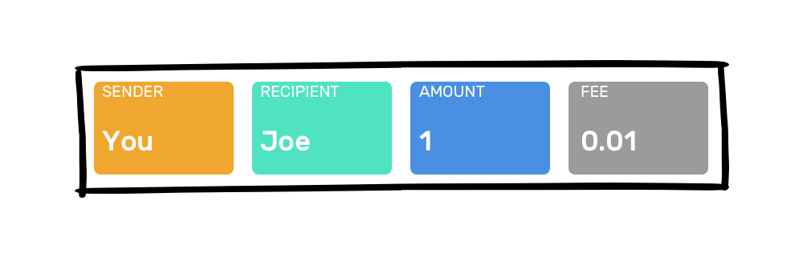
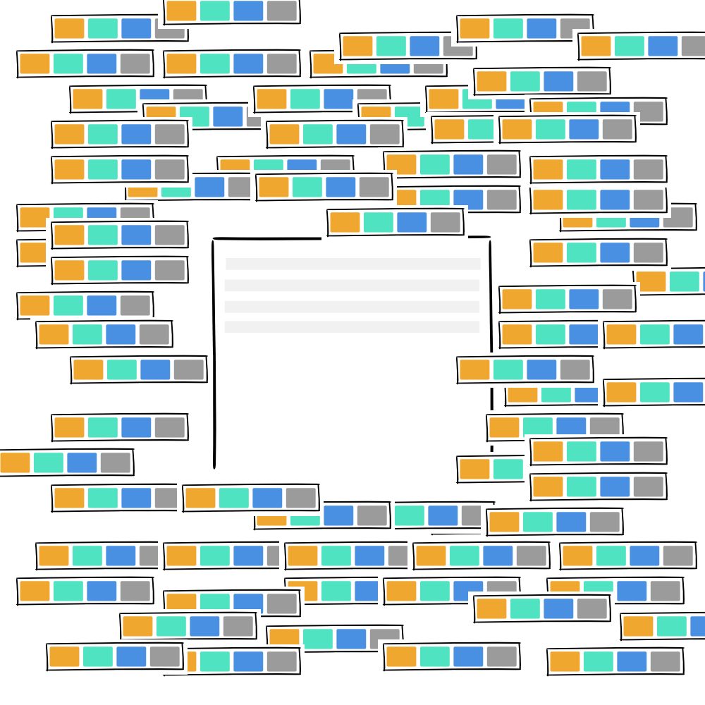
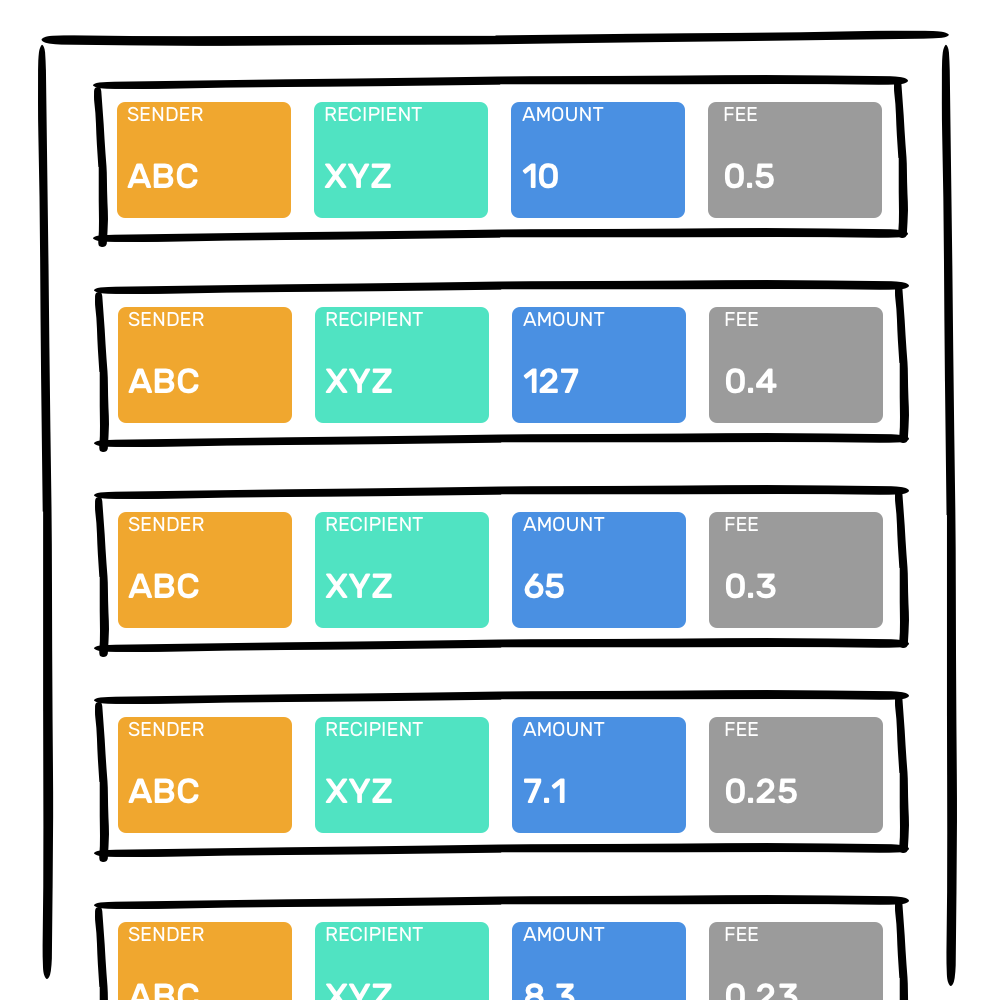
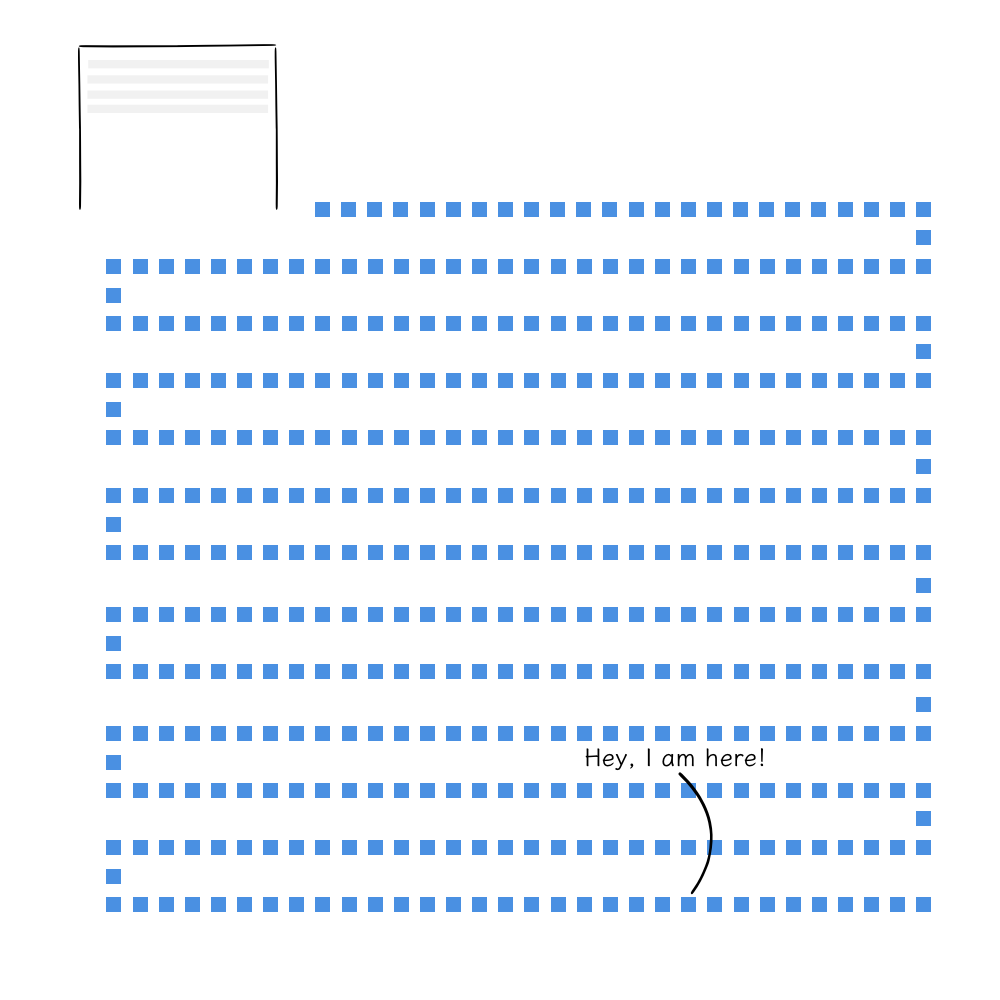
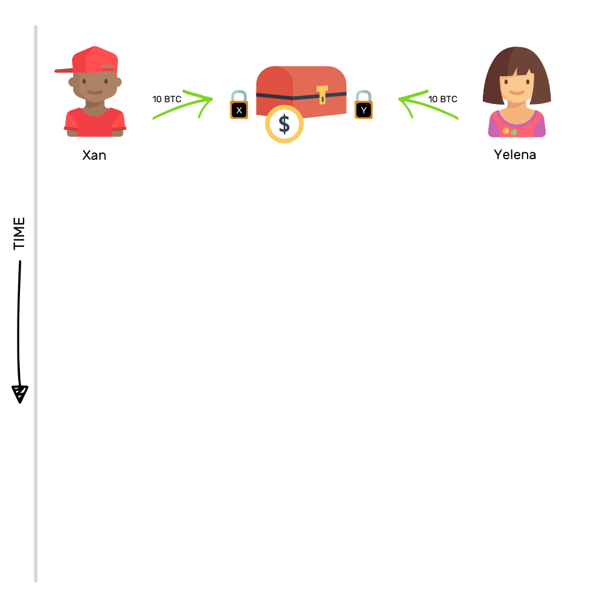
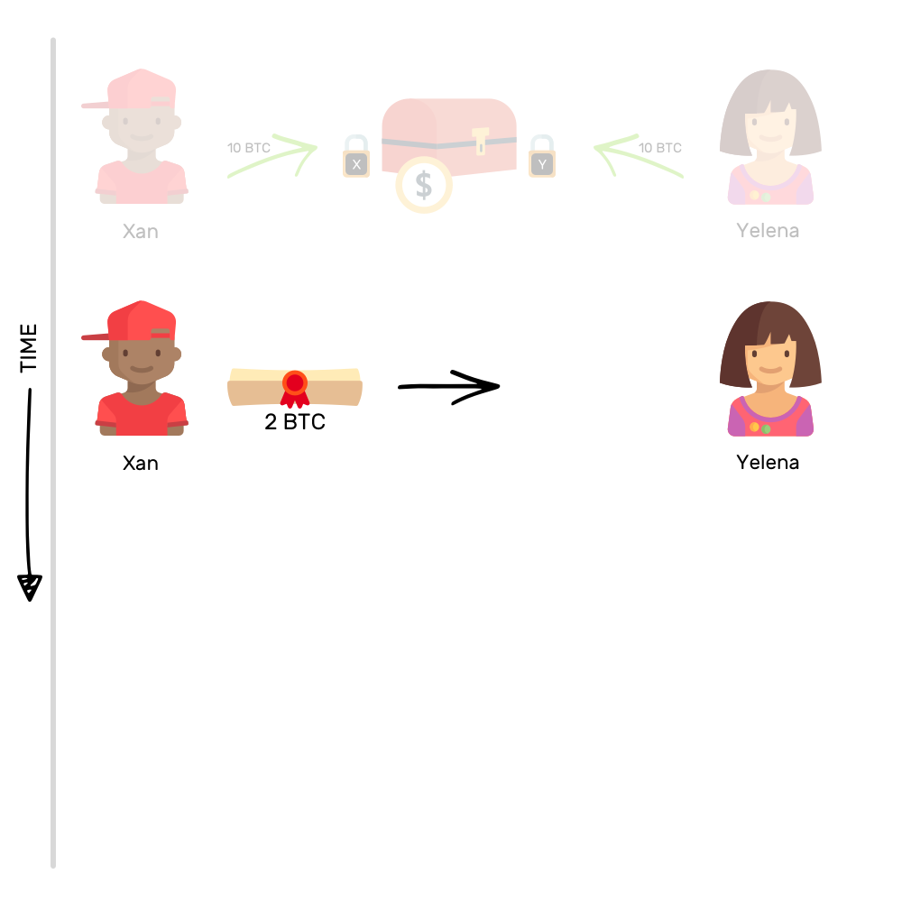
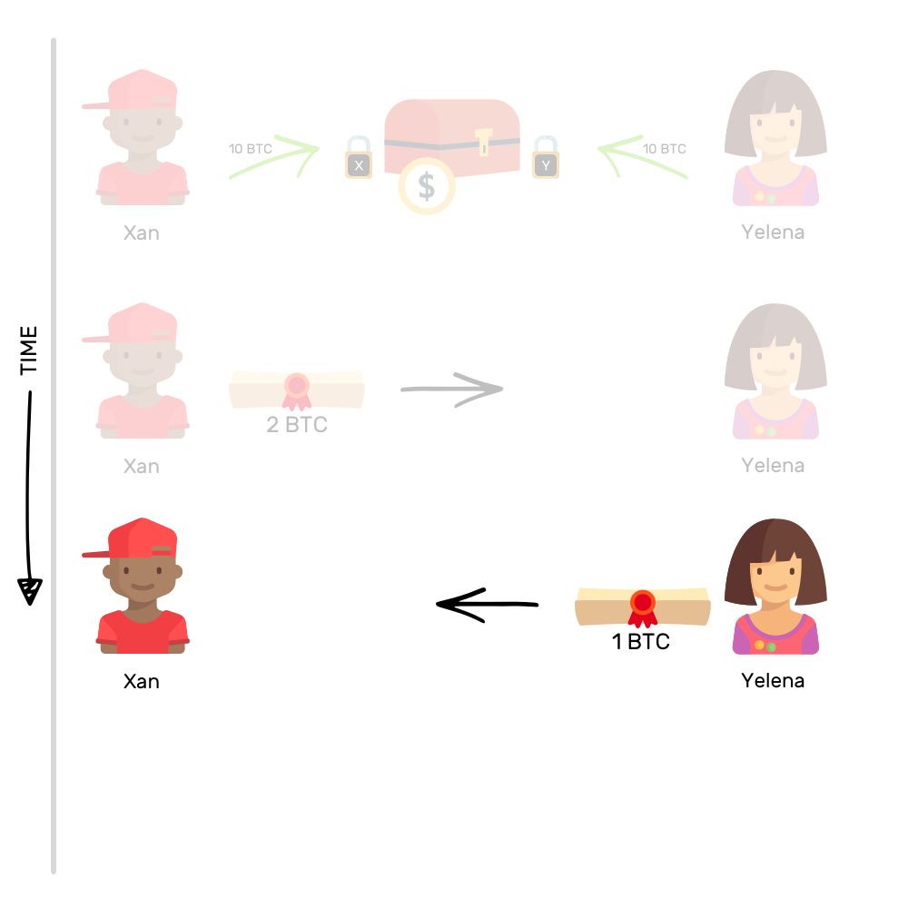
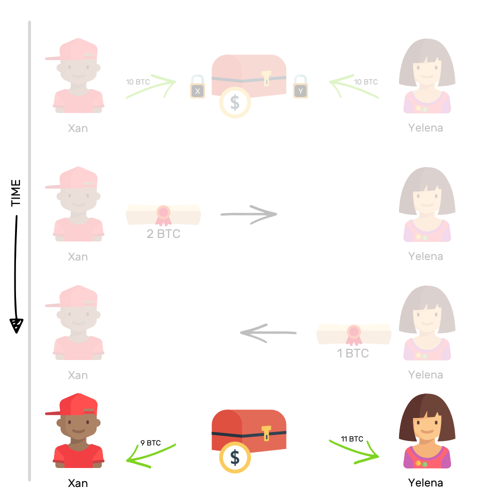
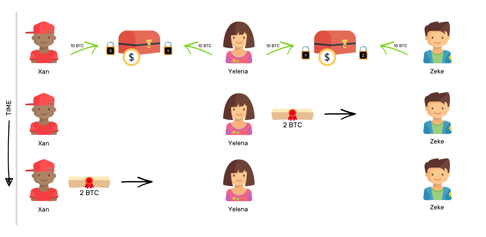

How to explain Lightning Network to your non-technical friends? 如何向你的非技术朋友解释闪电网络
------------------------------------------------------

> 本文翻译自：https://hackernoon.com/lightning-network-explained-d4615c12ad09
>
> 译者：[区块链中文字幕组](https://github.com/BlockchainTranslator/EOS) [小丹](https://github.com/zhuangjun)
>
> 翻译时间：2017-11-18

---------------------------

**Blockchains are slow.** And therefore, expensive. If I had to send you some Bitcoins, you’d receive them in about a couple of hours and I’d have paid a heavy transaction fee too. With such a reputation, how will Blockchains take over the world?

**区块链很慢，** 因此也很昂贵。如果我要给你发送一些比特币, 你可能会需要几个小时才能收到他们, 并且我也要支付昂贵的交易费。用这样的名声, 区块链将如何接管世界？

Any idea that can solve the non-scalability of Blockchains is worth attention, time and effort. Lightning Network is one such idea. But before we understand the solution, we’ll need to understand the problem.
任何能解决区块链无法扩展的想法都值得关注，花时间和去努力。闪电网络就是这样的一个想法。但是在我们理解这个解决方案之前, 我们需要先理解这个问题。

If you’re already aware of the problem, you can directly jump to the next section.
如果您已经知道该问题, 可以直接跳转到下一节。

### Why Blockchains are slow?
### 为什么区块链会慢呢？

> “I am a slow walker, but I never walk back.” — Abraham Lincoln

> “我走的慢, 但我从不走回头路。— Abraham Lincoln

**Think of a Blockchain as a register.** And this register contains several pages (blocks) where each page has several transactions. As soon as a page has been filled with transactions, it needs to be added to the register before starting to record transactions on the next page.

把区块链当作一个登记簿。此登记簿包含多个页面 (块), 其中每个页面都有多个交易。一旦一个页面被交易填满, 就需要将它添加到登记簿中, 然后再开始在下一页记录交易。

Before a page (block) can be added to the register (chain), there’s some processing that needs to be done to ensure that everyone agrees with the contents it contains. The process approximately takes 10 minutes (for Bitcoin Blockchain) for each block.

在将页面 (块) 添加到登记簿 (链) 之前, 需要做一些处理, 以确保每个人都认可它所包含的内容。每个区块大约需要10分钟 (对于比特币区块链) 。 

Imagine, you send 1 BTC to your friend, Joe. The transaction will look something like this.

想象一下, 你发送 1 BTC 给你的朋友Joe。这笔交易看起来就像是这样。

Among other things, a transaction contains information about the sender, the recipient, the amount and the transaction fee.

除其他事项外, 交易记录包含有关发件人、收件人、金额和交易费用的信息。

### Wait a minute, transaction fee?

### 等一下， 交易费？

> “A consultant is someone who saves his client almost enough to pay his fee.” — Arnold H. Glasow

> “顾问是一个能帮客户省下足够多的钱够来支付咨询费的人."-Arnold H. Glasow

Yes, there’s an additional fee. You can pay it to incentivize miners to include your transaction in a block as soon as possible. There’s no set price and it’s entirely up to you how much you are willing to pay to speed up the process. The higher the fee, faster your transaction will go through.

是的, 还有额外的费用。你可以支付它来激励矿工尽快把你的交易包含在区块中。没有固定的价格, 这完全取决于你愿意付出多少来加速这个过程。费用越高, 交易就会越快。

At any given moment, there are several transactions available to be recorded on the current page.

在任何给定的时刻, 当前页上都有几笔交易要被记录。

The miners, i.e. computers working in the Blockchain network, have to decide which of the available transactions to include in the current block. To help them decide, they look at which transactions yield the most rewards — meaning that the transactions with the highest transaction fee will be included first.

矿工, 即在区块链网络中工作的计算机, 必须决定在当前区块中包括哪些可用的交易。为了作出决定, 他们会看哪些交易收益最高, 这意味着交易费越高的将越先包括在内。

If there are enough transactions with a higher transaction fee than yours to fill up the block, your transaction will have to wait in queue. The wait can last from a few minutes to a few hours. And sometimes, even days. The more you pay in transaction fees, the quicker your transaction is processed.

如果填补该区块的交易中，有足够的交易比您的费用高, 您的交易将不得不等待在队列中。等待可以持续几分钟到几个小时。有时甚至是几天。 您支付的交易费用越多, 处理事务的速度就越快。

That’s why Blockchains are slow, and therefore, expensive for everybody to start using. Ideally, the adoption of Blockchain would mean more transactions happening but as the number of transactions goes up, the network will become slow, making a hurdle for adoption. What a paradox!

这就是为什么区块链是缓慢的, 因此, 每个人开始使用的时候会是昂贵的。理想情况下, 人们接受区块链将意味着发生更多的交易, 但随着交易数量的增加, 网络将变得缓慢, 从而成为接受的障碍。真是自相矛盾!

Lightning Network (LN) is a potential solution to the problem.

闪电网络 (LN) 是解决这个问题的潜在方法。

> “Thunder is good, thunder is impressive; but it is lightning that does the work.” — Mark Twain

> “雷声很好, 雷声很厉害;但是有了闪电才有雷声” - 马克吐温

The idea behind LN is that not all transactions are required to be recorded on the Blockchain.

闪电网络背后的想法是, 不是所有的交易都需要记录在区块链上。

Imagine you and I transact quite a few times among ourselves. In such a case, we can bypass recording the transactions on the Blockchain and carry them off the chain.

想象一下, 仅你和我交易了好几次。在这种情况下, 我们可以绕过记录在区块链上的交易, 并在链下进行。

In the simplest terms, how it’ll work is — we’ll open something called a payment channel between us and record its opening on the Blockchain. Now, you and I can transact any number of times through this payment channel and it can stay open for any number of hours, days, weeks or decades. The only time we would touch the Blockchain ever again will be when we would want to close the channel. Then, we’ll write the final status of the transactions that occurred through the channel on the Blockchain.

简单来说, 它的工作方式是-我们将打开一个付款通道, 并把通道的开放记录在区块链上。现在, 您和我可以通过这个支付通道进行任何次数的交易, 并且可以在任何时间、天数、周数或十年内保持开放状态。我们唯一一次接触区块链的时间将会是我们想要关闭通道的时候。然后, 我们把这个通道上产生的交易的最终状态写在区块链上。

Using this idea of payment channel, we can create a network of payment channels such that it would be only rarely required to transaction on the Blockchain. Imagine there are three characters — Xan, Yelena and Zeke.

使用这种支付渠道的想法, 我们可以创建一个支付通道的网络, 这样就很少需要在区块链交易。试想, 有三个人-Xan, Yelena和Zeke。

If Xan and Yelena have a payment channel opened between them and Yelena and Zeke have a payment channel opened between them, then Xan can send money to Zeke via Yelena.

如果Xan和Yelena有一个开着的付款通道，Yelena和Zeke也有一个开着的付款通道， 那么Xan可以通过Yelena向Zeke转账。

Suppose Xan wants to send 2 BTC to Zeke, Yelena will send 2 BTC to Zeke and Xan will reimburse Yelena with 2 BTC.

假设Xan要给Zeke转 2 BTC , 那Yelena将发送 2 BTC 给Zeke, Xan将补偿Yelena 2 BTC。

That’s what the idea of Lightning Network is. Because you won’t be touching the Blockchain often, the transactions will be happening at lightning speed. As you might have guessed by now, all the magic happens in the payment channels. Let’s learn the magic trick then.

这就是闪电网络的概念。因为不会经常接触区块链, 交易会以闪电般的速度发生。你可能已经猜到了, 所有的魔术都发生在支付通道。让我们学习魔术的把戏吧。

> “Individually, we are one drop. Together, we are an ocean.” — Ryunosuke Satoro

> “单独的, 我们是一个水滴。在一起, 我们聚会成海洋.-Ryunosuke Satoro

It’s like a safety deposit box where two people deposit equal amounts of money and each put a lock on it.

这就像一个保险柜, 两个人存入等量的钱, 每个人都把它锁上。

This action of depositing equal amounts of money in a common box is recorded on the Blockchain in the form of an ‘Opening Transaction’ and thereafter a payment channel is open between those two people.

这种在一个共同的盒子里存入等量的钱的行为以 "开放交易" 的形式记录在区块链上, 然后在这两个人之间开了一个付款通道。

The idea behind locking money in such a box is that no one person can spend the money in the box without the other. The money in this box is then used to transact between each other.

把钱锁在这样一个盒子里背后的想法是, 没有人可以单独花盒子里的钱。这个盒子里的钱是用来互相交易的。

Imagine, Xan and Yelena pool in 10 BTC each in the common box. And now, if Xan wants to send 2 BTC to Yelena, how would he do that?

想象一下, Xan和Yelena在这个共同的盒子里各自放了 10 BTC。现在, 如果Xan想发送 2 BTC 到Yelena, 他会怎么做呢？

To do that, he would transfer a promise of ownership for two of his Bitcoins in the common box to Yelena. After this transfer of promise, if the box is unlocked, Xan will be able to take 8 BTC from it and Yelena will be able to claim 12 BTC.

为了做到这一点, 他转移了两个比特币的承诺转让给Yelena。在这个诺言转移后, 如果箱子解锁, 那Xan将能得到 8 BTC， Yelena将能取得到12 BTC。

But they will not open the box because they want to continue transacting between themselves. That’s the beauty of this arrangement.

但是他们不会打开这个盒子, 因为他们想继续在他们之间进行交易。这就是这种安排的妙处。

Now, if the next day, Yelena has to send 1 BTC to Xan, she would do the same — transfer a promise of ownership for one of her Bitcoins to Xan. After these two transactions, if the box is opened, Xan can claim 9 BTC and Yelena can get 11 BTC.

现在, 如果第二天, Yelena需要发送 1 BTC 到Xan, 她会做同样的事情-转让她的比特币所有权的承诺给Xan。在这两笔交易后, 如果盒子被打开, Xan可以得到 9 BTC 和Yelena可以得到 11 BTC。

To imagine how off-chain transactions look like, consider this:

若要想象链下交易是什么样的, 请考虑以下事项:

To sum it up, payment channel is nothing but a combination of pooling some money together and then transferring the promise of ownership of the pooled-in money in the agreed upon manner. If ever either of Xan or Yelena wants to close the channel, they can.

总而言之, 支付通道只不过是把一些钱汇集在一起, 然后把池里钱的所有权的承诺以商定的方式转移。如果Xan或Yelena任何一个想关闭通道, 他们就可以。

Closing a channel would simply mean opening up the box and taking the money inside. This opening of the box happens on the Blockchain and the who owns how much from the box is recorded forever.

关闭通道只意味着打开盒子, 取出里面的钱。开箱行为发生在区块链上，谁能从盒子里取得多少将被永远记录。

That’s how payment channels work. But that doesn’t even come close to defining their true potential. Their true power is unleashed when two or more payment channels work together to form a network — The Lightning Network.

这就是付款通道的工作方式。但这甚至还不能确定他们的真实潜能。当两个或两个以上的支付渠道共同组成一个网络--闪电网络时, 他们真正的力量就被释放了。

> “Great things are done by a series of small things brought together.” — Vincent Van Gogh

> "伟大的事情是由一系列的小东西一起带来的. Vincent Van Gogh

LN works by moving the value from the ownership of the Bitcoins to the promise of ownership of the Bitcoins.

闪电网络的工作原理是用比特币拥有权的承诺来替代拥有权。

This shift is huge. Like always, we will use an example to understand this. Imagine there are three people — Xan, Yelena and Zeke — such that there’s a payment channel open between Xan and Yelena, and there’s another channel open between Yelena and Zeke. Note that Xan and Zeke have no payment channel between them.

这种转变是巨大的。像往常一样, 我们会用一个例子来理解这一点。试想, 有三人-Xan, Yelena和Zeke-这样, Xan和Yelena之间有一个开着的支付通道, Yelena和Zeke之间也有一个开着的支付通道。请注意, Xan和Zeke之间没有付款通道。

In such a situation, if Xan wants to transfer 2 BTC to Zeke, he can use the payment channel between Yelena and Zeke to do that. How does that look like?

在这种情况下, 如果Xan想转移 2 BTC 到Zeke, 他可以使用Yelena和Zeke之间的支付通道来做到这一点。那看起来像什么？

Xan asks Yelena to transfer a promise of 2 BTC to Zeke on Yelena-Zeke payment channel and then he reimburses Yelena with 2 BTC on Xan-Yelena channel.

Xan要求Yelena通过Yelena-Zeke支付通过将 2 BTC 的承诺转让给Zeke, , 然后他在Xan-Yelena通道偿还Yelena与 2 BTC。

With such network of payment channels, a huge chunk of transactions can be off-loaded from the Blockchain to be carried out off the chain, therefore, freeing up the chain’s bandwidth. Using a network of payment channels, millions of transactions can happen, and that too without a hefty transaction fee.

有了这样的支付通道网络, 一大块的交易可以在链下进行, 因此, 释放了链的带宽。通过网络支付通道, 数百万的交易变得可能, 而且也没有高额的交易费。

----------------------------------------------------

#### 区块链中文字幕组

致力于前沿区块链知识和信息的传播，为中国融入全球区块链世界贡献一份力量。

如果您懂一些技术、懂一些英文，欢迎加入我们，加微信号:w1791520555。

[点击查看项目GITHUB，及更多的译文...](https://github.com/BlockchainTranslator/EOS)

#### 本文译者简介

小丹 区块链技术爱好者， 欢迎加微信号 zhuangjun0606 交流。

本文由币乎社区（bihu.com）内容支持计划赞助。

版权所有，转载需完整注明以上内容。

----------------------------------------------------

