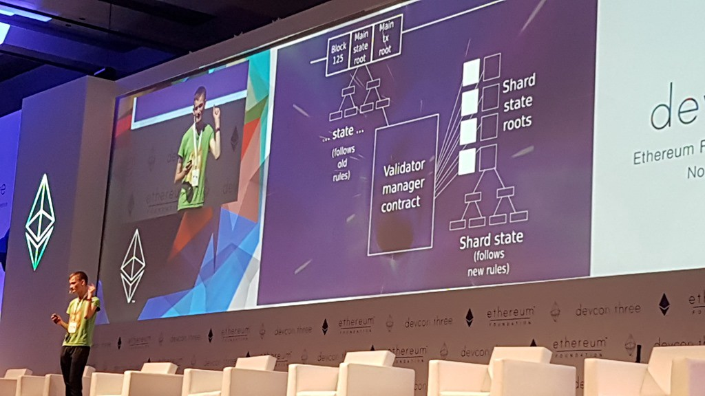
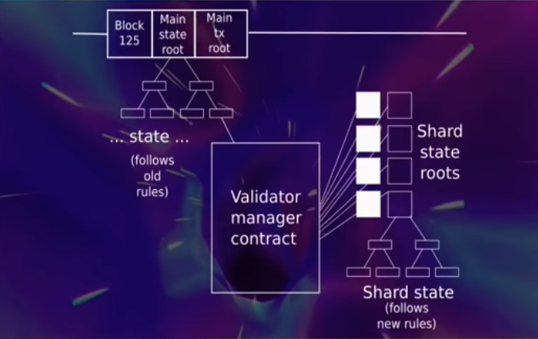
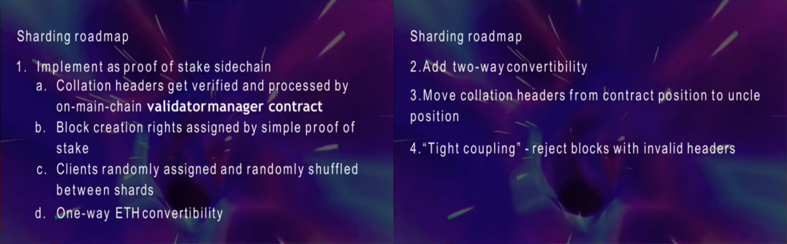
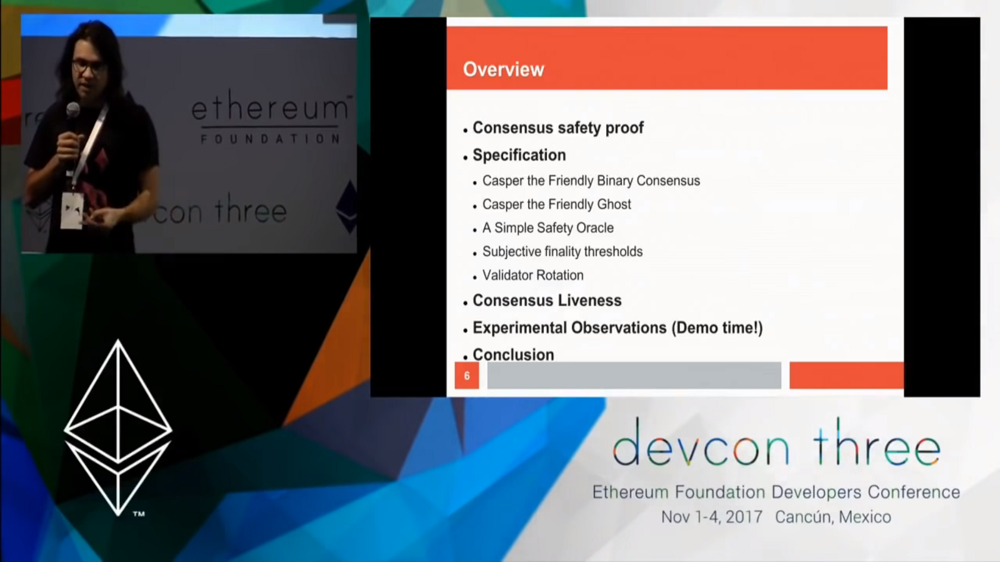
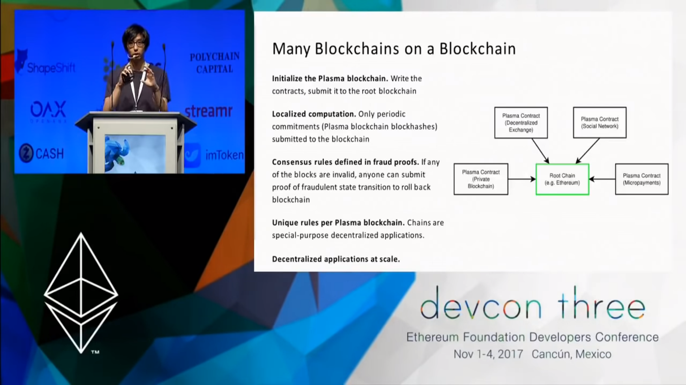
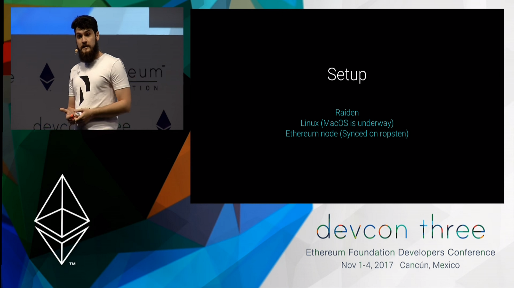

How Will Ethereum Scale? Top Talks from Devcon3 Summarized 以太坊将如何扩展？Devcon3 热门讲座总结

------------------------------------------------------

> 本文翻译自：https://hackernoon.com/https://medium.com/loom-network/how-will-ethereum-scale-top-talks-from-devcon3-summarized-f51f99ed4602
>
> 译者：[区块链中文字幕组](https://github.com/BlockchainTranslator/EOS) [小丹](https://github.com/zhuangjun)
>
> 翻译时间：2017-11-25

---------------------------

Devcon, also known as the Ethereum Foundation’s developers conference, is one of the most important annual events in the cryptocurrency space. It is a conference “by developers for developers” which “is designed to help inform, educate and address interests of the Ethereum R&D community”.

Devcon, 也被称为以太坊基金会的开发者大会, 是最重要的年度事件之一, 在数字货币圈子中。这是一个 “服务于开发者的开发者" 的会议, "旨在帮助告知、教育和解决以太坊的研发社区的利益"。

It should be noted that even though it is a technical conference, individuals interested in familiarizing themselves with Ethereum and blockchain technology should not be discouraged from attending. As stated in the official page, “this year’s participant demographic is also the most international and globally diverse one to date” which shows how individuals are increasingly getting involved in Ethereum research and development.

应该指出的是, 尽管这是一个技术性会议, 但不应劝阻有兴趣了解以太坊和区块链技术的个人参加。如官方网页所述, "今年的参与者人口也是最国际化和全球性的多样化的一年", 这表明个人越来越多地参与以太坊的研究和开发。

This article will discuss the most important talks on scalability that were presented this year. If you have the time, I strongly recommend that you watch the whole talks — look for the timestamped “Link” in every section. But if not, this article will give you the broad strokes.

本文将讨论今年提出的关于可伸缩性的最重要的会谈。如果您有时间, 我强烈建议您观看整个谈话-在每个部分中寻找 "链接"。但如果你没时间观看, 这篇文章也会给你介绍要点。

--------

**Designing Maximally Verifying Light Clients and Sharding, Vitalik Buterin**

**设计最大化的验证轻客户端和切分, Vitalik Buterin**

Day 1 | Link | Sharding & Ethereum’s future| 30 minutes

Image source: https://davidburela.wordpress.com/

第一天 |友情链接 |切分和以太坊的未来 |30分钟

图像来源: https://davidburela.wordpress.com/

Firstly, Vitalik performs a recap on 
Ethereum’s achievements so far:

*  Steady increase of adoption
* Lack of attacks to the network
* Successful hard fork to Byzantium.
* North America and Europe have the most concentration of nodes, but nodes are starting to appear across every corner of the world.

首先, Vitalik 对以太坊迄今取得的成就进行了回顾:

* 接受度稳步增加
* 少有网络攻击
* 成功实施拜占庭硬分叉
* 北美和欧洲有最集中的节点, 但节点也开始出现在世界的每个角落。

He then proceeds to talk about how scalability in Ethereum is tied to solving the scalability trilemma (previously mentioned here). Furthermore, solving the trilemma requires also solving the so-called Data Availability Problem. That is, for a secure blockchain infrastructure, you need not only to be able to verify the validity of data, but you need to ensure that the data is available to all the network participants (Joseph Poon’s talk below discusses this in more detail). Then there are other bottlenecks towards scalability such as disk reads and the fact that every node has to validate the whole state. He also mentions that smart contracts not being parallelizable at the moment is a huge problem.

然后, 他谈到了以太坊的可伸缩性与解决可伸缩性的三元悖论紧密相关 (在此之前提到过)。此外, 解决三元悖论还需要解决数据可用性的问题。即, 对于安全的区块链基础架构, 您不仅需要能够验证数据的有效性, 而且还需要确保数据对所有网络参与者都可用 (下面的Joseph Poon的谈话更详细地讨论了这一点)。然后还有其他一些可伸缩性的瓶颈, 例如磁盘读取和每个节点都必须验证整个状态。他还提到, 目前智能合约无法并行运行是一个巨大的问题。

The answer to these issues is sharding, essentially splitting the state of the blockchain into “universes” called “shards” that are allowed to communicate only asynchronously and split the load.

这些问题的答案是切分, 实质上是将区块链的状态分解为称为 "碎片" 的 "宇宙", 它们只允许异步通信和拆分负载。

> “Hard-forks” that make deep changes are hard since they take a long time to code and test and due to the 7 different client implementations might introduce consensus bugs. However, in order to reach a highly scalable network with new features these deep changes are much needed.

> 由于需要很长时间来编写代码和进行测试, 并且由于七种不同的客户端实现可能会引入共识的错误, 因此很难进行深刻变化的 “硬分叉"。然而, 为了达到一个具有新功能的高度可伸缩的网络, 这些深刻的变化是非常需要的。

“1 blockchain, 2 systems”. The main chain remains as is, while a “Validator Manager Contract” that runs PoS manages the shards’ block creation process

"1 区块链, 2 系统"。主链保持不变, 而运行 PoS 的 “验证人管理合约" 管理分区区块的创建过程

The slide above is a potential visualization of the sharding system that is currently being implemented. In addition to the current system, there will be a Validator Manager Contract (VMC), running Proof of Stake consensus for a sharding system that exists inside the mainchain. It will keep track of Validators and manage the rights of when someone is allowed to create blocks in each shard (also called collations). It will not verify the full blocks of each shard or contain a copy of all consensus rules. Essentially the VMC acts as a light client for the proper communication between shards and the mainchain, and between shards themselves (he later shows the communication between mainchain and collations potentially happening via an RPC interface).

上面的幻灯片是当前正在实施的切分系统的可视化。除了当前的系统之外, 还将有一个验证人管理合约 (VMC),  为主链内的切分系统运行PoS共识。它将跟踪验证人并管理允许某人在每个分区 (也称为归类) 中创建块的权限。它不会验证每个分区的完整块, 也不会包含所有协商一致规则的副本。本质上, VMC 充当一个轻客户端, 用于在分区和主链之间以及分区之间进行适当的通信 (他后来显示了通过 RPC 接口可能发生的主链和分区之间的通信)。

That way, you have C shards, each being able to process C transactions, essentially achieving C² scalability, compared to the mainchain’s C (simplified version without big O notation). The mainchain shall slowly transition to full Proof of Stake, while each shard shall function under Proof of Stake via the Validation Manager Contract. The “main shard” will be the version of Ethereum focusing on security while the new shards will be focusing on fast evolution and deployment of new features.

这样, 您就有了 c 分区, 每个都能够处理 c 事务, 实质上实现了 C²的可伸缩性, 与主链的 c (没有大 O 表示法的简化版本) 相比。主链应慢慢过渡到全部PoS, 而每个分区应该通过VMC在PoS下工作。”主要分区" 将是以太坊关注安全的版本, 而新的分区将集中在快速进化和新功能的部署上。

Finally, he proceeds to give a total roadmap for sharding and the planned changes for Ethereum as a whole (Binary Merkle trees, EVM upgrades, Parallelizability, Stateless Clients).

最后, 他继续给出切片的总体路线图以及以太坊整体的计划更改 (二进制默克尔树、EVM 升级、并行和无状态客户端)。

Sharding Roadmap (remember: Collations := Shards)

切分路线图 (记住: 归类: = 碎片)

This is one of the most important talks of the whole conference and I highly recommend that you watch it closely.
这是整个会议中最重要的一次会谈, 我强烈建议您密切关注。

More information: Sharding | Data Availability Problem

更多信息: 切分 |数据可用性问题

----------

**Casper the Friendly GHOST: A correct-by-construction blockchain, Vlad Zamfir**

**Casper， 友好的幽灵: 一个正确的区块链构建, Vlad Zamfir**

Day 1 | Link | Casper & Consensus protocols | 25 minutes

第一天 |友情链接 |Casper 和 共识协议 |25分钟

Vlad’s talk is about building secure consensus protocols, and how Casper achieves that. Firstly he describes consensus safety (i.e. how to transition from one consensus state to another in a smooth manner, refer to the draft release for more details). He specifies a “binary consensus protocol” which is able to decide on the value of a bit (0 or 1) and then proceeds to extend that to a blockchain-based consensus protocol for deciding on valid blocks.

Vlad的演讲是关于建立安全的共识协议, 以及如何实现这一点。首先, 他描述了共识安全 (即如何以一种平滑的方式从一个共识状态过渡到另一个协商一致的情况, 请参阅发布稿以了解更多细节)。他指定了一个 "二进制协商一致协议", 它能够决定位 (0 或 1) 的值, 然后继续将其扩展到基于区块链的协商一致协议以确定有效的区块。

He compares traditional Byzantine Fault Tolerant (BFT) protocols with Blockchain consensus protocols and argues how Casper provides both the high safety from the first and the low latency of the latter. Should note here that traditional BFT protocols aim for finalization per block, while in blockchains it is accepted that a block cannot be reverted after enough blocks have been “chained” to it.

他将传统的拜占庭容错 (BFT) 协议与区块链协商一致的协议进行了比较, 并论证了Casper是如何优先确保安全性，再确保低延迟性的。这里应该注意到, 传统的 BFT 协议的目标是每个块的最后定稿, 而在区块链中, 它被接受, 在足够的区块被 "链接到" 之后, 区块不能被还原。

The talk concludes with a demo illustrating how consensus is reached while forks happen continuously and by Vlad stating that other consensus protocols can be derived based on this specification.

该演讲结束时, Vlad演示了在分叉不断发生的情况下共识是如何达成的, 以及其他共识协议如果根据这个规范派生。

Note: I found this talk very complex and hard to follow, however I believe its concepts will become more clear as the ideas get more formalized and further research is done.

注: 我发现这个演讲非常复杂, 很难理解, 但是我相信随着思想的进一步形式化和进一步研究的进行, 它的概念将变得更加清晰。

More information: Casper draft release | “Correct-by-construction” implementation
更多信息: Casper的草稿发行 |”正确构建" 的实施

---------------

**Plasma Overview and Transaction Data Availability, Joseph Poon**

**Plasma概述和交易数据可用性, Joseph Poon**

Day 1| Link | Plasma & Sidechains | 20 minutes

第一天 |友情链接 | Plasma和侧链 |20分钟

Joseph Poon’s talk on Plasma revolves around using plasmachains to achieve scalability. There will be a Plasma Smart Contract that will be used as a base layer in order for participants to spin up their own sidechains with custom rules and participants. The difference here is that these rules are fully enforcible on the mainchain, implying that if an actor acts maliciously in a plasmachain then he can get punished on the mainchain.

Joseph Poon关于Plasma的谈话围绕着使用 plasma链来实现可伸缩性。将有一个Plasma智能合约, 将作为一个基础层, 以使参与者用自定义规则和参与者来加速自己的侧链。这里的区别是, 这些规则是完全可以被主链强制推行的, 这意味着, 如果一个节点在plasma链上有恶意行为, 那么他将在主链上得到惩罚。

The idea is that a plasmachain’s block hashes get periodically submitted to the main chain. Many state changes might occur between some Plasma Blocks but only a few of them get included to the root chain. The goal is to be able to sustain billions of transactions per second. As long as someone does not dispute the data being broadcasted, the root chain does not do any computation. In the case of fraud, a merklized proof is submitted and if it is valid, the state gets rolled back and the actors who committed the fraud get penalized.

这个想法是， plasma链的区块哈希会周期性地提交到主链中。许多状态变化可能发生在一些Plasma区块之间, 但只有少数几个被纳入到根链中。目标是能够维持每秒数十亿的交易。只要有人不否认正在广播的数据, 根链就不会进行任何计算。在欺诈的情况下, 提交一个默克尔证明, 如果是有效的, 状态将得到回滚和犯下欺诈的行为者受到惩罚。

He provides interesting points on the data availability problem. What do you do if some plasma block is being witheld or a state is invalid? I highly suggest you watch that part of the talk as me paraphrasing it would do more harm than good.

他提供了有关数据可用性问题的有趣的观点。如果某些plasma区块正在 witheld 或状态无效, 您该怎么办？我强烈建议你看一下演讲中的那部分，我说出来的话会弊多于利。

For greater scalability, he states that you can create “blockchains of blockchains” achieving further decentralization and increasing throughput. The presentation concludes with a step-by-step process of how a transaction would be executed in a plasmachain, and how a dishonset actor would get penalized by the mainchain’s contract.

为了获得更大的可伸缩性, 他指出您可以创建 “区块链上的区块链", 从而实现进一步的权力下放和增加吞吐量。演示文稿的结尾是一个逐步文档,说明如何在 plasma 链中执行交易, 以及不诚实的节点如何被 主链的合同所惩罚。

---------------

**“Ethereum can basically be the Supreme Court of computation across the world.”**

The Raiden Network, Augusto Hack, Loredana Cirstea

**“以太坊基本上可以成为全世界最高的计算法院。”**

雷电网络, Augusto Hack, Loredana Cirstea

Day 2 | Link | Raiden & State-Channels | 20 minutes

第二天 |友情链接 |雷电网络和状态-渠道 |20分钟

While Plasma describes scaling by using sidechains with specific rules, Raiden leverages payment channels which can scale Ethereum to handle up to millions of transactions per second. In short, payment channels are a way to repeatedly transfer value between parties by offchain transactions without having to pay the huge transaction fees induced by transacting multiple times.

Plasma描述了通过使用侧链和特定规则进行伸缩, 而雷电利用可以扩展以太坊的支付渠道来处理每秒数以百万计的交易。简言之, 支付渠道是一种通过链下交易, 不需要支付多次交易所引发的巨额交易费而重复转让当事人之间价值的方式。

The first part of the talk covers guidelines on Raiden’s RESTful HTTP API, and how it can be used to build applications that implement micropayments. It is currently available only for Linux (and soon for MacOS). In order to use it you first need to download Raiden and have a synchronized Ethereum node (with an exposed JSON-RPC interface).

讲座的第一部分介绍了雷电的 rest 风格 HTTP API 的指导原则, 以及如何使用它构建实现支付的应用程序。它目前只适用于 Linux (很快就 MacOS)。为了使用它, 您首先需要下载雷电, 并有一个同步的以太坊节点 (带有暴露的 JSON-RPC 接口)。

REST API:

Automatic channel management: PUT /api/1/connections/<token>
Manually open a channel: PUT /api/1/channels
Change the channel state: PATCH /api/1/channels/<address>
Make transfers: POST /api/1/transfers/<token>/<target>
Watch for events: GET /api/1/events/tokens/<address>

REST API:

自动通道管理: PUT/api/1/connections/<token>
手动打开通道: PUT/api/1/channels
更改通道状态: PATCH/api/1/channels/<address>
进行传输: POST/api/1/transfers/<token>/<target>
监视事件: GET/api/1/events/tokens/<address>

In the second part of the talk μRaiden (read micro-raiden) is presented. It is an offchain unidirectional payment channel framework, currently available on the Kovan test network and will be deployed to the mainnet by the end of November.

在谈话的第二部分μRaiden (读作微雷电) 被提出。它是一个链下的单向支付渠道框架, 目前可在Kovan测试网络上使用, 并将在11月底之前部署到主链。

μRaiden’s use cases include but are not limited to paywalled content (by paying per minute/second) and implementing machine to machine micropayments with two onchain transactions — one to open the payment channel, and one to close it. That way, APIs, data storage and data usage can be monetized, on the blockchain. This also opens up a lot of monetization opportunities of IoT applications.

μRaiden 的用例包括但不限于网站内容 (通过支付每分钟/秒) 和实现机器支付与两个链上交易-一个打开付款渠道, 一个关闭它。这样, api、数据存储和数据的使用都可以在区块链上货币化。这也为很多应用提供了许多赚钱的机会。

Loredana Cirstea then proceeds to do a live demo of a car-robot which is connected to μRaiden that gets paid for each movement command that gets sent to it via a payment channel. When the channel closes, an onchain transaction gets executed, paying the robot for its services.

Loredana Cirstea 然后继续做一个汽车机器人的现场演示, 这是连接到μRaiden, 它的每次移动都通过支付渠道得报酬。当通道关闭时, 将执行一个链上的交易, 向机器人支付其服务费用。

Conclusion

结论

Devcon gave us a lot information to process. At the end of Vitalik’s talk he mentions that applications which do not require maximum security can proceed to “Layer 2”, for rapid development and experimentation, without having to go through “Layer 1” where they’d have to go through rigorous testing and long fuzzing periods in order to ensure stability.

Devcon 给了我们很多信息。在 Vitalik 的谈话结束时, 他提到, 不需要最高安全性的应用程序可以在 "2 层", 用于快速开发和实验, 而不必经过 "1 层”。 在"1 层”里的程序必须经过严格的测试和漫长而模糊的时期, 以确保稳定。

This strongly aligns with our vision of scalability at Loom Network. To build large decentralized applications on the scale Twitter or Youtube, developers will need strong layer 2 solutions. We envision a network of sidechains, where each sidechain can make its own trade-off between cost/speed and decentralization/security, and developers can split up their application according to which parts of the app require the highest levels of security and which require the highest speeds.

这与我们在Loom网络上的可伸缩性的愿景是一致的。为了在 Twitter 或 Youtube 上建立大规模的分散应用, 开发者需要强大的2层解决方案。我们设想一个侧链网络, 每个链可以在成本/速度和分权/安全之间做出自己的权衡, 开发者可以根据应用程序的哪些部分需要最高级别的安全性和需要最高的速度

We’re excited to see the progress in scaling Ethereum, and look forward to continued efforts to make it the backbone for the new decentralized web!

我们很高兴看到以太坊扩展性上的进展, 并期待着继续努力, 使之成为新的去中心化网络的骨干!

----------------------------------------------------

#### 区块链中文字幕组

致力于前沿区块链知识和信息的传播，为中国融入全球区块链世界贡献一份力量。

如果您懂一些技术、懂一些英文，欢迎加入我们，加微信号:w1791520555。

[点击查看项目GITHUB，及更多的译文...](https://github.com/BlockchainTranslator/EOS)

#### 本文译者简介

小丹 区块链技术爱好者， 欢迎加微信号 zhuangjun0606 交流。

本文由币乎社区（bihu.com）内容支持计划赞助。

版权所有，转载需完整注明以上内容。

----------------------------------------------------
