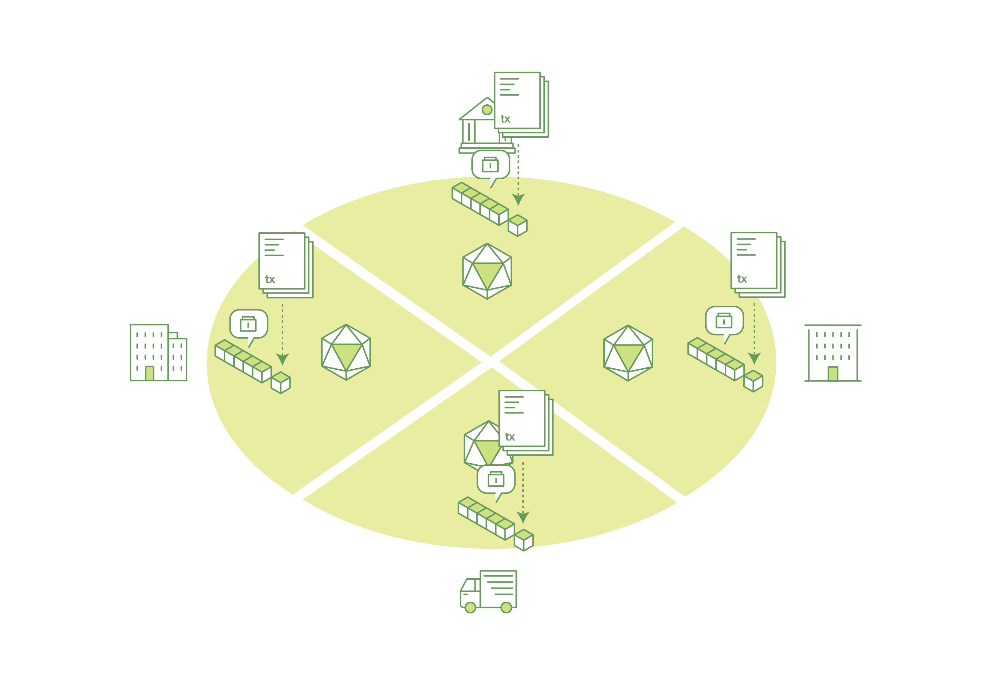
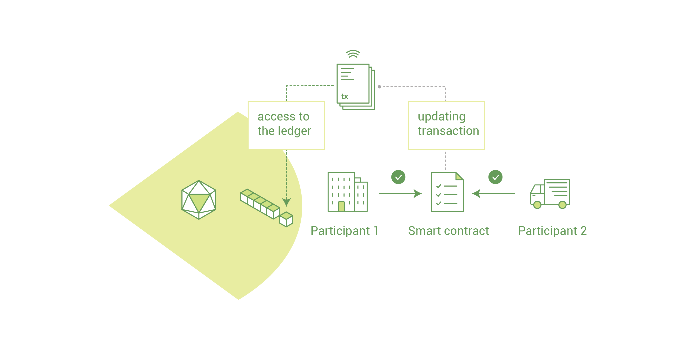
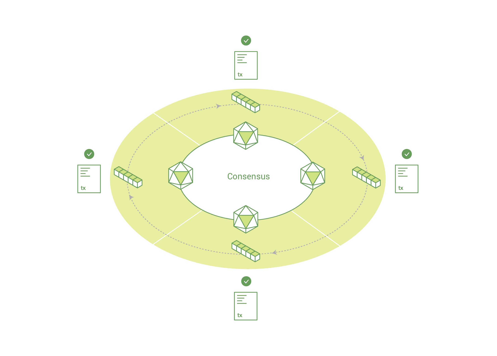
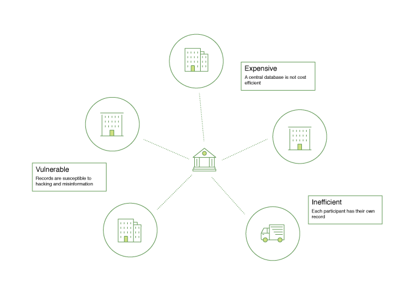
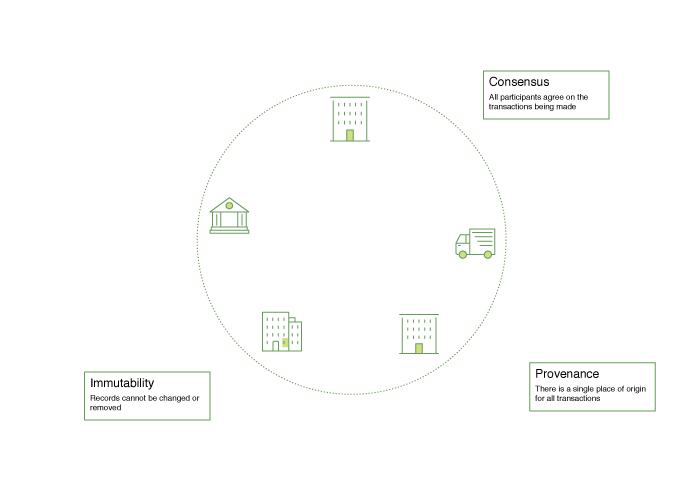

## Introduction | （核心概念）简介

> 本文翻译自：http://hyperledger-fabric.readthedocs.io/en/latest/blockchain.html
>
> 译者：[区块链中文字幕组 胡亮](https://github.com/gumoon)
>
> 翻译时间：2018-2-7

Hyperledger Fabric is a platform for distributed ledger solutions underpinned by a modular architecture delivering high degrees of confidentiality, resiliency, flexibility and scalability. It is designed to support pluggable implementations of different components and accommodate the complexity and intricacies that exist across the economic ecosystem.

超级账本 Fabric 是一个分布式的账本解决方案平台。它基于模块化的架构设计，提供高等级的保密性、弹性、灵活度和扩展性。它设计为支持不同组件的可插拔，并且适应经济生态系统的复杂性。

Hyperledger Fabric delivers a uniquely elastic and extensible architecture, distinguishing it from alternative blockchain solutions. Planning for the future of enterprise blockchain requires building on top of a fully vetted, open-source architecture; Hyperledger Fabric is your starting point.

超级账本 Fabric 提供一个独特的弹性和可扩展的体系结构，区别于其它的区块链解决方案。对企业的未来规划需要区块链建构在支持全面审查，开源架构上；超级账本 Fabric 是你的起点。

We recommended first-time users begin by going through the rest of the introduction below in order to gain familiarity with how blockchains work and with the specific features and components of Hyperledger Fabric.

我们建议新手用户通过以下的介绍去熟悉区块链如何工作以及超级账本 Fabric 详细的功能和组件。

Once comfortable – or if you’re already familiar with blockchain and Hyperledger Fabric – go to [Getting Started](http://hyperledger-fabric.readthedocs.io/en/latest/getting_started.html) and from there explore the demos, technical specifications, APIs, etc.

一旦熟悉完，或者如果你已经熟悉了区块链和超级账本 Fabric，跳到 [从这里开始](http://hyperledger-fabric.readthedocs.io/en/latest/getting_started.html) 去学习demo，技术规范，接口，等等。

## What is a Blockchain? | 什么是区块链？
### A Distributed Ledger | 一个分布式账本

At the heart of a blockchain network is a distributed ledger that records all the transactions that take place on the network.

区块链网络的核心是一个分布式账本，它记录着网络上发生的所有交易。

A blockchain ledger is often described as **decentralized** because it is replicated across many network participants, each of whom **collaborate** in its maintenance. We’ll see that decentralization and collaboration are powerful attributes that mirror the way businesses exchange goods and services in the real 
world.

区块链账本经常被描述为是去中心化的，因为它被众多网络参与者复制，他们共同维护同一账本。类比真实世界的商品和服务的交易，区块链的去中心化和相互合作是强大的属性。

In addition to being decentralized and collaborative, the information recorded to a blockchain is append-only, using cryptographic techniques that guarantee that once a transaction has been added to the ledger it cannot be modified. This property of immutability makes it simple to determine the provenance of information because participants can be sure information has not been changed after the fact. It’s why blockchains are sometimes described as **systems of proof**.

除了去中心化和协作之外，记录到区块链上的信息只能增加不能减少，使用密码学技术保证一旦交易被添加进账本则不能再修改。不可纂改性使得查明信息的来源变得容易，因为上链之后所有参与方就确保了信息不会被修改。这也是为什么区块链有时候被描述为：**证据系统**。

### Smart Contracts | 智能合约

To support the consistent update of information – and to enable a whole host of ledger functions (transacting, querying, etc) – a blockchain network uses **smart contracts** to provide controlled access to the ledger.

为了支持信息的一致性更新，以及开启完整的账本功能（转账、查询等），区块链网络使用**智能合约**来访问账本。

Smart contracts are not only a key mechanism for encapsulating information and keeping it simple across the network, they can also be written to allow participants to execute certain aspects of transactions automatically.

智能合约不仅是操作数据和简化跨网操作的关键机制，而且允许参与者自动执行交易的某些部分。

A smart contract can, for example, be written to stipulate the cost of shipping an item that changes depending on when it arrives. With the terms agreed to by both parties and written to the ledger, the appropriate funds change hands automatically when the item is received.

例如，智能合约能够编程规定运输物品的成本根据不同的到达时间而不同。如果双方都同意这个条款并且被写入账本，当物品到达时，会自动支付适当地的资金。

### Consensus | 共识

The process of keeping the ledger transactions synchronized across the network – to ensure that ledgers only update when transactions are approved by the appropriate participants, and that when ledgers do update, they update with the same transactions in the same order – is called **consensus**.

保持账本交易跨网同步的过程---确保账本只更新被合适的参与者批准的交易，并且所有参与者以相同的顺序更新相同的交易。这个过程被称为：**共识**。

We’ll learn a lot more about ledgers, smart contracts and consensus later. For now, it’s enough to think of a blockchain as a shared, replicated transaction system which is updated via smart contracts and kept consistently synchronized through a collaborative process called consensus.

稍后，我们将学习更多关于账本、智能合约和共识的知识。到此为止，这足够我们去想象区块链是一个共享的、交易被复制的系统，它通过智能合约来更新，通过一个叫做共识的合作过程来保持一致性同步。

## Why is a Blockchain useful? | 为什么区块链有用？
### Today’s Systems of Record | 现有的记录系统

The transactional networks of today are little more than slightly updated versions of networks that have existed since business records have been kept. The members of a **Business Network** transact with each other, but they maintain separate records of their transactions. And the things they’re transacting – whether it’s Flemish tapestries in the 16th century or the securities of today – must have their provenance established each time they’re sold to ensure that the business selling an item possesses a chain of title verifying their ownership of it.

今天的交易网络只是自从商业记录被存储以来稍微改进的版本的网络。**商业网络**的成员之间的业务往来，他们各自存储自己的交易记录。当他们记录的时候，不管是十六世纪的佛兰德地毯还是今天的证券，都必须每次建立他们卖出物品的来源来确保他们销售的物品能拥有一条链，以此证明他们是物品的拥有者。

What you’re left with is a business network that looks like this:

保留下来的就是这样一个商业网络：

Modern technology has taken this process from stone tablets and paper folders to hard drives and cloud platforms, but the underlying structure is the same. Unified systems for managing the identity of network participants do not exist, establishing provenance is so laborious it takes days to clear securities transactions (the world volume of which is numbered in the many trillions of dollars), contracts must be signed and executed manually, and every database in the system contains unique information and therefore represents a single point of failure.

现在技术已经推动这个过程从石板刻写和纸质文件夹到硬盘和云平台，但是底层的结构没有变化。管理网络所有参与者标识的统一系统不存在。建立来源如此艰难，以至于花费长时间去结算证券交易（全世界的交易量为万亿美元级别）。合约必须签，而且人工执行。系统中的每个数据库包含独特的信息，因此相当于一个失败的单点。

It’s impossible with today’s fractured approach to information and process sharing to build a system of record that spans a business network, even though the needs of visibility and trust are clear.

基于今天破碎的信息和共享流程来建立一个跨业务往来的记录系统是不可能的，即使必需的透明度和信任是清晰的。

### The Blockchain Difference | 区块链的不同

What if instead of the rat’s nest of inefficiencies represented by the “modern” system of transactions, business networks had standard methods for establishing identity on the network, executing transactions, and storing data? What if establishing the provenance of an asset could be determined by looking through a list of transactions that, once written, cannot be changed, and can therefore be trusted?

要替代由“现代”交易系统所代表的效率低下的老鼠窝，商业网络有标准的方法来在网络上建立身份，执行交易和存储数据吗？要构建资产的来源，是否可以通过查看一个曾经写过的、不能改变的、可以信任的交易列表来确定呢？

That business network would look more like this:

那个商业网络可能看起来更像这样：

This is a blockchain network. Every participant in it has their own replicated copy of the ledger. In addition to ledger information being shared, the processes which update the ledger are also shared. Unlike today’s systems, where a participant’s **private** programs are used to update their **private** ledgers, a blockchain system has **shared** programs to update **shared** ledgers.

这就是区块链网络。网络中的每个参与方都拥有自己复制的账本拷贝。除此之外，账本信息被共享，更新账本的过程也被共享。区别于今日既有的交易网络的参与者的**私有**程序只被用于更新他们**私有**的账本，区块链系统使用**共享**的程序更新**共享**账本。

With the ability to coordinate their business network through a shared ledger, blockchain networks can reduce the time, cost, and risk associated with private information and processing while improving trust and visibility.

因为共享账本带有校正商业网络的能力，区块链网络能够减少时间，成本，以及使用私有信息和建立信任和透明度的过程中的风险。

You now know what blockchain is and why it’s useful. There are a lot of other details that are important, but they all relate to these fundamental ideas of the sharing of information and processes.

你已经知道区块链是什么并且知道它为什么有用了。还有一些其它重要的细节，但是它们都基于信息和过程共享这个基本概念。

## What is Hyperledger Fabric? | 什么是超级账本 Fabric?
The Linux Foundation founded Hyperledger in 2015 to advance cross-industry blockchain technologies. Rather than declaring a single blockchain standard, it encourages a collaborative approach to developing blockchain technologies via a community process, with intellectual property rights that encourage open development and the adoption of key standards over time.

Linux基金会于2015年创建了超级账本项目，来推动跨行业区块链技术的发展。区别于声明一个单一的区块链标准，它鼓励通过社区合作的方法来开发区块链技术，开放知识产权并且采用成熟的关键标准。

Hyperledger Fabric is one of the blockchain projects within Hyperledger. Like other blockchain technologies, it has a ledger, uses smart contracts, and is a system by which participants manage their transactions.

超级账本 Fabric 是超级账本区块链项目集中的一个。跟其他区块链技术一样，它有一个账本，使用智能合约，并且是一个由参与者管理交易的系统。

Where Hyperledger Fabric breaks from some other blockchain systems is that it is **private** and **permissioned**. Rather than an open permissionless system that allows unknown identities to participate in the network (requiring protocols like Proof of Work to validate transactions and secure the network), the members of a Hyperledger Fabric network enroll through a **Membership Service Provider (MSP)**.

超级账本 Fabric 区别于其他区块链系统的特点是：私有和带权限的。不像其它的开放系统，允许未知身份的人参与网络（使用工作量证明协议来验证交易、确保网络安全），超级账本 Fabric网络引入了 MSP（成员管理服务） 。

Hyperledger Fabric also offers several pluggable options. Ledger data can be stored in multiple formats, consensus mechanisms can be switched in and out, and different MSPs are supported.

超级账本 Fabric 也提供很多可选的选项。账本数据可以使用多种格式存储，共识截止可以来回切换，并且支持不同的 MSP。

Hyperledger Fabric also offers the ability to create channels, allowing a group of participants to create a separate ledger of transactions. This is an especially important option for networks where some participants might be competitors and not want every transaction they make - a special price they’re offering to some participants and not others, for example - known to every participant. If two participants form a channel, then those participants – and no others – have copies of the ledger for that channel.

超级账本 Fabric 也提供创建频道的功能，允许一组参与方创建一个单独的交易记录账本。这是一个特别重要的功能。因为网络中一些参与者可能是竞争对手，他们不希望自己的每一笔交易都被所有人知道。例如，提供给不同的参与者不同价格时。如果两个参与者创建一个频道，那么其他参与者都不能从这个频道复制账本。

### Shared Ledger | 共享账本

Hyperledger Fabric has a ledger subsystem comprising two components: the **world state** and the **transaction log**. Each participant has a copy of the ledger to every Hyperledger Fabric network they belong to.

超级账本 Fabric 有一个账本子系统，它有两个部分组成：世界态和交易记录。每个参与者都有一个它们所属超级账本 Fabric 网络的账本的一个拷贝。

The world state component describes the state of the ledger at a given point in time. It’s the database of the ledger. The transaction log component records all transactions which have resulted in the current value of the world state. It’s the update history for the world state. The ledger, then, is a combination of the world state database and the transaction log history.

世界态组件表示某一时刻的账本状态。它是账本数据库。交易记录组件记录了导致世界态当前值的所有交易记录。它是世界态的更新历史。因此，账本是世界态数据库和交易记录历史的集合。

The ledger has a replaceable data store for the world state. By default, this is a LevelDB key-value store database. The transaction log does not need to be pluggable. It simply records the before and after values of the ledger database being used by the blockchain network.

账本为世界态提供一个可替代的数据存储。默认情况下，这个数据存储是  LevelDB 键值对数据库。交易记录不需要可插拔。它简单的记录区块链网络中被使用的账本数据库前后的值即可。

### Smart Contracts | 智能合约

Hyperledger Fabric smart contracts are written in **chaincode** and are invoked by an application external to the blockchain when that application needs to interact with the ledger. In most cases chaincode only interacts with the database component of the ledger, the world state (querying it, for example), and not the transaction log.

超级账本 Fabric 智能合约以链码的形式被编写。当应用程序需要跟账本交互时，被应用从外部调用，来访问区块链。大部分情况下，链码仅仅跟账本的数据库组件、世界态（例如：查询）交互，不跟交易记录交互。

Chaincode can be implemented in several programming languages. The currently supported chaincode language is Go with support for Java and other languages coming in future releases.

链码可以使用多种编程语言实现。当前支持编码链码的编程语言是GO。Java和其他语言的支持，会在未来的版本中增加。

### Privacy | 隐私

Depending on the needs of a network, participants in a Business-to-Business (B2B) network might be extremely sensitive about how much information they share. For other networks, privacy will not be a top concern.

根据网络的需要，B2B网络的参与者可能对他们共享的数据非常敏感。而对于其他网络，隐私并不是首要考虑的。

Hyperledger Fabric supports networks where privacy (using channels) is a key operational requirement as well as networks that are comparatively open.

超级账本 Fabric 既支持隐私是关键运营要求的网络，也支持相当开放的网络。

### Consensus | 共识

Transactions must be written to the ledger in the order in which they occur, even though they might be between different sets of participants within the network. For this to happen, the order of transactions must be established and a method for rejecting bad transactions that have been inserted into the ledger in error (or maliciously) must be put into place.

交易必须按发生的顺序写入账本，即使在网络中不同的参与者集合之间。为了让这件事发生，交易的顺序必须建立好，并且处理错误（或恶意）交易的方法必须被插入账本的适当位置。

This is a thoroughly researched area of computer science, and there are many ways to achieve it, each with different trade-offs. For example, PBFT (Practical Byzantine Fault Tolerance) can provide a mechanism for file replicas to communicate with each other to keep each copy consistent, even in the event of corruption. Alternatively, in Bitcoin, ordering happens through a process called mining where competing computers race to solve a cryptographic puzzle which defines the order that all processes subsequently build upon.

这是一个计算机科学深入研究的领域，并且取得了很多成绩，每个方案都有不同的权衡点。例如：PBFT(实用拜占庭容错）可以为文件在不同节点间复制并且保持一致性提供机制，即使个别节点欺诈。另外，对于比特币，由一个叫挖矿的过程来排序。挖矿是指，相互竞争的计算机比赛解决一个密码学谜语。

Hyperledger Fabric has been designed to allow network starters to choose a consensus mechanism that best represents the relationships that exist between participants. As with privacy, there is a spectrum of needs; from networks that are highly structured in their relationships to those that are more peer-to-peer.

超级账本 Fabric 则设计为允许网络启动者选择一个最能代表参与者相互关系的共识机制。与隐私一样，有各种各样的需求；从高度结构化关系的网络到更对等的网络。

We’ll learn more about the Hyperledger Fabric consensus mechanisms, which currently include SOLO, Kafka, and will soon extend to SBFT (Simplified Byzantine Fault Tolerance), in another document.

我们将在其它文档中学习更多超级账本 Fabric 共识机制，当前包括了 SOLO， Kafka，以及将会扩展 SBFT (简化拜占庭容错）。

## Where can I learn more? | 我可以去哪里继续学习？
### [Getting Started](http://hyperledger-fabric.readthedocs.io/en/latest/getting_started.html) | [从这里开始](http://hyperledger-fabric.readthedocs.io/en/latest/getting_started.html)

We provide a number of tutorials where you’ll be introduced to most of the key components within a blockchain network, learn more about how they interact with each other, and then you’ll actually get the code and run some simple transactions against a running blockchain network. We also provide tutorials for those of you thinking of operating a blockchain network using Hyperledger Fabric.

我们提供了很多手册，在那里，你将了解到很多区块链网络关键组件，学习节点间怎么交互，并且，你将动手拉取代码并在区块链网络上运行一些简单交易。我们也为想使用超级账本 Fabric 操作区块链网络的用户提供了教程。

### [Hyperledger Fabric Model](http://hyperledger-fabric.readthedocs.io/en/latest/fabric_model.html) | [超级账本 Fabric 模型](http://hyperledger-fabric.readthedocs.io/en/latest/fabric_model.html)

A deeper look at the components and concepts brought up in this introduction as well as a few others and describes how they work together in a sample transaction flow.

进一步的学习组件和概念，并且通过一个简单的交易流来描述他们怎么组合在一起工作的。

----------------------------------------------------

#### 区块链中文字幕组

致力于前沿区块链知识和信息的传播，为中国融入全球区块链世界贡献一份力量。

如果您懂一些技术、懂一些英文，欢迎加入我们，加微信号:w1791520555。

[点击查看项目GITHUB，及更多的译文...](https://github.com/BlockchainTranslator/)

#### 本文译者简介

胡亮 区块链技术爱好者，欢迎加微信号:haobaba-huliang

本文由币乎社区（bihu.com）内容支持计划赞助。

版权所有，转载需完整注明以上内容。

----------------------------------------------------

