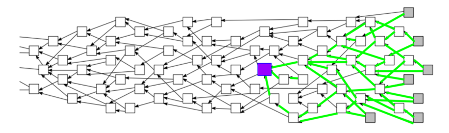

## What is Iota? | 什么是Iota
### Cryptocurrency and The Internet of Things | 数字货币和物联网
------------------------------------------------------

> 本文翻译自：https://hackernoon.com/what-is-iota-5da4446602a
>
> 译者：[区块链中文字幕组](https://github.com/BlockchainTranslator/EOS) [小丹](https://github.com/zhuangjun)
>
> 翻译时间：2017-12-11

---------------------------
A cryptocurrency provides this trick of trusted exchange without a mediator. Or at least, the protocol acts as the mediator. Most of today’s coins need a blockchain to achieve this balance.

数字货币提供了可信任交换, 而不需要中介，或者至少, 充当中介的协议。现在的代币大部分需要区块链来实现这种平衡。

Iota wants to upset that paradigm. The team believes they’ve found the next generation of cryptocurrency; a faster, cheaper, and more secure way of managing trust. They call it a Tangle. This is what it looks like.

Iota想要打乱这一范式。团队相信他们已经找到了下一代数字货币，一种更快、更便宜、更安全的管理信任的方式。他们把这叫做Tangle。 这就是它的样子。

Each of those white dots represents a transaction. In order for a transaction to be approved, it needs to verify two other transactions. The green lines represent verifications.

每个白色点代表一个交易。为了通过一个交易, 它需要验证另外两个交易。绿线代表验证。

So when you want to add a transaction to the system, you pick two other transactions at random, check them to make sure that their associated keys and balances are valid, then bundle them with your own transaction and a little Proof of Work. That bundle gets sent out to the network to be reviewed and verified by the next generation of transactions.

因此, 当您要向系统添加交易时, 您可以随机选择另外两个交易, 检查它们的关联密钥和余额是否有效, 然后将它们与您自己的交易捆绑起来, 并提供少量的工作量证明。该捆绑包将被发送到网络, 由下一代交易进行审阅和验证。

Proof of Work protects the network against spam attacks or sybil attacks. Both attacks require that the attacker issue a high volume of transactions. With Proof of Work in place, each transaction requires sacrificing some processing power. This means it’s a lot harder and less attractive to generate the number of transactions that an attacker would need in order to disrupt the system.

工作量证明保护网络免受垃圾邮件攻击或女巫攻击。这两种攻击都要求攻击者发出大量交易。有了工作量证明, 每个交易都需要牺牲一些处理能力。这意味着, 攻击者为了破坏系统而需要的交易数量要困难得多, 也不那么吸引人。

Cryptocurrencies that employ Proof of Work usually farm out the heavy lifting to miners. In return for contributing hashing power, miner’s receive rewards. So it’s noteworthy that Iota incorporates this processing as an element of a transaction. This system of distributing Proof of Work across the network helps to explain two of Iota’s most interesting features.

基于工作量证明的数字货币通常把繁重的工作放到矿工那里。作为贡献哈希算力的回报, 旷工得到奖励。值得注意的是, Iota将此处理作为交易的一个元素。这种通过网络分发工作量证明的系统有助于解释Iota的两个最有趣的特性。

Iota does not require transaction fees. Because the network is set up in such a way that in order to participate, you must contribute, each transaction is essentially earning it’s keep through Proof of Work. The absence of transaction fees means that Iota should be very well-suited to processing microtransactions.

Iota不需要交易费用。因为网络是建立在这样一种方式: 为了参与, 你必须贡献, 每笔交易基本上是赚取它的工作量证明。不需要交易费意味着应该非常适合处理小额交易 "。

Additionally, the team claims that their network‘s’ efficiency will increase as it scales. To get an idea of how this might work, let’s take a look at what happens when the network starts to flood.

此外, 团队声称, 随着规模的增加, 他们的网络效率将会提高。为了了解这种方法的工作方式, 让我们来看看当网络有大量节点的时候会发生什么。

Imagine that purple square represents the burrito you bought for lunch. Each of those green lines is a verification that either directly or indirectly verifies that you paid for your burrito. You can see in the case above that after only a few generations, the system has reached a state where any new transaction that is verified indirectly enforces verification of your transaction.

想象一下, 紫色广场代表你午餐买的玉米煎饼。每一个绿色的线是一个验证, 直接或间接验证你支付了你的玉米煎饼。在上面的例子中, 您可以看到, 在仅几代之后, 系统已经达到了一个状态, 即任何被验证的新交易都间接地强制对您的交易进行验证。

So even if the network is randomly segmented and distributed across devices, you’ve got this situation where you can broadcast a transaction and very quickly, provided the transaction is valid, you’ll have the entire network standing up to vouch for you.

因此, 即使网络是随机分割和分布在不同的设备, 你有这样的情况下, 你可以广播的交易非常快, 只要交易是有效的, 你将有整个网络站起来为你作证。

It’s a cool concept. If you’ve got the time, patience and math proficiency, the Tangle whitepaper breaks it down to show exactly how increased load pushes the Tangle to a threshold where transactions are almost instantly verified by all incoming traffic to the network. You might also check out this youtube video. They touch on this concept at around 19:45.

这是一个很酷的概念。如果你有时间、耐心和数学能力, 可以看Tangle的白皮书，那里它分部分精确介绍了，增加的负载如何将Tangle推到一个阈值, 在那里, 交易几乎可以立即被所有传入网络的流量验证。你也可以看看这个 youtube 视频。他们在19:45 左右触及这个概念。

### The Coordinator

### 协调员

At scale, Iota promises some impressive features: fast transaction verifications, zero fees, increased security, etc. But the network is not yet operating at scale.

在规模上, Iota承诺了一些令人印象深刻的特点: 快速交易核查, 零收费, 增加安全性等。但是网络还没有大规模运作。

In order to keep things on track during these early stages, Iota relies on what’s referred to as a Coordinator. The Coordinator is intended to protect the network while transaction volume is low. The plan is to disable this system when the network hits a high enough transaction volume to stand on it’s own.

为了使事情在这些早期阶段保持正轨, Iota依赖于被称为协调员的东西。协调员旨在当交易量较低时保护网络, 。计划是在网络有足够高的交易量时禁用此系统。

This leads to one of the key criticisms of Iota. It’s been argued that, because Iota transactions are subject to this Coordinator, and specific details on the Coordinator’s functionality are not public, Iota in it’s current state is effectively ‘centralized’.

这导致了一个对Iota的主要批评。有人争辩说, 因为Iota交易受此协调员的影响, 而且协调员的功能的具体细节不是公开的, 所以它的当前状态实际上是 “中心化" 的。

We can’t access the Coordinator’s source code, so we can’t be entirely sure of what it does. However, without it, it would seem that the network is exposed to certain vulnerabilities. This suggests that the Coordinator maintains some influence over factors related to these vulnerabilities.

我们不能访问协调员的源代码, 因此我们不能完全确定它的行为。但是, 如果没有它, 网络似乎会暴露在某些漏洞中。这表明协调员对与这些漏洞相关的因素保持了一定的影响力。

According to Sergey Ivancheglo, an Iota cofounder, the Coordinator is currently being used to guard against a 34% attack. The 34% attack refers to a scenario in which an attacker is able to contribute over 1/3 of the network’s total processing power, allowing it to produce conflicting transactions. So, what keeps the Coordinator from orchestrating that 34% attack itself?

据 Sergey Ivancheglo, 一个Iota创始人, 协调员目前正在使用, 以防止34% 的攻击。34% 攻击指的是攻击者能够贡献超过1/3 的网络总处理能力, 从而产生冲突的交易。那么, 是什么让协调员不去策划34% 的攻击呢？

While the Iota team probably wouldn’t have a good reason to sabotage their own network, that doesn’t exactly prove that they can’t find one. Still, there is a mechanism in place that should help to check the power of the Coordinator.

虽然Iota没有一个很好的理由去破坏他们自己的网络, 但这并不能证明他们找不到一个。尽管如此, 还是有一种机制可以帮助核查协调员的权力。

Any Iota user may independently operate a full node. In so doing, you contribute processing power to maintain the validity of the Tangle. Now, without mining rewards, there’s no economic incentive to running one of these nodes. But a node can benefit a user if they are already processing a large number of transactions, if they operate an app or system that benefits from a reliable connection to the Tangle or a reduction in transaction times, or if they simply desire to support the Iota ecosystem.

任何Iota的用户都可以独立操作一个完整的节点。你贡献处理能力, 以保持有效的Tangle。现在, 没有采矿奖励, 就没有经济动力去运行其中的一个节点。但是, 如果一个节点已经在处理大量的交易, 如果他们操作一个应用程序或系统, 从可靠的连接到Tangle或交易时间的减少, 或者他们只是希望支持Iota的生态系统, 那么它就可以使用户受益。

It should be noted that the 34% referenced here isn’t referring to a simple 34% of the network. Devices linking to Iota’s Tangle are exposed to only a subset of the full network. So, even if you were able to generate enough processing power to very quickly gain control of 34% of the network, you’d also have to actually find the entire network.

应该注意的是, 这里引用的34% 不是简单的34% 的网络。连接到Iota’s的Tangle的设备只暴露在整个网络的一个子集中。因此, 即使您能够生成足够的处理能力, 以便很快获得控制34% 的网络, 您也必须找到整个网络。

### Curl and the JINN Processor
### Curl和JINN处理器

Iota‘s original Proof of Work algorithm is known as Curl. Curl employs ternary logic, which means information is stored in three-states as opposed to the traditional two of binary logic. Ternary logic is a fixture of early Russian computing. It can provide certain types of performance benefits over traditional logic, but is not quite practical to find or manufacture processors that take advantage of this logic at the moment.

Iota原始的工作量证明被称为Curl。Curl采用三元逻辑, 这意味着信息存储在三状态, 而不是传统的二进制逻辑。三元逻辑是早期俄语计算机的一个设备。它使得某些类型的性能优势优于传统的逻辑,  但目前发现或制造能利用这种逻辑优点的处理器还不现实。

That’s where JINN comes in. JINN Labs is still in ‘stealth mode,’ but they appear to be working on an asynchronous ternary processor that’s intended for use in Internet of Things applications. Several of Iota’s key team members appear to have been involved in it’s development. The assumption then is that the JINN processor will be able to hash Iota’s ternary algorithm more efficiently than traditional processors. The goal being that the JINN ternary processor will someday be integrated into the majority of Internet of Things devices, offering these devices the ability to exchange value, and securing Iota as the medium by which to do so.

这就是需要JINN的地方。 JINN实验室仍然处于 "隐形模式", 但他们似乎正在研究一个异步三元处理器, 用于物联网应用。几个Iota’s的关键团队成员似乎参与了它的发展。当时的假设是, JINN处理器将能够比传统的处理器更有效地哈希Iota的三元算法。这一目标是, JINN三元处理器有朝一日将被整合到大多数的东西设备的互联网, 提供这些设备的能力, 以交换价值, 并确保Iota作为媒介,。

But the use of the Curl algorithm and ternary logic are the basis for another criticism of the Iota platform. This algorithm was developed by members of the Iota team. Being that cryptographic algorithms are entrusted with sensitive information, they generally undergo extensive evaluation before being used in real world applications.

但是, 使用Curl算法和三元逻辑是对Iota平台的另一个批评。这个算法是由Iota团队的成员开发的。由于加密算法被赋予敏感信息, 它们通常在实际应用中使用之前进行广泛的评估。

Neha Narula and her team at MIT argue that Iota’s cryptography has not been properly vetted. Narula claims her team was able to generate a collision in Iota’s hashing algorithm. That is, with practically available computing power, they were able to identify 2 keys that hashed to the same value. This could provide attackers the ability to generate conflicting transactions.

Neha Narula 和她在麻省理工学院的团队争辩说, Iota’s的哈希算法没有得到适当的审查。Narula 声称她的团队能够在Iota的哈希算法中产生冲突。即, 在实际可用的计算能力下, 他们能够找到两个键值,生成的哈希值相同。这使得攻击者可以生成冲突交易。

In Ivancheglo’s response to Narula’s report, he argues that the vulnerabilities were intentionally added to the code as a form of copy protection (which has given rise to other concerns) and that the Coordinator makes exploitation of those vulnerabilities impractical. He also argues that the uniqueness of the system warrants the risk of developing specialized cryptography. The team has apparently released some adjustments to the cryptography used for certain tasks that nullifies any security issue that may have existed.

在 Ivancheglo 对 Narula 的报告的答复中, 他认为, 这些漏洞是故意添加到代码中的一种形式的拷贝保护 (它引起了其他问题), 而且协调员使得利用这些漏洞是不现实的.他还认为, 该系统的独特性保证了开发专门加密的风险。该小组显然已对用于某些任务的加密进行了一些调整, 以抵消可能存在的任何安全问题。

Another justification for the use of Curl is that it incorporates the Winternitz One-Time Signature Scheme. Theoretically, quantum computing does not represent a significant advantage in processing the Winternitz hash, so Iota should prove resistant to potential future attacks as quantum computing comes within reach.

使用Curl的另一个理由是它包含了 Winternitz 的一次性签名方案。从理论上讲, 量子计算在处理 Winternitz 哈希方面并不具有明显的优势, 因此在量子计算达到一定范围时, 对潜在的未来攻击Iota将有抵抗能力。

### Flash Channels

### 闪光通道

Flash channels are a more recent addition to Iota’s services. Inspired by systems like the Lightning Network and Raiden, Flash Channels allow for private, off-network transactions. They provide a way for trusted parties to divert Iota transactions off of the Tangle.

闪光频道是对Iota’s服务的最新补充。受闪电网络和雷电等系统的启发, 闪光通道允许私人的、脱机的交易。它们为受信任的各方提供了一种方式, 可以把混乱的交易转移出去。

If you want to transact high volumes of iota, you have to wait for each transaction to process to the Tangle. This is likely to cause bottlenecks. Using Flash Channels, multiple parties deposit equal amounts of Iota into a multisignature account. Involved parties can then transact independently of the main Tangle. To close out transactions, they simply agree to release funds from the account. In this way, independent groups can process high volumes of transactions quickly by minimizing direct interaction with the Tangle.

如果你想处理大量的iota交易, 你必须等待每笔交易在Tangle中处理。这可能会导致瓶颈。使用闪光通道, 多个当事人存入等量的签名账户。参与方可以独立处理主要的Tangle。为了结束交易, 他们只要同意从帐户中释放资金。通过这种方式, 独立组可以用最少化的与Tangle的直接交互来快速处理大量的交易。

### The Coin

### 代币

A fixed total of 2,779,530,283,277,761 were created in Iota’s genesis block. Without miners, the system lacks a natural mechanism for distributing tokens, so Iota tokens were initially distributed through an ICO. The ICO raised around $584,000 for the Iota Foundation, the German entity responsible for Iota’s management and development. Current token distribution is visualized here. Check the current price here. Because there are so many Iota in existence, the Iota price as listed on exchanges is almost universally issued in terms of Miota (1,000,000 Iota). The high number of Iota in existence should serve to further promote Iota as an effective vehicle for very small transactions.

Iota的创世纪块上生成了固定的总数为2779530283277761个代币。在没有矿工的情况下, 该系统缺乏自然机制来分配代币, 因此, ICO 代币最初通过ICO来分发。ICO 公司，这个负责管理和发展的德国实体，筹集了大约58.4万美元的资金, 。当前的代币分布可在这里查看。当前价格在这里查看。因为存在如此多的Iota, 在交易所上市的Iota价格几乎是普遍发行的 Miota (100万Iota)。Iota大量的代币, 应该有助于进一步促进小额交易。

### The Team

### 团队

Iota’s basic structure was initially described by Serguei Popov in the Iota whitepaper. Popov looks to be a CS PHD, specialized in probability theory, who studied in Moscow and maintains a faculty position at UNICAMP in Brazil.

Iota’s的基本结构最初是由Serguei Popov描述在Iota白皮书。Popov看起来是一个 CS 博士, 专攻概率论, 他在莫斯科学习, 并在巴西的 UNICAMP 保持教员的地位。

The implementation of the described protocol was carried out by Sergey Ivancheglo and Dominik Schiener. According to this podcast interview with another one of Iota’s founders, David Sønstebø, Sergey Ivancheglo is the founder of Nxt. Ivancheglo launched Nxt in 2013 under the pseudonym BCNext. Ivancheglo has also commonly appeared under the pseudonym Come-from-Beyond.

所述协议的执行由Sergey Ivancheglo 和Dominik Schiener。根据这个播客采访的另一位创始人之一, David Sønstebø, 谢尔Sergey Ivancheglo 是Nxt的创始人 . Ivancheglo 在2013年化名BCNext推出 Nxt 。Ivancheglo 也经常化名Come-from-Beyond。

### Finally
### 最后

The Iota project offers a lot to be excited about. If the team is able to deliver on even a portion of what they‘re shooting for, the effects could be amazing. But it’s still very early in the game and Iota is in mostly uncharted waters. There are projects that have the concepts, the capital, the people to drive a convincing argument that they can pull off what they’ve dreamt up. But there are no guarantees. Iota is a particularly wild dream, and that’s exactly what makes it interesting. The team promises a lot. Only time will tell if they can deliver.

Iota项目提供了很多令人兴奋的东西。如果团队能够提供他们所描述的部分, 效果可能会很惊人。但这仍然是很早的游戏, Iota还存在很多的未知。有些项目有概念, 有资本, 有令人信服的论据可以实现他们的梦想。但都没有保证。Iota是一个特别狂野的梦, 这正是使它有趣的东西。团队承诺了很多。只有时间能证明他们是否能做到。

----------------------------------------------------

#### 区块链中文字幕组

致力于前沿区块链知识和信息的传播，为中国融入全球区块链世界贡献一份力量。

如果您懂一些技术、懂一些英文，欢迎加入我们，加微信号:w1791520555。

[点击查看项目GITHUB，及更多的译文...](https://github.com/BlockchainTranslator/EOS)

#### 本文译者简介

小丹 区块链技术爱好者， 欢迎加微信号 zhuangjun0606 交流。

本文由币乎社区（bihu.com）内容支持计划奖励。

版权所有，转载需完整注明以上内容。

----------------------------------------------------
